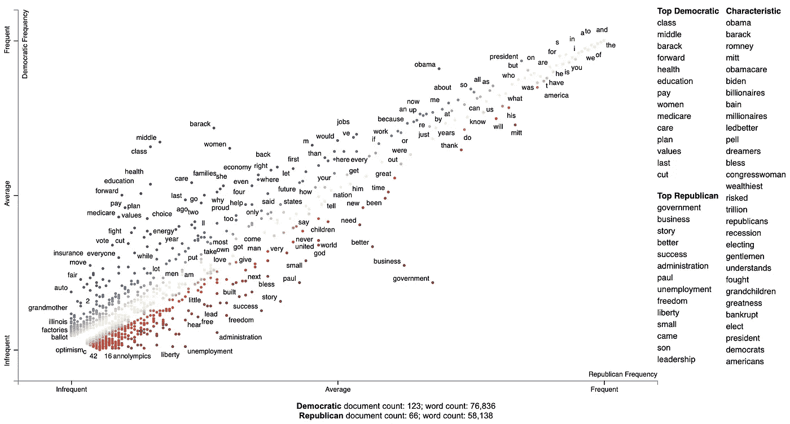
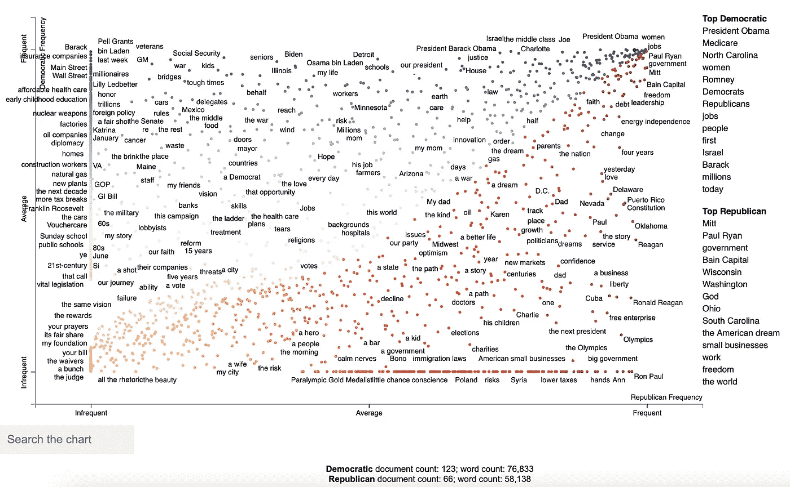
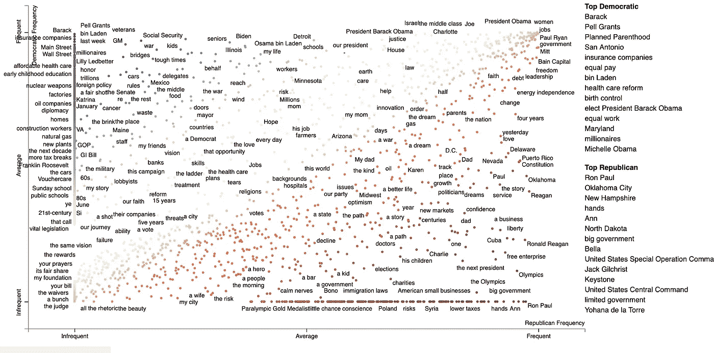
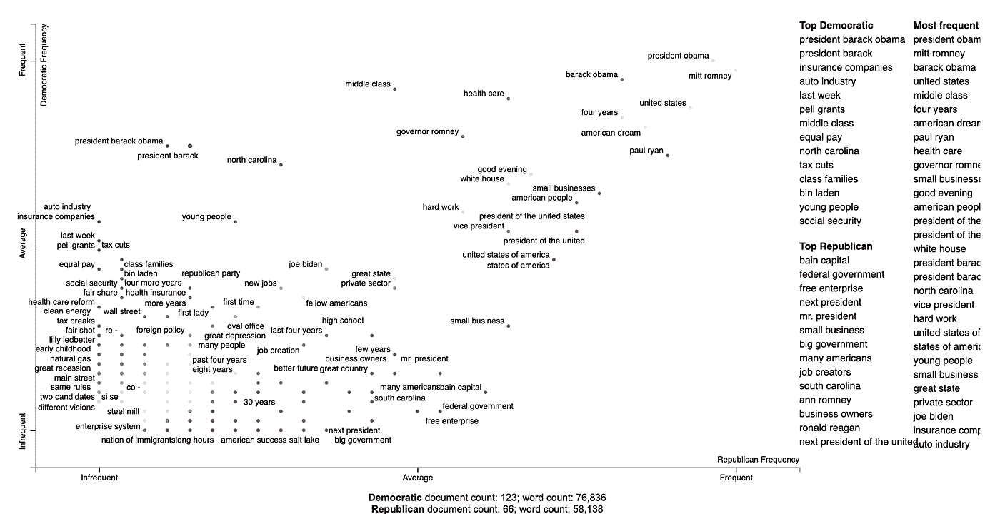

# 用 Scattertext、PyTextRank 和 Phrasemachine 可视化成千上万的短语

> 原文：<https://medium.com/analytics-vidhya/visualizing-phrase-prominence-and-category-association-with-scattertext-and-pytextrank-f7a5f036d4d2?source=collection_archive---------3----------------------->

**2021 年 3 月 7 日:PyTextRank 的 v3 与 Scattertext≤0.1.1 不兼容。我已经更新了 Scattertext 以确保与 API 的兼容性，以及 Readme 文件和这篇博文。至少在这里使用的约定数据集上，结果似乎更好。**

[Scattertext](https://github.com/jasonkessler/scattertext) 是一个 Python 包，让你交互式地可视化两类文本如何彼此不同(Kessler 2017)。我在散点图上做的大部分工作都集中在如何可视化不同类别中不同频率的单个单词和(以及二元模型)的区别。

这篇博文关注的是我们如何使用 [PyTextRank](https://github.com/DerwenAI/pytextrank) 和 [Phrasemachine](https://github.com/slanglab/phrasemachine) 将这些技术扩展到更长的短语。这篇文章的第一部分将概述散点图可视化是如何工作的，第二部分描述了如何将 PyTextRank 集成到散点图中以及集成其分数的两种不同方法，第三部分将讨论如何集成 Phrasemachine。

# 散文本简介



**图一。**一个散点图示例显示了民主党人和共和党人在 2012 年提名大会上的演讲中词频排名如何不同。越蓝的术语，民主党的关联分数越高。术语越红，共和党的关联分数越高。请看[http://jasonkessler.github.io/demo_dense_rank.html](http://jasonkessler.github.io/demo_dense_rank.html)的互动版剧情。

在图 1 中，我们可以看到民主党人和共和党人(在 2012 年政治大会的发言人中)的用词情况。每个点对应一个词的用法，这个词在 y 轴上的位置越高，它被民主党人使用得越多，越靠右，它被共和党人使用得越多。频繁使用的术语，如连词、冠词和介词，出现在右上角，而不常用的术语，如“乐观主义”或“选票”出现在右下角。

所示的位置对应于特定类别中密集的频率等级。意味着在特定类别中第一个最常用的术语被标在第二个最常用的术语旁边，即使一个术语比它的邻居使用的次数多很多。这可以防止图中出现大的间隙，并使其整体可读性更好。

最后，使用一种针对分散文本的独特算法来确定哪些点被标记，哪些点没有被标记。这种标注发生在客户端，如果用户将鼠标悬停在这些术语上，就可以交互式地看到哪些术语对应于哪些点。单击会显示文档片段，显示每个术语在上下文中的用法。

# 使用 PyTextRank

由 Paco Nathan 创建的 PyTextRank 是 TextRank 算法(Mihalcea 和 Tarau 2004)的修改版本的实现。它涉及图中心性算法来提取文档中最突出的短语的评分列表。这里，命名实体由 spaCy 识别。从 spaCy 版本 2.2 开始，这些来自于在 notes 5 上[训练的 NER 系统。](https://catalog.ldc.upenn.edu/LDC2013T19)

使用时，像平常一样构建一个语料库，但是要确保使用 spaCy 来解析每个文档，而不是使用内置的`whitespace_nlp`类型的标记器。注意，不需要将 PyTextRank 添加到 spaCy 管道中，因为它将由`PyTextRankPhrases`对象单独运行。

我们将使用`AssociationCompactor`将图表中显示的短语数量减少到 2000 个，保留与每个类别最相关的 1000 个短语。所生成的短语将被视为非文本特征，因为它们的文档分数将不对应于字数。减少生成的短语数量很重要，因为随着更多的短语被可视化，散射文本的渲染引擎会变慢。请注意，超过 4000 个短语的图加载起来会非常慢。

```
import pytextrank, spacy
import scattertext as st
import numpy as npnlp = spacy.load('en')
nlp.add_pipe("textrank", last=True)convention_df = st.SampleCorpora.ConventionData2012.get_data(
).assign(
    parse=lambda df: df.text.apply(nlp),
    party=lambda df: df.party.apply(
        {'democrat': 'Democratic', 
         'republican': 'Republican'}.get
    )
)corpus = st.CorpusFromParsedDocuments(
    convention_df,
    category_col='party',
    parsed_col='parse',
    feats_from_spacy_doc=st.PyTextRankPhrases()
).build(
).compact(
    st.AssociationCompactor(2000, use_non_text_features=True)
)
```

注意，语料库中存在的术语是命名的实体，并且与频率计数相反，它们的得分是由 TextRank 算法分配给它们的特征中心性得分。运行`corpus.get_metadata_freq_df('')`将为每个类别返回术语的 TextRank 得分总和。这些分数的密集等级将用于构建散点图。

```
term_category_scores = corpus.get_metadata_freq_df('')
print(term_category_scores.head(5))
'''
                               Democratic  Republican
term
new plants                       0.104446    0.000000
jobs                             3.967825    2.860420
construction workers             0.120949    0.000000
more opportunity                 0.175094    0.147941
more Americans                   0.177554    0.054976
'''
```

在我们构建这个图之前，让我们添加一些辅助变量，因为总的 TextRank 分数不太容易解释，我们将在`metadata_description`字段中显示每个分数在每个类别中的排名。这些将在点击一个术语后显示。

```
term_ranks = np.argsort(
    np.argsort(-term_category_scores, axis=0), 
axis=0) + 1metadata_descriptions = {
    term: '<br/>' + '<br/>'.join(
        '<b>%s</b> TextRank score rank: %s/%s' % (
            cat, 
            term_ranks.loc[term, cat], 
            corpus.get_num_metadata()
        )
        for cat in corpus.get_categories()
    )
    for term in corpus.get_metadata()
}
```

我们可以用几种方法来构建学期分数。一个是标准的密集等级差异，这是在这里的大多数两个类别对比情节中使用的分数，它将给我们最多的类别相关短语。另一个是使用最大类别特定得分，这将为我们提供每个类别中最突出的短语，而不管其他类别中的突出程度。我们将在本教程中采用这两种方法，让我们计算第二种分数，下面是类别特定的突出度。

```
category_specific_prominence = term_category_scores.apply(
    lambda row: (row.Democratic 
                 if row.Democratic > row.Republican 
                 else -row.Republican),
    axis=1
)
```

现在我们准备输出这个图表。注意，我们使用了一个`dense_rank`转换，它将相同比例的短语放置在彼此之上。我们使用`category_specific_prominence`作为分数，并将`sort_by_dist`设置为`False`，以确保显示在图表右侧的短语是根据分数而不是到左上角或右下角的距离来排序的。由于匹配短语被视为非文本特征，并且为了确保它们在被点击时是可搜索的，我们通过将`topic_model_preview_size`设置为`0`将它们编码为单短语主题模型。这表明主题模型列表不应该显示。最后，我们设置确保显示完整的文档。请注意，文档将按特定短语得分的顺序显示。

```
html = st.produce_scattertext_explorer(
    corpus,
    category='Democratic',
    minimum_term_frequency=0,
    pmi_threshold_coefficient=0,
    width_in_pixels=1000,
    transform=st.dense_rank,
    metadata=corpus.get_df()['speaker'],
    scores=category_specific_prominence,
    sort_by_dist=False,
    use_non_text_features=True,
    topic_model_term_lists={term: [term] for term in         
                            corpus.get_metadata()},
    topic_model_preview_size=0,
    metadata_descriptions=metadata_descriptions,
    use_full_doc=True
)
```



**图二。**短语由 PyTextRank 提取。两个轴是由 PyTextRank 计算的短语中心性得分的密集等级。根据 PyTextRank 计算的特定于类别的特征向量中心性的总和对术语进行评分。类别关联简单地由哪个类别的平均分数最高来确定。互动版:[http://jasonkessler . github . io/demo _ pytextrank _ prominence . html](http://jasonkessler.github.io/demo_pytextrank_prominence.html)

每个类别中最相关的术语是有意义的，至少在事后分析中是如此。当提到(当时的)州长罗姆尼时，民主党人在最核心的地方提到他时使用了他的姓氏“罗姆尼”，而共和党人则使用更熟悉、更人性化的“米特”。至于奥巴马总统，短语“奥巴马”也没有出现在最热门的词汇中，但是名字“巴拉克”是民主党演讲中最核心的短语之一，与“米特”相似。与共和党人相比，民主党人更倾向于使用“奥巴马总统”这一正式称谓。

或者，我们可以将分数中的等级差异浓缩到颜色短语点，并确定要显示在图表右侧的顶级短语。我们没有将`scores`设置为特定类别的重要性分数，而是将`term_scorer=RankDifference()`设置为在散点图创建过程中注入一种确定术语分数的方法。

```
html = st.produce_scattertext_explorer(
    corpus,
    category='Democratic',
    minimum_term_frequency=0,
    pmi_threshold_coefficient=0,
    width_in_pixels=1000,
    transform=st.dense_rank,
    use_non_text_features=True,
    metadata=corpus.get_df()['speaker'],
    term_scorer=st.RankDifference(),
    sort_by_dist=False,
    topic_model_term_lists={term: [term] for term in 
                            corpus.get_metadata()},
    topic_model_preview_size=0, 
    metadata_descriptions=metadata_descriptions,
    use_full_doc=True
)
```



**图三。**短语由 PyTextRank 提取。这里，根据术语密集等级的不同，术语的评分方式与图 1 相同。这突出了每个类别中更有特点和独特性的短语。例如，“罗恩·保罗”，一个来自得克萨斯州的自由主义代表和一个邪教人物，是共和党人中最有特色的。如图 2 所示，“巴拉克”是民主党人的特征，就像佩尔·格兰特和政治上备受指责的生殖保健提供者“计划生育”一样。互动版:[https://jasonkessler . github . io/demo _ pytextrank _ rank diff . html](https://jasonkessler.github.io/demo_pytextrank_rankdiff.html)

# 使用短语机器

来自[Abe Handler](https://github.com/AbeHandler)(Handler et al . 2016)的 Phrasemachine 在词性标签序列上使用正则表达式来识别名词短语。这比使用 spaCy 的 NP 组块有优势，因为它倾向于分离有意义的、没有同位语的大名词短语。

与 PyTextRank 相反，我们将只使用这些短语的计数，像对待任何其他术语一样对待它们。

我们将从语料库中选择 4000 个与类别最相关的短语，并使用其密集排序的特定于类别的频率来绘制它们。我们将使用密集等级中的差异作为得分函数。

```
import spacy
from scattertext import SampleCorpora, PhraseMachinePhrases, dense_rank, RankDifference, AssociationCompactor, produce_scattertext_explorer
from scattertext.CorpusFromPandas import CorpusFromPandascorpus = CorpusFromPandas(
    SampleCorpora.ConventionData2012.get_data(),
    category_col='party',
    text_col='text',
    feats_from_spacy_doc=PhraseMachinePhrases(),
    nlp=spacy.load('en', parser=False)
).build().compact(AssociationCompactor(4000))html = produce_scattertext_explorer(
    corpus,
    category='democrat',
    category_name='Democratic',
    not_category_name='Republican',
    minimum_term_frequency=0, 
    pmi_threshold_coefficient=0,
    transform=st.dense_rank,
    metadata=corpus.get_df()['speaker'],
    term_scorer=st.RankDifference(),
    width_in_pixels=1000
)
```



**图 4。**找到的短语来自 Phrasemachine (Handler 2016)在这里。术语的位置是基于它们的频率的密集等级，和图 1 和图 3 一样，分数是术语密集等级的差异。

# 参考

*   亚伯兰·汉德勒，马特·丹尼，汉娜·沃勒克，和布伦丹·奥康纳。一袋什么？面向语料库分析的简单名词短语抽取。EMNLP 2016 的 NLP+CSS 研讨会。
*   杰森·s·凯斯勒。 [Scattertext:一个基于浏览器的工具，用于可视化语料库的差异](https://arxiv.org/abs/1703.00565)。ACL 系统演示。2017.
*   拉达·米哈尔恰，保罗·塔劳。TextRank:给文本带来秩序。EMNLP。2004.