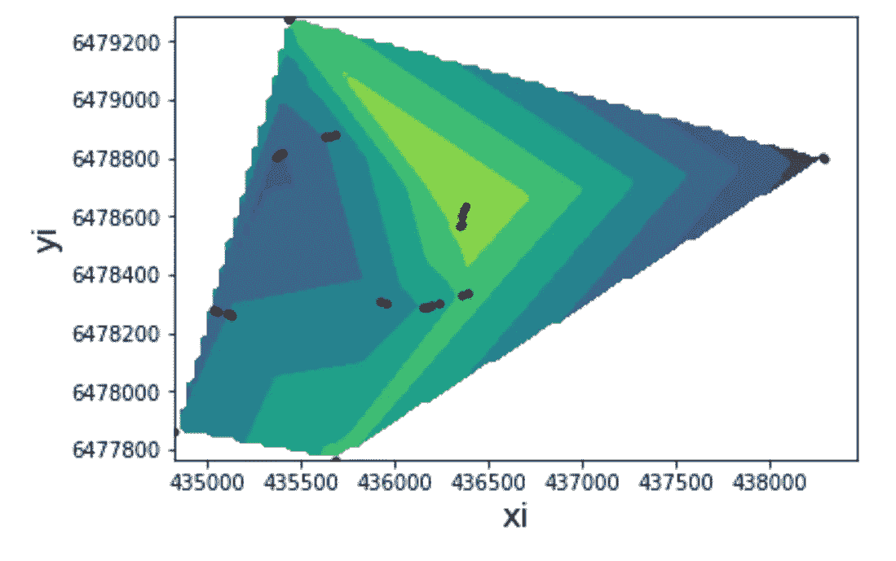
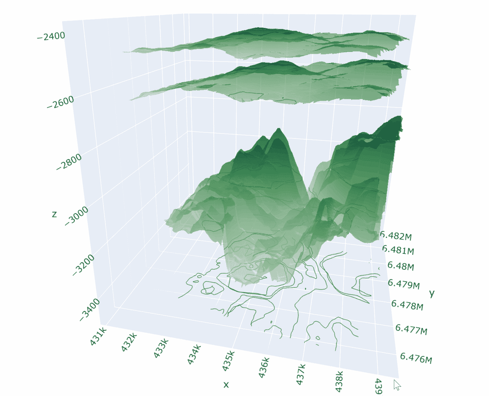

# 用 Plotly 可视化油藏数据

> 原文：<https://medium.com/analytics-vidhya/visualizing-reservoir-data-with-plotly-a03c754c940d?source=collection_archive---------8----------------------->

Volve 是一个位于挪威大陆架上的油田。该油田于 1993 年被发现，但直到 2008 年才开始生产。Equinor(正式名称为 Statoil)是该油田的大股东运营商。该油田生产了大约 6300 万桶石油，峰值产量达到 5600 万桶/天，然后于 2016 年关闭。

现场位置(菲略、梅莱斯、柯蒂斯和拉瓦西，2017 年)

2018 年，Equinor 采取了前所未有的措施，发布了该领域管理和开发中使用的所有相关文件。文件包括地震、钻井、生产、动态模型、PVT 和许多其他类型的数据。该版本的目的是添加一个全面而丰富的数据集，供学术界使用，以支持下一代工程师。数据可以在这里找到:[https://www . equinor . com/en/how-and-why/digitalization-in-our-DNA . html](https://www.equinor.com/en/how-and-why/digitalisation-in-our-dna.html)

历史上，这种类型的储层数据是在商业软件包中读取和分析的。像 Petra、Landmark 或 Petrel 这样的程序非常强大，而且非常非常昂贵。这些软件的许可费每月可达数千美元。这项费用对于大公司来说是合理的，但是对于这些公司之外的个人来说是力所不及的。

本文的目的是展示使用 Plotly 和 Python 可视化 Volve 油藏数据的开源方法。

有大量数据可用，但我们将重点关注 Ty、Hugin 和 Shetland 地层的地面数据以及油井数据。地层顶部数据可在地球物理解释数据集中找到。

首先让我们来研究一下数据。

来自 *wells.csv* 的井数据集

油井数据包含纬度、经度、深度和射孔信息。horizon 文件都只包含三列:纬度、经度和深度。

让我们在一个简单的散点图上绘制油井位置，以获得油井的方位。

井位散点图。坐标轴使用 UTM 系统米

这稍微有点用，因为它显示了井与井之间的大致位置。

为了让事情变得更有趣，我们可以创建一个网格，在已知的井深之间插值，以创建一个等值线图。

显示井位等高线图的井位散点图。浅色更浅。

这为油藏结构提供了一些额外的见解。我们可以看到西边有一口异常井，这可能是一口处理井，或者是一口深度更深的干井，我们还可以看到油田顶部区域有几口井。

总井深的三维散点图。坐标轴以米为单位。

在 3D 中绘制东西让我们更接近一些有用的可视化。让我们把井的数据放在一边，把地层顶部结合起来，得到一些结构。

我们想在这里制作 3D 表面图，所以我们需要从简单的地层顶部数据制作一个平滑和连续的表面。这些数据足够可靠，可以让我们看到一幅美丽的画面。我们正在使用 Plotly graph_objects 的表面函数，它给了我们一些现成的很酷的特性，包括等高线和尖峰线。

现在我们真的有了一些有用而且很酷的东西可以玩了。该图形是交互式的，显示等高线、峰值线以及带有位置和图层数据的悬停文本。

现在，让我们绘制井眼图，用红色显示射孔段，这样我们就可以看到生产层在哪里。

现在我们可以看到 Hugin 地层主顶部区域的井筒。如果我们去除其他层，我们可以得到一个主要目标地层的清晰图像。

使用 Plotly 绘制 Volve 油田 Hugin 油藏的三维地面图，包括井筒和射孔

这个情节的完全互动版本可以在[https://es42289.github.io/Volve_Hugin](https://es42289.github.io/Volve_Hugin)找到