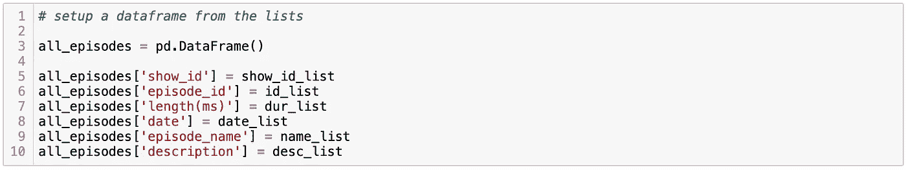

# 可视化 Spotify 播客数据

> 原文：<https://medium.com/analytics-vidhya/visualizing-spotify-podcast-data-6dce49ca9a43?source=collection_archive---------6----------------------->

一个关于如何访问专门用于播客数据的 Spotify API 以及你可以用它做什么的教程！对于这个项目，我将展示如何收集与搜索词(如“数据科学”)相关的每个节目和剧集的播客数据。

作为一名音乐人，Spotify API 一直是我寻找和处理音乐数据的首选。太牛逼了！最近，Spotify 也为他们庞大的播客库付出了很多努力。真正的犯罪爱好者欢欣鼓舞——似乎有好几年的娱乐性和知识性播客可以尽情播放。最近，Spotify 利用他们播客库中的数据举办了一场比赛，你可以通过下面的链接找到这些数据。

[播客数据集和 2020 年 TREC 挑战赛](https://podcastsdataset.byspotify.com/)

*在这个挑战中，将提供一个数据集，其中包含 Spotify 上不同播客节目的 10 万集。参与者将被要求完成两项任务，重点是理解播客内容，并增强播客中的搜索功能。*

我不想参加竞赛，而是想看看我能从他们的 API 中获得什么样的通用播客数据。之前为了访问他们的 API，我使用了 python 的 ***spotipy*** 包，但是我还没有看到任何人使用它来访问播客数据，所以我想进一步探索这一点。由于 Spotify API 使用 GET 请求，所以想法是让 spotipy 包处理握手和凭证，然后编写我自己的 GET 请求。创建开发者账户后，你可以阅读 Spotify 的文档，了解该 API 的功能。

[Spotify 开发者文档](https://developer.spotify.com/documentation/web-api/reference-beta/#category-episodes)

# 获取数据

我们将为每一集创建一个数据框架，涉及一个搜索词，如“数据科学”，但你可以随意将这个词改为你可能感兴趣的其他词。

第一步是创建一个开发者账户，并获得相关凭证。然后，spotipy 包获取这些凭证并生成一个“*令牌*，您可以用它来发出 GET 请求。

接下来，我们需要从 Spotify API 的众多可用端点中选择一个。他们最近增加了几个新的端点来容纳播客。你可以在这里阅读:

[使用新的播客 API 搜索、浏览和关注播客](https://developer.spotify.com/community/news/2020/03/20/introducing-podcasts-api/)

要执行查询，我们需要记住一些事情。有一点是 Spotify 的最大请求限制是 50 个。为了一次获得超过 50 个节目，我们可以用一些条件变量开始 while 循环，这些条件变量将递增，直到达到最大节目数。我们需要增加的变量是 ***偏移量*** 变量，它告诉查询应该从哪个节目号开始搜索。最初，它在第一次放映时被设置为 0，然后我们使用的下一个偏移值将是 50，以获取从第 50 次放映开始的下 50 个…依此类推，直到我们拥有所有的偏移值。我们需要记住的第二件事是与搜索相关的显示的总数*。json 提供了节目的总数，我们可以简单地划分，找出我们需要做多少个 50 的抓取。*

**

*根据文档，偏移量的最大值是 2000(包括 50 的限制)，因此 while 循环被设置为在偏移量达到 1950 时运行。在我忘记之前，我们还需要将 search 的*类型设置为“show”，因为我们正在寻找所有相关的 show。**

************

**所有相关信息随后被添加到空列表中。剩下唯一要做的事情就是从完整的列表中创建一个数据帧。你可以从元数据中获取更多的信息，但我们真的只是在节目 id 之后。当我们寻找单个剧集时，我们将在后面使用这些来循环播放。我们还获取节目名称和描述，因为这对我们来说太容易了。正如你在下面看到的，我们总共有 279 个播客节目与术语“数据科学”相关。**

****

**我们将再执行一个搜索查询，除了 ***类型*** 变量和 ***端点*** 之外，其他基本相同。这一次，我们要寻找每一集，为此，我们可以循环遍历之前获取的节目 id。**

****

**如果有任何错误，代码将打印下面给出错误的 ***show_id*** ，然后继续运行。如果你感到好奇，如果你愿意的话，你可以进一步了解每场演出。**

************

**再次从完整的列表中创建一个数据框架，并对数据进行一些清理，我们可以看到有 8474 集与术语“数据科学”相关。有更多的元数据可用，但我最感兴趣的功能包括长度，日期和描述。**

****

# **数据可视化**

**那么，我们能用我们的数据做什么呢？首先，我们可以做一些可视化来探索趋势。让我们看看我们发现了什么…**

**哪些播客的剧集最多？**

****

**平均每一集有多长？**

****

**哪些播客的剧集最长？**

****

**每个月还会有多少播客被制作出来？**

****

**每年有多少播客被制作出来？**

****

**2020 年有趋势吗？显然这里发生了一些事情…**

****

**一周中的哪几天有新的播客发布？**

****

**非常刺激。平均而言，我们可以看到大多数播客通常在 30 分钟左右，少数例外在 85 分钟和 140 分钟左右。我们看到，自 2013 年以来，节目总数一直在稳步增长，甚至出现了一些高峰，这可以进一步调查。从年度水平来看，这一趋势是重复的，今年似乎也将遵循这一趋势。当仔细观察 2020 年的每日播客数量时，我们可以看到有许多高峰和低谷。通过查看工作日的平均值，我们可以看到周末播出的播客并不多。通常播客会在周一播出，周五会稍微少一点，以及两者之间的任何时间。**

# **词汇云**

**既然我们已经有了每集的描述，让我们看看我们是否能从他们描述中最常用的词的词云中产生任何见解。**

****

**还有一个更漂亮的版本怎么样…**

****

**这才是可以挂在办公室墙上的东西！**

# **文本生成**

**我在这里能想到的另一件事是，根据所有的描述，尝试生成一个全新的虚构情节描述。您当然可以在这里深入研究这个主题，也许使用 GPT-2 或其他一些高级模型，但出于我们的目的，我决定使用 ***markovify*** ，这是一个用于文本生成的 python 包，非常容易和简单，它使用马尔可夫链来生成文本。以下是 10 个虚构的情节描述:**

****

# **结论**

**Spotify 又一次做得如此出色，让他们的数据可以免费获取，并且易于使用。摆弄这些数据并寻找趋势非常有趣和令人兴奋。随着播客库的不断增长，当然有更多的探索要做。我想知道我下一步可以搜索什么样的主题，以及如何从这些数据中创造价值。比较不同类型的播客会很酷。一个真正令人兴奋的端点是 ***集恢复点*** ，它告诉用户在播客中一直听到哪里。那里似乎有很多可能性。**

**感谢阅读！请随意分享…如果你想看笔记本和代码，请到我的 GitHub 上来！**

# **链接**

**Sam Brady 的 LinkedIn↓—寻求一个令人兴奋的新就业机会！**

**[山姆·布雷迪的 GitHub 回购](https://github.com/sam-brady/spotify-podcasts)**

**[山姆·布雷迪的个人项目博客](https://samsdataprojects.wordpress.com)**

**[Spotify API 开发者页面](https://developer.spotify.com/documentation/web-api/reference-beta/#category-episodes)**

**[Spotify 播客数据集和 2020 年 TREC 挑战赛](https://podcastsdataset.byspotify.com/)**

**[Spotify 播客端点](https://developer.spotify.com/community/news/2020/03/20/introducing-podcasts-api/)**

**[spotipy Python 包](https://pypi.org/project/spotipy/)**

**[markovify Python 包](https://pypi.org/project/markovify/)**