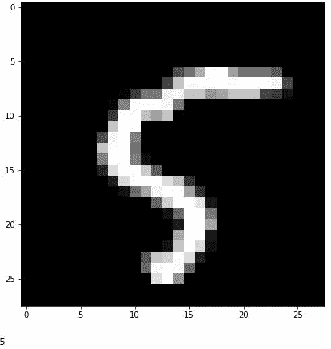

# 可视化 MNIST 数据集

> 原文：<https://medium.com/analytics-vidhya/visualizing-the-mnist-data-set-4ba985c4af12?source=collection_archive---------8----------------------->

MNIST 数据集

> “观想是有目的的白日梦。”

这是一个令人悲伤的事实，大多数人无法想象三维之外的世界。物理学家说第四维是时间，但很少有人能想象它是第四维。

在数据可视化和探索的情况下，我们可以使用相应维度的散点图轻松地可视化二维和三维数据。除此之外，我们通常使用配对图。结对图有其局限性。配对图的数量由 *nC2* 给出，等于 *(n！)/(2!* n！).*这意味着如果我们有一个 100 维的数据集，那么我们将不得不查看 4950 个不同的图。实际上，超过 10 个维度，配对图的数量太多了，无法单独显示每一个。

在这篇博客中，我们正在处理有 784 个维度的 mnist 数据集的相同问题。我们将把它的尺寸减少到 2 维，以便使用 2d 散点图来可视化它。但首先让我们看看什么是 mnist 数据。

# MNIST 数据集

mnist 数据集包含从 0-9 的手写数字字符的 **60，000 个** **不同的** *28 * 28* 图像。该数据集广泛用于学习计算机视觉和图像处理的基础。使用 pandas 读取 csv 格式的数据后，它将如下所示

这是前 5 个数据点

第一列标签告诉我们数据点对应的数字。其余的列包含 784 个像素(28 * 28)中每个像素的像素值。它们的值范围从 0 到 255。像素值越大，网格的颜色就越强烈。这是一个数据点的样子

该图像对应于训练集的索引 10360 处的数据点

为了在 2d 或 3d 散点图中显示这一点，我们首先需要将其维度降低到 2。为了做到这一点，我们将使用两种不同的技术，一种叫做 PCA，这是一种非常古老的技术，另一种是 t-SNE，我将在下一篇博客中讨论。

# 主成分分析

主成分分析(简称 pca)是最基本、最简单的降维技术之一。在无监督学习的情况下，它也被用作聚类技术。它将 D 维数据转换为 D `-维数据*，其中 D`≤D.* **，以便使用 pair plot *，D`=2 进行可视化。我们将看到它在 2d 中是如何工作的。***

假设我们有一个数据集，xi 为数据点，如左图所示，我们希望将其投影到一维上。可以清楚地看到，y 轴上的分布或方差比 x 轴上的方差大得多。方差是(粗略地)对信息的一种度量。因此，如果我们将所有数据点投影到 y 轴上，与将数据点投影到 x 轴上相比，我们将保留更多的差异。这意味着我们将能够保存更多的信息，将它的维度从 2d 降低到 1d。

> 或者，保存更多的信息可以被认为是区分 1 d 中的点的容易程度。这只有在点位于更宽的分布中并且在 1d 中清晰可见时才能实现，这又意味着点在投影轴上应该具有更高的方差。因此我们总是**试图保持最大可能的方差**。因此，在这种情况下，为了在 1-d 中可视化这些点，我们只需要将它们投影到 y 轴上，然后放下 x 轴。

现在，对于上述数据点中描述的情况，我们有了特征标准化的数据集。特征向量的标准化意味着去除其均值(使其为零)并使其方差等于 1。所以特性是独立标准化的。

标准化就是这么做的(这里 mu 是均值，sigma 是标准差)。

在这种情况下，两个轴上投影点的方差将相同，因为两个轴在 2d 中具有相等的方差。在这种情况下，我们通常会看到这种类型的数据，我们将做一些被称为轴的旋转。我们将轴旋转为

现在可以很容易地看出，f1’上投影点的方差将明显比 F2’上的大得多。现在我们可以很容易地把我们的点投射到 f1 上，然后放下 f2。现在，我们将数据集缩减到 1 维，并保留了最大的信息。

> 我们想找到一个方向 f1 ’,使得投射到 f1’上的 xi s 的方差最大。

现在我们把我们的结果推广到 n 维。为了找到方向，我们只需要找到沿着那个方向的单位向量。设 u1 是所需的单位向量，xi′是 Xi 在 f1′上的投影，则

其中 u1T 是单位向量 u1 转置。现在新点 xi '的方差将为

其中 x 条是 xi 的平均向量，n 是数据点的数量。由于我们的数据点是特征标准化的，因此平均向量将为零，我们的问题归结为

鉴于 *u1* 是一个单位向量，这是一个优化问题。原来，我们的优化问题的解是由数据点或数据矩阵的协方差矩阵的特征向量给出的。

协方差矩阵是这样一种矩阵，使得在给定我们的数据矩阵(必须被特征标准化)的特征第*I*和特征第*j*之间的协方差的情况下，其在第*I*行和第*j*列的值是对应于变换矩阵的向量，使得在变换之后，它们被称为其特征值的值缩放。观看[这](https://www.youtube.com/watch?time_continue=156&v=PFDu9oVAE-g&feature=emb_title)可以清楚地了解特征向量和特征值。

我们现在需要做的就是取对应于两个最大特征值的特征向量(在将维度减少到 2 的情况下为**)并将我们的数据矩阵投影到这两个向量上。那么我们的 xi 将会变成这样**

其中 v1 和 v2 是对应于两个最大特征值的特征向量。我们新的数据矩阵将是一个二维矩阵。

简而言之，这就是我们要做的。特征标准化数据矩阵。求协方差矩阵，求对应两个最大特征值的特征向量。并且在最后一步中，将向量矩阵与数据矩阵的转置相乘。你可以在这里找到 PCA [的实现。](https://github.com/vedanshsharma/Visualizing-MNIST-data-set-)

我们从主成分分析中得到的视觉效果会是这样的..

这可能不是最好的可视化效果，但你可以清楚地看到，它在一边聚集了所有的 0，在另一边聚集了 1 和 9。对于其他数字，有很大的重叠。

为了提高可视化，我们将使用 t-SNE，这是目前最好的降维技术之一。在下一篇博客中，我将讨论 t-SNE 以及 PCA 的局限性。

## 履行

要实现 pca，请点击[链接](https://github.com/vedanshsharma/Visualizing-MNIST-data-set-)我已经从头开始实现了 PCA，并且使用了 scikit-Learn。