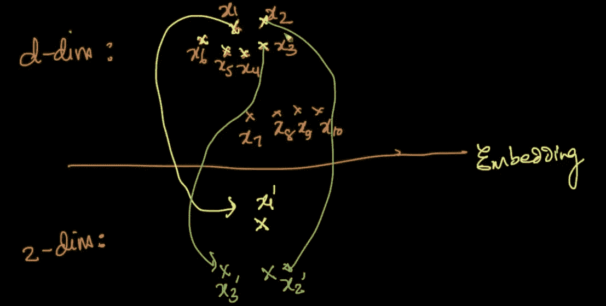
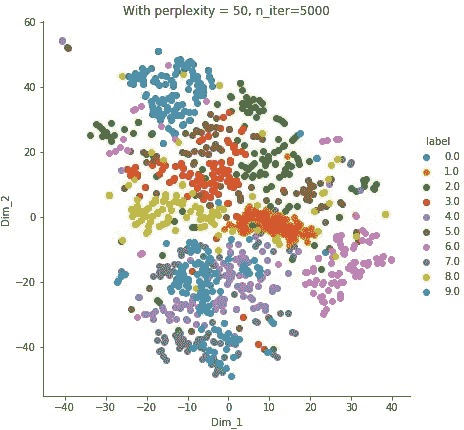

# 可视化 MNIST 数据集(续。)

> 原文：<https://medium.com/analytics-vidhya/visualizing-the-mnist-data-set-cont-3b6e6030f70b?source=collection_archive---------18----------------------->

在上一篇文章中，我们讨论了 MNIST 数据集以及如何使用 PCA 来可视化它。正如我们上次看到的，主成分分析没有提供一个非常明显的可视化。所以我们将使用 [**t-SNE**](https://en.wikipedia.org/wiki/T-distributed_stochastic_neighbor_embedding) 这是目前最先进的降维技术。但首先让我们讨论一下 PCA 的局限性。

# PCA 的局限性

如果我们的数据点形成一个圆形，在更高的维度**超球体，**或接近它的结构，那么主成分分析将不会很好地工作。考虑右侧所示的数据点。在这里，它们形成了一个完整的圆，我们将它简化为 1 维，但在我们旋转轴并找到两个本征向量后，我们会注意到它们中任何一个上的投影点的方差将完全相等，并且将是总方差的 50%。在这种情况下，我们不能比较这两个向量来确定哪一个将是更好的投影点，以便具有投影点的最大可能方差，并且大量信息总是丢失。

由于 PCA 致力于方差最大化，**它试图保持数据的全局结构**。它不关心数据中存在的局部结构或聚类。假设我们有一个像左边这样的分布，其中也有局部集群。如果我们想使用 PCA 将此数据转换为 1d，我们可能会将数据投影到 v1 上，但可以观察到，当我们将数据点投影到 v1 上时，在 v2 方向上出现的两个群集将最终在我们的新轴 v1 上聚集在一起。我们可能无法在 1d 中区分哪个数据点属于哪个聚类。

PCA 的另一个限制是它**并不总是保持特征**之间的关系。例如，考虑以下数据点的分布。

在这个数据分布中我们可以清楚地看到它是一个正弦函数。但是在我们应用 PCA 将其降维后，我们会得到 v1 作为最大方差的方向。但是，一旦我们将数据点投影到 v1 上，我们会看到我们的点变得有些等距，并失去了正弦函数的性质。一般来说，每当我们从 n 维到 d 维时，我们经常会丢失变量之间的许多这样的关系。

# t 分布随机邻居嵌入

t-SNE 或 t-分布式随机邻居嵌入是目前最好的降维技术之一，也是最先进的技术。它是由范德马滕和辛顿在 2008 年首次提出的。在这里可以看到 SNE 霸王龙的实时影像。虽然使用起来可能很简单，但背后的数学原理实际上相当复杂。对于想深入数学的人，我强烈推荐这个[视频](https://www.youtube.com/watch?v=ohQXphVSEQM&t=33s)。但是在实际应用中，我们可以不去理解数学。我们需要完美地调整它的两个最重要的参数，以获得良好的可视化，即**困惑**和迭代次数。

t-SNE 中的 t 代表学生的 t 分布。这是一种类似于正态分布的分布，因为它呈钟形，但尾部较重。换句话说，t 分布比正态分布有更大的机会出现极值，因此尾部更厚。

**随机**表示 t-SNE 的过程或算法是概率性的，而不是确定性的。这意味着我们可能在多次运行中得到相同输入的不同输出。

一个点的邻域是靠近它的点的数目。有一个名为“**perfusion**的可调参数，它粗略地说明了如何在数据的局部和全局方面平衡注意力。换句话说，我们可以认为，困惑定义了有多少(大约)点可能位于邻域内。

xi 附近

粗略地说，嵌入基本上意味着**将存在于更高维度(比如 d 维)中的每个点**放置在更低维度的空间(比如 2 维)中。点以这样一种方式放置，即对于每个点，它的邻域甚至在较低的维度中也被保留。

在我们的 MNIST 数据集上应用 t-SNE 后，我们可能会得到以下结果。

这是一个比 PCA 更好的可视化，因为现在我们可以清楚地看到每个点，没有太多重叠。(注意，上述内容仅使用数据点样本进行训练)。在更精确地调整参数后，我们可能会得到如下结果

Christopher Olah 的博客中的 MNIST 形象

# t-SNE 之前的 PCA

由于 t-SNE 需要大量的计算能力和时间，一个试探**可能在应用 t-SNE 之前使用 PCA。PCA 将做的是，它将只保留那些解释大部分累积方差(假设 90%)的特征，并删除其余的特征。在下面的可视化中，我首先将维度从 784 减少到 350，因为这 350 个特征能够解释 90%的差异，然后我运行 t-SNE。正如可以观察到的，这次获得了更好的结果。请点击[链接](https://github.com/vedanshsharma/Visualizing-MNIST-data-set-)来看看我是如何实现的。**

# 履行

关于 pca 的实现，请点击[链接](https://github.com/vedanshsharma/Visualizing-MNIST-data-set-)我已经使用 scikit-learn 实现了 t-SNE，我还实现了 pca 降维。