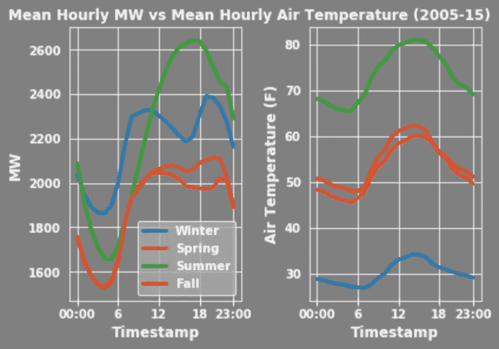
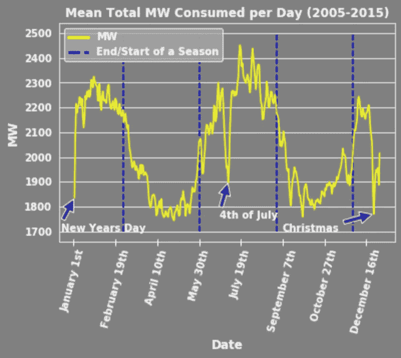
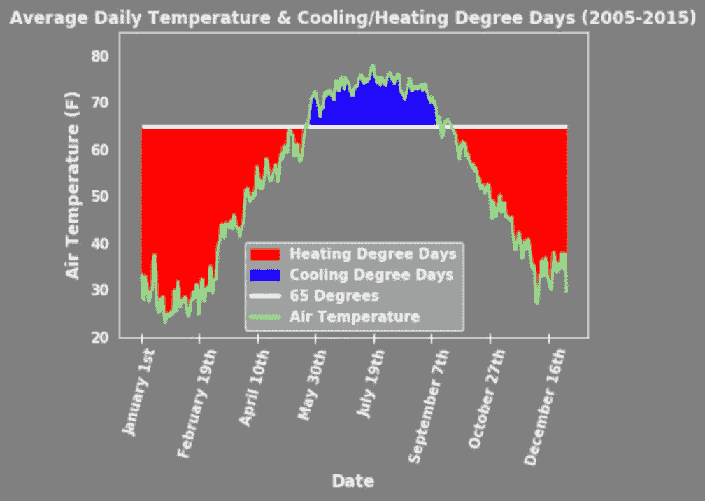
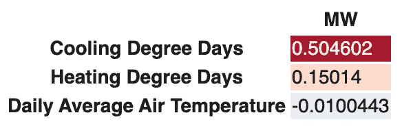

# 将能量需求和空气温度之间的关系可视化

> 原文：<https://medium.com/analytics-vidhya/visualizing-the-relationship-between-energy-demand-and-air-temperature-7d3f7de3ff0?source=collection_archive---------5----------------------->

## Python 中的分析

**数据:** [托管在 Kaggle 上的能源数据](https://www.kaggle.com/robikscube/hourly-energy-consumption#pjm_hourly_est.csv)来自一个名为 [PJM 互联有限责任公司](https://www.pjm.com/)的区域性传输组织。在 PJM 的数据中，我选择了来自[代顿电力和照明](https://www.dpandl.com/About-DPL/Our-Company/Corporate-Information/Fast-Facts/) (DPL)的子集。[天气数据](https://www.ncei.noaa.gov/data/local-climatological-data/access/)来自 [NOAA](https://www.ncei.noaa.gov/) 。[这里的](https://github.com/cjakuc/DS-Unit1-Build-Week/tree/master/Notebooks)是我的 Github 页面的链接，这个页面上有我整理和可视化数据的 Google 协作笔记本。

编辑:这个项目最终导致了[这个网络应用](https://energydemandforecast.herokuapp.com/)的诞生，你可以用它来探索一些预测能源需求的预测模型。

## 背景

我开始这个项目的意图是挖掘能源需求和气温之间的关系，目标是更好地理解复杂的能源系统是如何运作的。为了更好地探索这一点，我需要尽可能高时间分辨率的能量和温度数据。数据集之间同样高的时间分辨率将允许我做更少的数据清理，并提供更多的细节。为了专注于单个气象站，我还想查看我能找到的最小区域。这让我想到了来自 DPL 的每小时能源数据，单位是兆瓦(MW)，[它为 6000 平方英里内的 525000 个客户提供服务](https://www.dpandl.com/About-DPL/Our-Company/Corporate-Information/Fast-Facts/)。为了近似这整个地区的天气，我使用了在代顿国际机场收集的每小时数据。

## 平均每小时需求与平均每小时温度

首先，了解一下每日能源需求和每日气温在每个季节的平均一天中是如何变化的会有所帮助:

立刻跳出来的东西是线条间相似的大致形状。在大多数人都在睡觉的清晨，能量需求和温度是最低的。然后，它们在一天中逐渐增加，在下午 3 点左右逐渐减少。这种形状是众所周知的，与我们的能源生产系统有着至关重要的关系。关于这种联系的更多信息可以从能源部这里找到。

还要注意不同季节的差异。特别是，夏季和冬季是相对能量需求最高的季节。当考虑到更高或更低的温度会导致冷却和加热需求的峰值时，这是有意义的，这些过程可能需要大量的电力。同样有趣的是，一个普通的夏天在所有季节中有最高的峰值电力需求，这一点将在后面更多地讨论。

## **一年中的平均日能耗**

接下来，让我们看一下一年中每天消耗的平均总 MW:

季节之间的差异可以再次看到，这次用蓝色虚线显示。很明显，能源需求会随着季节而变化。也许更有趣的是元旦、7 月 4 日和圣诞节期间的极低需求。考虑到许多需要大量电力的企业可能会关闭，国庆假期期间如此急剧的下降是有道理的。这些需求下降对于需要调整产量以满足不断变化的需求的能源生产商来说也非常重要。想了解更多关于不同人群的普通行为变化如何对能源需求产生直接影响的信息，请查看[这篇 twitter 帖子](https://twitter.com/FryRsquared/status/1222114027767312385)，它是这篇博文的部分动机。

## **日平均温度&度制冷/制热**

最后，让我们看看一年中每天的平均气温:

该图中还显示了两个指标，分别是降温天数(CDD)和升温天数(HDD)。CDD 和硬盘测量温度比标准温度(通常为 65 华氏度)高或低多少。总的想法是，在 65 度时，大多数人不会加热或冷却他们的房屋，随着温度进一步偏离该标准，人们将使用更多的这些服务，因此需要更多的电力。例如，如果一天的平均温度是华氏 75 度，那么这一天有 10 CDD。要了解更多关于学位日的信息，请查看美国能源信息管理局的页面。

此图中的一个关键要点是 CDD 和硬盘的数量差异。很明显，HDD 比 CDD 多，尽管我们早些时候注意到 CDD 发生的夏季平均能量需求最高。我们可以通过相关矩阵进一步探究这种关系:

## **能源需求和温度指标的相关性**

当观察能量和温度之间的相关性时，加热和冷却度日的解释和预测作用变得非常明显。如前所述，尽管夏季的 CDD 低于冬季的 HDD，但夏季的能量需求最高。这是因为与 HDD 相比，CDD 驱动的需求水平。CDD 与兆瓦的相关系数为 0.504602，相比之下，硬盘的相关系数为 0.15014，日平均温度几乎为 0。这很可能是因为许多冷却系统需要电力，而大多数加热系统使用天然气或石油。相对较高或较低的温度导致的用电量增加也可能会混淆平均温度和兆瓦之间的关系。

## **进一步分析注意事项**

*   在能源需求预测模型中使用加热和冷却度日作为预测因子
*   更多地关注影响能源需求的周期性假期、体育赛事等
*   使用这些确定的日期作为能源需求预测的预测值
*   调查一周中能源需求的变化
*   考虑气温以外的其他天气模式
*   深入研究鸭子曲线，以及它与能源需求和天气的对应关系

## **假设和缺点**

*   代顿国际机场的天气数据被假定为整个 DPL 地区的天气指标
*   只看了美国一个(相对)小的地区
*   来源数据以兆瓦为单位列出，但能源需求通常以兆瓦为单位列出，因此没有机会进一步探究

在评论里告诉我你对我的分析有什么看法！