# 使用 Python 和 Power BI 可视化 WhatsApp 聊天

> 原文：<https://medium.com/analytics-vidhya/visualizing-whatsapp-chats-using-python-and-power-bi-72ea861364ed?source=collection_archive---------3----------------------->

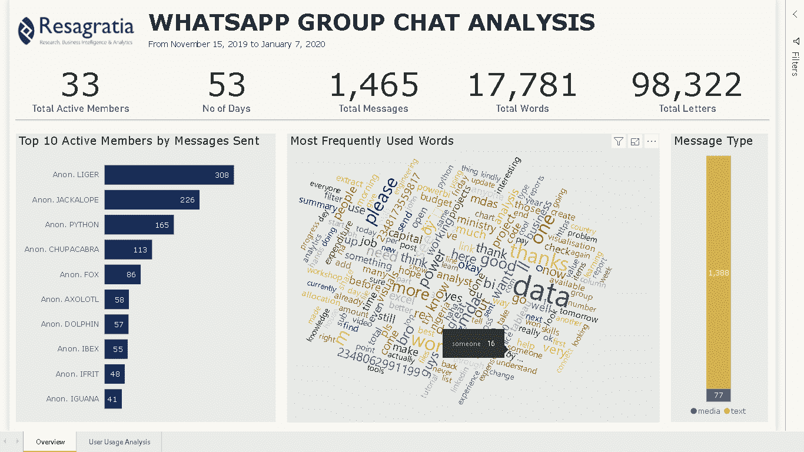

## 介绍

全球 180 多个国家超过 10 亿人使用 Whatsapp 与朋友和家人保持联系，开展业务和其他社交活动。它允许用户以文本、图片、视频和语音记录的形式分享信息，因此是一个很好的数据分析来源。

在本教程中，我们将从 Whatsapp 平台导出数据，将其导入 Python，转换和清理这些数据，并最终使用 Power BI 创建一个非常棒的交互式仪表盘。

## 先决条件

在我们开始之前，您需要在 Python 环境中安装以下包:

1.  熊猫
2.  matplotlib
3.  正则表达式
4.  日期解析器
5.  numpy

您可以通过在 Jupyter 笔记本或命令行上运行 `pip install`命令来轻松安装这些包。如果您正在使用 Python 的 Anaconda 发行版，也可以在 Jupyter 或 Anaconda 提示符下使用`conda install`。例如，要安装 pandas，您可以运行:

```
pip install pandas
```

或者

```
conda install pandas
```

一旦你安装了所有这些包，我们就可以开始收集数据了。

## 提取 WHATSAPP 聊天数据

在本教程中，我将使用来自 Whatsapp 群聊的数据，但是你也可以使用你自己的数据。只需在您的手机上打开 Whatsapp 应用程序，导航到您想要分析的聊天(由于其广泛的可视化选项，我会建议群聊)，单击垂直省略号(电话符号旁边的三个小点)，单击更多，选择导出聊天并选择无媒体。包括媒体需要时间来导出，我们不希望这样。然后选择电子邮件选项并导出。

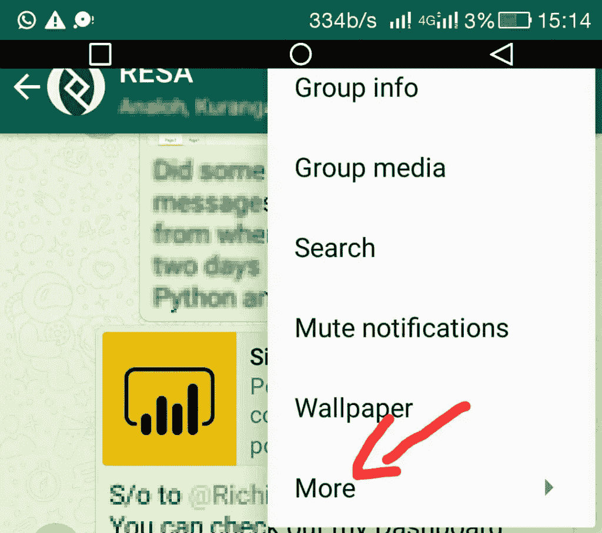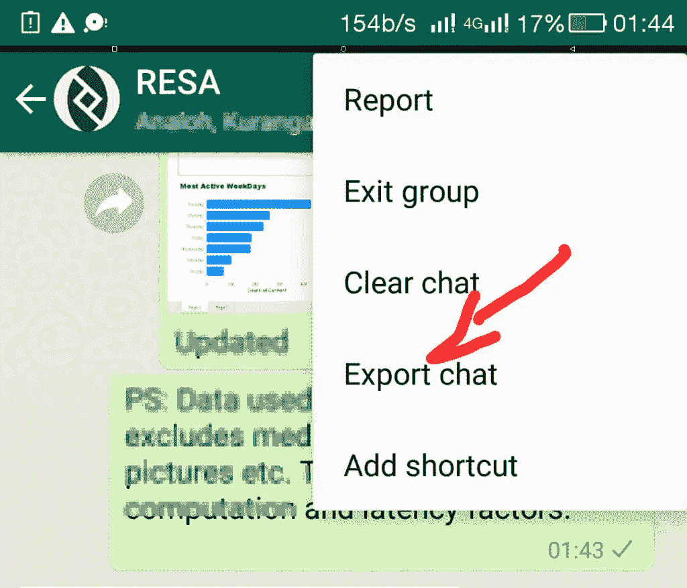

从您的电子邮件中下载导出的聊天数据，并将其作为 Chat.txt 保存在为此项目专门创建的新文件夹中。聊天数据是文本文件格式，我们将使用 Python 来清理和转换这些数据。

## 数据清理和准备

我们的聊天数据是文本文件格式，我们不能做太多。我们需要清理这个文本文件并将其转换成数据帧，以便我们能够分析它，获得洞察力并创建令人惊叹的视觉效果。我们将利用 Python 中的 pandas 库来做这件事。

打开 Jupyter notebook(或您首选的 IDE)，导航到包含我们的文本文件的文件夹，并创建一个新的笔记本。

首先，我们需要导入一些分析所需的包:

```
import pandas as pd
import numpy as np
import re
import dateparser
from collections import Counter
```

接下来，我们需要将我们的 Chat.txt 加载到 Python 中并读取它。我们将使用下面的函数来实现这一点:

```
def read_file(file):
    '''Reads Whatsapp text file into a list of strings''' 
    x = open(file,'r', encoding = 'utf-8') #Opens the text file into variable x but the variable cannot be explored yet
    y = x.read() #By now it becomes a huge chunk of string that we need to separate line by line
    content = y.splitlines() #The splitline method converts the chunk of string into a list of strings
    return content
```

接下来，我们使用 read_file 函数将 Chat.txt 文件读入 Python，并将其保存到一个名为 Chat 的变量中。

```
chat = read_file('Chat.txt')
len(chat)
```

我们将获得以下输出，显示聊天中的行的长度:

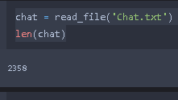

有些消息对我们的分析没有用，我们需要删除它们。例如，系统生成的消息显示有人刚刚加入或离开群聊。让我们将所有“连接”的消息保存到一个名为 join 的变量中。

```
join = [line for line in chat if  "joined using this" in line]
join
```

这为我们提供了以下输出:

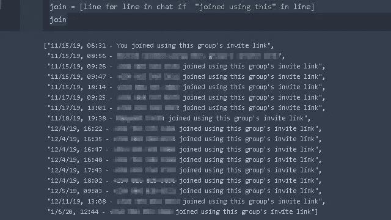

我们将通过删除 join 中的所有消息以及通过运行以下代码删除所有空行(不包含消息的行)来清理我们的聊天数据:

```
#Remove new lines
chat = [line.strip() for line in chat]
print("length of chat is:")
print(len(chat))
#Clean out the join notification lines
clean_chat = [line for line in chat if not "joined using this" in line]
#Further cleaning
#Remove empty lines
clean_chat = [line for line in clean_chat if len(line) > 1]
print("length of clean_chat is:")
print(len(clean_chat))
```

这给出了输出:

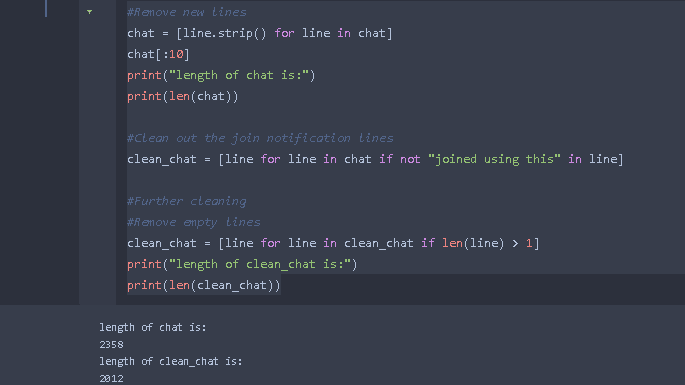

在我们的 clean_chat 变量中有 2012 行(这对于你自己的数据应该是不同的)。

接下来，我们对显示离开成员的消息进行同样的操作。

```
#Drop 'left-ers'
left = [line for line in clean_chat if line.endswith("left")]
left
```

对于重新整合的 Whatsapp 聊天，在此分析所涵盖的时间段内没有成员离开，如下所示:

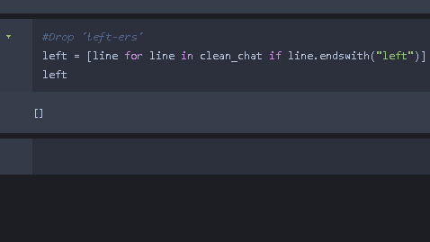

如果您的数据包含显示一些成员离开的消息，则运行以下代码:

```
#Clean out the left notification lines
clean_chat = [line for line in clean_chat if not line.endswith("left")]
print(len(clean_chat))
```

接下来，我们将把 clean_chat 中的所有行分组到消息中，并存储在一个名为 msgs 的变量中。每封邮件都以日期开始，例如 12/12/19，我们将在分组中使用该属性。我们将通过运行下面的代码来利用 Python 中的 regex 包:

```
#Merge messages that belong together
msgs = [] #message container
pos = 0 #counter for position of msgs in the container
"""
Flow:
For every line, see if it matches the expression which is starting with the format "number(s)+slash" eg "12/"
If it does, it is a new line of conversion as they begin with dates, add it to msgs container
Else, it is a continuation of the previous line, add it to the previous line and append to msgs, then pop previous line.
"""
for line in clean_chat:
    if re.findall("\A\d+[/]", line):
        msgs.append(line)
        pos += 1
    else:
        take = msgs[pos-1] + ". " + line
        msgs.append(take)
        msgs.pop(pos-1)
len(msgs)
```

这给出了下面的输出:

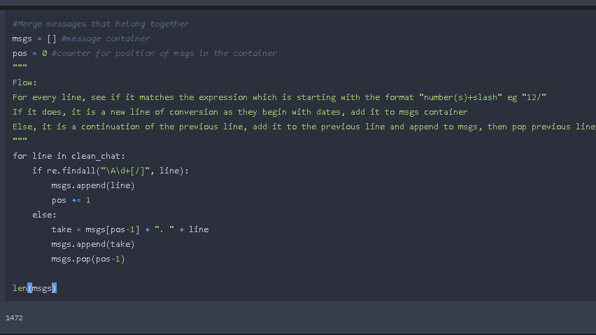

我们总共有 1472 条不同的消息(这应该与您的数据不同)。让我们看看我们的 msgs 数据的内容:

```
msgs[0:10]
```

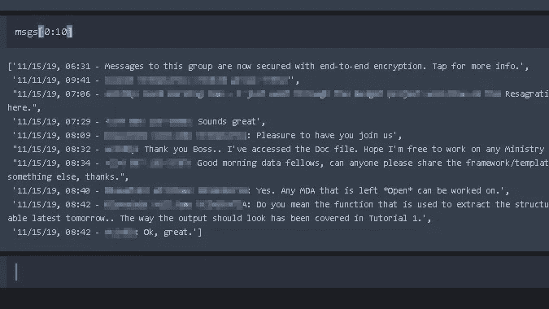

接下来，我们需要使用以下代码从我们的 msgs 数据中提取日期、时间、姓名和消息内容:

```
time = [msgs[i].split(',')[1].split('-')[0] for i in range(len(msgs))]
time = [s.strip(' ') for s in time] # Remove spacing
print("length of time is:")
print(len(time))
time
```

这给出了输出:

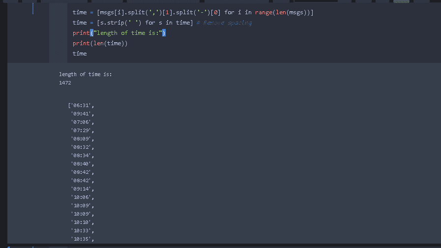

我们对日期、名称和内容也是如此。

```
date = [msgs[i].split(',')[0] for i in range(len(msgs))]
len(date)name = [msgs[i].split('-')[1].split(':')[0] for i in range(len(msgs))]
len(name)content = []
for i in range(len(msgs)):
  try:
    content.append(msgs[i].split(':')[2])
  except IndexError:
    content.append('Missing Text')
len(content)
```

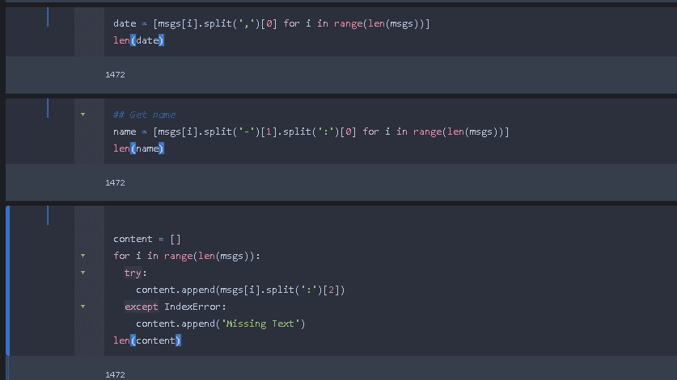

现在，我们终于可以使用 pandas 库将我们的日期、时间、姓名和内容数据合并到一个名为 df 的数据帧中了，代码如下:

```
df = pd.DataFrame(list(zip(date, time, name, content)), columns = ['Date', 'Time', 'Name', 'Content'])
df
```

这给出了下面的输出:

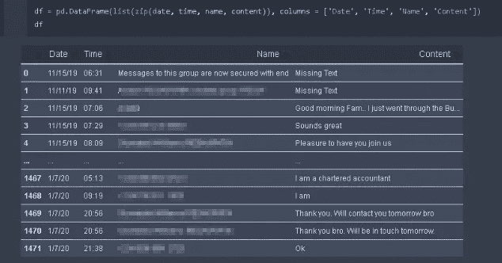

看前两行数据。内容栏显示“缺少文本”这些是系统消息，我们需要删除它们。我们可以通过以下方式做到这一点:

```
df = df[df["Content"]!='Missing Text']
df.reset_index(inplace=True, drop=True)
df
```

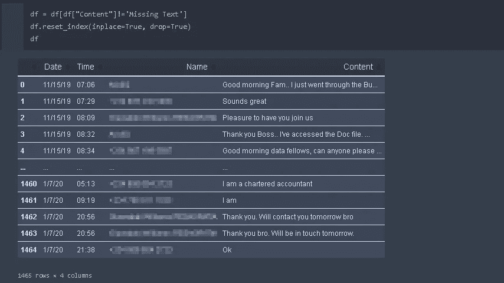

请注意，行数从 1472 降到了 1465(对于您的数据，这应该是不同的)。

我们将利用 pandas 中的内置函数创建额外的列。首先，让我们通过合并日期和时间列并使用 pd.to_datetime 函数来创建一个日期时间列:

```
df['DateTime'] = pd.to_datetime(df['Date'] + ' ' + df['Time'])
df['DateTime']
```

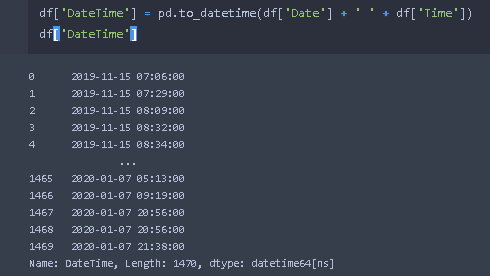

使用我们新创建的 Datetime 列，我们可以创建一个显示一周中各天的 weekday 列。

```
df['weekday'] = df['DateTime'].apply(lambda x: x.day_name())
```

我们将拆分内容列以创建新列，显示每封邮件中包含的字母和单词数。我们将这些列分别称为字母计数和单词计数。

```
df['Letter_Count'] = df['Content'].apply(lambda s : len(s))
df['Word_Count'] = df['Content'].apply(lambda s : len(s.split(' ')))
```

接下来，我们将拆分 Time 列，创建一个名为 Hour 的新列，显示一天中发送消息的时间。例如，给定 12:15，我们将在冒号(12)之前拆分数据，因为这表示小时。

```
df['Hour'] = df['Time'].apply(lambda x : x.split(':')[0]) 
# The first token of a value in the Time Column contains the hour (Eg., "12" in "12:15")
```

让我们看看我们的数据帧 df，看看到目前为止我们预处理的结果:

```
#print first five rows of our dataframe
df.head()
```

这给出了输出:

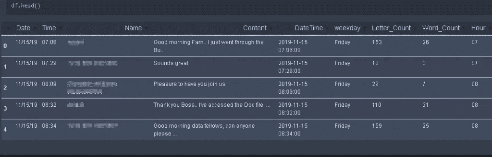

我们现在可以通过使用 pandas 内置函数以 CSV 格式保存我们的数据帧 df。这个 CSV 将用于在 Power BI 中创建我们的视觉效果。

```
#saving to csv format
df.to_csv("WhatsappChat.csv")
```

我们的 CSV 文件现在被保存为项目文件夹中的“WhatsappChat.csv”。在本教程的下一部分，我们将使用这个 CSV 文件在 Power BI 中创建令人惊叹的视觉效果。

你可以在这个 [github repo](https://github.com/ObinnaIheanachor/Whatsapp-Chat-project) 查看代码文件:

在下一篇文章中，我们将介绍如何在 Power BI 中创建一份出色的报告。

**关于作者**

Obinna Iheanachor 是一名创新型数据专家，拥有丰富的分析经验，并成功处理大量数据集来分解信息、收集相关见解和解决高级业务问题。*你会发现他处于数据分析、科学和艺术的交汇点*。

你可以在 [LinkedIn](https://www.linkedin.com/in/obinnaiheanachor/) 和 [Twitter](https://twitter.com/DatascientistOb) 上和我联系。