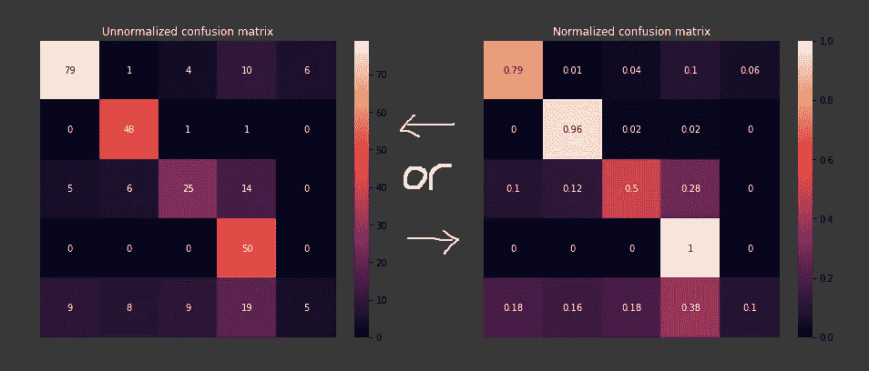
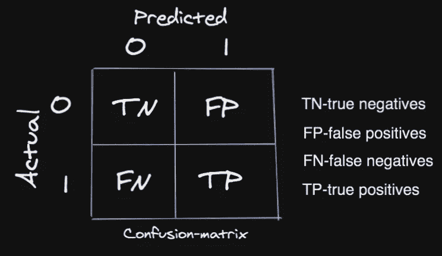
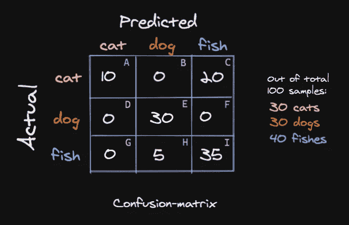
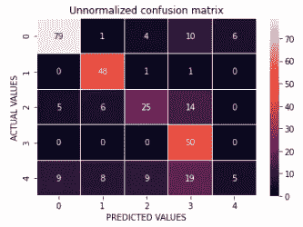
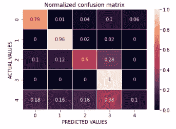

# (视觉上)解释混淆矩阵:

> 原文：<https://medium.com/analytics-vidhya/visually-interpreting-the-confusion-matrix-787a70b65678?source=collection_archive---------3----------------------->

## 标准化与非标准化混淆矩阵

## ..作为一名数据科学家，您如何更直观、更有效地从混乱矩阵中获得洞察力。



标准化与非标准化。模型解释哪个好？

B ut 首先，什么是混淆矩阵？在机器学习中，混淆矩阵是一种混淆表，用于了解我们的模型预测执行得有多好(*尤其是*当我们有多个类而不是经典的二进制 0/1 问题时会混淆)。然而，渐渐地，我发现混淆矩阵并不那么令人困惑，它对我理解模型行为和解释结果有很大帮助。所以我会试着在这里做同样的事情.. ***让它少一些迷惑，多一些趣味，更容易解读*** ！

在写这篇博客的时候，我假设读者已经有了一些先验知识，并打算回答:

1.  如何利用可视化工具解读混淆矩阵？
2.  为什么要使用归一化的混淆矩阵进行解释？

首先，让我们看一个简单的二元分类(0/1)混淆矩阵:



列表示我们的模型做出的预测，行表示实际的类(这是非常流行的 Python 库 ML: `sklearn`的格式)。一些书有相反的说法，但我将坚持这种格式)。因此`cell(0,0)`代表真正的否定..即。实际为阴性(属于`class 0`)的样本数量，我们预测它们也为阴性。类似地，真阳性是我们的模型正确分类为阳性并且实际上是阳性的样本数。

假阳性意味着我们预测这些样本为阳性(`class 1`)，但它们实际上是阴性(`class 0`)，反之亦然。

现在，让我们看看随着类别数量的增加，混淆矩阵是如何变得稍微复杂一些的。让我们考虑 3 类:`cats`、`dogs`和`fishes.`



对于 100 个样本的多类分类

在上图中，`cell A`代表被我们的模型正确分类的猫的数量。我们可以看到总共`30`只猫中只有`10`只被正确分类。`Cell E`代表`30/30`正确分类的狗(yaay🐶 ).`Cell H`代表`5`被错误归类为狗的鱼。由此可见，我们的模型对狗来说表现最好的是*，对鱼来说表现一般的是*，但对猫来说确实不好的是*。这就是多类混淆矩阵的样子。***

***现在，让我们来到 ***直观地解读******混淆矩阵*** :***

**我创建了一个虚拟混淆矩阵来解释这个概念。这里，我们考虑具有 5 个标签的多类分类模型的预测输出:`label 0 to 4`。班级是不平衡的。每个类别的真实样本数不相同。在我的例子中，`label 0`有`100`个真实样本，所有`other labels`都有`50`个真实样本。所以总共有`300`个样本。**

```
**#Create dummy Confusion Matriximport numpy as np
confusion_matrix = np.array([[79, 1,4,10,6],[0,48,1,1,0],[5,6,25,14,0],[0,0,0,50,0],[9,8,9,19,5]])print(confusion_matrix) **OUTPUT:** 
[[79 1 4 10 6]
 [ 0 48 1 1 0]
 [ 5 6 25 14 0]
 [ 0 0 0 50 0]
 [ 9 8 9 19 5]]**
```

**正如你所看到的，上面的混乱矩阵很难解释和得出结论。因此，我们使用视觉工具使其更容易解释。我倾向于使用 Python 中的`seaborn`库来实现可视化，因为它非常快速且易于使用。让我们根据上面的矩阵创建一个热图。**

```
**#Create a Confusion Matrix heatmap from the above data
import seaborn as sns
sns.heatmap(cm, annot=True, linewidths = 0.01)**
```

****

**浏览一下矩阵，我们知道:**

*   **`diagonal elements`代表每类预测的总正确值。例如:`79`值已被正确预测为属于`100`值中的`class 0` 。(但是请注意，我们并不知道标签 0 的总班级人数是 100)**
*   *****颜色越浅，数字越大*** ..我们可以从侧面的颜色条上看到。因此，我们很自然地会假设——对角线元素上的颜色较浅，而所有其他元素上的颜色较深，这意味着我们的模型表现良好，反之亦然。(然而，这是不正确的，我们将从归一化矩阵中看到。)**
*   **再多保持一点你的好奇心，让我给这个热图更多的解释。`class 1`和`class 3`的对角线元素几乎是同样的红色。所以我们也假设这两个类表现一样差。**
*   **对角线元素`(0,0)`的浅色暗示我们的模型在`class 0`中表现非常好。**
*   **最后但同样重要的是，`class 2`和`class 4`表现最差。**

**现在，让我们来看看这张热图的标准化版本。为了得到规范化的版本，我们将每个行元素除以整行的总和。由于每一行代表每个类标签的实际值的总数，最终的归一化矩阵将向我们显示百分比 ie。在特定类别的所有真实标签中，我们的模型对该特定真实标签做出的每个类别的预测百分比是多少。**

```
**#Create normalized Confusion Matrix
cm_normalized = confusion_matrix.astype('float') / confusion_matrix.sum(axis=1)[:, np.newaxis]sns.heatmap(cm_normalized, annot=True, linewidths = 0.01)**
```

****

**现在，每个`cell (i,j)`表示`class i`标签中的`P %`被预测为`class j`。希望这有意义。解释这个矩阵:**

*   **第一个主要区别。`class 1`和`class 3`的对角线元素，我们认为它们被错误地分类了…实际上被分配到了一个更亮的颜色。更高的数字(或者百分比，如果你愿意的话)。事实上，`class 3`被完全分类，因为它的值是`1`。接下来是`class 1`和`0.96`正确的预测。**
*   **我们认为`class 0`是最好的分类类别的假设只是误入歧途。现在是第三好的班级。在`class 0`的所有真实标签中，我们的模型只能正确分类其中的`79%`。**
*   **根据我们的非归一化混淆矩阵，`Class 2`表现最差，现在向我们显示它表现相对较好，因为在`class 2`的所有真实标签中，它正确地将`50%` 分类。**
*   **但是为什么会有这种差异呢..标准化和非标准化混淆矩阵之间的区别？ ***这种差异是由于阶级的不平衡而产生的*** 。并非所有类别都具有相同数量的总样本，因此非标准化矩阵输出绝对值，而没有考虑总类别大小中有多少比例被正确预测，这导致由于热图的彩色化而导致不正确的结论。**
*   **因此，从这个矩阵得出最终正确的结论，我们的模型对`class 1`和`class 3`表现良好，对`class 0`表现中等，对`class 2`和`class 4.`表现差。因此，作为一名数据科学家，你现在可以专注于为什么你的模型对`class 2 and 4`表现差。**

**因此，通过对混淆矩阵使用正确的可视化技术，我们能够获得关于我们的模型的正确见解，这就是混淆矩阵可视化的力量。总之，*总是使用标准化的混淆矩阵来解释你的结果。***

**以上代码可以在 [***这里找到***](https://github.com/riddhinn99/medium-articles-code/blob/main/confusion_matrix_normalized_vs_unnormalized.ipynb) ！幸运的是，sklearn 还提供了一个内置函数来创建这两种类型的混淆矩阵。你可以在这个*[*sk learn 文档*](https://scikit-learn.org/stable/auto_examples/model_selection/plot_confusion_matrix.html) *中找到代码和用法。****

**感谢阅读！如果你觉得这篇文章很有见地和/或有趣，请为它鼓掌，关注 [***了解更多！😋***](/@riddhinn)**

**一如既往，你和我一起学习。如果你发现一些不正确的东西或者我遗漏了一些明显的东西，请留下回复，我会检查一下。干杯！✨**