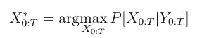
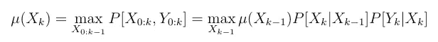
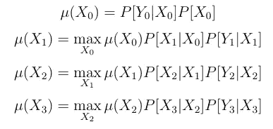
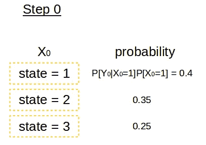
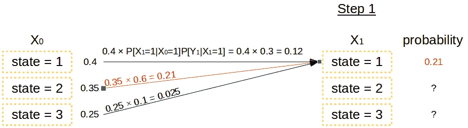
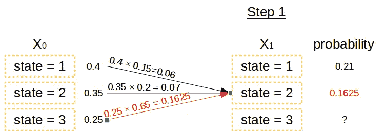
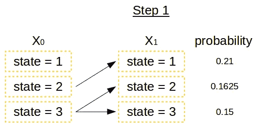
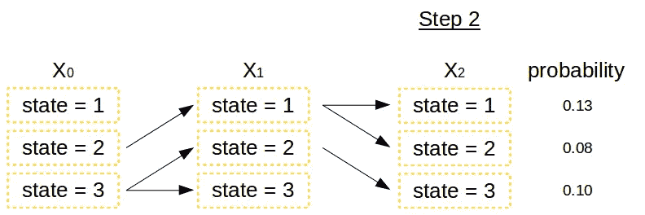

# HMM 预测的 Viterbi 算法——HMM 系列之三

> 原文：<https://medium.com/analytics-vidhya/viterbi-algorithm-for-prediction-with-hmm-part-3-of-the-hmm-series-6466ce2f5dc6?source=collection_archive---------1----------------------->

*如何从所有可能的途径中获得最佳隐藏状态链？*

*免责声明:这是我在过去的几天里了解到的关于 HMM 的内容，我认为这更容易理解，这绝对不是一本教科书能提供给你的系统化的方式。教科书永远是我们的朋友，它提供了一个完整的、结构化的学习方法，材料也不失一般性，但我希望我的文章能帮助你克服旅途中的一些瓶颈。祝你好运！*

第一部分:[隐马尔可夫模型的体系结构](/@rmwkwok/hidden-markov-model-part-1-of-the-hmm-series-3f7fea28a08)
第二部分:[训练 HMM 的算法:Baum-Welch 算法](/@rmwkwok/baum-welch-algorithm-for-training-a-hidden-markov-model-part-2-of-the-hmm-series-d0e393b4fb86)
第三部分:[用训练好的 HMM 进行预测的算法:Viterbi 算法](/@rmwkwok/viterbi-algorithm-for-prediction-with-hmm-part-3-of-the-hmm-series-6466ce2f5dc6)

在[第一篇文章](/@rmwkwok/hidden-markov-model-part-1-of-the-hmm-series-3f7fea28a08)中，我谈到了隐马尔可夫模型(HMM)的架构和参数化，以及我将在这里使用的变量的含义。[在第二篇文章](/@rmwkwok/baum-welch-algorithm-for-training-a-hidden-markov-model-part-2-of-the-hmm-series-d0e393b4fb86)中，是关于 HMM 的训练算法。在这一次，重点将放在预测算法，这是所谓的维特比算法。

像我们的训练算法 Baum-Welch 算法一样，Viterbi 算法也是一种动态规划方法。提醒一下，动态编程是一种可以在下一次计算中重用计算结果的方法，而且重用可以节省时间！更重要的是，它确实是 HMM 的自然选择，以简单的 HMM 为例，其中任何状态都依赖于它的第一个先前状态。然而这个说法并不是说从其余的前一个状态到当前状态完全没有影响，而是它们的影响都被吸收到第一个前一个状态中，这个第一个前一个状态就成为你过渡到下一个状态时唯一需要考虑的因素。

因此，你也可以说，在一个简单的 HMM 中，任何状态通过第一个先前状态依赖于所有先前状态，我说动态编程在这里是一个自然的选择，因为它也是一种捕获过去的一切并在未来重用的手段。

# 维特比算法

维特比算法的目的是基于训练的模型和一些观察到的数据进行推断。它通过提出一个问题来工作:给定训练的参数矩阵和数据，选择什么状态使得联合概率达到最大？换句话说，给定数据和训练好的模型，最有可能的选择是什么？这个说法可以形象化为下面的公式，显然，答案取决于数据！

这意味着找到给定数据的条件概率最大的状态。

为了找到最佳状态集，使用下面的递归公式。我推荐[这个 YouTube 视频](https://www.youtube.com/watch?v=RwwfUICZLsA)和[这个 YouTube 视频](https://www.youtube.com/watch?v=t3JIk3Jgifs)的偏差。

mu 函数。这取决于它的前一步，转换和发射矩阵。

让我们代入 *k* =1，2，3，这样我们可以很容易地理解这个递归。

第一个公式是起始 *mu* 函数，并导致在给定初始观察数据的情况下看到不同初始状态的概率分布。在这里，我们不把自己约束到这些初始状态中的任何一个，而是在下一个公式中确定。

第二个公式选取最佳初始状态，使右边各项的乘积最大化，并将第一个状态作为自由参数留在第三个公式中确定。类似地，第三个公式选择最佳的第一个状态，然后将第二个状态留给第四个公式。

让我们把这些重复的过程用一个叫做格子图的图来形象化。在图中，我们可以看到每个状态是如何根据概率最大化规则选择的，为了保持图小，我假设在每个时间步只有三个可能的状态可供我们选择。当然，同样的想法适用于任何数量的州。

步骤 0。列出了时间为 0 时的初始状态的所有三种可能状态。为了便于下面的讨论，相应的概率被假设为一些实际的数字。

步骤 0 只是列出时间 0 时所有可能的状态，以及它们相应的概率值，我们并不决定在这个阶段选择哪个状态。

步骤 1–1。对于每个可能的第一状态，选择最佳的可能初始状态。我们发现初始状态= 2 最有可能导致第一状态= 1。

步骤 1–2。这里我们发现初始状态= 3 最有可能导致第一状态= 2。

步骤 1–3。我们通过找到最有可能导致第一个状态的初始状态，并记住它们的概率值来结束步骤 1，这些概率值将在下一步中重复使用。

在步骤 1 中，我们遍历所有可能的第一状态(时间= 1 时的状态)，并找出它们对应的最佳初始状态(时间= 0 时的状态)，如上图所示。然后，我们重复相同的过程，完成步骤 2。

第二步。重复从步骤 0 到步骤 1 的过程，以从步骤 1 得到步骤 2。

现在我们开始看到一些路径。例如，如果我们在步骤 2 结束推理，那么最可能的结束状态将是 state = 1，其余的先前状态可以通过箭头回溯，它们是时间 0 时的状态 2、时间 1 时的状态 1 和时间 2 时的状态 1。第二个可能的路径是 3–2–3，最不可能的路径是 2–1–2。该路径不太可能从状态 1 开始。

# 摘要

给定模型参数被优化，并且给定观察数据，维特比算法是对隐藏状态进行推断或预测的有效方式。最好通过网格来直观地了解如何选择从一个时间步长到下一个时间步长的路径。这就结束了对隐马尔可夫模型系列的介绍。