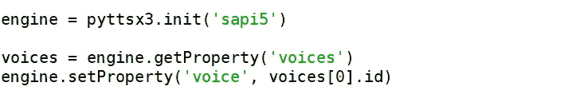
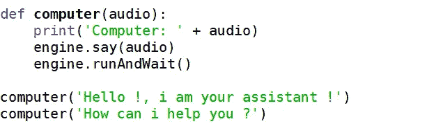
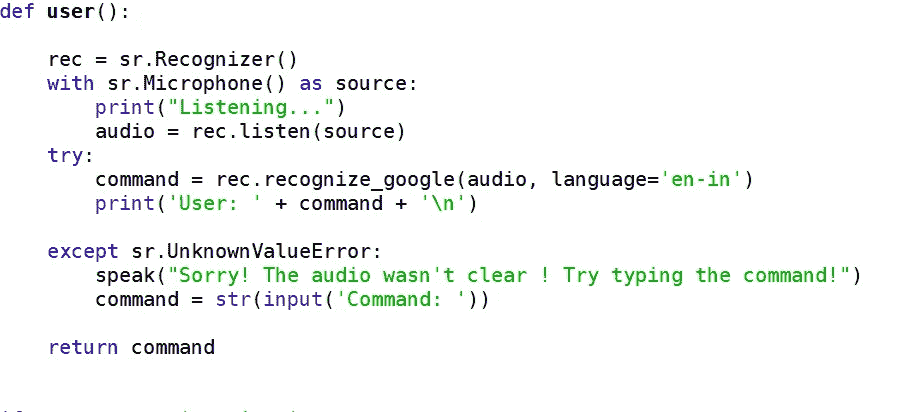
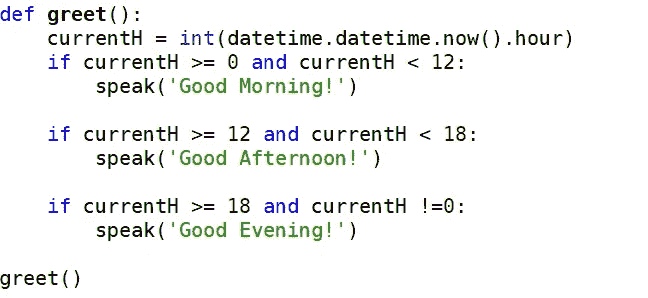
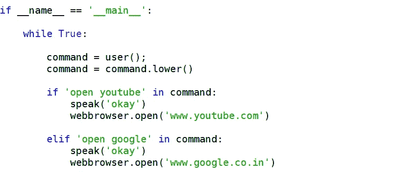
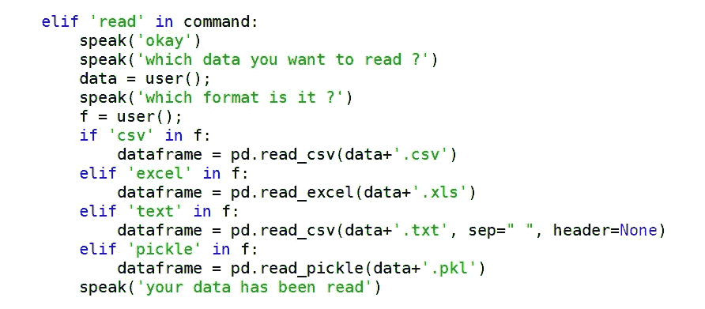

# 执行日常任务的语音识别

> 原文：<https://medium.com/analytics-vidhya/voice-recognition-to-perform-tasks-done-on-daily-basis-1a9b9642969b?source=collection_archive---------1----------------------->

声音识别

## **语音识别:**

语音识别是机器或程序识别口语中的单词和短语并将其转换为机器可读格式的能力。初级语音识别软件的单词和短语的词汇量有限，只有当它们说得非常清楚时，它才能识别它们

今天，这是在装有 **ASR** ( **自动语音识别**)软件程序的电脑上完成的。许多 ASR 程序要求用户“训练”ASR 程序来识别他们的声音，以便它能够更准确地将语音转换成文本。例如，你可以说“打开互联网”，电脑就会打开互联网浏览器。

这不仅仅限于打开东西，我们还可以命令它执行日常任务(重复执行)，如读取数据、旋转和其他一些除了输入之外不需要任何代码更改的任务。

为了让事情先工作，我们需要安装一些东西。

1.  pyttsx3:它是 Python 中的一个文本到语音转换库。与其他库不同，它可以离线工作，并且兼容 Python 2 和 3。
2.  speechRecognition:这是一个用于执行语音识别的库，支持在线和离线的多个引擎和 API。语音识别引擎/API 支持:

*   CMU 狮身人面像(离线工作)
*   谷歌语音识别
*   谷歌云语音 API
*   Microsoft Bing 语音识别
*   Houndify API
*   IBM 语音转文本
*   Snowboy 热门词汇检测(离线工作)

3.PyAudio : PyAudio 为跨平台音频 I/O 库 PortAudio 提供 Python 绑定。有了 PyAudio，你可以轻松地使用 Python 在各种平台上播放和录制音频，比如 GNU/Linux、微软 Windows、苹果 Mac OS X / macOS。

4.datetime:这个模块提供了以简单和复杂的方式操作日期和时间的类。虽然支持日期和时间算法，但实现的重点是有效的属性提取，以便进行输出格式化和操作。有关相关功能，另请参见时间和日历模块。

5.webbrowser:webbrowser 模块提供了一个高级接口，允许向用户显示基于 Web 的文档。在大多数情况下，只需从这个模块调用 open()函数就可以了。脚本 webbrowser 可以用作模块的命令行界面。它接受一个 URL 作为参数。

6.wikipedia : wikipedia 是一个 Python 库，使得访问和解析来自 Wikipedia 的数据变得容易。搜索维基百科，获取文章摘要，从页面获取链接和图像等数据，等等。维基百科包装了 MediaWiki API，因此您可以专注于使用维基百科数据，而不是获取数据。

## **导入库时面临的复杂情况:**

在导入上述模块的过程中，您肯定会遇到专门针对 PyAudio 的问题，因为 Windows 上没有 Python 3.7 的 wheel(预构建的包)(Python 2.7 和 3.4 到 3.6 有一个)，所以您需要在 PC 上准备构建环境来使用该包。或许，你需要从这个“ [***链接***](https://www.lfd.uci.edu/~gohlke/pythonlibs/)*对外下载车轮文件，在这个网页上搜索“pyaudio”并根据你的 python 版本和系统规格下载车轮。现在，使用 pip 命令将其安装到您的系统上，例如，如果您的文件位于下载部分，则使用*"！pip install/Downloads/filename . whl "*在您的 IDE 或 open 提示符下键入上面的命令，不带"！"。这将最终在您的系统上安装这个软件包。*

## ***我们开始:***

**

*(截图)*

## *使用 pyttsx3:*

*应用程序调用 pyttsx3.init()工厂函数来获取对 pytsx 的引用。引擎实例。在构造期间，引擎初始化 pyttsx3.driver.DriverProxy 对象，该对象负责从模块加载语音引擎驱动程序实现。*

*要加载和使用的 pyttsx3.drivers 模块的名称。默认为适用于该平台的最佳驱动程序，目前:*

*   *sapi5—Windows 上的 SAPI 5*
*   *Mac OS X 上的 nsss — NSSpeechSynthesizer*
*   *espeak —在所有其他平台上的 espeak*

***set property(**name**):**对设置引擎属性的命令进行排队。新的属性值影响在该命令之后排队的所有话语。*

***getProperty(**name**):**获取引擎属性的当前值。下列属性名称对所有驱动程序都有效。*

**速率*:以每分钟字数为单位的整数语速。默认为每分钟 200 字。*

**语音*:活动语音的字符串标识符。*

**voices*:pyttsx 3 . voice . voice 描述符对象列表。*

**音量*:0.0 到 1.0 范围内的浮点音量。默认为 1.0。*

****

*(截图)*

*上述两个模块*计算机*和*用户*将帮助计算机识别用户想要什么，并相应地传递对话。*

***识别器类:***

*SpeechRecognition 的所有神奇之处都发生在 recognizer 类上。当然，识别器实例的主要目的是识别语音。每个实例都带有各种设置和功能，用于识别来自音频源的语音。每个识别器实例都有七种使用各种 API 从音频源识别语音的方法。这些是:*

*   *recognize_bing():微软 bing 语音*
*   *recognize_google() : Google Web 语音 API*
*   *recognize _ Google _ Cloud():Google Cloud Speech-需要安装 Google Cloud-Speech 包*
*   *recognize_houndify():由 SoundHound 执行 houndify*
*   *recognize_ibm() : IBM 语音转文本*
*   *recognize_sphinx() : CMU Sphinx -需要安装 PocketSphinx*
*   *recognize_wit() : Wit.ai*

**

***问候**方法会让它问候你。*

*现在，最后一件事是利用这些模块，使系统运行命令编码在主函数中。这部分代码将决定在给定的命令上运行哪个模块。*

**

*(截图)*

*这里，在命令中调用用户模块，该模块识别用户给出的命令，并且在命令中，如果用户提到*‘打开 YouTube’*或*‘打开谷歌’*，它会将用户直接引导到指定的网页。*

*类似地，我们可以使用它来完成日常工作，如读取数据、旋转数据、以不同格式保存文件以及许多其他不需要修改代码的任务。*

**

*(读取数据)*

*同样，也可以执行其他任务。*

***可以让它更有互动性:***

*这可以用于其他目的，比如你可以制作一个像“KBC”或“谁想成为百万富翁”这样的脱口秀节目。您也可以插入录制的音频。*

*为此，首先下载音频并导入 **playsound** 模块。使用 playsound . playsound(' location/file . MP3 '，True)播放音频。此外，你可以为每一个正确的答案加上阿米特巴·巴强著名的对话“Aadbhut”。😁😁😁😁*