# 库伯内特斯卷

> 原文：<https://medium.com/analytics-vidhya/volumes-in-kubernetes-fa9f50ce4c8f?source=collection_archive---------6----------------------->

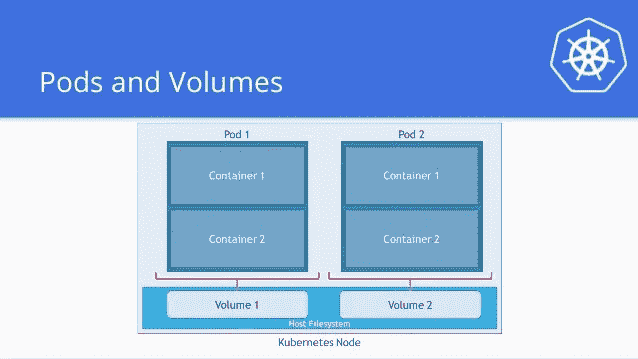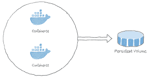

在 **Kubernetes** 中，卷可以被认为是 pod 中的容器可以访问的目录。Kubernetes 中有不同类型的卷，类型定义了卷的创建方式及其内容。

体积的概念出现在 Docker 上，但是唯一的问题是体积非常局限于一个特定的 pod。一个荚果的寿命一结束，体积也就失去了。

另一方面，通过 Kubernetes 创建的卷不限于任何容器。它支持 Kubernetes pod 内部部署的任何或所有容器。

# 库伯内特卷的类型

Kubernetes 的一些卷是:

*   **empty dir**—这是一种在 Pod 首次分配给节点时创建的卷。只要 Pod 在该节点上运行，它就会保持活动状态。该卷最初是空的，pod 中的容器可以读写 emptyDir 卷中的文件。从节点中删除 Pod 后，emptyDir 中的数据将被擦除。
*   **主机路径**—这种类型的卷将文件或目录从主机节点的文件系统挂载到您的 pod 中。
*   **gcepersistindisk**—这种类型的卷将一个 Google 计算引擎(GCE)永久磁盘安装到您的 Pod 中。当 Pod 从节点中移除时，gcePersistentDisk 中的数据保持不变。
*   **awsElasticBlockStore**—这种类型的卷将 Amazon Web Services (AWS)弹性块存储装载到您的 Pod 中。就像 gcePersistentDisk 一样，当 Pod 从节点中删除时，awsElasticBlockStore 中的数据保持不变。
*   **nfs**—NFS 卷允许将现有的 NFS(网络文件系统)安装到您的 pod 中。当从节点中删除 Pod 时，nfs 卷中的数据不会被擦除。仅卸载了该卷。
*   **git repo**—git repo 卷挂载一个空目录，并在其中克隆一个 git 存储库供您的 pod 使用。
*   **Azure Disk volume**—**Azure Disk volume**用于将微软 Azure 数据磁盘装入 Pod。

所以现在让我们详细讨论一下上面提到的一些量:

# 注意:

**先决条件**:请通过此 [pdf](https://docs.google.com/document/d/1-iC93GhUz1LvYAgjgDS6F3g01V0Vk2q4omTP_OifBkI/edit?usp=sharing) 为本地 depy 设置 **Minikube。**本 pdf 包括逐步安装和设置 docker、kubectl 和 minikube。

链接:[https://docs . Google . com/document/d/1-IC 93 ghuz 1 lvyagjgds 6 F3 g 01 v0k 2 q 4 omtp _ OifBkI/edit？usp =分享](https://docs.google.com/document/d/1-iC93GhUz1LvYAgjgDS6F3g01V0Vk2q4omTP_OifBkI/edit?usp=sharing)

你也可以看看我以前的[教程](/analytics-vidhya/using-minikube-for-local-deplyment-of-single-node-kubernetes-cluster-25bb576d532b)，其中我使用了 **Minikube 作为单节点 Kubernetes 集群**的本地部署

链接:[https://medium . com/analytics-vid hya/using-minikube-for-local-deployment-of-single-node-kubernetes-cluster-25bb 576d 532 b](/analytics-vidhya/using-minikube-for-local-deplyment-of-single-node-kubernetes-cluster-25bb576d532b)

请遵循每一步，否则你将无法前进。

# EmptyDir 卷

emptyDir 是一个临时目录，当 pod 被销毁时，它将销毁共享卷及其所有内容。

让我们创建一个包含两个容器的 pod，它们使用一个 **emptyDir** 卷来交换数据:

1.  创建一个 emptyDir-pod.yml，并使用

```
chmod 777 emptyD-r-pod.yml
```

在 emptyDir-pod.yml 中，我们将使用 **redis** 映像，卷挂载的名称将是 **redis-storage** ，挂载位置将是 **/data/redis，并且我们正在使用的卷的**类型是 **emptyDir**

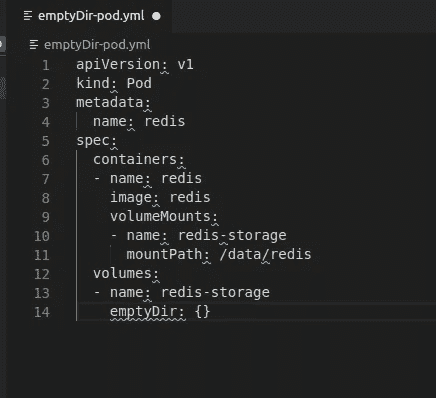

2.现在，对于本地部署，我们需要启动 minikube 服务器

```
sudo minikube start
```

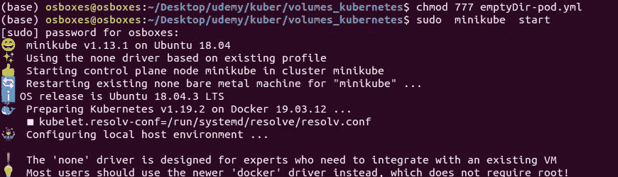

3.验证 Minikube 正在运行。

```
sudo kubectl get node
```

4.验证 Pod 的容器正在运行，然后观察 Pod 的变化:

```
sudo kubectl create -f emptyDir-pod.ymlsudo kubectl get pod redis --watch
```

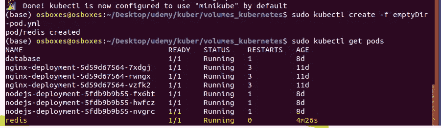

5.打开另一个终端，获取运行容器的 shell:

```
kubectl exec -it redis -- /bin/bash
```

在您的 shell 中，转到`/data/redis`，然后创建一个文件，不要退出容器:

```
echo "I am inside redis container" >> test_file.txt
```

在您的 shell 中，列出容器中正在运行的进程:

```
 sudo apt-get update
sudo apt-get install procps
ps auxYou output will look like this :USER       PID %CPU %MEM    VSZ   RSS TTY      STAT START   TIME COMMAND
redis        1  0.1  0.1  33308  3828 ?        Ssl  00:46   0:00 redis-server *:6379
root        12  0.0  0.0  20228  3020 ?        Ss   00:47   0:00 /bin/bash
root        15  0.0  0.0  17500  2072 ?        R+   00:48   0:00 ps aux
```

在 shell 中，终止 Redis 进程:

```
sudo kill <pid> where is <pid> will be redis process ID
sudo kill 1 
```

在原来的终端中，观察 Redis Pod 的变化。您将看到类似这样的内容:

```
NAME      READY     STATUS     RESTARTS  AGE
redis     1/1       Running    0         11s
redis     0/1       Completed  0         4m
redis     1/1       Running    1         4m
```

此时，容器已经自行终止并重新启动。

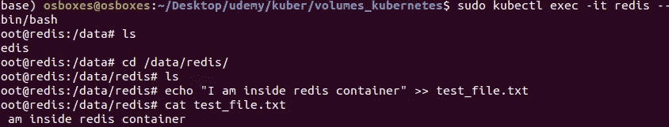

6.删除您为此练习创建的 Pod:

*   `kubectl delete pod redis`

# 主机路径卷

主机路径也是节点本地类型 k8s 卷。这可以从主机访问，而无需访问群集资源。

**持久卷:**持久卷是 Kubernetes 集群中的一块存储。

1.  创建持久卷:在 specication 部分，我们可以看到我们正在共享 10 GB 的本地存储，具有读写访问权限和我们想要共享的文件夹路径。

在共享文件夹中，我创建了一个 index.html 文件，并添加了以下内容“嘿，这是萨尔塔·斯里瓦斯塔瓦在 Kubernetes 中执行主机路径卷”，并使用 chmod 777 index.html 使其可执行

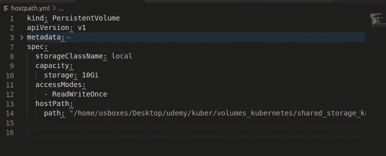

2.保存文件并创建永久卷。

```
sudo kubectl create -f hostpath.yml
```

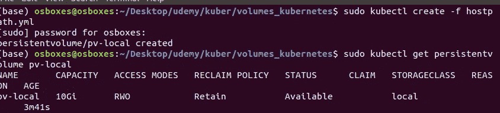

3.您可以使用以下方式查看持久卷:

```
sudo kubectl get pv
```

**持续量索赔**

现在我们将创建一个 PersistentVolumeClaim，它将声明一个 pod 中要引用的空间。PersistentVolumeClaim 是通过指定所需的 persistentVolume 的最小大小和访问模式来创建的。

在“specication”部分，我们可以看到我们要求 10 个本地存储中有 5 GB 具有读写访问权限。

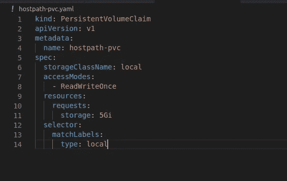

4.保存文件并创建永久卷声明。

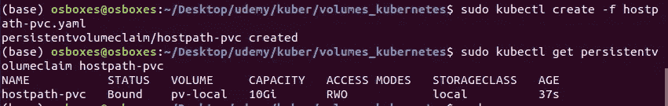

# 创建一个 Pod

下一步是创建一个 Pod，它使用 PersistentVolumeClaim 作为卷。

这是名为 httpd 的 Pod 的配置文件，其中副本数为 2，容器使用映像 httpd，公开的端口为 80，容器中的装载位置为/usr/local/apache2/htdocs

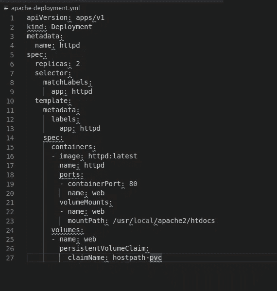

5.创建 Pod

```
sudo kubectl create -f apache-deployment.yml
```

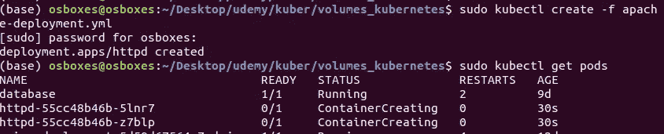

6.现在，我们将公开我们的部署并运行命令来获取 url

```
sudo kubectl expose deployment httpd --type=NodePort
sudo minikube service httpd
```

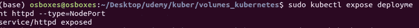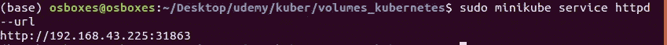

7.复制 url 并将其粘贴到浏览器上

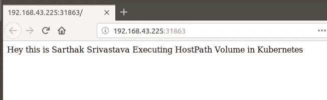

或者使用以下命令访问 Pod 中运行的容器的外壳:

```
#This will take you to inside of the container
kubectl exec -it httpd -- /bin/bashapt update
apt install curl
curl http://localhost/
```

这将在浏览器上显示与上述相同的输出

## 打扫

删除 Pod、PersistentVolumeClaim 和 PersistentVolume:

```
kubectl delete pod httpd
kubectl delete pvc hostpath-pvc
kubectl delete pv pv-local
```