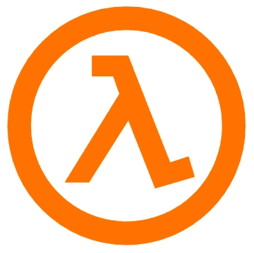
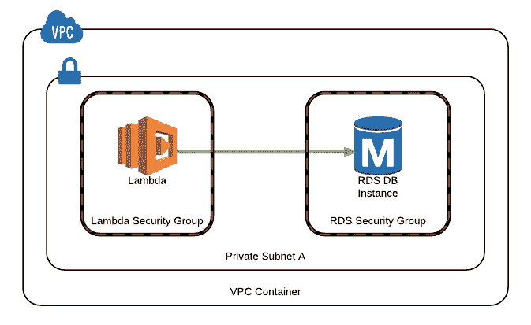
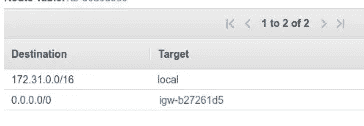
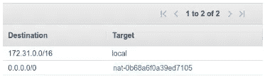
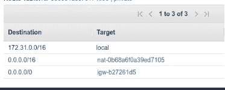

# lambda 位于 VPC，可接入互联网

> 原文：<https://medium.com/analytics-vidhya/vpc-lambda-internet-access-f70a55dc7a39?source=collection_archive---------14----------------------->



运行 lambda 函数，执行简单而简短的任务，受欢迎程度不断增长。

无需供应或管理服务器，运行简单的单任务应用程序，已经证明非常有用。

正确使用 AWS lambda 函数可以成为执行小型、临时任务的服务的一种经济高效、易于管理且方便的替代方式。

作为一个例子，我将解决一个微服务，轮询 SQS 队列或订阅 SNS 主题，对每条消息或通知进行数据库查询，处理结果并通过第三方提供商发送 SMS 通知。

到目前为止，这是一个非常简单的任务。这就是事情变得棘手的地方。

# 为什么？

AWS RDS 实例在 VPC 内部启动。通常，组织会阻止对其数据库的所有公共访问，并在没有公共访问点的 VPC 内管理它们。在上面的例子中，我们可以得出结论，除了 RDS 实例之外，我们的 lambda 函数也需要访问互联网。

# 那么，问题出在哪里呢？

研究 AWS ENI 文档会发现，lambda 要访问 VPC 内部的资源，它需要一个弹性网络接口(ENI)。分配给λ函数的 ENI 仅与私有 IP 地址相关联。因此，lambda 函数没有互联网连接，每个公共 HTTP 调用都会导致超时。

由于限制、性能和可伸缩性问题，在 VPC 中包含 lambda 是好是坏还有很多争议。我写这篇教程只是因为当我需要解决这个问题时，作为将微服务迁移到无服务器应用的任务的一部分，在线上没有例子、有效的文档或解决方案。



# 解决方案

必须条件:

*   **RDS 实例必须在帐户的默认 VPC 中启动。**
*   **必须创建一个新的默认子网。**
*   **一个公共子网和一个私有子网。**

**实现**:

*   **创建新的公共子网:** 公共子网必须包含一个路由表，其中至少包含一个公共互联网网关:



公共子网

*   **创建新的私有子网:** 私有子网必须包含一个路由表，其中至少包含一个 NAT 实例。



私有子网

*   **创建新的默认子网:**
    新的默认子网不应分配给任何实例或服务。
    应该将两条路由添加到其路由表中，一条到 internet 网关，一条到 NAT 实例。两个目标都应该在 0.0.0.0 上。我们不能将两个目的地分配给 0.0.0.0/0，因此我们将 0.0.0.0/0 分配给 IGW，0.0.0.0/x 分配给 NAT 实例。



新默认子网

通过 CLI 创建新的默认子网

```
aws ec2 create-default-subnet —-availability-zone <availablity zone>
```

*   **配置 lambda 函数:** 完成所有这些第一步后，最后一步是将 lambda 函数分配给默认的 VPC id，该 id 包含我们的私有和公共子网以及出站规则为 0.0.0.0 的安全组。
    请注意，尽管 AWS 最佳实践指导我们使用 at list 两个子网，但只将私有子网分配给 lambda 函数就足够了，它可以访问互联网。请注意，只分配公共网络是行不通的。

# 总之:

正如我们所见，在可以访问互联网的 VPC 中使用 lambda 函数并不简单。AWS 要求我们，作为开发人员，不时地要有灵活性和创造性。如果这是你所面临的问题，我建议的解决方案会帮你解决。

一般的无服务器架构，特别是 lambda 函数的使用。最近变得超级流行，非常推荐使用。

我接下来的故事将继续关注 AWS 服务和一些常见问题，并提出一些重要的解决方案。

敬请期待:)…