# VS 代码扩展入门

> 原文：<https://medium.com/analytics-vidhya/vs-code-getting-started-extensions-7eff2188b4aa?source=collection_archive---------20----------------------->

## vs 代码是最好的编辑器之一，当你定制它的时候，它会变得更好。

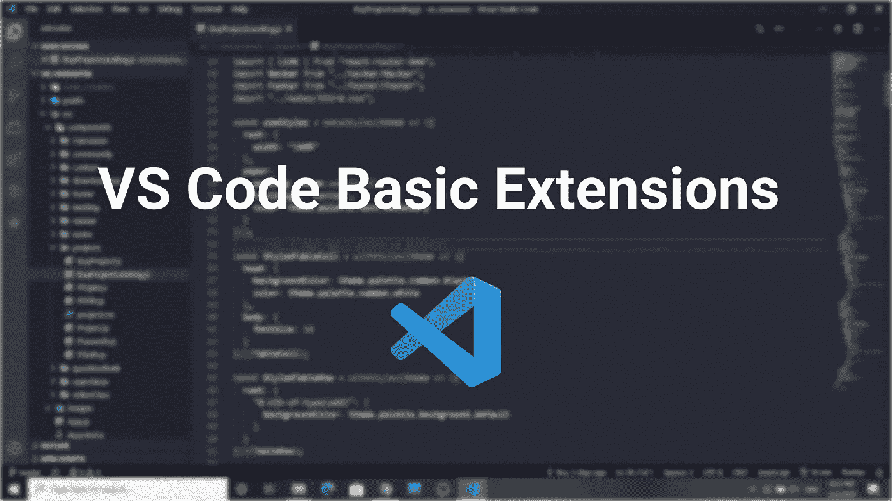

我使用 VS 代码已经有几年了。毫无疑问，它是最好的编辑器之一。随着扩展，它变得更加强大。它有丰富的扩展集合，这使得它支持任何语言。

在这里，我试图编译一些最好的扩展，以便开始使用我使用的一些编程语言和框架。请随意探索 Vs 代码市场以获得更多扩展。

你可以从这里下载 VS 代码:[https://code.visualstudio.com/](https://code.visualstudio.com/)

# 主题

注意:说到主题我有点偏。还有更多精彩的主题。希望你找到一个符合你口味的。

## [德拉库拉官方](https://marketplace.visualstudio.com/items?itemName=dracula-theme.theme-dracula)

一个美丽的黑暗主题。

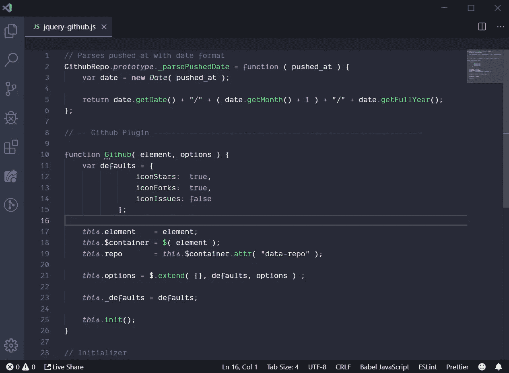

## [素材图标主题](https://marketplace.visualstudio.com/items?itemName=PKief.material-icon-theme)

VS 代码的材料设计图标。让所有无聊的图标不再无聊。

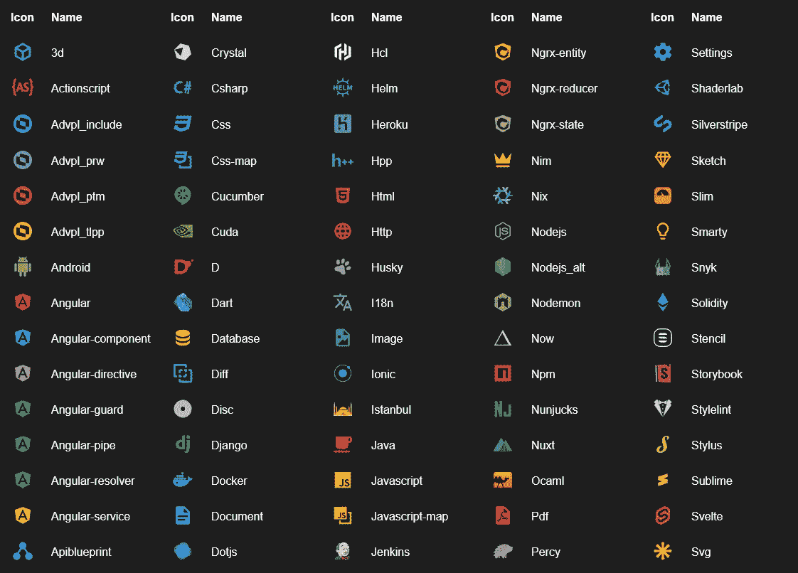

# Web 开发

## [HTML 代码片段](https://marketplace.visualstudio.com/items?itemName=abusaidm.html-snippets)

通过自动完成使输入 html 标签变得更加容易。

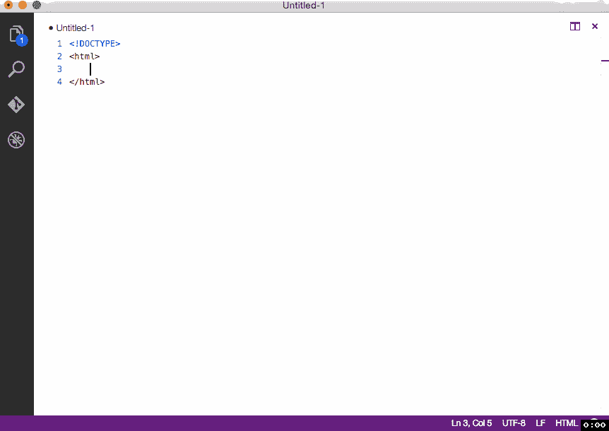

## [html 提示](https://marketplace.visualstudio.com/items?itemName=mkaufman.HTMLHint)

它分析你 html 代码中的语法错误，如果发现的话就标记出来。

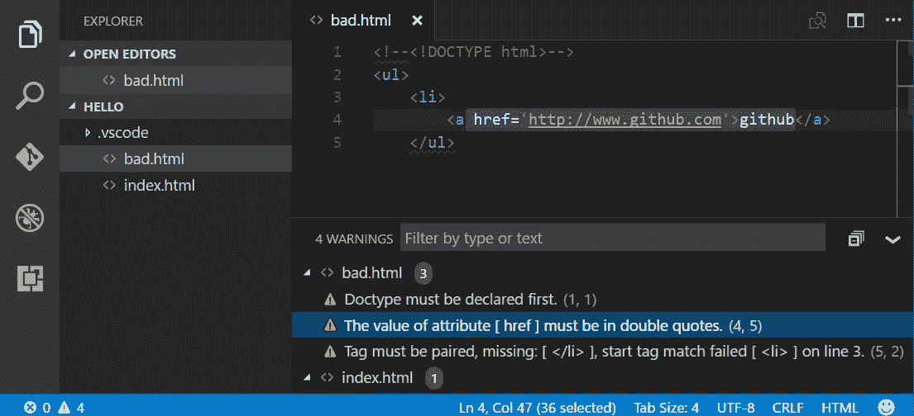

## [HTML 中 CSS 类名的智能感知](https://marketplace.visualstudio.com/items?itemName=Zignd.html-css-class-completion)

根据您的项目自动完成 HTML 属性的 CSS 类名。

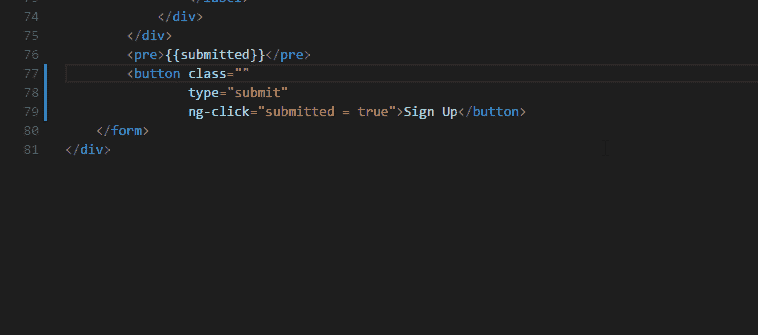

## [CSS 窥视](https://marketplace.visualstudio.com/items?itemName=pranaygp.vscode-css-peek)

它允许直接从 html 窥视 css 属性的定义。当项目很大时，它使调试变得如此容易。

## [HTML CSS 支持](https://marketplace.visualstudio.com/items?itemName=ecmel.vscode-html-css)

为 vs 代码添加 css 自动完成支持。

## [JavaScript (ES6)代码片段](https://marketplace.visualstudio.com/items?itemName=xabikos.JavaScriptSnippets)

向 vs 代码添加 JavaScript (ES6)代码片段支持。

## [ESLint](https://marketplace.visualstudio.com/items?itemName=dbaeumer.vscode-eslint)

它将 [ESLint](http://eslint.org/) 集成到 VS 代码中。它检查您的 JavaScript 代码的语法错误。

# 反应 Js

## [简单的反应片段](https://marketplace.visualstudio.com/items?itemName=burkeholland.simple-react-snippets)

顾名思义，它提供了基本的 React 片段和命令。

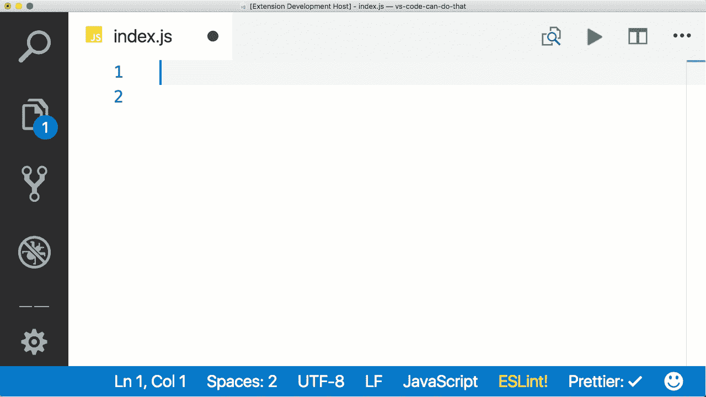

## [ES7 React/Redux/graph QL/React-Native 片段](https://marketplace.visualstudio.com/items?itemName=dsznajder.es7-react-js-snippets)

它在 ES7 中提供了 react/redux 片段。

## [直播服务器](https://marketplace.visualstudio.com/items?itemName=ritwickdey.LiveServer)

它为静态和动态页面创建了一个具有实时重新加载功能的开发本地服务器

# 计算机编程语言

## [Python](https://marketplace.visualstudio.com/items?itemName=ms-python.python)

它将 python 支持添加到 vs 代码中，其中包括林挺、代码格式化、调试和对微软直接烘焙的 Jupyter 笔记本的支持。

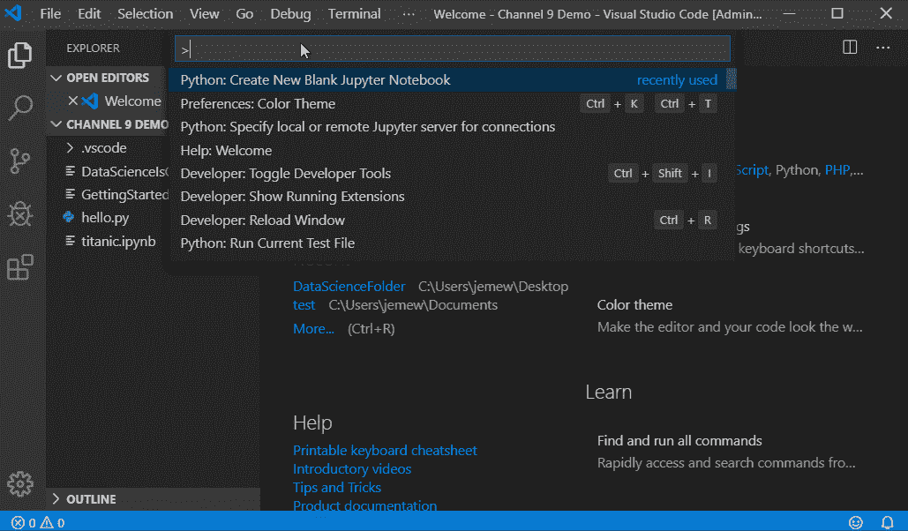

# Java 语言(一种计算机语言，尤用于创建网站)

## [Java 扩展包](https://marketplace.visualstudio.com/items?itemName=vscjava.vscode-java-pack)

它是多个 java 扩展的集合，添加了在 vs 代码中运行、调试和编辑 java 所需的所有基本特性。

# 摆动

## [颤动](https://marketplace.visualstudio.com/items?itemName=Dart-Code.flutter)

它增加了对编辑、重构和运行 flutter 应用程序的支持。

## [镖](https://marketplace.visualstudio.com/items?itemName=Dart-Code.dart-code)

它增加了对 dart 语言的支持。

## [码头工人](https://marketplace.visualstudio.com/items?itemName=ms-azuretools.vscode-docker)

这增加了启动等选项。无需键入任何代码，直接停止和移除容器。它还使得管理和维护 docker 图像变得容易。

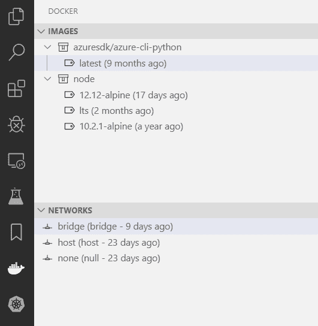

# 公用事业

## [代码时间](https://marketplace.visualstudio.com/items?itemName=softwaredotcom.swdc-vscode)

它提供了衡量标准，比如你花在编码上的时间和其他信息，让你不时保持动力。

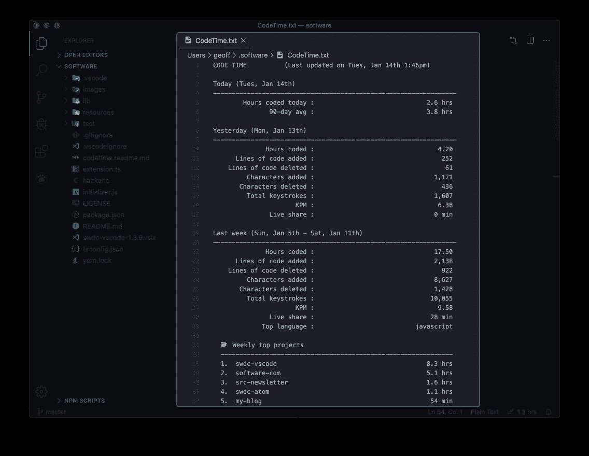

## [代号跑者](https://marketplace.visualstudio.com/items?itemName=formulahendry.code-runner)

单击一个按钮即可运行多语言的代码片段或代码文件。

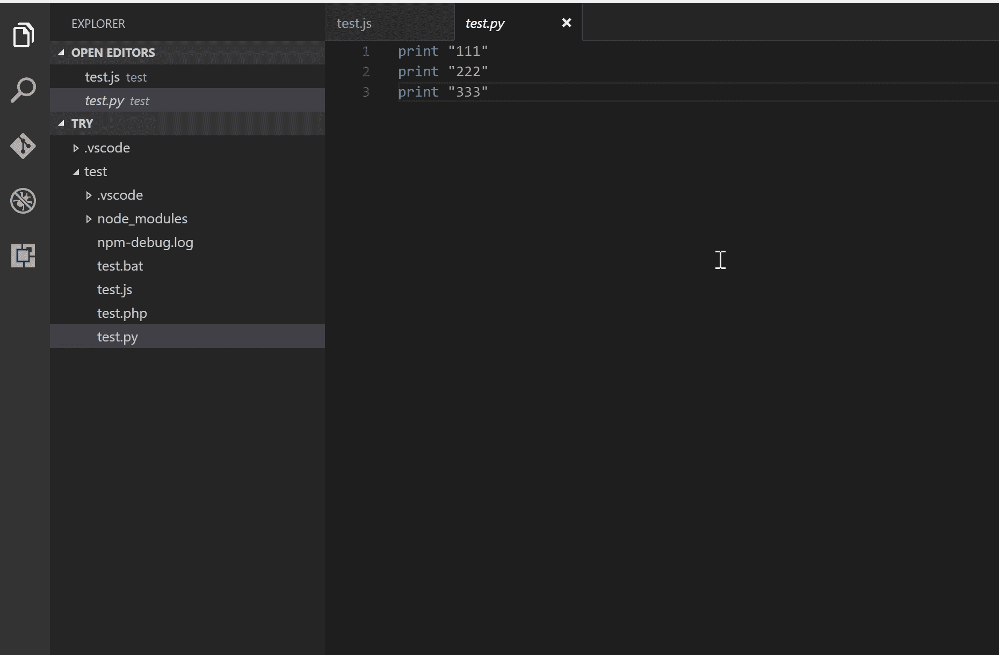

## [支架对着色机 2](https://marketplace.visualstudio.com/items?itemName=CoenraadS.bracket-pair-colorizer-2)

它使你的两个支架颜色相同。这可能是一个简单的添加，但是在调试时节省了大量的时间和精力。

## [GitLens — Git 增压](https://marketplace.visualstudio.com/items?itemName=eamodio.gitlens)

## 更漂亮—代码格式化程序

它格式化你的代码，使它看起来始终一致和可读。

## [Visual Studio IntelliCode](https://marketplace.visualstudio.com/items?itemName=VisualStudioExptTeam.vscodeintellicode)

它提供由微软直接烘焙的 AI 辅助代码自动完成。

## [现场分享](https://marketplace.visualstudio.com/items?itemName=MS-vsliveshare.vsliveshare)

它帮助您共享和协作您的代码，直接从 vs 代码中实时测试和调试。

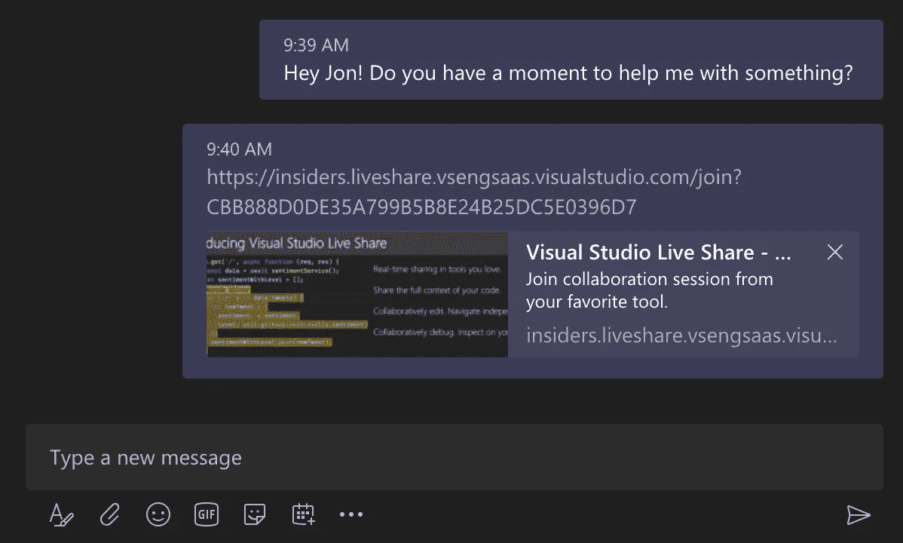

# 结论

既然您已经花费了这么多时间和精力来设置和定制您的 vs 代码环境，我知道您会想知道是否可以备份所有这些设置，以便您可以随时恢复您的设置。

## [设置同步](https://marketplace.visualstudio.com/items?itemName=Shan.code-settings-sync)

将所有 vs 代码设置和配置同步到 GitHub repo。

这个扩展确实做到了它所告诉我们的。它会备份您的所有设置和配置，以便您可以随时恢复，就像在家一样。

**感谢您的阅读，希望您在设置 VS 代码的过程中过得愉快。**

编码快乐！！