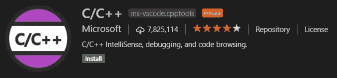
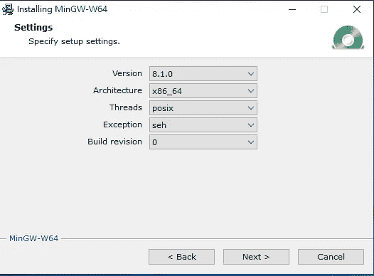
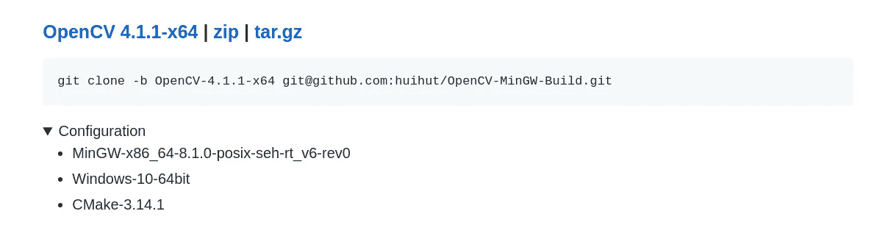
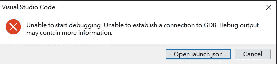

# 解释了 Windows 10 上 OpenCV C++的 VS 代码

> 原文：<https://medium.com/analytics-vidhya/vs-code-with-opencv-c-on-windows-10-explained-256418442c52?source=collection_archive---------0----------------------->

## 消除你噩梦的指南。

照片由[潘卡杰·帕特尔](https://unsplash.com/@pankajpatel?utm_source=medium&utm_medium=referral)在 [Unsplash](https://unsplash.com?utm_source=medium&utm_medium=referral) 拍摄

> 点击[此](/analytics-vidhya/vs-code-with-opencv-c-on-windows-10-explained-256418442c52?source=friends_link&sk=bfbfd296b82ebf4401f7c54ab1225db8)通过付费墙。

# TL；速度三角形定位法(dead reckoning)

你可以从这里得到完整的例子:[https://github.com/Cuda-Chen/opencv-config-with-vscode](https://github.com/Cuda-Chen/opencv-config-with-vscode)

# 介绍

OpenCV 在图像处理领域是一个强大的工具，因为它的速度和直观的 API。然而，配置 OpenCV 是一项艰巨的工作，尤其是在 Windows 上。

最近，我注意到一个关于在 PTT 上用 VS 代码配置 OpenCV C++的请求，这解决了我对在 Windows 上配置有多难的好奇。在尝试配置了一个上午和半个下午后，我终于完成了配置并成功编译。为了便于你在 VS 代码上配置 OpenCV，我决定写这篇文章来教你。

# 配置

本教程假设您使用以下配置:

`\\`分隔符是特意添加的。

# 配置过程

## 0.安装 VS 代码(Visual Studio 代码)(当然！)

## 1.安装 VS 代码 C/C++扩展(ms-vscode.cpptools)

根据 VS 代码文档的建议，您可以通过以下步骤进行安装:

1.  开放 VS 代码。
2.  点击侧边栏上的**扩展**视图图标(或`Ctrl+Shift+X`键盘组合)。
3.  搜索 **C++** 。搜索后，您应该会发现如下所示的扩展名:

此图摘自[1]。

然后点击**安装**进行安装。

## 2.安装 C/C++编译器和调试器

这部分我选择 Mingw-w64。请注意，安装时应选择以下设置:

> *选择这些设置的原因将在下一部分提及。*
> 
> *我假设你在* `*C:\mingw-w64\x86_64-8.1.0-posix-seh-rt_v6-rev0*`安装了所有的编译器

## 3.下载预构建的 OpenCV 包

从 [OpenCV-MinGW-Build](https://github.com/huihut/OpenCV-MinGW-Build) 下载预建的 OpenCV 包。因为我们选择版本 4.1.1，所以这个版本有一些规范:

我们可以看到这个包是用`MinGW-x86_64-8.1.0-posix-seh-rt_v6-rev0`编译的。因此，您应该将 MinGW 的配置设置为与软件包使用的配置相同。

## 4.将编译器路径和预构建的 OpenCV 包添加到`Path`变量中

为了让其他程序不用输入绝对路径就能找到编译器和 OpenCV 包的名字，你可以用编译器和 OpenCV 包的二进制文件来设置你的账户的`Path`变量。

> *要编辑* `*Path*` *变量，可以去* ***控制面板****>****系统**>****高级系统设置*** *。然后切换到系统属性窗口中的“高级”选项卡，并单击“环境变量”按钮。最后，编辑你账号的* `*Path*` *变量(添加编译器和 OpenCV 二进制路径)。***
> 
> *我假设你在* `*C:\opencv\OpenCV-MinGW-Build-OpenCV-4.1.1-x64*`安装了所有 OpenCV 的东西

## 5.配置项目的`.vscode`文件。

首先，创建一个名为`opencvexample`的新项目。然后复制粘贴我从这个[回购](https://github.com/Cuda-Chen/opencv-config-with-vscode)创建的`task.json`、`launch.json`和`c_cpp_properties.json`。

> *注意:目前我不能在 VS 代码中启动调试模式。需要有人帮助我。*
> 
> 五月。17、2020 更新:*感谢*[*Tinashe Tanyaradzwa Mabika*](/@cookyt28/great-article-this-can-be-helpful-solve-your-error-dd77311f1b0b)*指出 launch.json 文件中有错别字，我已经修复了问题！*

我还对每个 json 文件和我应用的一些更改做了一些简单的解释。

## 任务 json

这个文件告诉 VS 代码调用编译器根据源代码创建一个可执行文件。我对`command`和`args`做了一些改动:

*   `command`将调用编译器。在这里，我将路径更改为我需要的 MinGW 编译器。
*   `args`将作为编译器标志传递给编译命令。你可以看到该程序将与 OpenCV 库链接。
*   作为一个经验法则，只包括你将要使用的库，尽管我包括了 OpenCV 的所有库。

## 启动. json

当您开始调试程序时，`launch.json`文件将启动 GDB 调试器，我更改了如下所示的一些行:

*   `program`是这个程序的可执行文件。
*   `miDebuggerPath`找到调试器的可执行文件，我切换到我想使用的 GDB 调试器。

## c_cpp_properties.json

`c_cpp_properties.json`让您对 C/C++扩展有更多的控制:

*   `includePath`搜索包含您想要的库的路径，我添加了 OpenCV 的路径。
*   `compilerPath`找到了编译器的路径，所以我设置了我要使用的编译器。

## 6.创建代码，编译它，并运行它

创建一个名为`main.cpp`的文件，并粘贴以下内容:

然后从[这里](https://github.com/Cuda-Chen/opencv-config-with-vscode)放一个叫`lenna.jpg`的图。

之后，编译项目并运行它，如果没有问题，您应该会得到一个带有 Lenna 图像的窗口。

> *2020.04.06 新增:*
> 构建并运行项目，可以按`Ctrl+Shift+B`构建并键入终端中运行的可执行文件名称。更多信息，可以查看[本官方指南](https://code.visualstudio.com/docs/cpp/config-mingw#_build-helloworldcpp)。

# 结论

在这篇文章中，我将教你如何从头开始用 OpenCV C++包设置 VS 代码。虽然调试部分无法工作，但我成功地编译并运行了用 OpenCV 编译的程序。

# 当前问题

目前，每当我开始运行调试模式，我总是收到这个消息框:

如果有人能留下评论，发邮件给我来解决这个错误，我会很高兴:)

> 五月。2020 年 17 日更新:*感谢*[*Tinashe Tanyaradzwa ma bika*](/@cookyt28/great-article-this-can-be-helpful-solve-your-error-dd77311f1b0b)*指出 launch.json 文件有错别字，我已经修复了问题！*

# 参考

[1][https://code.visualstudio.com/docs/languages/cpp](https://code.visualstudio.com/docs/languages/cpp)

*原载于 2020 年 1 月 21 日*[*https://cuda-Chen . github . io*](https://cuda-chen.github.io/programming/image%20processing/2020/01/21/vscode-with-opencv-cpp-on-windows10-explained.html)*。*

> *如果你有什么想法和问题要分享，请联系我*[***clh 960524【at】Gmail . com***](http://clh960524@gmail.com/)*。还有，其他作品可以查看我的* [*GitHub 库*](https://github.com/Cuda-Chen) *。如果你和我一样热衷于机器学习、图像处理和并行计算，欢迎在 LinkedIn 上* [*加我*](https://www.linkedin.com/in/lu-hsuan-chen-78071b171/) *。*