# 基于机器学习的营养不良脆弱性图谱

> 原文：<https://medium.com/analytics-vidhya/vulnerability-mapping-of-undernutrition-using-machine-learning-aa27907b6f0d?source=collection_archive---------25----------------------->

[来源](https://blog.forumias.com/indias-malnutrition-challenge/)

# **简介**

《2018 年全球营养报告》将营养不良定义为:

*缺乏适当的营养，由没有足够的食物、没有摄入足够的含有生长和健康所必需的物质的食物以及其他直接和间接原因造成。*

在 2019 年全球饥饿指数中，印度在 117 个合格国家中排名第 102 位，令人震惊，其饥饿水平被确定为严重。尽管印度有足够的粮食产量，但由于不能满足其人口的营养需求，印度遭受着“隐性饥饿”。因此，事先确定对营养安全的威胁对于政府制定粮食安全政策是必要的。为了解决这个问题，我们将应用机器学习技术来预测印度各地区新生儿营养不良的脆弱性。在大多数国家，出生体重低于 2.5 公斤通常被认为是“低体重”。低出生体重不仅与儿童死亡风险增加有关，还会影响青春期的生长和发育，并引发冠状动脉疾病和糖尿病等成人疾病。[ 1 ]因此，一个地区低出生体重儿的比例是新生儿营养不良的一个重要指标。

主要目的是通过建立我们自己的集成 ML 分类器，基于社会经济和健康参数将一个地区的低出生体重儿脆弱性分为“低”和“高”级别。因此，通过生成一个州内所有地区的脆弱性级别的可视化热图来可视化结果。

# **方法论**

我们采用了监督学习和非监督学习。聚类技术已被用于找出数据中的最佳聚类，而分类技术最终被用于分类成标签。回归(线性和逻辑)也被用于分类。除此之外，离群点检测算法已经被用于检测和移除离群点。此外，在设计模型之前，还对数据集进行了初步的探索性数据分析(EDA)。

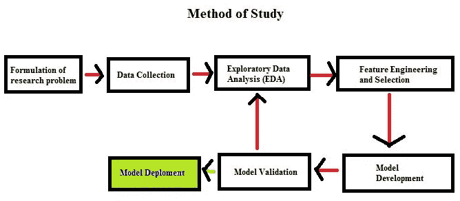

我们使用了 2012 年至 2013 年的**年度印度健康调查(AHS)**数据来训练我们的模型。这项调查是在赋权行动小组(EAG)的北阿坎德邦、拉贾斯坦邦、北方邦、比哈尔邦、恰尔肯德邦、奥里萨邦、恰蒂斯加尔邦&中央邦和阿萨姆邦进行的。鉴于这九个州的生育率和死亡率相对较高，它们是高度关注的州。这是一个约 2100 万人口和 432 万家庭的代表性样本，覆盖了这九个州的农村和城市地区的 2 万多个样本单位。

**变量数量:** 41

**因变量:** *出生体重低于 2.5 公斤的儿童百分比*

**自变量:**

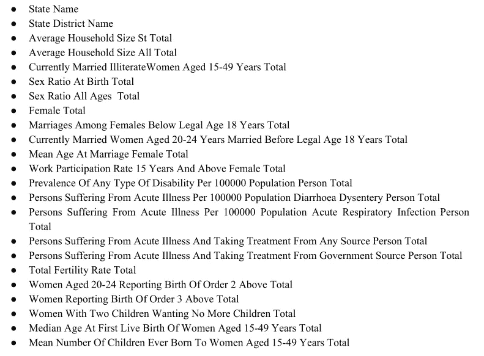

**技巧:**

**局部离群因子:**这是一种基于密度的离群点检测算法。该算法根据与 k 个最近邻点的距离来评估每个数据点的唯一性。该方法基于局部密度，并将数据点的局部密度与最近邻密度进行比较。[ 2 ]如果一个数据点的密度与其相邻数据点相比非常低，则该数据点被视为异常值。数据点 p 的局部异常因子(LOF)由[ 2 ]给出:

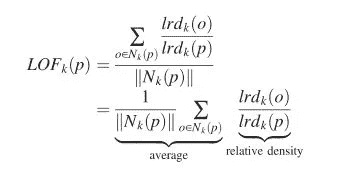

其中对象 p 的局部可达性密度(lrd)由[ 2 ]给出:

**聚类技术:**对无监督的未标记数据进行聚类，以找到在数据中自然形成的最佳聚类。K-Means 和层次聚类就是为此目的而进行的。使用轮廓系数和 J 对 k 图(肘方法)来确定最佳聚类 k。基于聚类的结果，创建两个水平低(小于中值)和高(大于中值)。

**分类算法:**

1.  线性回归
2.  逻辑回归
3.  K-最近邻(KNN)
4.  决策图表
5.  随机森林
6.  自适应增压

**降维技术:**我们还使用了***【LDA】***降维技术进行分类。首先从自变量出发，测试集和训练集以 1:2 的比例分开。然后，基于训练集的统计参数对这些训练集和测试集进行缩放。然后使用 LDA 降低变量的维数，并且选择第一分量 LDA 1 来使用 KNN 和随机森林分类器执行分类。

**集成学习:**
通过评估上面使用的所有分类技术的结果，我们选择了基于度量分数的前三个分类器来设计我们自己的集成技术。集成分类器将来自前三个分类器的预测作为输入，并基于多数投票标准选择最佳预测。它被设计成通过组合所有三个分类器来实现最大的准确性。

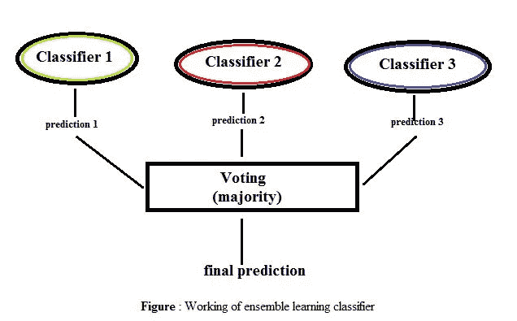

**模型评估:**

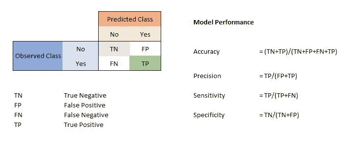

**F1-分数** = (2 *精度*灵敏度)/(精度+灵敏度)

# **结果**

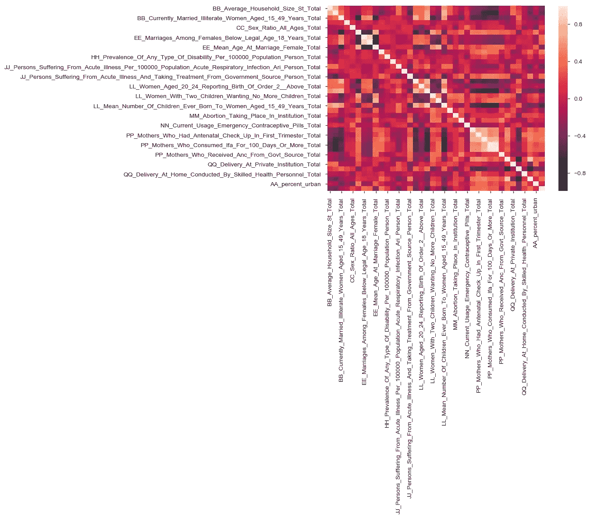

图:独立变量的相关矩阵

图:因变量的箱线图

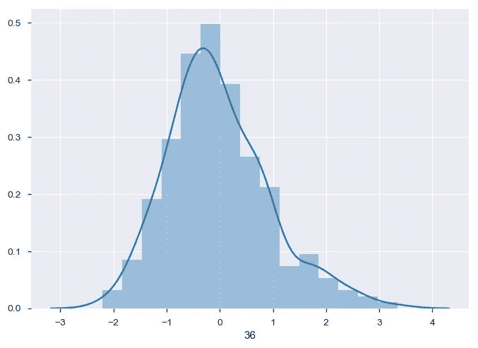

图:因变量直方图

**聚类:**

图:K-Means J vs k 图(肘法)

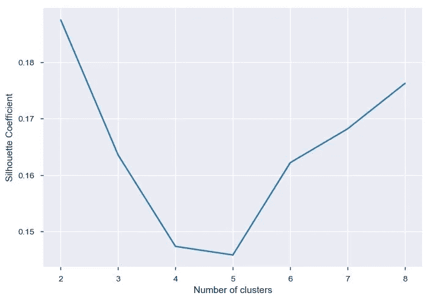

图:剪影系数

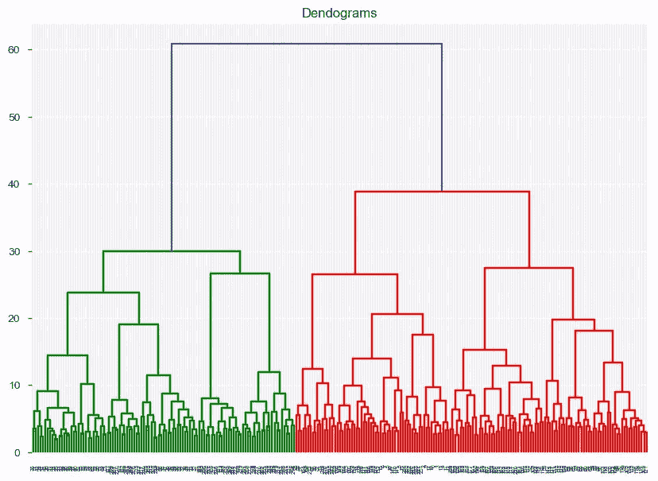

图:使用 ward 链接的层次聚类

因此，给定数据集中的固有聚类数是 2。因此，我们总结形成 2 个级别—低和高来分类我们的数据点；基于因变量的中值，即-0.172165(标准化值)。

基于准确度，性能最好的分类器是线性回归、KNN、随机森林和基于 LDA 的分类。线性回归的准确率为 72.9%，KNN 为 80%，随机森林为 71.7%。然而，一个重要的观察结果是，尽管基于 LDA 的分类给出了良好的准确性，但是 F1 分数非常低。这是因为由于假阳性和假阴性的情况更多而导致的低精度和灵敏度。因此，我们选择前三个分类器线性回归、KNN 和随机森林来构建我们的集成分类器，而丢弃基于 LDA 的分类器。在最终的集成模型中，我们将首先获取这三个分类器的预测，然后基于多数投票分配最终类别。

图:使用集成方法的样本分类

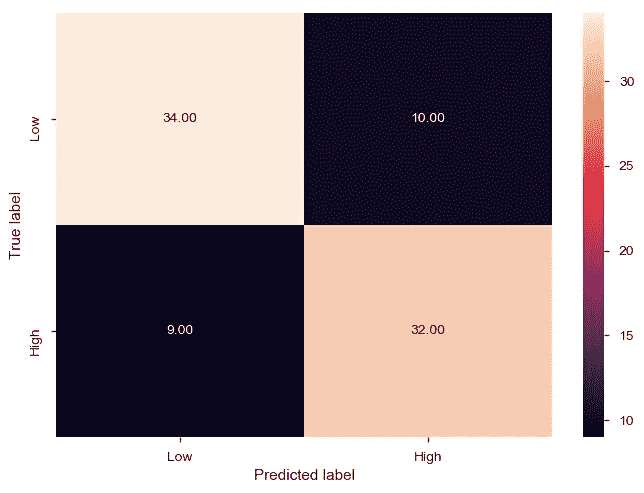

图:集合方法的混淆矩阵

准确度:77.6%
精确度:76.1%
灵敏度:78%
特异性:77.2%
F1 得分:0.771

**结果的总结和可视化:**
用最终集合模型对测试数据做出的预测在下面的地理热图中表示。

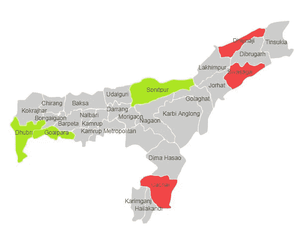

阿萨姆

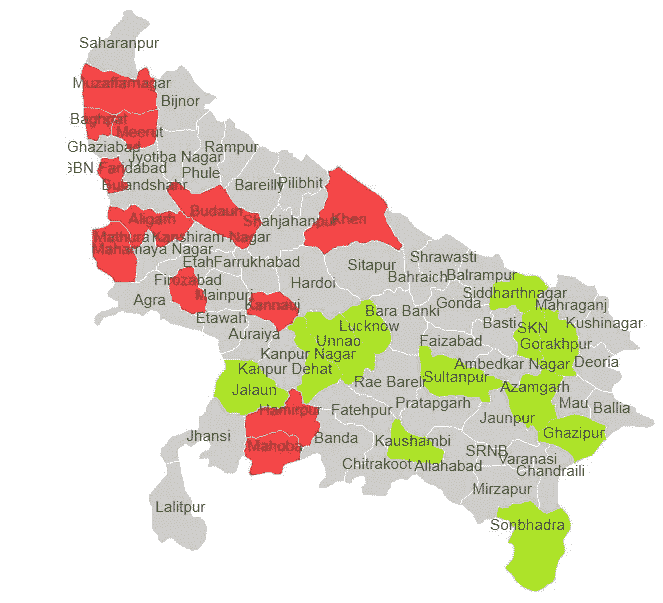

北方邦

比哈尔

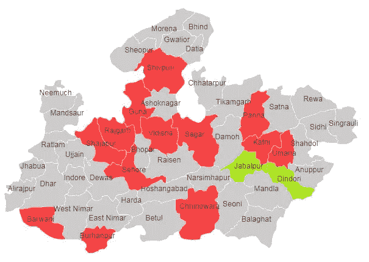

中央邦

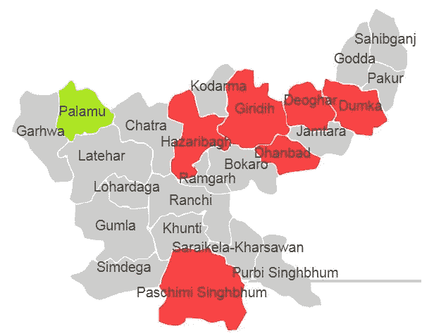

恰尔康得

北安恰尔邦

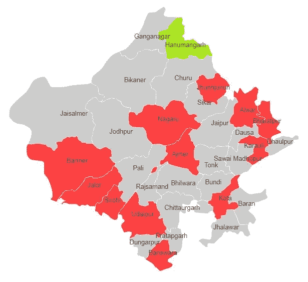

拉贾斯坦邦

切蒂斯格尔

奥里萨邦

我们预测的热图为不同州的新生儿营养不良的脆弱性提供了深刻的可视化。我们可以看到，中央邦、贾坎德邦和拉贾斯坦邦的大部分地区都处于“高”威胁级别。根据我们的预测得出的这一观察结果，与印度政府卫生和家庭福利部公布的 2005-2006 年全国家庭健康调查(NFHS-3)数据的结果相似。第三次 NFHS 营养报告指出，五岁以下体重不足儿童的比例从北方邦的 40%到中央邦的 60%不等。此外，根据第三次 NFHS 调查，贾坎德邦超过一半的儿童体重不足。我们最终模型的预测已经清楚地表明了这些趋势。另一个值得注意的现象是，与东部相比，西部的一些地区更加脆弱。这与东西部人类发展参数不平等的事实相对应。[​4​]

# **结论**

因此，给定任何具有上述选择的社会经济和健康参数的地区，最终模型可以预测其新生儿营养不良的脆弱性(低或高),准确率为 77.6%。从使用地理热图的数据可视化中，我们还能够推断出与通过其他可靠调查收集的观察数据相匹配的实质性见解。因此，我们的最终分类模型不仅在统计上是稳健的，而且在实践中是可部署的，并且在很大程度上能够解释印度所有地区新生儿营养不良的脆弱性趋势。

将一个地区划分为不同的营养不良脆弱程度，将为政府和非政府机构提供减轻出生体重不足婴儿影响的工具。它将使决策者和社会科学家能够仅仅通过观察社会经济和健康数据来确定和预防营养不良。从而提供了一种以技术为主导的方法来确保营养安全。

# **参考文献**

[1] A. Indrayan，“儿童健康的流行病学指标”，*医学生物统计学*，第三版(2012)

[2]内里尤斯·保劳斯卡斯，ąžuolas·福斯塔斯·巴格多纳斯，“用于网络流量异常检测的局部离群因子”，*安全与通信网络*，(2015)

[3]印度政府卫生和家庭福利部，“印度的营养状况”，*全国家庭健康调查(NFHS -3)* 2005 年 6 月

[4] Sumit Chaturvedi，“比较西方 UP 和 Bundelkhand:人类发展、性别和剥夺”，*《经济和政治周刊》(EPW)* ，第 50 卷，2015 年第 20 期