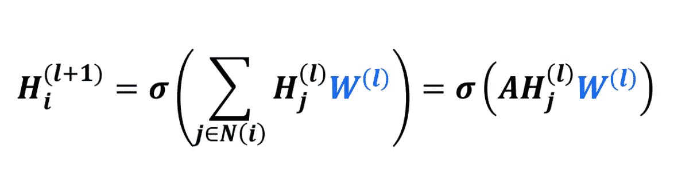

# 涉水通过图形神经网络

> 原文：<https://medium.com/analytics-vidhya/wading-through-graph-neural-networks-968f2ef138af?source=collection_archive---------21----------------------->

在这个博客中，我将讨论图形神经网络及其变体。让我们从什么是图形神经网络以及它可以应用的领域开始。我们继续进行的顺序如下:

# 主题

1.  *图及其动机*
2.  *图形卷积*
3.  *图形注意力网络*
4.  *门控图神经网络*
5.  *图形自动编码器*
6.  *图贤者*
7.  *GCN 背后的历史*

# 图形及其动机

随着深度学习时代的发展，我们有许多针对文本、图像、视频等数据集的先进解决方案。这些算法大多由 MLPs、RNNs、CNN、Transformers 等组成。，它在前面提到的数据集上表现出色。但是，我们也可能会遇到一些非结构化数据集，如下所示:

你所需要的，就是表示这些系统的图，这就是我们将要进一步讨论的。

让我们简单了解一下图表是什么样子的:

图 **G** 由两个关键元素 **{V，E}** 表示，其中 **V** 是节点的集合，而 **E** 是在其节点之间定义的边的集合。图形神经网络具有**节点特征**和**边特征**，其中节点特征表示系统的单个元素的属性，边特征表示系统元素之间的**关系、交互或连接**。

**节点特性:**

**边缘特征:**

图形神经网络不仅可以产生系统元素的特征，还可以了解它们之间的相互作用，从而学习系统中存在的归纳偏差。从系统中学习归纳偏差的能力使其适用于像少点学习、自我监督或零点学习这样的问题。

我们可以使用 GNNs 进行节点预测、链接预测、寻找节点、子图或图形的嵌入等等。现在让我们来谈谈图的卷积。

# 图形卷积网络

所以在一个图问题中，我们得到一个图 **G(V，E)** ，目标是学习节点和边的表示。对于每个顶点 ***i* ，**我们需要有一个特征向量****【vᵢ***并且节点之间的关系可以用一个邻接矩阵 ***A.*** 来表示*

*可以使用简单的神经网络来表示 GCN，其数学表示如下:*

**

*其中***【hᵢˡ】***是***I**lᵗʰ***层中的特征向量，***【wˡ】***是用于*层的权重矩阵， ***N(i)*** 是节点 ***i 的邻域中的节点集合*****

**现在，正如你所看到的，给定层中的所有节点的权重是共享的，类似于传统的卷积滤波器，节点的特征向量是在对其邻居节点(也类似于 CNN)执行一些**数学运算(这里使用边缘参数进行加权求和)后计算的，**我们提出了术语图卷积网络，***【wˡ】***可以被称为层*中的滤波器***

***很明显，我们在这里看到两个问题，第一个是当计算节点的特征向量时，我们不考虑它自己的特征向量，除非存在自循环。其次，这里使用的邻接矩阵不是归一化的，因此它会由于边缘参数的大值而导致缩放问题或梯度爆炸。***

***为了解决第一个问题，实施自循环，为了解决第二个问题，使用邻接矩阵的规范化形式，如下所示:***

1.  ***自循环: **Â =A+I*****
2.  ***正常化:**â=(d^(-1/2))â(d^(-1/2))*****

***其中 **I** 是形状为 **A** 的单位矩阵，而 **D** 是对角矩阵，其每个对角值对应于矩阵 **Â.中相应节点的度数**在每一层中，信息从它的邻居传递到一个节点，因此这个过程被称为**消息传递。*****

***现在让我们来讨论一下我们讨论过的简单图形卷积的一些变体。***

# ***图形注意网络***

***在科技界，关注并不是什么新鲜事。它已经广泛应用于 LSTMs、GRUs、CNN 等架构。现在，它甚至能够成为像伯特和 GPT 那样的基于变形金刚的模型的唯一和最重要的组成部分。因此，注意机制的主要目的是通过以概率的形式学习输入的权重来关注输入的一些关键区域。让我们简单地看看它在图形神经网络中是如何工作的。***

******

***左边给出的是一个图形卷积的修正方程。区别在于术语:***

******

***这些不过是注意力的砝码。对于*层中节点**I**的每个邻居节点 ***j*** ，在更新节点 ***i.*** 的特征向量时，学习表示其重要性的权重，因此，我们从关注权重越大的节点获取越多的信息，而从权重越小的节点获取越少的信息，而不是找到邻居的简单加权和。****

**现在，这些重量可以通过多种方式学习，如 softmax 或一些挤压功能，如下所示:**

****

**为了让事情变得更有趣，我们还可以使用多头注意力方法，该方法将使用 **K 个**头而不是一个头，最后取从 **K 个**头学习到的所有特征向量的平均值( ***或连接*** )。下图对此进行了说明:**

****

# ****门控图神经网络****

**现在，假设我们想要为一个像文本这样的序列数据集建立一个模型，但是序列中的每个元素不能仅仅通过像手套一样的嵌入来表示，而是采取一种类似图形的结构的形式。朋友们，现在我们需要讨论门控图神经网络。这些网络可用于处理序列图。所以，基本上每个节点都使用以前的节点状态和当前的消息状态来更新，就像 GRU 一样。**

**节点状态和消息状态类似于 RNN 单元中的隐藏状态和单元状态。下面的公式清楚地解释了这个理论:**

********

**在给出的方程式中，*是节点 ***i i*** n 层 ***l*** 和 ***mˡᵢ*** 是层节点***I***的消息状态 ***l. U******

# **图形自动编码器**

**类似于其他自动编码器，我们也可以有一个图形自动编码器。图形自动编码器可用于节点压缩或图形数据结构的自我监督训练。在这种情况下，我们首先为图中的节点找到一个潜在的特征向量表示，然后学习从潜在的表示中重建原始的邻接矩阵。同样，为了使事情复杂化，我们可以使用变分图自动编码器。图形自动编码器如下图所示:**

****

**给定一个图 ***G(X，A)*** ，我们通过学习分布 ***q(z|X，A)*** 来学习节点的潜在表示。然后我们通过学习分布***【p(a | z)】*来尝试重构邻接矩阵*。*****

# ***图表圣人***

***有没有想过这样一个事实:在一个典型的 GCN 中，我们通过对一个节点的邻居节点的特征进行加权平均来聚集该节点的邻居信息。问题是我们能不能尝试更多或更好的东西。这就是我们讨论图形 SAGE 的地方。在这种情况下，当节点的特征向量被更新时，我们尝试学习聚集节点的邻域信息的函数近似器，而不是取相邻节点的加权平均值。下图会让它明白得很清楚:***

******

***上图中的黑盒是一个可微分函数，它将一些向量作为输入，将它们的信息聚合成一个单一的特征向量。相同的等式如下:***

******

***其中*是 ***k 层中节点 ***v*** 的特征向量，A*** 和 ***B*** 是可训练的权重。通过执行一些加权来连接聚集的邻域信息和节点特征向量本身，然后通过非线性函数σ来馈送，以获得下一层的节点特征向量。 **AGG** 是聚合器函数，可以有多种形式，如均值、池或 LSTM 聚合器，如下所示:****

**

# *GCNs 背后的一些历史*

*我们上面讨论的方法都使用空间滤波器，但是我们在图形神经网络中也有另一种类型的滤波器，**光谱滤波器**。*

*使用频谱滤波器要求我们进入频谱域(傅立叶域)，这进一步要求我们计算拉普拉斯 L 图的特征向量分解，拉普拉斯 L 图是图 G 的邻接矩阵的特殊归一化形式**。***

# *L = I — **Â***

*其中 **Â** 是博客开始时讨论的归一化邻接矩阵，而 **I** 是单位矩阵**。***

***L** 分解为形式，**l=*vλvᵀ****其中* ***V*** *为* ***L*** *的特征向量的矩阵，λ为对角矩阵，其对角值对应于* ***L*** *的特征值。**

*正向传递的公式如下所示:*

**

*其中 W 是权重矩阵，点是逐元素乘法。对于大的邻接矩阵，计算分解变得不可行，从而使得该过程在计算上非常昂贵。*

*[Defferrard 等人，NeurIPS，2016](https://arxiv.org/abs/1606.09375) 引入的切比雪夫图卷积逼近，通过使用切比雪夫逼近并引入一个参数 **K.** 对于 **K=1，**我们通过节点特征 *X⁽ˡ⁾* 在我们的 GNN 模型中；对于 *K=2，*我们经过 *X⁽ˡ⁾，ax⁽ˡ⁾；对于 K=3，*我们通过 *X⁽ˡ⁾，AX⁽ˡ⁾，a*t44】x⁽ˡ⁾同样对于 **K=n** ，我们通过 *X⁽ˡ⁾，AX⁽ˡ⁾，a*x⁽ˡ⁾……..GNN 模型中的一个 ⁿ *X⁽ˡ⁾* 。一旦来自第 **n** 跳的所有特征被创建，我们连接所有的特征向量，然后再次应用 GNN 来获得节点的最终特征向量。从下面给出的图像中可以清楚地看到这一过程:*

**

*切比雪夫近似确实消除了频谱域，但是由于在单个层中的迭代 **n(由我们决定)**跳，其计算量仍然很大。*

## *进一步近似和重正化技巧*

*由于增加 **K** 的值会导致模型参数数量的增加，我们可以将该值限制为 K=2。*

**

*上图中使用的 A 是没有自循环实施的原始邻接矩阵。通过对θ₀*和θ₁*使用赋予相同 **θ的技巧或近似，我们得到了在 GCN 部分已经讨论过的重正化技巧(增加自循环)。因此，这种近似给出了适用于 1 跳和 2 跳的 GCN 层，如果我们想要 2 跳以上，我们可以继续添加这样的 GCN 层。*****

# ***结论***

***到目前为止，我们讨论了使用图形神经网络背后的动机。在下一篇博客中，我打算讨论 GCNs 的一些很酷的应用，比如文本分类、链接预测、基于零镜头草图的图像检索等等。***

# ***参考***

1.  ***[https://arxiv.org/abs/1606.09375](https://arxiv.org/abs/1606.09375)***
2.  ***https://arxiv.org/abs/1609.02907***
3.  ***[https://towards data science . com/tutorial-on-graph-neural-networks-for-computer-vision-and-beyond-part-2-be 6d 71d 70 f 49](https://towardsdatascience.com/tutorial-on-graph-neural-networks-for-computer-vision-and-beyond-part-2-be6d71d70f49)***
4.  ***[https://medium . com/blogging-guide/medium-subscript-text-and-medium-superscript-format-c169a 8717 ECF](/blogging-guide/medium-subscript-text-and-medium-superscript-format-c169a8717ecf)***
5.  ***[https://tkipf.github.io/graph-convolutional-networks/](https://tkipf.github.io/graph-convolutional-networks/)***