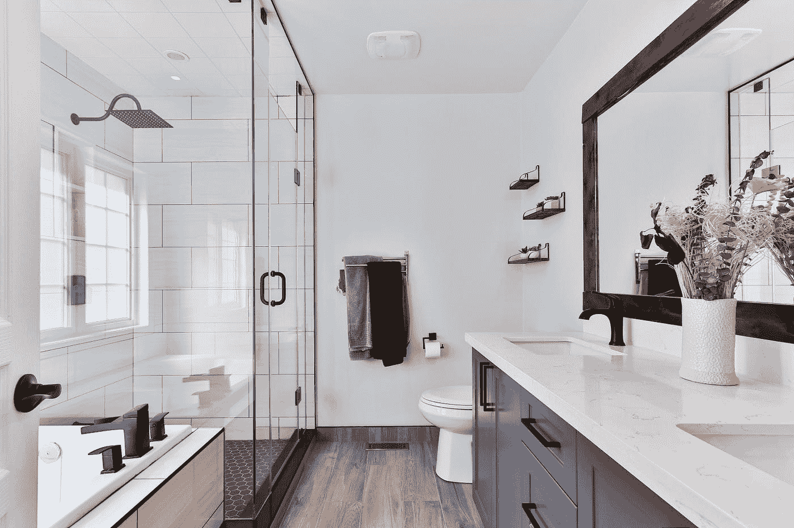
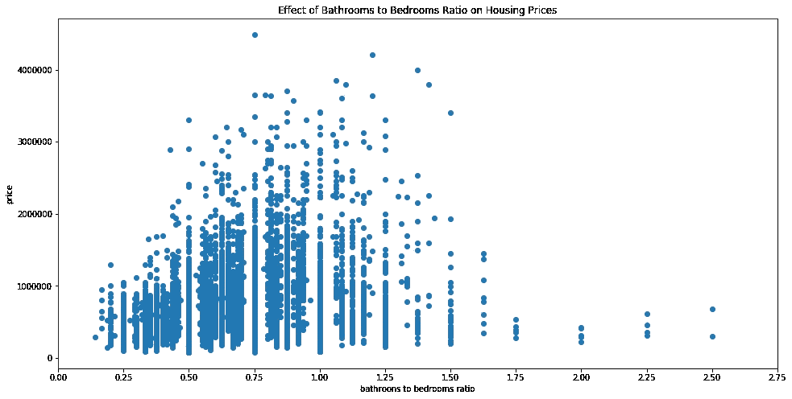

# 等待浴室——一个线性回归的故事

> 原文：<https://medium.com/analytics-vidhya/waiting-for-the-bathroom-a-linear-regression-story-8b2b7c48bcc7?source=collection_archive---------23----------------------->



由 [Unsplash](https://unsplash.com?utm_source=medium&utm_medium=referral) 上的 [Sidekix 媒体](https://unsplash.com/@sidekix?utm_source=medium&utm_medium=referral)拍摄的照片

我最近完成了一个涉及多元线性回归预测房价的项目，你猜怎么着……人们真的不喜欢等厕所。

这似乎很明显，但是他们有多不喜欢等待呢？事实证明，他们可能愿意支付数万美元，以避免在接下来的 13 年里每天等待上厕所。

我将讲述一下我是如何得出上述结论的，即美国人在上厕所时是多么有耐心。

# 开始线性回归

我使用 Jupyter 笔记本用 Python 编写了我的项目，并将我的数据存储在 Pandas dataframe 对象中。在清理我的数据并将其分成训练集和测试集之后，我开始制作一个线性回归模型。我选择使用 [Statsmodels](https://www.statsmodels.org/stable/index.html) ，因为我喜欢它生成的汇总报告。

```
# create a linear regression model for the training set
# statsmodels' function to create a linear regression model doesn't
# add a constant(y-intercept) by default so you will need to call
# sm.add_constant to add oneimport statsmodels.api as smX_train_int = sm.add_constant(X_train)
model = sm.OLS(y_train, X_train_int).fit()
display(model.summary())
```

# 处理多重共线性

我最终制作了几个模型，反复改进它们。在这个过程中，我发现我的数据集中有很多数据存在多重共线性问题。我通过给熊猫打电话发现了这个问题。DataFrame.corr()，它返回一个矩阵，显示所有特征之间的相关性，以及当我的一些与目标正相关的特征在线性回归模型中具有负系数时。

```
# get a correlation matrix for my training setX_train.corr()
```

# 为什么多重共线性不好？

当您的数据具有大量多重共线性时，您不能信任该模型。你甚至可以得到更好的 R 值或其他精确度，但是你不能相信自变量的系数或它们的 p 值。独立变量的微小变化可能会导致独立变量系数的巨大变化(在这种情况下，独立变量不是非常独立)，并且模型将无法对这些系数的 p 值进行可信的计算。

# 平均居中

我不想只删除具有高度多重共线性的特征，它们告诉我关于房子的特征:浴室、卧室、平方英尺、地板和建筑等级，我想尽可能多地保留它们。

要素的平均中心化或标准化是减少多重共线性的简单方法。我的意思是使用来自 [sklearn.preprocessing](https://scikit-learn.org/stable/modules/generated/sklearn.preprocessing.scale.html) 的 scale 函数将所有受影响的特征居中。为了便于解释我的模型，我不想将数据换算成单位标准偏差，这是默认设置，所以我必须将 with_std 参数设置为 False。通过只减去数据的平均值(平均值居中),我仍然能够解释这些特征，就好像我没有进行转换一样；通过将独立特征 *a* 增加 1 个单位，目标的平均变化将是特征*a*的系数

```
from sklearn.preprocessing import scale# standardize the specified columns in the dataframe and give
# them updated column namesfor col in cols_with_multicollinearity:
    scaled_col_name = col + '_scaled'
    X_train[scaled_col_name] = scale(X_train[col], with_std=False)
```

我很幸运，我的意思是居中消除了大多数多重共线性问题，但我仍然很难在我的模型中以直观的方式保留卧室数量和浴室数量的特征，浴室具有正系数，卧室具有负系数。多加一间卧室总不能把房子的价格降下来，所以一定是有别的原因。

# 添加交互式功能

浴室和卧室功能的系数的混乱行为导致我尝试为浴室和卧室添加一个交互功能，瞧，我的模型变得更有意义了。

```
# add a column to the dataframe for the interacting featureX_train['bathrooms_scaled*bedrooms_scaled'] = X_train.bathrooms_scaled * X_train.bedrooms_scaled
```

# 解释系数

当我完成建模过程时，我得到了以下系数，所有系数的 P 值都足够低，足以使它们具有显著性:

```
bathrooms_scaled 36,470
bedrooms_scaled -4,839
bathrooms_scaled*bedrooms_scaled 11,030
```

现在我有了系数，它们是如何解释的呢？我有相互作用的项，这些项是以平均值为中心的。对于包含两个术语的交互功能，有两种情况需要解释，但我将重点关注添加浴室的情况。这可能意味着在现有的房子上增加一个浴室，或者你可以把它想象成两个几乎相同的房子，但其中一个有一个额外的卧室。

首先，我将分配系数，以便更容易地呈现公式。

```
a = 36,470 # the coefficient of bathrooms_scaled
b = -4,839 # the coefficient of bedrooms_scaled
c = 11,030 # the coefficient of bathrooms_scaled*bedrooms_scaled
d = number of bedrooms
e = mean number of bedrooms in the dataset
```

增加一个卧室会增加房子的平均价格，结果如下。

```
a + c * (d - e)
```

因为这些特征是相互作用的，所以增加一间浴室的房子的平均价格的增加量将取决于房子有多少间卧室。例如:

```
d = 3 # number of bedrooms
e = 3.373 # mean number of bedrooms36,470 + 11,030 * (3 - 3.373) = $32,355.81
```

因此，对于一个三卧室的房子，模型预测人们将支付超过 32，000 美元来拥有同样的房子，但有一个额外的浴室。

# 他们的时间值多少钱？

以 13 年的房屋使用权中位数为例，购房者愿意每天支付约 6.80 美元，以避免等待上厕所。如果一天平均有 20 分钟等待上厕所，总计 94，900 分钟，购房者估计他们的厕所等待时间为每分钟 0.34 美元。

# 我应该只加浴室吗？

回归到增加卫生间对房子的预测附加价值，能不能就这么增加一堆卫生间，让我的房子更值钱？不。线性回归模型是基于真实的房子，预测会打破你房子的陌生人。看看真实的房屋数据，一旦你的房子浴室和卧室的比例超过 1:1，价格就会开始下降。如果你的每个卧室都有一个以上的浴室，这些浴室可能会被视为浪费空间和额外的维护成本。



# 我的项目

感谢阅读这篇文章，你可以在 github [这里](https://github.com/merb92/multivariate-linear-regression----housing-prices)查看我的整个项目和它的发现。

根据[全国房地产经纪人协会](https://www.nar.realtor/blogs/economists-outlook/how-long-do-homeowners-stay-in-their-homes)的数据，截至 2018 年，美国房屋所有权的中值期限