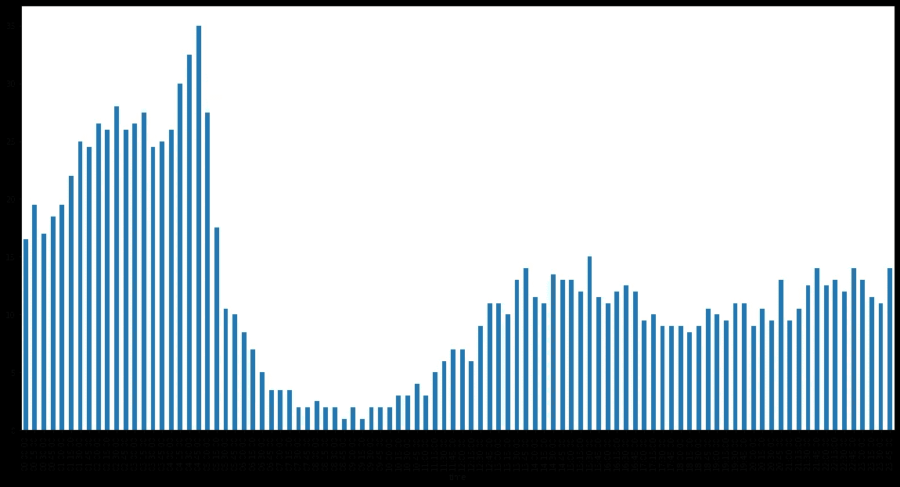
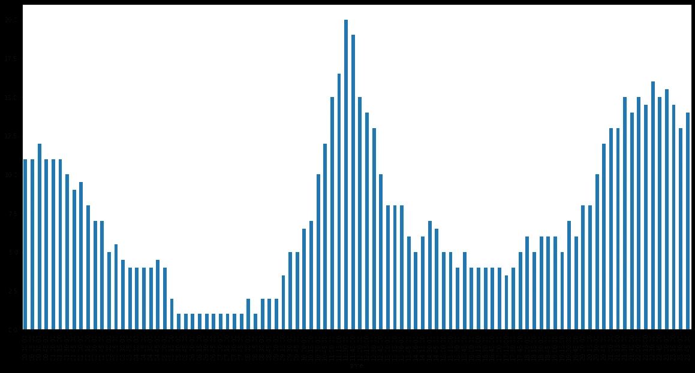
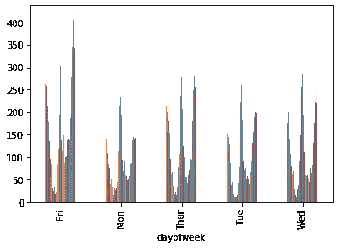
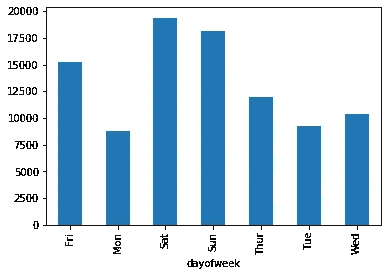
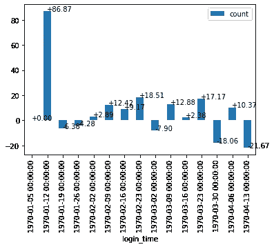
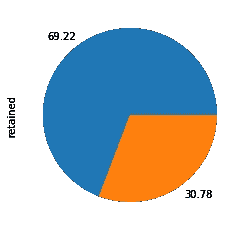
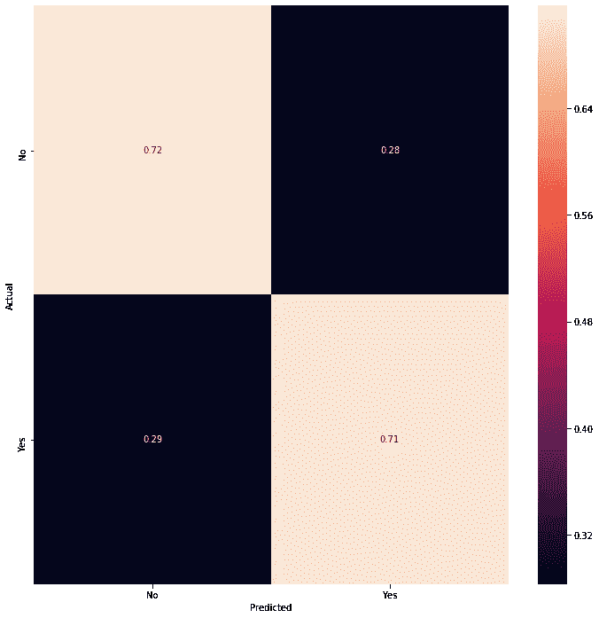
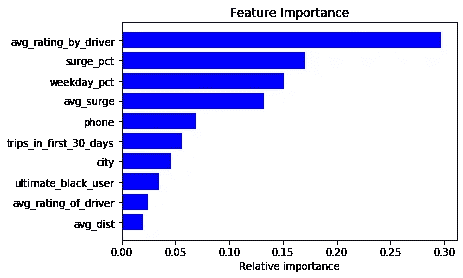

# 浏览我对数据分析/数据科学案例研究进行的分析

> 原文：<https://medium.com/analytics-vidhya/walking-through-an-analysis-i-carried-out-on-a-data-analysis-data-science-case-study-bbcd6491d642?source=collection_archive---------12----------------------->


在过去的几周里，我一直在用跳板完成我的数据科学职业跟踪训练营。作为最后几个迷你项目的一部分，我们收到了一个带回家的挑战，模拟数据分析/科学面试挑战，以评估您的技术技能和解决业务问题的能力。这项挑战分为三个部分:探索性数据分析、实验和度量、设计和预测建模。挑战是基于一个类似优步的假想公司。我决定写下我的解决方案和每个答案背后的理由。

**问题 1**

第一个问题需要创建可视化，以说明一个假设的城市对电子打车平台的需求，并尝试理解日常周期和有趣的模式，从而为我们提供更多关于需求的见解，在这种情况下，需求是通过用户登录来衡量的-大概是因为如果用户登录电子打车平台，可以合理地假设用户登录是为了订购顺风车。数据显示在包含用户登录时间戳的 JSON 中。该问题要求根据 15 分钟的时间间隔汇总这些登录计数。

我采取的第一步是以 15 分钟的时间间隔对数据集进行重采样，返回每个时间间隔内的登录次数

```
json.resample(rule ='15min',on='login_time').count()
```

下一步，我从每个时间戳中获取工作日，目的是了解需求是否/如何受到该天的影响，以及需求是在工作日还是周末。我继续按照登录是发生在周末还是工作日对所有登录进行分组

```
*#weekend data*
weekends = json_resampled[json_resampled['dayofweek'].isin(['Sat','Sun'])]
weekdays = json_resampled[~json_resampled['dayofweek'].isin(['Sat','Sun'])]
```

并且继续创建柱状图可视化来描绘需求如何在整个周末以每 15 分钟的间隔起伏——假设用户行为在周六和周日有些相似，因为这两天人们很可能参与娱乐性的周末活动。



周末趋势

由于数据与从 1 月到 4 月的用户登录相关，我还想了解在这段时间内需求是否在增长。由于给出的信息有限，不断增长的需求可能表明用户群或参与度不断增长的平台，也可能表明需求在特定时间段增长的月度周期，例如，在与多名电子打车司机交谈后，我了解到某些地区的需求通常在夏季周末增加，因为与冬季相比，当天气温暖时，人们似乎更有可能“外出走动”。然而，由于没有提供进一步的信息，这些纯属猜测。

**分析-周末数据**

在分析这些图表时，我注意到登录在周末的凌晨达到峰值，绝对峰值在凌晨 4 点左右，此后登录减少，最低点在上午 8 点左右。

在解释这种模式时，我的一个假设是，人们更有可能在周末的清晨预订顺风车，因为在周五或周六晚上外出后，人们可能会有更高的需求。这是假设人们倾向于在周末晚上外出时使用电子呼叫服务。

**工作日数据**

当观察工作日时，我们看到一个不同的趋势。



工作日趋势



每天的工作日趋势

在工作日图表中，我们首先观察到需求在一周中遵循类似的周期，需求在早上达到峰值，这时人们可能希望通勤上班，需求在一天中下降，并在 6 点后缓慢增加。使用电子打车应用程序上班的人可能会使用相同的交通方式回家，但是他们不会在同一时间去，这可能解释了为什么需求似乎从晚上 6 点增加到 11 点。



按日需求

查看 4 个月期间每天的总需求可以确认，大量登录发生在周末和周五，其中周一的登录次数最少。尝试了解并找出人们在工作日的周末倾向于叫车的原因、每天的平均乘车时间以及在给定的一天更可能叫车的用户类型将是有趣的。例如，主要使用该服务去上班的乘客通常在工作日更活跃，可能对价格不太敏感——只要成本和收益超过自己开车去上班的成本和收益。假设这些类型的用户占工作日需求的大部分，这家公司可能会受益于将其营销工作转向提高对使用打车应用上下班的成本和更重要的便利性的认识。由于这些用户可能是更长期的，所以可以假设他们具有更高的生命时间价值，并且企业能够负担得起花费更多的钱来提高对这些用户的认识并获得这些用户。与优步非常相似，该平台可能会受益于引入一个选项，允许人们分摊账单，让在同一地区工作的人更容易一起通勤，或者为那些显示出主要利用该应用上下班的用户提供每月套餐。这可能会增加需求，因为人们可以更好地预测某个月在电子商务上的预期支出，从而更容易理解开车上班的实际成本效益。

另一方面，对于周末骑手，人们可以假设需求来自不同类型的客户，从游客到休闲骑手和专业人士。由于夜间和凌晨的需求较高，增加周末需求可能包括与酒吧/夜总会合作，可能向选择搭车而不是从合作酒吧/夜总会开车回家的用户提供折扣。该平台还可以在周末举办活动时与活动组织者合作，设立专门的接送区。

很像在确定需求如何增长时，我创建了一个柱状图，显示与前一周相比，给定一周内登录的百分比变化

```
*#week on week growth*
newbar = pd.DataFrame(json_resampled.groupby(json_resampled['login_time'].dt.date)['count'].sum())
ax = (json_resampled.resample('W-Mon',on='login_time').sum().pct_change()*100).plot(kind='bar')
x_offset = -0.03
y_offset = 0.02
**for** p **in** ax.patches:
    b = p.get_bbox()
    val = "**{:+.2f}**".format(b.y1 + b.y0)        
    ax.annotate(val, ((b.x0 + b.x1)/2 + x_offset, b.y1 + y_offset))
    ax.set_rotation
```



周环比增长

由此我们观察到每周都有规律的增长，除了个别几周的例外，平均每周增长 8%左右。随着更多的观察，我们可以开始根据以前的趋势，了解某个月的预期增长水平。

**问题 2-实验和指标设计**

挑战中的第二个问题为数据添加了更多的上下文。根据这个问题，高谭市和大都会在工作日有互补的昼夜节律，高谭市在晚上更活跃，而大都会在白天更活跃。作为一个华盛顿特区的粉丝，我不完全理解为什么有人愿意住在经常被超级恶棍蹂躏的城市，我想保险费率一定非常高，但我跑题了。

这两个城市之间存在一座收费桥梁，这使得司机倾向于只去一个城市。然后，该问题询问了通过报销所有过路费来鼓励司机伙伴在两个城市都可用的试验的成功的关键衡量标准，以及测量所述试验的有效性的实际测试。

因为我们知道这两个城市在工作日有免费的循环，我的回答建议在实验实施期间和之后，观察高谭市和大都市的人们在高峰时间等待司机的时间，并比较实验实施之前的平均等待时间。我希望一个成功的实验能减少两个城市高峰时间的平均等待时间。我特别关注高峰时段，因为司机更有可能在高峰时段转移到另一个城市，以实现利润最大化(并从高峰定价中受益)。为了评估实验的成功，我将进行 A/B 测试，并进行 t 测试，以寻找统计上和实践上的显著变化，从而保证实施可能会增加该企业运营成本的变化。

**问题 3——预测建模**

挑战的最后一个问题与预测骑手保留率有关。最终目标是建立一个预测模型，帮助企业预测用户在使用系统的第 6 个月是否活跃。

对于这部分挑战，我首先清理数据。这个过程包括查找具有 NaN 值的列，用 0 或字符串“unknown”替换它们，并将时间戳转换为日期时间。

```
*#find columns with null values* 
filedf.isnull().any()[**lambda** x: x]
*#fill na values*
filedf.avg_rating_of_driver.fillna(0,inplace=**True**)
filedf.phone.fillna('unknown',inplace=**True**)
filedf.avg_rating_by_driver.fillna(0,inplace=**True**)
*#converting all date time columns to datetime format*
filedf['signup_date'] = pd.to_datetime(filedf.signup_date)
filedf['last_trip_date'] = pd.to_datetime(filedf.last_trip_date)
```

然后，我制作了一个饼图，以便更好地了解根据给出的定义，在头 30 天内获得乘车服务的用户的百分比。

```
*#how many users are active after 6 months*
filedf.loc[(filedf['trips_in_first_30_days'] > 0),'retained'] = 'Yes'
filedf.loc[(filedf['trips_in_first_30_days'] == 0),'retained'] = 'No'
yes = (len(filedf[filedf['retained']=='Yes'])/len(filedf))*100
no = (len(filedf[filedf['retained']=='No'])/len(filedf))*100
sums = [yes,no]
filedf.retained.value_counts().plot(kind='pie',labels=sums)
```



保留 v 未保留

根据饼状图，69.22%的用户被保留。形象化这个饼图帮助我更好地理解了这个保留问题的严重性。根据这张图表，该平台未能留住 30%多一点的用户。从这张图表中，我很好奇被保留的用户和没有被保留的用户之间是否有明显的行为差异。例如，我们可以发现，未被保留的用户给司机的平均评分较低，这可能表明保留率与平台上司机的感知质量有关。

```
#RETAINED USERS
active = filedf[filedf['6month_retained'] == 'Yes']
active.mean()###OUTPUT###
trips_in_first_30_days     3.950205
avg_rating_of_driver       4.308472
avg_surge                  1.078053
surge_pct                  9.589459
ultimate_black_user        0.525760
weekday_pct               61.515736
avg_dist                   4.700034
avg_rating_by_driver       4.747338
months_active              6.000000
dtype: float64#USERS NOT RETAINED
inactive = filedf[filedf['6month_retained'] == 'No']
inactive.mean()###OUTPUT### 
trips_in_first_30_days     2.107207 
avg_rating_of_driver       3.807612 
avg_surge                  1.074427 
surge_pct                  8.773865 
ultimate_black_user        0.361875 
weekday_pct               60.865781 
avg_dist                   5.908994 
avg_rating_by_driver       4.760138 
months_active              2.783140 
dtype: float64
```

从这个比较中，一些事情开始变得明显，更有可能被留住的用户在注册的前 30 天更多地使用这个平台。为了增加最初的兴趣，合资企业可以在签约时提供更多折扣，以鼓励更多的早期乘坐。同样值得注意的是，被保留的用户倾向于给司机更高的平均评级。

**模型建立**

重申我的导师和另一位导师在我通过 Springboard 进行的数据科学模拟技术面试中提到的内容，模型构建是一个迭代过程，在增加更多复杂性之前，从最简单的模型开始总是好的。有时简单的模型给出最好的结果，更容易解释，运行时间更短。根据这一点，我开始建立一个逻辑回归模型。

```
y = filedf['6month_retained']
X = filedf.drop(['6month_retained','months_active','retained','signup_date','last_trip_date'],axis=1)
X_train,X_test,y_train,y_test = train_test_split(X,y, test_size=0.3,random_state=100)
le = preprocessing.LabelEncoder()
filedf['phone'] = le.fit_transform(filedf['phone'])
filedf['city'] = le.fit_transform(filedf['city'])
filedf['ultimate_black_user'] = le.fit_transform(filedf['ultimate_black_user'])
log_reg.fit(X_train,y_train)
predicts = log_reg.predict(X_test)
print(classification_report(y_test,predicts))###OUTPUT###
       precision    recall  f1-score   support

No        0.91      1.00      0.95     13621
Yes       0.29      0.00      0.01      1379
```

由此很明显，我正在处理一个不平衡的数据集，在尝试将 class_weights 设置为平衡后，我最终选择尝试一个分层的随机森林分类器，以在我的测试和训练数据分割中平等地表示保留和非保留用户

```
strat = filedf['6month_retained']
X_train, X_test, y_train, y_test = train_test_split(X, y, test_size=0.3, random_state=0, stratify=strat)
*#looking for the best parameters*
params = {
    'n_estimators':[i **for** i **in** range(1,201,10)],
    'max_depth':[i **for** i **in** range(1,10,1)],
    'max_features':[i **for** i **in** range(1,10,1)],
    'bootstrap': [**True**, **False**]
}
rf = RandomForestClassifier()
randomsearch = RandomizedSearchCV(rf,param_distributions=params,random_state=2)
bestparams = randomsearch.best_params_
class_weight = dict({'No':1, 'Yes':10})
rc = RandomForestClassifier(**bestparams,random_state=10,class_weight=class_weight)
rc.fit(X_train,y_train)
preds = rc.predict(X_test)
**from** **sklearn.metrics** **import** f1_score
score = f1_score(y_test,preds,average='macro')
score###OUTPUT###
0.5690044413066144
```

然后，我选择创建一个混淆矩阵来可视化模型的性能，通过预测“是”或“否”结果的准确性来衡量,“是”代表保留的用户，而“否”代表没有保留的用户

```
labels = ['No','Yes']
conf = confusion_matrix(y_test,preds)
*#normalize data*
cm = conf.astype('float')/conf.sum(axis=1)[:, np.newaxis]
fig,ax = plt.subplots(figsize=(12,12))
ax = sns.heatmap(cm,annot=**True**, fmt= '.2f',xticklabels=labels,yticklabels=labels)
*#new matplotlib version cuts off part of first and last row, fixing this*
bottom, top = ax.get_ylim()
ax.set_ylim(bottom + 0.5, top - 0.5)
plt.ylabel('Actual')
plt.xlabel('Predicted')
```



混淆矩阵可视化模型精度

为了了解哪些特性在预测用户是否会被保留方面具有更大的权重，我从这个模型中绘制了特性的重要性

```
*#feature importance*
features = X.columns
importances = rc.feature_importances_
indices = np.argsort(importances)
plt.title('Feature Importance')
plt.barh(range(len(indices)), importances[indices],color='b',align='center')
plt.yticks(range(len(indices)), [features[i] **for** i **in** indices])
plt.xlabel('Relative importance')
plt.show()
```



相对特征重要性

**分析**

该模型可以分别以大约 71%和 72%的准确度预测一个人是否可能在 6 个月时被保留。从特征重要性柱状图来看，似乎司机如何评价他们的乘客对乘客在 6 个月后是否活跃有最大的影响。理解为什么司机给某些乘客较低的评级并使用该信息来指导乘客如何给他们的司机留下愉快的印象可能是值得的。

实际上，可以要求司机每次给出低评级时都给出一个原因，然后当有问题的乘客订购下一次乘坐时，他们可以收到个性化的通知，给他们如何留下积极印象的提示和指示。激励因素可能是司机更有可能接受评级较高的顾客的搭车。虽然这可能不是一个足够大的激励，但这些变化可能相对容易实施，好处是保留率和客户生命周期价值的增加。