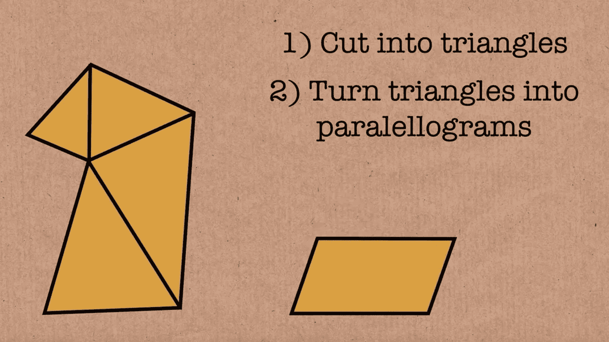

# 切割任意多边形以形成另一个多边形

> 原文：<https://medium.com/analytics-vidhya/wallace-bolyai-gerwien-theorem-2ba0dff6b94a?source=collection_archive---------10----------------------->


## 华莱士-波尔约-格文定理

如果你有两个多边形 P1 和 P2，并且它们有相同的面积，你能用有限多条直线切断 P1，然后重新组合得到 P2 吗？


答案是肯定的，YouTube 视频[Dehn 不变量——Numberphile](https://youtu.be/eYfpSAxGakI?t=188)详细解释了整个算法。以下是丹尼尔·利特在视频中所说和演示的内容。

核心思想是任何多边形都可以被切割并形成一个 1 ⨉的矩形。这是为什么呢？这是因为切割和重新排列是一个可逆的操作。所以如果你有一个面积为 A 的多边形，你可以用一个矩形把它变成 1。而另一个面积为 A 的多边形，你可以通过一个矩形把它做成同样的 1。


那么，你如何从第一个多边形到第二个多边形呢？你只需要通过一个矩形来传递 1，你可以把它们都变成矩形。所以这样做就够了。


所以我们可以假设 P1 和 P2 中的一个只是长方形。以下是显示其工作原理的图表。

第一步是什么？很简单。你只要把它切成三角形。


第二步有点棘手。我们要把三角形变成平行四边形。我们该怎么办？我们取这两边的中点。我们画一条穿过它们的线，这样这条线的长度是红色部分的两倍。


现在你可以把它切开，变成平行四边形。



好了，现在我们要把平行四边形变成矩形。


你只要放下一条垂线，移动三角形。


好了，现在我们有了一个矩形，它和原来的多边形有相同的面积。我们对每个三角形都这样做。我们得到一堆矩形。


现在我们要把它做成 1 乘 1 的矩形。这是一个长方形。我们要做的是测量出距离 1。比方说，底部 1 英寸左右。然后画一个同样面积的矩形。


现在我们连接这两个顶点 A 和 f，结果是三角形 ABC 是相同的——它与三角形 DEF 全等。所以我们可以从移动这个三角形开始，然后向下滑动。


我们来快速证明一下为什么 ABC = DEF。首先我们需要这个:

```
if a/b = c/d
then bc = ad
Add ac to both sides: ac + bc = ac + ad
then c(a + b) = a(c + d) 
then a/(a + b) = c/(c + d)
```

由于这两个矩形有相同的面积:ABGP 和 GEFM，我们有

```
EF * MF = AP * AB
PQ * MF = AP * QM
MF / QM = AP / PQ
MF / (QM + MF) = AP / (AP + PQ)
MF / QF = AP / AQ
Because APD and AQF are similar triangles,
PD / QF = AP / AQ = MF / QF
We have PD = MF, AP = CM, BC = GM, BC = EF-- done --
```

现在还剩一点。是这两个三角形。结果发现它们也是一样的。


我们首先切割成三角形。然后我们切割成平行四边形。然后我们把它切成特殊的长方形。然后我们撤销所有这些，进入另一个多边形，我们想在开始的时候瞄准它。

那么，为什么会这样呢？它之所以有效，是因为我们有这个我们知道要搜索的**不变量**——我们要搜索 1 ⨉的矩形区域。