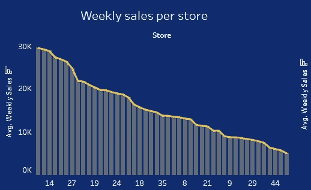
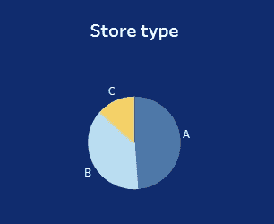
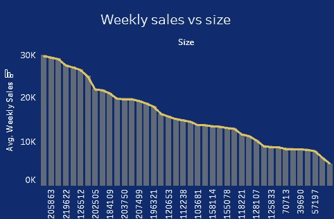
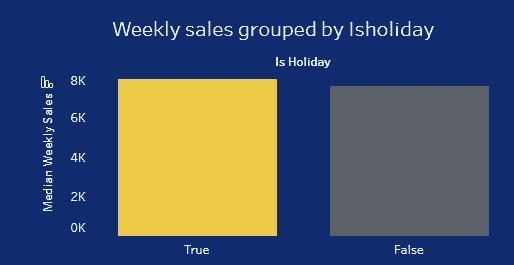
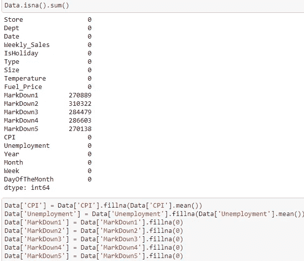
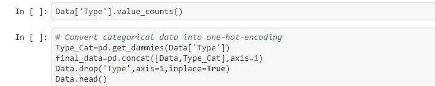

# 沃尔玛-招聘-商店-销售-预测

> 原文：<https://medium.com/analytics-vidhya/walmart-recruiting-store-sales-forecasting-ef275e8d5d4e?source=collection_archive---------16----------------------->

# **项目概述**

在这篇文章中，我将指导你从 scikit-learn 库构建一些回归器，然后，我们将强调最好的准确性。

# 问题陈述

美国领先的零售商店之一沃尔玛希望准确预测销售和需求。有一些特定的事件和节日会影响每天的销售。有沃尔玛 45 家店的销售数据。由于不可预见的需求，企业面临着挑战，并且由于不适当的机器学习算法，有时会缺货。一个理想的最大似然算法将准确地预测需求，并吸收像经济条件，包括消费物价指数，失业指数等因素。

# 韵律学

我使用了来自 **sklearn.model_selection 库**的 **cross_val_score** 来检查模型的准确性。

# 数据探索

这是从 2010 年 2 月 5 日到 2012 年 11 月 1 日的历史销售数据，在沃尔玛 _ 商店 _ 销售文件中。在该文件中，您将找到以下字段:

*   商店——商店编号
*   日期—销售的那一周
*   Weekly_Sales —给定商店的销售额
*   Holiday _ Flag 该周是否为特殊假日周 1-假日周 0-非假日周
*   温度——销售当天的温度
*   燃料价格-该地区的燃料成本
*   CPI——普遍消费价格指数
*   失业——普遍失业率

## 假日活动

超级碗:2010 年 2 月 12 日，2011 年 2 月 11 日，2012 年 2 月 10 日，2013 年 2 月 8 日

劳动节:2010 年 9 月 10 日，2011 年 9 月 9 日，2012 年 9 月 7 日，2013 年 9 月 6 日

感恩节:11 月 26 日至 10 日，11 月 25 日至 11 月 11 日，11 月 23 日至 12 日，11 月 29 日至 13 日

圣诞节:2010 年 12 月 31 日，2011 年 12 月 30 日，2012 年 12 月 28 日，2013 年 12 月 27 日

[***此处下载数据集***](https://drive.google.com/open?id=1alDWzg16PJmq_W33ySIv-RqpUjvTRU9U)

**通过这篇文章，我们将试图解决这些重要的问题:** 1-改变商店会影响销售吗？
2-改变商店类型会影响销售吗？
3-商店规模的变化会影响销售吗？销售会受到假期的影响吗？

最后，预测每个商店/部门的周销售额。

# 形象化

改变商店会影响销售吗？

只是作为一个观察，平均是非常不同的，这使我认为一些商店/部门可能比其他人卖得更多。

改变商店类型会影响销售吗？

作为一个观察，我可以说每周的销售变化取决于商店的规模。

商店规模的变化会影响销售吗？

作为一个观察，我可以说商店规模和每周销售额之间有着直接的关系。

假期会影响销售吗？

如上所述，我们可以说，每周销售额在假期增加。

# **数据预处理步骤**

缺失值和处理分类变量给用 sklearn 拟合机器学习模型带来了一些复杂性。

因此，首先，我们将检查缺失值和变量的数据类型。

有丢失的值，我像上面一样估算它们。

将类型更改为数值。

# **实施**

我通过 sklearn 库建立多个模型(LinearRegression，DecisionTreeRegressor，RandomForestRegressor，KNeighborsRegressor)。

# 结果

我得到的最好的准确度:RandomForestRegressor，它的训练分数为 97.0 %的准确度分数。

# 正当理由；辩解

最后，我可以预测位于不同地区的 45 家沃尔玛商店的 99 个部门的每周销售额。

# GITHUB 代码

要获取这篇文章的代码，请[点击这里](https://github.com/aljawharah-20/walmart-recruiting-store-sales-forecasting)。

# TABLEAU 仪表板

要访问仪表盘，请[点击此处](https://public.tableau.com/profile/aljawharah8507#!/vizhome/WalmartMarket-Aljawharah/SalesofWalmart)。

# 未来的改进

这是一个简单的数据探索，绘图和建立回归的会议，
我希望在不久的将来创造更多的进步。如果发现任何错误，请发邮件到 aljawharah.aldukhayni@gmail.com[给我](mailto:aljawharah.aldukhayni@gmail.com)