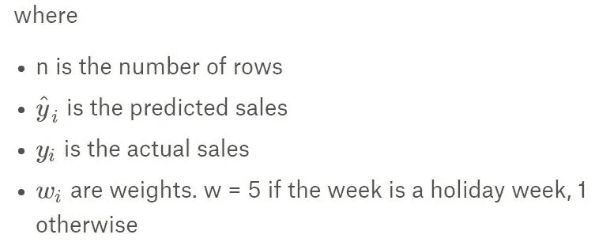

# 沃尔玛招聘—商店销售预测— Kaggle 竞争

> 原文：<https://medium.com/analytics-vidhya/walmart-recruiting-store-sales-forecasting-kaggle-competition-856c72c9265a?source=collection_archive---------1----------------------->

> 一个不老练的预测者使用统计数据，就像一个醉汉使用灯柱一样——为了支持而不是为了照明*—安德鲁·朗之后*


**图一:沃尔玛零售店**

> 销售预测是估计未来销售的过程。准确的销售预测使公司能够做出明智的商业决策，并预测短期和长期业绩。
> 
> 公司可以根据过去的销售数据、行业范围的比较和经济趋势做出预测。
> 
> 在这种情况下，这家公司就是沃尔玛。名字够好听！！！

# 项目概述:

*   **第 1 部分:**带评估指标的 Kaggle 问题定义。
*   **Part-2:** 探索性数据分析(EDA) *。*
*   **第三部分:**数据预处理
*   **第四部分:**时间序列模型。
*   **第五部分:**机器学习回归模型。

# **第 1 部分:**带评估指标的 Kaggle 问题定义:

## 问题定义:

*   沃尔玛提供了位于不同地区的 45 家沃尔玛商店的历史销售数据。每个商店包含许多部门，给定的任务是预测每个商店的部门范围内的销售额。
*   此外，沃尔玛全年都会举办几次促销活动。这些降价发生在重要的节日之前，其中四个最大的节日是超级碗、劳动节、感恩节和圣诞节。
*   包含这些假期的周在评估中的权重是非假期周的五倍。这项比赛的部分挑战是在缺乏完整/理想的历史数据的情况下，模拟降价对这些假日周的影响。
*   ka ggle-这个问题的链接可以在 [*这里找到*](https://www.kaggle.com/c/walmart-recruiting-store-sales-forecasting) 。

## 评估指标:

*   沃尔玛提供了加权平均绝对误差(WMAE)指标，其数学函数如下所示。



**图 3:绩效指标(WMAE)**

*   sklearn 的任何库中都没有这个性能指标，因此挑战在于为这个评估指标编写数学脚本。很明显，我们的目标是在预测每周销售额的同时，尽可能降低这一分数。我们将在回归模型中使用这个性能指标。

# **第二部分:**探索性数据分析(EDA):

> 在机器学习/深度学习中，必须知道什么是什么和如何是什么？到目前为止，我们已经知道了问题的定义，我们也清楚我们想要达到的目标。但我们如何实现它才是最重要的。为了前进，我们需要已经提供给我们的数据。我们将执行称为探索性数据分析的过程，这是一种分析数据集以总结其主要特征的方法，通常采用可视化方法。

*   让我们先导入一组库。

```
import numpy as np
import pandas as pd
import scipy.stats as stats
import matplotlib.pyplot as plt
import seaborn as sns
from sklearn.model_selection import train_test_split
from sklearn.metrics import mean_squared_error, mean_absolute_error
from datetime import datetime
import math# Importing the most popular regression libraries.
from sklearn.linear_model import LinearRegression, 
from sklearn.neighbors import KNeighborsRegressor,
from sklearn.linear_model import Ridge,
from sklearn.linear_model import Lasso,
from sklearn.tree import DecisionTreeRegressor,
from sklearn.ensemble import RandomForestRegressor,
from sklearn.ensemble import ExtraTreesRegressor,
from xgboost import XGBRegressor 
```

*   接下来，我们将 csv 文件中的数据加载到 pandas 数据框中，并检查其属性。

```
#Loading the data from csv files.
train=pd.read_csv('train.csv')
features=pd.read_csv('features.csv')
stores = pd.read_csv('stores.csv')
```


**图-4: train.csv 和 store.csv**


**图 5: features.csv**

*   因为我们已经得到了三个不同的文件，所以我们将这些文件连接起来，形成新的数据文件作为数据。

```
data = train.merge(features, on=['Store', 'Date'], how='inner').merge(stores, on=['Store'], how='inner')
print(data.shape)
```


**图 6:合并数据**

*   总共有 3 种类型的店铺:A 型，Type Band 型 C.
    总共有 45 家店铺。有关销售类型的更多信息如下所示。

```
sorted_type = stores.groupby('Type')
plt.style.use('ggplot')
labels=['A store','B store','C store']
sizes=sorted_type.describe()['Size'].round(1)
sizes=[(22/(17+6+22))*100,(17/(17+6+22))*100,(6/(17+6+22))*100] # convert to the proportionfig, axes = plt.subplots(1,1, figsize=(10,10))wprops={'edgecolor':'black',
      'linewidth':2}tprops = {'fontsize':30}axes.pie(sizes,
        labels=labels,
        explode=(0.0,0,0),
        autopct='%1.1f%%',
        pctdistance=0.6,
        labeldistance=1.2,
        wedgeprops=wprops,
        textprops=tprops,
        radius=0.8,
        center=(0.5,0.5))
plt.show()
```


**图-7:店铺类型饼图**

*   我们了解到，A 类商店的中位数高于其他商店类型的中位数，因此 A 类商店的周销售额高于其他商店类型。
*   我们检查了节假日和非节假日的每周销售额。

```
holiday = train_stores['Weekly_Sales'].loc[train_stores['IsHoliday']== True] # Weekly Sales in Holidays
non_holiday = train_stores['Weekly_Sales'].loc[train_stores['IsHoliday']== False] #Weekly Sales in Non-holidays.sns.barplot(x='IsHoliday', y='Weekly_Sales', data=train_stores)
```


**图-8:周销售额与节假日**

*   我们绘制了按部门和假日划分的每周销售额的箱线图。

```
data_11= pd.concat([train_stores['Dept'], train_stores['Weekly_Sales'], train_stores['IsHoliday']], axis=1)
plt.figure(figsize=(20,6))
plt.title('Box Plot of Weekly Sales by Department and Holiday')
fig = sns.boxplot(x='Dept', y='Weekly_Sales', data=data_11, showfliers=False, hue="IsHoliday")
```


**图-9:按部门和节假日划分的周销售额**

*   每月每周销售可视化也以下列方式进行。

```
data_14 = pd.concat([train_stores['Month'], train_stores['Weekly_Sales'], train_stores['IsHoliday']], axis=1)
plt.figure(figsize=(20,6))
plt.title('Box Plot of Weekly Sales by Month and Holiday')
fig = sns.boxplot(x='Month', y='Weekly_Sales', data=data_14, showfliers=False, hue='IsHoliday')
```


**图-10:按月份和节假日统计的周销售额**

# **第三部分:**数据预处理:

*   这里，我们首先检查合并的数据文件中是否存在空值，我们发现在一些列中存在空值。我们用零代替空值。


```
data=data.fillna(0)
data.isna().sum()
```


**图-11:每周销售额估算**

*   通过查看数据框的统计数据，我们知道有些行的周销售额为负值。由于销售额不能为负，我们跳过了周销售额为负的那些行。

```
data = data[data['Weekly_Sales'] >= 0]
```

*   我们绘制了相关矩阵，以查看这些特征之间是否存在任何相关性。我们执行此步骤是因为使用高度相关的特征没有意义，因为相关的特征在放入模型进行预测时会给出相同的信息。因此，更好的办法是识别这些，并级联相关的那些。我们来多了解一下吧。

> **相关矩阵:**
> 
> 相关性是一种双变量分析，衡量两个变量之间的关联强度和关系方向。就关系的强度而言，相关系数的值在+1 和-1 之间变化。
> 
> 值为 1 表示两个变量之间的完美关联程度。随着相关系数值趋向于 0，两个变量之间的关系将变弱。关系的方向由系数的符号表示；加号表示正相关，减号表示负相关。通常，在统计学中，我们测量四种类型的相关性:皮尔逊相关性、肯德尔等级相关性和斯皮尔曼相关性。下面的图表会给你一个关于相关性的概念。


**图 12:相关矩阵**

# **第四部分:**时间序列模型:

*   因为数据文件包含日期字段，所以给定的数据集是一个时间序列数据集，其中根据每个日期提供了关于商店和部门的每周销售额。
*   因此，我们将应用一些流行的时间序列预测模型，即:
    1。汽车 ARIMA 型号
    2。霍尔特-温特斯模型

## **1。自动 ARIMA(自回归综合移动平均线):**

> ARIMA 代表自回归综合移动平均模型。
> 
> 单变量(单向量)ARIMA 是一种预测技术，它完全基于序列自身的惯性来预测序列的未来值。

*   下面给出了接近自动 ARIMA 模型的步骤。
    →加载数据。
    →及时可视化可用的单变量数据。
    →查看季节性分解参数，检查季节性、趋势等。有没有空。
    →使用一种时间序列平稳性方法进行平稳性测试。
    →如果时间序列是非平稳的，则使其平稳。
    →如果时间序列是平稳的，则无需使其平稳。
    →分割训练和测试中的单变量数据。
    →最重要的步骤是通过绘制 ACF 和 PACF 图，找到三元组 p、d、q 的适当值，其中 p 是自回归数，d 是积分或差分，q 是移动平均数。
    →一旦获得 p、d、q 的值，根据列车数据拟合 ARIMA 模型。
    →预测测试数据值，并在单一图表上绘制列车、测试和预测测试数据值的可视化。
    →计算预测值的均方根误差(RMSE)。

> 请注意，ARIMA 或霍尔特-温特斯模型考虑了单变量数据。因此，我们使用 Weekly_Sales 列进行分析，因为我们需要预测该列在不久的将来的值。下图是迄今为止每周销售额的大致情况。

```
data.Date = pd.to_datetime(data.Date,format='%Y-%m-%d')
data.index = data.Date
data = data.drop('Date', axis=1)data = data.resample('MS').mean() # Resmapling the time series data with month starting first.# Train-Test splitting of time series data
train_data = data[:int(0.7*(len(data)))]
test_data = data[int(0.7*(len(data))):]# ARIMA takes univariate data.train_data = train_data['Weekly_Sales']
test_data = test_data['Weekly_Sales']# Plot of Weekly_Sales with respect to years in train and test.
train_data.plot(figsize=(20,8), title= 'Weekly_Sales', fontsize=14)
test_data.plot(figsize=(20,8), title= 'Weekly_Sales', fontsize=14)
plt.show()
```


**图-13:周销售额**

*   时间序列模型假设给定的时间序列数据集在平稳意义下具有恒定的均值和恒定的方差。如果数据集是不稳定的，那么我们不会将时间序列模型原样应用于数据集。首先，我们使用平稳性方法使序列平稳，然后我们在其上应用时间序列模型。我们执行了 Dicky Fuller 检验来检查序列是否平稳。下面是它的实现。

> d**Dicky Fuller 平稳性检验:**
> Dicky-Fuller 检验时间序列数据中存在单位根的零假设。为了使事情更加清楚，这个测试检查平稳性或非平稳数据。该测试试图拒绝零假设，即单位根的存在和数据是非平稳的。如果零假设被拒绝，则替代假设可以被认为是有效的(例如，数据是固定的)。
> 当我们运行测试时，我们将得到一个 ADF 值和一个 p 值。ADF 数应该是负数，并且 p 值应该低于置信水平的某个阈值(例如 1%或 5%等)。这里，我们将使用 5%(或 95%的置信水平)，因此如果 p 值大于 0.05，那么我们说我们无法拒绝零假设，因为数据有一个单位根，并且是非平稳的。如果 p 值小于或等于 0.05，我们可以说我们拒绝零假设，因为数据没有单位根，是平稳的。

```
from statsmodels.tsa.stattools import adfuller
result = adfuller(data['Weekly_Sales'])
print('ADF Statistic: {}'.format(result[0]))
print('p-value: {}'.format(result[1]))
print('Critical Values:')
for key, value in result[4].items():
    print('\t{}: {}'.format(key, value))
```


**图 14:迪基-富勒平稳性检验**

*   正如我们可以看到的，我们的 p 值肯定小于 0.5，甚至小于 0.01，因此我们可以非常自信地说，我们可以拒绝零(单位根，非平稳数据)，并可以假设我们的数据是平稳的。此外，我们的 ADF 远小于我们的 1%置信值-3.43，所以我们有另一个确认，我们可以拒绝零假设。
*   现在我们可以应用 ARIMA 模型了，因为数据集是固定的。
*   我们应用 ARIMA 模型进行了手动检查。它确实工作得很好，但是有一些小的限制。为了应用 ARIMA，我们需要计算三联体值，即(p，d，q)。p 的值是自动回归数，d 的值是使序列稳定所需的差值数，q 是移动平均数。为了计算 p、d、q 值，我们需要绘制自相关函数(ACF)和部分自相关函数(PACF)图。
*   为了避免这种情况，我们使用了自动 ARIMA 而不是 ARIMA，因为在 ARIMA 模型中，我们需要找到自动回归数(p)、移动平均数(q)和积分数(差值，d)的适当值，这既繁琐又耗时。在自动 ARIMA 中，我们可以看到三元组(p，q，d)值自动基于最少的 AIC 和 BIC 分数，更重要的是最符合模型。
*   这里需要注意的一点是，汽车 ARIMA 并不存在于统计模型中，它实际上存在于**金字塔**中。所以我们安装了金字塔，然后导入 auto arima 库。下面是实施汽车 ARIMA 到沃尔玛的数据集(每周销售额)。
*   这里我们给出(p，q，d)三元组的范围为 0 到 10。你可以把这想象成执行三个 for 循环，从 p 开始，然后 q，最后计算 AIC 和 BIC 的分数。

```
pip install pyramid-arima# Applying auto_arima model on train data.
from pyramid.arima import auto_arimamodel_auto_arima = auto_arima(train_data, trace=True, error_action='ignore', suppress_warnings=True)
model_auto_arima = auto_arima(train_data, trace=True,start_p=0, start_q=0, start_P=0, start_Q=0, max_p=10, max_q=10, max_P=10, max_Q=10, seasonal=True,stepwise=False, suppress_warnings=True, D=1, max_D=10,error_action='ignore',approximation = False)model_auto_arima.fit(train_data)
```


**图-15:汽车 ARIMA 车型输出**

*   应用自动 ARIMA 后我们得到的结果如下所示。该模型自动选择 AIC 和 BIC 得分最小的 p、d、q 值。在我们的例子中，p=0，q=0，d=2。


**图 16:自动 ARIMA 最佳模型输出**

*   这里我们不需要知道 p，d，q 值。一旦我们得到了最佳拟合的模型，我们就继续预测测试值，并在单个图表上绘制训练、测试和预测值，随后我们找到 MSE、RMSE 和 MAD 值。

```
# Predicting the test values using predict function.
forecast = model_auto_arima.predict(n_periods=len(test_data))
forecast = pd.DataFrame(forecast,index = test_data.index,columns=['Prediction'])
plt.figure(figsize=(20,6))
plt.title('Prediction of Weekly Sales using Auto ARIMA model', fontsize=20)
plt.plot(train_data, label='Train')
plt.plot(test_data, label='Test')
plt.plot(forecast, label='Prediction using ARIMA Model')
plt.legend(loc='best')
plt.xlabel('Date', fontsize=14)
plt.ylabel('Weekly Sales', fontsize=14)
plt.show()
```


**图 17:自动 ARIMA 结果**

*   以下是自动 ARIMA 的性能指标。

```
# Performance metric for ARIMA model -MSE/RMSE
print('Mean Squared Error (MSE) of ARIMA: ', mean_squared_error(test_data, forecast))
print('Root Mean Squared Error (RMSE) of ARIMA: ', math.sqrt(mean_squared_error(test_data, forecast)))
print('Mean Absolute Deviation (MAD) of ARIMA: ', mean_absolute_error(test_data, forecast))
```


**图-18:自动 ARIMA 的性能指标**

**2。霍尔特-温特斯法:**

> Holt-Winters 是一种时间序列模型，是一种对时间序列的三个方面进行建模的方法:典型值(平均值)、一段时间内的斜率(趋势)和周期性重复模式(季节性)。
> 
> Holt-Winters 使用指数平滑对过去的大量值进行编码，并使用它们来预测现在和未来的“典型”值。

*   以下是执行霍尔特-温特斯法所需的步骤。
    →加载数据。
    →及时可视化可用的单变量数据。
    →使用霍尔特-温特斯法对列车数据拟合模型。
    →使用测试数据预测数值。
    →在单一图形上可视化训练数据、测试数据和预测数据
    →计算预测数据的均方根误差(RMSE)。

> 霍尔特-温特斯模型有水平，趋势和季节性参数可以寻找。在 Holt-linear 模型的早期版本中，没有引入季节性参数，因此如果数据集有季节性参数，那么早期模型将会失败。因此引入了 Holt-Winters 模型，它考虑了季节性参数。
> 
> 这也被称为三重指数平滑算法，因为它平滑水平，趋势和季节性指数。下面是霍尔特-温特斯方法的实现。

*   由于数据已经以时间序列格式组织，这里我们只需要应用 Holt-Winters 方法。下面是它的实现。

```
# Fitting the Holt-Winters method for Weekly Sales.
from statsmodels.tsa.api import ExponentialSmoothingmodel_holt_winters = ExponentialSmoothing(train_data, seasonal_periods=7, trend='additive', seasonal='additive').fit() pred = model_holt_winters.forecast(len(test_data))# Predict the test data#Visualize train, test and predicted data.
plt.figure(figsize=(20,6))
plt.title('Prediction of Weekly Sales using Holt-Winters model', fontsize=20)
plt.plot(train_data, label='Train')
plt.plot(test_data, label='Test')
plt.plot(pred, label='Prediction using Holt Winters Methods')
plt.legend(loc='best')
plt.xlabel('Date', fontsize=14)
plt.ylabel('Weekly Sales', fontsize=14)
plt.show()
```


**图-19:使用霍尔特-温特斯法的训练、测试和预测值**

我们看到这种方法非常正确地拟合了试验值。下面是霍尔特-温特斯法的性能指标。

```
print('Mean Squared Error (MSE) of Holt-Winters: ', mean_squared_error(test_data, pred))
print('Root Mean Squared Error (RMSE) of Holt-Winters: ', math.sqrt(mean_squared_error(test_data, pred)))
print('Mean Absolute Deviation (MAD) of Holt-Winters: ', mean_absolute_error(test_data, pred))
```


**图 20:霍尔特-温特斯法的性能指标**

# **第五部分:**机器学习回归模型:

*   到目前为止，我们讨论的是使用时间序列方法预测每周销售额。现在，我们将使用传统的回归算法来预测销售额。
*   在这里，我们将使用以下回归模型进行每周销售预测。

*1。线性回归*

*2。k 最近邻回归*

*3。岭回归*

*4。拉索回归*

*5。决策树回归*

*6。随机森林回归*

*7。树外回归*

*8。XGBoost 回归*

在下面的每个模型中，将执行以下步骤。

*   定义每个库采用的参数。
*   根据训练数据拟合模型。
*   超级参数-使用简单的 for 循环调整参数。
*   根据调整后的参数重新训练模型。
*   获得加权平均绝对误差(WMAE)分数。

*注意:但是在应用任何模型之前，我们需要数据为数字格式。例如，如果任何列是字符串格式，并且如果我们对字符串类型的列应用回归模型，那么模型将抛出一个错误。
在现有的数据集中，有一些列被我们转换为数值数据类型。*

```
train_data = [train]# Converting Categorical Variable 'Type' into Numerical Variables.
type_mapping = {"A": 1, "B": 2, "C": 3}
for dataset in train_data:
    dataset['Type'] = dataset['Type'].map(type_mapping)# Converting Categorical Variable 'IsHoliday' into Numerical Variables.
type_mapping = {False: 0, True: 1}
for dataset in train_data:
    dataset['IsHoliday'] = dataset['IsHoliday'].map(type_mapping)
```

*   为了增加预测的复杂性，沃尔玛增加了一系列新的假期，即超级碗、感恩节、劳动节和圣诞节。竞争对手需要了解这些假期对每周销售参数的影响。因此，我们在现有的 IsHoliday 中添加了这些功能，并相应地将它们标记为 0 和 1。

```
 train['Super_Bowl'] = np.where(
(train['Date']==datetime(2010,2,10))|
(train['Date'] == datetime(2011,2,11))| 
(train['Date'] == datetime(2012,2,10))|
(train['Date'] == datetime(2013,2,8)), 1, 0)train['Labor_day'] = np.where(
(train['Date'] == datetime(2010,9,10))|
(train['Date'] == datetime(2011,9,9))| 
(train['Date'] == datetime(2012,9,7))|
(train['Date'] == datetime(2013,9,6)), 1, 0)train['Thanksgiving'] = np.where(
(train['Date']==datetime(2010, 11, 26)) | (train['Date']==datetime(2011, 11, 25)) | 
(train['Date']==datetime(2012, 11, 23)) | (train['Date']==datetime(2013, 11, 29)),1,0)train['Christmas'] = np.where(
(train['Date']==datetime(2010, 12, 31))| (train['Date']==datetime(2011, 12, 30))| 
(train['Date']==datetime(2012, 12, 28))| (train['Date']==datetime(2013, 12, 27)),1,0)
```

*   然后，我们在训练、交叉验证和测试中分割数据集，如下所示。因为我们按升序排列日期，所以我们将数据分成 70:30 的比例，分别用于训练:测试和训练:cv。

```
train = train.sort_values(by='Date', ascending=True) # Sorting the data in increasing order of Date and then splitting.
y = train['Weekly_Sales']
X = train.drop(['Weekly_Sales'], axis=1)X_train, X_test, y_train, y_test = train_test_split(X, y, test_size=0.3) # Train:Test = 70:30 splitting.X_train, X_cv, y_train, y_cv = train_test_split(X_train, y_train, test_size=0.3) #Train:CV = 70:30 splitting.
```

*   但是，在应用任何回归模型之前，我们定义了最重要的指标，即加权平均绝对误差。请注意前面显示的公式。我们用下面的逻辑计算 WMAE。我们分别计算了训练数据、cv 数据和测试数据的 WMAE 损失。

```
def wmae_train(test, pred): 
  weights = X_train['IsHoliday'].apply(lambda is_holiday:5 if   is_holiday else 1)
  error = np.sum(weights * np.abs(test - pred), axis=0) / np.sum(weights)
  return errordef wmae_cv(test, pred): # WMAE for CV
  weights = X_cv['IsHoliday'].apply(lambda is_holiday:5 if is_holiday else 1)
  error = np.sum(weights * np.abs(test - pred), axis=0) / np.sum(weights)
  return errordef wmae_test(test, pred): # WMAE for test
  weights = X_test['IsHoliday'].apply(lambda is_holiday:5 if is_holiday else 1)
  error = np.sum(weights * np.abs(test - pred), axis=0) / np.sum(weights)
  return error
```

*   现在我们应用上述回归模型，计算每个模型的 WMAE 分数。是时候使用标准的机器学习算法了！
*   我们展示了获得最佳 WMAE 分数的最佳模型。我们没有使用 GridSearch/RandomSearch 优化技术，因为 Kaggle 提供的损失函数不属于 skleran 的库(例如 MSE、准确性、F1 分数等)。).相反，我们执行了简单' for '循环，以获得各个模型最佳超参数。
*   在最佳模型中应用的程序也适用于所有其他的回归技术。

**步骤 1** : **应用随机森林回归来调整超参数(最大深度和 n 估计值)。**

```
# Define the list of errors and list of hyper parameters.
error_cv_rf = []
error_train_rf = []
max_depth = [1,5,10,15,20,25,30,35]
n_estimators = [10,20,30,40,50,60,70,80]
rf_hyperparams = []"""Calculating train and CV errors for maximum depth and number of estimators parameters."""for i in max_depth: 
    for j in n_estimators: 
        rf = RandomForestRegressor(max_depth=i, n_estimators=j) 
        rf.fit(X_train, y_train) 
        y_pred_cv_rf = rf.predict(X_cv) 
        y_pred_train_rf = rf.predict(X_train) 
        error_cv_rf.append(wmae_cv(y_cv, y_pred_cv_rf)) 
        error_train_rf.append(wmae_train(y_train, y_pred_train_rf)) 
        rf_hyperparams.append({'Maximum Depth':i, 'No. of Estimators':j}) 
```

**第二步:获取训练和交叉验证误差表。形成此表是因为我们需要在创建热图时提供此表。**

```
rf_dataframe = pd.DataFrame(rf_hyperparams)
rf_dataframe['Train Error']=error_train_rf
rf_dataframe['CV Error']=error_cv_rf
rf_dataframe.sort_values(by=['CV Error'], ascending=True)
rf_dataframe.head()
```


**图-21:随机森林数据帧**

**第三步:创建热图并确定适当的超级参数值。**

```
sns.set(font_scale=1.0)train_rf = pd.pivot_table(rf_dataframe,'Train Error','Maximum Depth','No. of Estimators') # Pivot table of Train data.cv_rf = pd.pivot_table(rf_dataframe, 'CV Error','Maximum Depth','No. of Estimators') # Pivot table of CV data.fig, ax = plt.subplots(1,2, figsize=(20,6))
ax_train = sns.heatmap(train_rf, annot=True, fmt='2g', ax=ax[0], linewidths=0.01)
ax_cv = sns.heatmap(cv_rf, annot=True, fmt='4g', ax=ax[1], linewidths=0.01)bottom_train, top_train = ax_train.get_ylim()
ax_train.set_ylim(bottom_train + 0.5, top_train - 0.5)bottom_cv, top_cv = ax_cv.get_ylim()
ax_cv.set_ylim(bottom_cv + 0.5, top_cv - 0.5)ax[0].set_title('Training set')
ax[1].set_title('CV set')
plt.show()
```


**图-22:列车和 CV 错误的热图**

**第四步:预测测试数据，计算 WMAE 分数。**

```
model_rf = RandomForestRegressor(max_depth= 35, n_estimators=80).fit(X_train, y_train) # Fit the model with best hyper parameter values.y_pred = model_rf.predict(X_test) # Predict the test data.print('Weighted Mean Absolute Error (WMAE) for Random Forest Regression:', wmae_test(y_test, y_pred)) # Get WMAE score.
```


**图-23:随机森林的 WMAE 分数**

*   同样，我们计算了其余模型的加权平均绝对误差(WMAE ),并列出每个模型的 WMAE 分数。下面是每个回归模型性能的简要总结。

```
models = pd.DataFrame({
'Model Name': 
['Linear Regression','KNN Regression','Ridge Regression','Lasso Regression','Decision Tree Regression','Random Forest Regression','ExtraTrees Regression','XGBoost Regession'],

'WMAE Score': 
['14904.66', '11887.99', '14824.52', '14810.89', '2134.17', '1785.20', '1986.29', '2765.22']
 })Index = pd.Series([1, 2, 3, 4, 5, 6, 7, 8])
models.set_index(Index, inplace=True)
models
```


**图-24:所有回归模型的 WMAE 得分**

*   我们观察到随机森林回归模型的 WMAE 分数最小，即 1785.20，因此最好使用的回归模型是随机森林回归。我们利用这个模型来计算测试文件(test.csv)中给定的未来日期的每周销售额。每周销售额按以下方式预测。

## 结果(提交文件):

*   我们对 test.csv 进行了与训练合并数据文件相同的预处理。我们最后对 test.csv 应用了具有最佳超参数的随机森林回归。

```
model_rf = RandomForestRegressor(max_deth= 35, n_estimators=80).fit(train) 
y_pred = model_rf.predict(test_kaggle) 
```

*   最后，使用 Kaggle 提供的 sampleSubmission.csv 文件格式生成每周销售预测 csv 文件。下面是它的实现。

```
submission = pd.DataFrame({
"Id": 
test_kaggle.Store.astype(str)+'_'+
test_kaggle.Dept.astype(str)+'_'+
test_kaggle.Date.astype(str), "Weekly_Sales": y_pred 
 })submission.to_csv('Weekly Sales Prediction.csv', index=False) # Final submission.
```


**图-25:每周销售预测文件**

*   这是这个卡格尔竞赛的完整故事，它包含了所学和所用的东西。
*   值得庆幸的是，当在 Kaggle 上传预测销售文件时，得到了 3202.24 的 WMAE 分数，排名 160！！


**图-26: Kaggle 比赛 WMAE 得分**

## 项目的 GitHub [链接](https://github.com/shubhamkabre/Machine-Learning-Project---Walmart_Recruiting_Store_Sales_Forecasting)。请务必查看我的 LinkedIn [简介](http://linkedin.com/in/shubham-kabra-45878b16b)。

> 机器学习领域就是学习未知的事物，并通过应用来试验它们..！！！

> 如果你愿意，请在下面留下一些评论和建议。毕竟，我希望通过阅读这篇文章，你可能已经开始了解你不知道的:D 的概念
> 
> 感谢您阅读这篇文章…！！