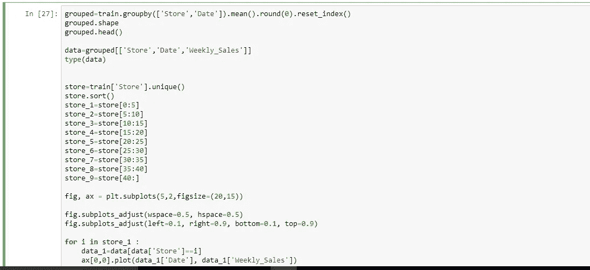

# 沃尔玛销售预测

> 原文：<https://medium.com/analytics-vidhya/walmart-sales-forecast-41c6dc1028b8?source=collection_archive---------3----------------------->

我已经尝试了 kaggle 问题作为我自己案例研究的一部分。案例研究的主要描述和数据可以在此链接找到:[https://www . ka ggle . com/c/Walmart-recruiting-store-sales-forecasting](https://www.kaggle.com/c/walmart-recruiting-store-sales-forecasting)

全部数据都可以在这个链接中找到，并且是开源的，可以下载。

我将讨论和解释我在 ipynb 中完成的整个解决方案。

一切按部就班。所以，我们先从数据描述部分开始。

# **数据描述:**

解决任何问题的第一步是彻底理解数据，比如数据是关于什么的，并且彻底理解。

如果不理解数据，就不可能解决数据。

*数据的正式取消声明:*

该数据包含位于不同地区的 45 家沃尔玛商店的历史销售数据。每个商店包含许多部门，我的任务是预测每个商店的部门范围内的销售额。

此外，沃尔玛全年都会举办几次促销活动。这些降价发生在重要的节日之前，其中四个最大的节日是超级碗、劳动节、感恩节和圣诞节。包含这些假期的周在评估中的权重是非假期周的五倍。这项比赛的部分挑战是在缺乏完整/理想的历史数据的情况下，模拟降价对这些假日周的影响。

stores.csv

该文件包含 45 家商店的匿名信息，表明商店的类型和规模。

train.csv

这是从 2010 年 2 月 5 日到 2012 年 11 月 1 日的历史培训数据。在该文件中，您将找到以下字段:

*   商店——商店编号
*   部门——部门编号
*   日期—星期
*   Weekly_Sales —给定商店中给定部门的销售额
*   IsHoliday —该周是否为特殊假日周

test.csv

该文件与 train.csv 相同，只是我们保留了每周销售额。您必须预测该文件中每个商店、部门和日期三元组的销售额。

功能. csv

该文件包含与给定日期的商店、部门和区域活动相关的附加数据。它包含以下字段:

*   商店——商店编号
*   日期—星期
*   温度—该地区的平均温度
*   燃料价格-该地区的燃料成本
*   减价 1–5—与沃尔玛促销减价相关的匿名数据。降价数据仅在 2011 年 11 月后可用，并非所有商店都随时可用。任何缺少的值都标有安娜。
*   CPI——消费者价格指数
*   失业——失业率
*   IsHoliday —该周是否为特殊假日周

为方便起见，这四个假日位于数据集中的以下几周内(并非所有假日都在数据中):

超级碗:2010 年 2 月 12 日、2011 年 2 月 11 日、2012 年 2 月 10 日、2013 年 2 月 8 日
劳动节:2010 年 9 月 10 日、2011 年 9 月 9 日、2012 年 9 月 7 日、2013 年 9 月 6 日
感恩节:2010 年 11 月 26 日、2011 年 11 月 25 日、2012 年 11 月 23 日、2012 年 11 月 29 日、2013 年 11 月 29 日
圣诞节:2010 年 12 月 31 日、2012 月 30

— — — — — — — — — — — — — — — — — — — — — — — -

## 绩效指标:

# **问题陈述:**

分配给我的主要问题是，我必须根据给定的数据集预测销售额。从问题本身我能理解的是，这是一个回归问题。我们必须使用回归模型来从数据集中预测销售额。

## **解决方案:**

我在这里的任务是解决这个作业，我会尽一切努力在最大程度上解决这个问题。

从解决方案部分开始，我首先下载了全部数据，然后将数据加载到我的 ipynb 笔记本中。

我已经从数据中读取了单个文件，并打印了列。我这样做是为了了解提供给我的数据类型。在这个解决方案中，我的核心问题是设计一种方法，在这种方法中，我应该根据上面的数据集来预测沃尔玛的销售额。所以，理解我所拥有的每一个特性是非常重要的。

在理解了数据集的列之后，我所做的是合并数据集，因为数据集被分成了许多部分。为了获得对数据的正确理解，我必须合并数据集。

在这里，我可以看到最终数据集已准备就绪。但是我可以看到在 MarkDown1 列和其他 MarkDown 列中有许多 nan 值。因此，对我来说，理解哪个特征可以用于设计机器学习算法并不容易。因此，我不得不选择探索性数据分析(它基本上被定义为一种技术，用于以统计方式理解数据的行为，并使用特定的绘图工具理解每个特征是如何表现的。所以，现在我将彻底讨论关于探索性数据分析部分。

## **探索性数据分析**

看完这些数据后，我决定先分析这些数据。分析的主要观点是，销售可以对时间因素和空间因素作出反应，商店的销售记录是每个部门日期变量的聚合，可以分解成 y/m/w/d 变量。日变量可以提供许多销售信息。将结合外部数据(如美国国庆节)来添加信息。我们已经知道，在机器学习问题解决部分，我们必须尝试所有可能的方法来解决问题，而 90%的实验可能是徒劳的。但是我们仍然必须努力寻找近似解。

我做的第一件事是检查商店和类型的唯一值。

我可以发现这里的惟一值是 45，也就是说，有 45 种不同的商店类型。虽然知道唯一类型，但在提供的数据中有三种唯一类型可用。

接下来，我决定寻找数据相对于类型的行为。

我使用 groupby 来查看数据的所有行为，包括计数、平均值、标准差、最小销售值、最大销售值以及所有百分点值(分位数)和最大值。这是为了了解每种类型的销售行为以及数据。

接下来，我要做的是找出每种类型数据的比例，并在饼图视图中聚焦它们。

从这个饼图中我们可以看到，48.9%的销售额属于 A 店，大约 37.8%属于 B 店，13.3 %属于 C 店。

为了了解 A 类和 C 类中每一类销售额的大小，我使用了箱线图。

在这里我们可以发现，A 型商店是最大的商店，C 型商店是最小的。此外，A、B 和 c 之间没有大小重叠的区域。类型是大小的最佳预测值。

接下来，我试图想象的是 A、B、c 三种类型的每周销售额。

我能看到的是数据重叠太多，A 的中位数是最高的，C 是最低的，这意味着规模越大的商店销售记录越高(规模中位数和销售额中位数的顺序是相同的)

接下来我要做的是深入了解训练数据。我已经合并了列车并存储了数据。然后用散点图对火车数据的大小和每周销量进行分析。

这个结果并不令人信服，我无法从这些数据中得到任何适当的信息。

接下来我做的是在每周销售额和 A、B、c 三种类型的规模之间做一个散点图。

正如我们所看到的，A 型、B 型和 C 型的每周销售额重叠太多。因此，我们不能由此得出任何恰当的结论。

所以，让我们继续 EDA 部分，因为我们没有从上面的图中发现任何有帮助的东西。因此，我们应该深入挖掘，以获得数据的洞察力。

接下来，我试图理解商店、周销售额和培训数据类型的数据。

接下来，我要做的是找出商店、每周销售额和假日之间的关系。

接下来我要做的是找出部门、周销售额和假期之间的关系。

与商店和假日的关系不同，部门和假日不能解释任何关系。72 个部门显示假日期间的销售额最高，而其他部门则没有，甚至在一些部门，非假日的销售额更高。这意味着产品(部门)的特性与销售有着不同的关系。

接下来我要做的是确定周销售数据是否服从高斯分布。因为如果周销售额服从高斯分布，那么我们也可以预测周销售额的一些其他属性。

周销售额的值并不遵循一条直线。所以。我们可以得出这样的结论:周销售额不服从高斯分布。

接下来我要做的是找出每周销售额的范围。我使用了实际值的对数来了解数据。

正如我们在这里看到的，周销售额范围从 0 到 12(对数)。

接下来，作为 EDA 的一部分，我所做的是获得独特的部门，并将独特的部门分成 4 个相等的部分，并找出 20 个槽中的平均销售记录。

通过线图，我们可以看到以下内容

销售水平因部门而异，一个部门的销售记录水平是稳定的，在 1 月和 5 月左右有一些峰值。因此，可能会有一个高销售事件，一些部门与这些事件高度相关。因此，销售记录在 1 月或 5 月左右急剧上升

结论 1:部门是预测销售的好特征

结论 2:日期(尤其是事件)是预测销售额的一个很好的特征像部门，按商店销售的时间序列将显示销售趋势假设:像部门，商店将给出一种销售水平假设 _2:另外，这也将给出最高销售额的一天。

接下来，我按商店和日期平均值分组，然后将它们分成 5 个时间段，并按时间轴绘制平均销售额。

由于我无法在这些销售预测栏中找到任何适当的关系，我决定制作一个虚拟模型，以检查最糟糕的情况是什么样的。

我已经尝试了这个虚拟模型，并在 kaggle 网站上查看了 wmae。它在 kaggle 页面上获得了大约 25000 分。

我已经决定在一个贪婪的方法工作，从较少的功能开始，并添加一个功能，如果分数有点多。

## 从主解决方案开始

我做的第一件事是对日期部分进行一些常见的特征化，因为日期与销售直接相关。特征化的核心部分基本上涉及到很多领域知识。

特征化是建模最重要的一步，因为模型的准确性很大程度上取决于我们所采取的特征化。我决定选取所有特征的一个子集，看看模型的表现如何。

def multi _ holiday(data):
dataset = data . copy()
holiday =[]
dates = data[' Date ']。apply(lambda x:x . strftime(' % Y-% m-% d '))。范围内 I 的值
(len(dates)):
holiday . append(get _ holiday(str(dates[I])))
holiday = PD。data frame(holiday)
holiday . columns =[' super _ bowl '，' labor '，' chris '，' columbus '，' veterans '，' independence '，' memorial '，' Washington ']
dataset = PD . merge(dataset，holiday，left_index=True，right _ index = True)
normal _ holiday = dataset . copy()
holiday _ pre1 =[]
dates = data[' Date ']。apply(lambda x:(x-datetime . time delta(days = 7))。strftime('%Y-%m-%d ')。范围内 I 的值
(len(dates)):
holiday _ pre1 . append(get _ holiday(str(dates[I]))
holiday _ next 1 =[]
dates = data[' Date ']。apply(lambda x:(x+datetime . time delta(days = 7))。strftime('%Y-%m-%d ')。范围内 I 的值
(len(dates)):
holiday _ next 1 . append(get _ holiday(str(dates[I]))
holiday _ pre1 = PD。data frame(holiday _ pre1)
holiday _ next 1 = PD。data frame(holiday _ next1)
holiday _ pre 1 . columns =[' super _ bowl _ P1 '，' labor_p1 '，' thank_p1 '，' chris_p1 '，' veterans_p1 '，' independence_p1 '，' memorial_p1 '，' Washington _ P1 ']
holiday _ next1 . columns =[' super _ bowl _ n1 '，' labor_n1 '，' thank_n1 '，' chris_n1 '，' columbus_n1 '，' memorial_n1 '，' washington_n1']
dataset = pd .apply(lambda x:(x-datetime . time delta(days = 14))。strftime('%Y-%m-%d ')。范围内 I 的值
(len(dates)):
holiday _ pre 2 . append(get _ holiday(str(dates[I]))
holiday _ next 2 =[]
dates = data[' Date ']。apply(lambda x:(x+datetime . time delta(days = 14))。strftime('%Y-%m-%d ')。范围内 I 的值
(len(dates)):
holiday _ next 2 . append(get _ holiday(str(dates[I]))
holiday _ pre2 = PD。data frame(holiday _ pre 2)
holiday _ next 2 = PD。data frame(holiday _ next 2)
holiday _ pre 2 . columns =[' super _ bowl _ p2 '，' labor_p2 '，' thank_p2 '，' chris_p2 '，' veterans_p2 '，' independence_p2 '，' memorial_p2 '，' Washington _ p2 ']
holiday _ next 2 . columns =[' super _ bowl _ N2 '，' labor_n2 '，' thank_n2 '，' chris_n2 '，' columbus_n2 '，' veterans_n2 '，' independence_n2 '，' memorial_n2 '

我使用商店、部门、日期、销售额、周销售额和每周销售额作为训练数据集，只是为了测试这些特性的子集是如何工作的。由于销售预测与这个因素直接相关，所以我选择了这个。我已经查看了卡格尔页面上的分数。这个范围在 5020 左右。

# 最后一个 IPYNB