# 沃尔玛销售预测

> 原文：<https://medium.com/analytics-vidhya/walmart-sales-forecasting-d6bd537e4904?source=collection_archive---------0----------------------->

*简单的模型平均值可以利用问题(此处为销售)的性能和准确性，这在没有深度特征工程的情况下也是如此。*


# 介绍

预测公司未来的销售是战略规划最重要的方面之一。作为初学者，沃尔玛是最好的例子，因为它拥有最多的零售数据集。此外，沃尔玛也将这个销售预测问题用于招聘目的。

收集的数据范围从 2010 年到 2012 年，全国各地的 45 家沃尔玛商店被纳入这项分析。每个商店包含几个部门，我们的任务是预测每个商店的部门范围内的销售额。值得注意的是，我们也有外部数据，如每个商场所在区域的 CPI、失业率和燃油价格，希望这些数据有助于我们进行更详细的分析。


# 数据集概述

这个数据集可以在 kaggle 网站上找到。这些数据集包含关于商店、部门、温度、失业、CPI、假日和降价的信息。

**店铺:**
*店铺*:店铺编号。范围从 1 到 45。
*类型*:三种类型的门店‘A’、‘B’或‘C’。
*大小*:设置一个商店的大小将根据特定商店中的产品数量来计算，范围从 34，000 到 210，000。

**特征 *:*** *温度*:该地区当周的温度。
*燃料价格*:当周该地区的燃料价格。
*降价 1:5* :表示降价的类型以及当周的可用数量。
*CPI* **:** 当周居民消费价格指数。
*失业率*:商店所在区域当周的失业率。

**销售 *:***
*日期*:进行观察的那一周的日期。
*Weekly_Sales* :当周记录的销售额。
*Dept*:1-99 之一，显示部门。
*IsHoliday* :一个布尔值，表示是否是假日周。

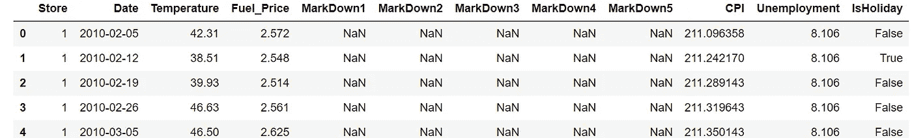

特征

作为竞争的一部分，我们有 421570 个值用于训练，115064 个值用于测试。但是我们将只处理 421570 个数据，因为我们有标签来测试模型的性能和准确性。

# 数据操作

1.  检查空值

```
feat.isnull().sum()
```

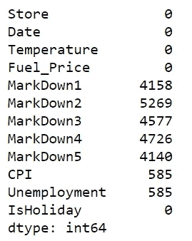

由于 CPI 和失业率的 NaN 很少，因此我们用它们各自的列平均值填充缺失值。由于降价有更多的缺失值，我们分别在缺失的地方补零

```
from statistics import meanfeat['CPI'] = feat['CPI'].fillna(mean(feat['CPI']))
feat['Unemployment'] = feat['Unemployment'].fillna(mean(feat['Unemployment']))
feat['MarkDown1'] = feat['MarkDown1'].fillna(0)
feat['MarkDown2'] = feat['MarkDown2'].fillna(0)
feat['MarkDown3'] = feat['MarkDown3'].fillna(0)
feat['MarkDown4'] = feat['MarkDown4'].fillna(0)
feat['MarkDown5'] = feat['MarkDown5'].fillna(0)
```

将所有特征与训练数据合并(添加)

```
new_data = pd.merge(feat, data, on=['Store','Date','IsHoliday'], how='inner')# merging(adding) all stores info with new training data
final_data = pd.merge(new_data,stores,how='inner',on=['Store'])
```

由于数据是**时间序列**，我们将它们按升序排序，以便模型可以对历史数据执行。

在固定时间间隔内测量的任何指标都构成一个时间序列。由于工业需要和相关性，特别是时间序列的预测，时间序列的分析在商业上很重要。

```
# sorting data with respect to date
final_data = final_data.sort_values(by='Date')
```

这个被操作的数据集的维数是(421570，16)。

# 探索性数据分析

共有 3 种类型的商店:A 型、b 型和 c 型
共有 45 家商店。

```
sizes=grouped.count()['Size'].round(1)
print(sizes)
```

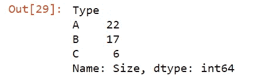

```
labels = 'A store','B store','C store'
sizes = [(22/(45))*100,(17/(45))*100,(6/(45))*100]fig1, ax1 = plt.subplots()
ax1.pie(sizes, labels=labels, autopct='%1.1f%%',
        shadow=True, startangle=90)
ax1.axis('equal')  # Equal aspect ratio ensures that pie is drawn as a circle.plt.show()
```

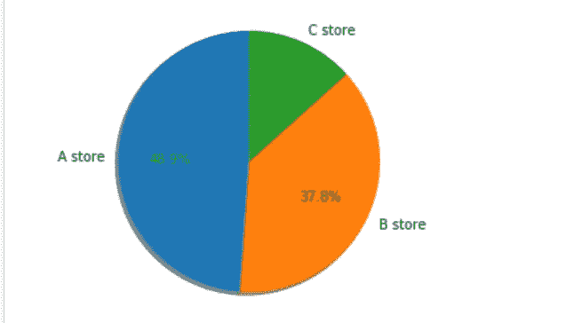

直观表示商店类型的饼图

```
# boxplot for sizes of types of storesstore_type = pd.concat([stores['Type'], stores['Size']], axis=1)
f, ax = plt.subplots(figsize=(8, 6))
fig = sns.boxplot(x='Type', y='Size', data=store_type)
```

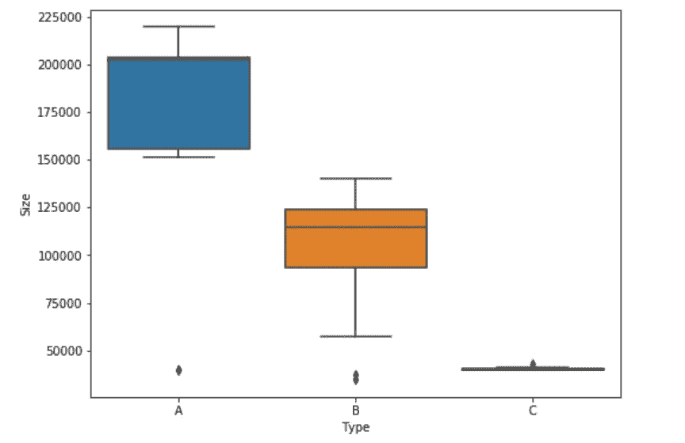

商店类型与规模的箱线图

*   通过箱线图和饼图，我们可以说 A 型商店是最大的商店，C 型商店是最小的
*   A、B 和 c 之间没有大小重叠的区域

不同类型商店的周销售额箱线图:

```
store_sale = pd.concat([stores['Type'], data['Weekly_Sales']], axis=1)
f, ax = plt.subplots(figsize=(8, 6))
fig = sns.boxplot(x='Type', y='Weekly_Sales', data=store_sale, showfliers=False)
```

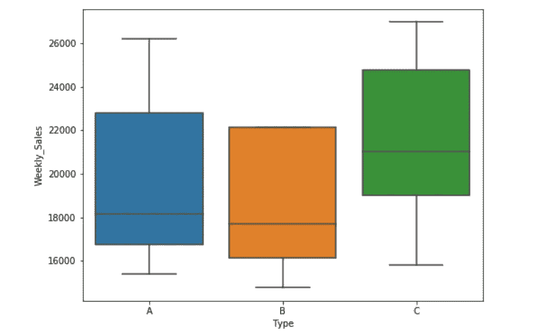

商店类型与每周销售额的箱线图

*   A 的中值最高，C 的中值最低，即商店规模越大，销售额越高

假日销售比非假日销售多一点

```
# total count of sales on holidays and non holidays
print('sales on non-holiday : ',data[data['IsHoliday']==False]['Weekly_Sales'].count().round(1))
print('sales on holiday : ',data[data['IsHoliday']==True]['Weekly_Sales'].count().round(1))
```

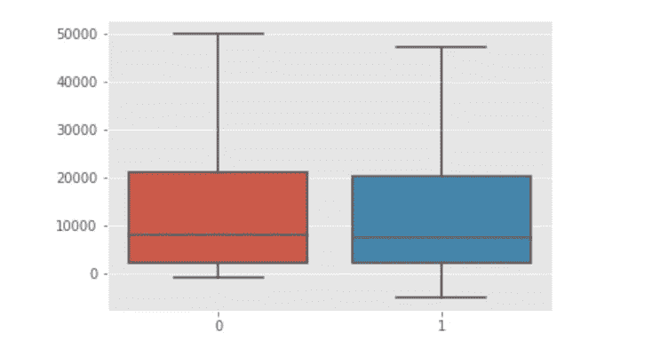

假日/非假日与每周销售额的箱线图

## 特征之间的相关性:

相关性是一种双变量分析，用于衡量两个变量之间的关联强度和关系方向。就关系的强度而言，相关系数的值在+1 和-1 之间变化。

值为 1 表示两个变量之间的完美关联程度。随着相关系数值趋向于 0，两个变量之间的关系将变弱。关系的方向由系数的符号表示；加号表示正相关，减号表示负相关。通常，在统计学中，我们测量四种类型的相关性:皮尔逊相关性、肯德尔等级相关性和斯皮尔曼相关性。下面的图表会给你一个关于相关性的概念。

```
# Plotting correlation between all important features
corr = final_data.corr()
plt.figure(figsize=(15, 10))
sns.heatmap(corr, annot=True)
plt.plot()
```

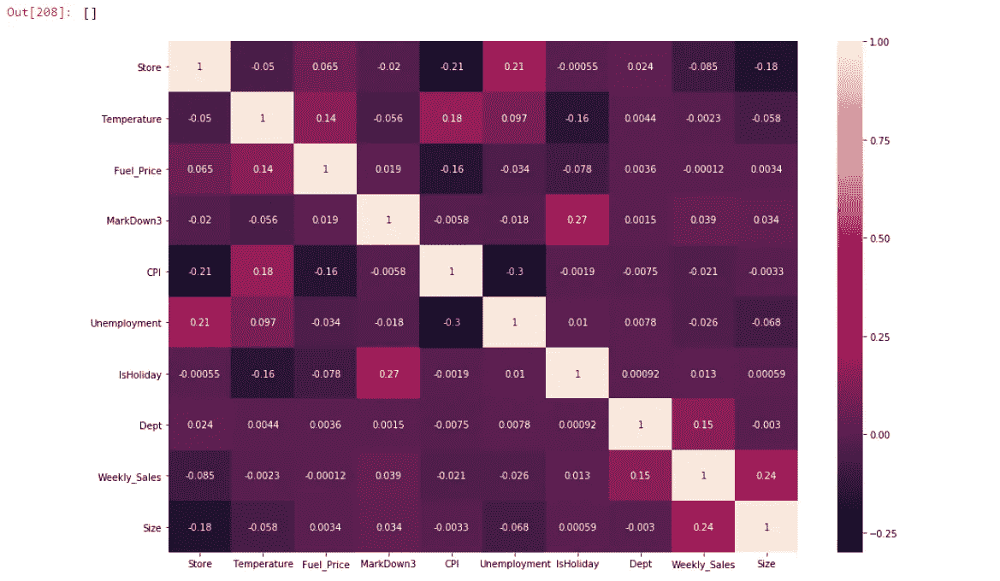

# 将日期拆分为要素

```
# Add column for year
final_data["Year"] = pd.to_datetime(final_data["Date"], format="%Y-%m-%d").dt.year
final_test_data["Year"] = pd.to_datetime(final_test_data["Date"], format="%Y-%m-%d").dt.year# Add column for day
final_data["Day"] = pd.to_datetime(final_data["Date"], format="%Y-%m-%d").dt.day
final_test_data["Day"] = pd.to_datetime(final_test_data["Date"], format="%Y-%m-%d").dt.day# Add column for days to next Christmas
final_data["Days to Next Christmas"] = (pd.to_datetime(final_data["Year"].astype(str)+"-12-31", format="%Y-%m-%d") -
                                   pd.to_datetime(final_data["Date"], format="%Y-%m-%d")).dt.days.astype(int)
final_test_data["Days to Next Christmas"] = (pd.to_datetime(final_test_data["Year"].astype(str) + "-12-31", format="%Y-%m-%d") -
                                   pd.to_datetime(final_test_data["Date"], format="%Y-%m-%d")).dt.days.astype(int)
```

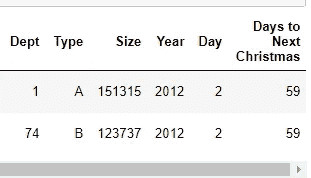

# 将商店类型拆分为分类特征。

因为我们有三种类型的商店(A、B 和 C ),它们是分类的。因此将 wach 类型作为一个特征拆分成一个热码编码

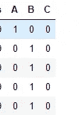

```
tp = pd.get_dummies(X.Type)
X = pd.concat([X, tp], axis=1)
X = X.drop(columns='Type')
```

因此，我们总共有 15 个特征:
-商店
-温度
-燃料价格
- CPI
-失业
-部门
-规模
-假期
-降价 3
-年份
-天数
-临近圣诞节的天数
- A、B、C

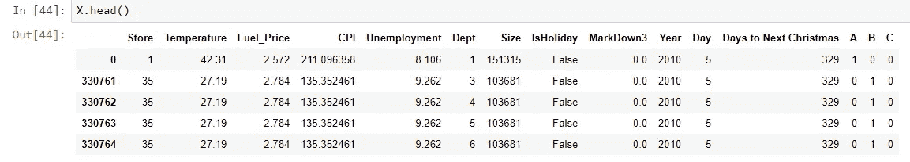

# 构建训练测试集

将最终数据分为训练和测试。我们保留了 80%的训练数据和 20%的测试数据。

```
#train-test split
X_train,X_test,y_train,y_test=train_test_split( X, y, test_size=0.20, random_state=0)
```

在 421570 个特征中，训练数据包括 337256 个特征，测试数据包括 84314 个特征。

# 机器学习模型

我们将使用不同的模型来测试准确性，并将最终训练整个数据来检查与 kaggle 竞争的分数。

标准化训练和测试数据:

```
from sklearn.preprocessing import StandardScaler
sc_X = StandardScaler()
X_train = sc_X.fit_transform(X_train)
X_test = sc_X.transform(X_test)
```

**1) KNN 回归量**

在我遇到的所有机器学习算法中，KNN 无疑是最容易上手的。KNN 可用于分类和回归问题。该算法使用“**特征相似度**来预测任何新数据点的值。这意味着根据新点与训练集中的点的相似程度为其赋值。

```
from sklearn.metrics import mean_absolute_error
from sklearn.neighbors import KNeighborsRegressor
knn = KNeighborsRegressor(n_neighbors=10,n_jobs=4)
knn.fit(X_train,y_train)
y_pred = knn.predict(X_test)
```

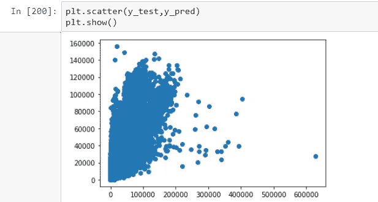

预测值的散点图

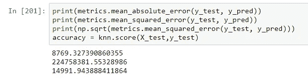

准确度误差为:56.4656386566686

**2)决策树正则器**

决策树以树结构的形式建立回归或分类模型。它将一个数据集分解成越来越小的子集，同时一个相关的决策树被增量开发。最终的结果是一个有**决策节点**和**叶节点**的树。决策节点(例如，Outlook)具有两个或多个分支(例如，晴天、阴天和雨天)，每个分支代表所测试的属性值。叶节点(例如，玩的小时数)代表关于数字目标的决策。对应于称为**根节点**的最佳预测器的树中的最高决策节点。决策树可以处理分类数据和数值数据。

```
from sklearn.tree import DecisionTreeRegressor
dt = DecisionTreeRegressor(random_state=0)
dt.fit(X_train,y_train)
y_pred = dt.predict(X_test)
```

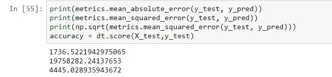

DTR 准确率:96.20101070234142 %

**3)随机森林回归器**

随机森林是一种装袋技术，而不是助推技术。随机森林中的树是并行运行的。它通过在训练时构建大量决策树并输出类来运行，该类是各个树的类(分类)或均值预测(回归)的模式。每个节点上可分割的特征数量被限制为总数的某个百分比(称为超参数)

```
# After Hyper-parameter tunning 
rfr = RandomForestRegressor(n_estimators = 400,max_depth=15,n_jobs=5)        
rfr.fit(X_train,y_train)
y_pred=rfr.predict(X_test)
```

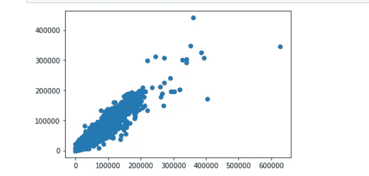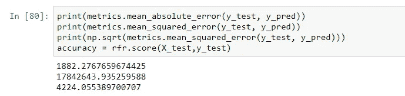

RandomForestRegressor 的准确度:96.768678686887

**4)xgb 回归器**

XGBoost(极限梯度增强)是梯度增强算法的高级实现。XGBRegressor 处理稀疏数据。XGBoost 有一个分布式加权分位数草图算法，可以有效地处理加权数据。为了加快计算速度，XGBoost 可以利用 CPU 上的多个内核。这是可能的，因为其系统设计中的块结构。数据被分类并存储在称为块的内存单元中。超参数是客观的，n 估计量，最大深度，学习率。

```
xgb_clf = XGBRegressor(objective='reg:linear', nthread= 4, n_estimators= 500, max_depth= 6, learning_rate= 0.5) 
xb = xgb_clf.fit(X_train,y_train)
y_pred=xgb_clf.predict(X_test)
```

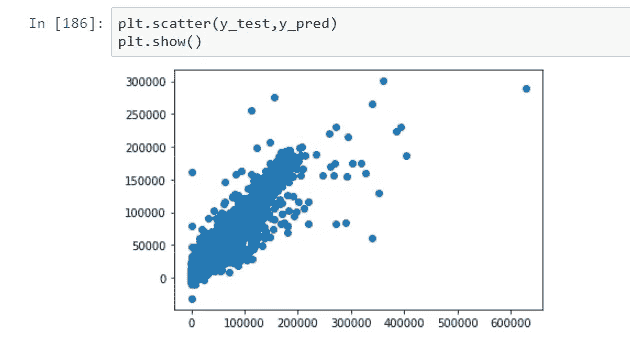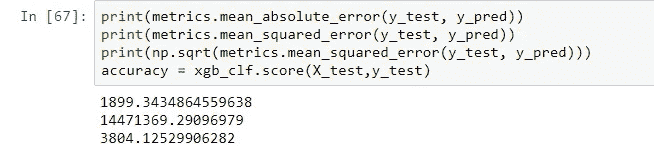

xgb 回归方程的精度:97.2971075%

**4)提取树回归量**

额外树方法(代表 **ext** remely **ra** 随机化**树** s)被提出，其主要目标是在数字输入特征的背景下进一步随机化树构建，其中最佳切割点的选择对诱导树的大部分方差负责。对于随机森林，该方法放弃了使用学习样本的自举副本的想法，并且不是试图在每个节点为 K 个随机选择的特征中的每一个寻找最佳切割点，而是随机选择切割点。

```
from sklearn.ensemble import ExtraTreesRegressor
etr = ExtraTreesRegressor(n_estimators=30,n_jobs=4) 
etr.fit(X_train,y_train)
y_pred=etr.predict(X_test)
```

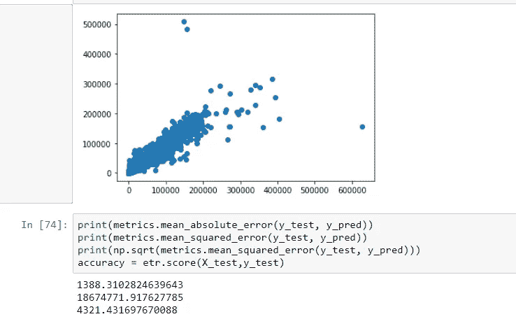

回归方程的准确度:96.8986868686886

**所有车型对比:**

```
from prettytable import PrettyTable

x = PrettyTable()x.field_names = ["Model", "MAE", "RMSE", "Accuracy"]x.add_row(["Linear Regression (Baseline)", 14566, 21767, 8.89])
x.add_row(["KNNRegressor", 8769, 14991, 56.87])
x.add_row(["DecisionTreeRegressor", 2375, 7490, 96.02])
x.add_row(["RandomForestRegressor", 1854, 5785, 96.56])
x.add_row(["ExtraTreeRegressor", 1887, 5684, 96.42])
x.add_row(["XGBRegressor", 2291, 5205,97.23 ])print(x)
```

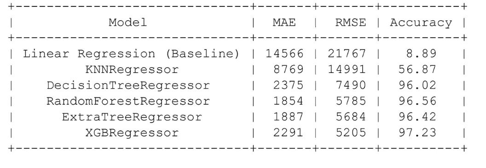

# 获取最佳模型的平均值

诀窍是获得前 n 个最佳模型的平均值。前 n 个模型由它们的精度和 rmse 决定。这里我们选取了 4 个模型，因为它们的准确率都在 95%以上。这些模型是 DecisionTreeRegressor、RandomForestRegressor、XGBRegressor 和 ExtraTreesRegressor。

注意，只拿顶级模特不代表不超配。这可以通过检查 RMSE 或梅来验证。在分类问题的情况下，我们可以使用混淆矩阵。还有，测试精度和训练精度应该不会有太大差别。

```
# training top n models
dt = DecisionTreeRegressor(random_state=0)
etr = ExtraTreesRegressor(n_estimators=30,n_jobs=4) 
xgb_clf = XGBRegressor(objective='reg:linear', nthread= 4, n_estimators= 500, max_depth= 6, learning_rate= 0.5) 
rfr = RandomForestRegressor(n_estimators = 400,max_depth=15,n_jobs=4)dt.fit(X_train,y_train)
etr.fit(X_train,y_train)
xgb_clf.fit(X_train,y_train)
rfr.fit(X_train,y_train)# predicting on test data
etr_pred=etr.predict(X_test)
xgb_clf_pred=xgb_clf.predict(X_test)
rfr_pred=rfr.predict(X_test)
dt_pred = dt.predict(X_test)
```

获取模型的平均值:

```
final = (etr_pred + xgb_clf_pred + rfr_pred + dt_pred)/4.0
```

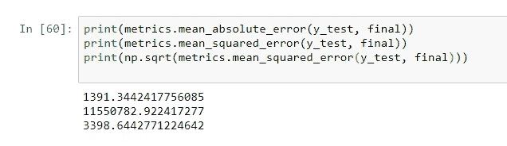

最终模型的预测

# **结论**

这里我们可以看到，与我们表现最好的单一模型(即 RMSE 为 3804 的 XGBRegressor)相比，我们的 RMSE 降低了。因此，我们可以得出结论，取前 n 个模型的平均值有助于减少损失。

由于此处可用数据较少，因此损失差异并不显著。但是在以千兆字节和兆兆字节为单位的大型数据集中，这种简单平均的技巧可以在很大程度上减少损失。

**Kaggle 分数**

现在，在没有将整个数据分割成训练测试的情况下，在相同的数据上训练它，并在 kaggle 提供的未来数据上测试它，得到的分数在 3000 **的范围内，而没有**太多深入的特征工程和严格的超调。


# **未来工作**

*   将日期功能修改为日、月、周。
*   该数据集包括特殊场合，如圣诞节、圣诞节前、黑色星期五、劳动节等。在这些日子里，人们往往比平时购物更多。因此，将这些作为一个特征添加到数据中也将在很大程度上提高准确性。
*   此外，在训练数据和测试数据之间存在一个缺失值差距，这两个数据具有两个特征，即 CPI 和失业。如果该差距减小，那么性能也可以提高。

**参考文献:**

[](https://www.kaggle.com/c/walmart-recruiting-store-sales-forecasting/discussion/8055#latest-209789) [## 沃尔玛招聘-商店销售预测

### 下载数千个项目的开放数据集+在一个平台上共享项目。探索热门话题，如政府…

www.kaggle.com](https://www.kaggle.com/c/walmart-recruiting-store-sales-forecasting/discussion/8055#latest-209789) 

**感谢您的关注和阅读我的作品**

如果你喜欢这个故事，与你的朋友和同事分享吧！

另外，**请在**关注我

 [## 瓦霍迪亚宇宙技术与管理研究所。

### 查看 Aditya Bhosle 在世界上最大的职业社区 LinkedIn 上的个人资料。Aditya 的教育列在…

www.linkedin.com](https://www.linkedin.com/in/aditya-bhosle-07b0a9146)