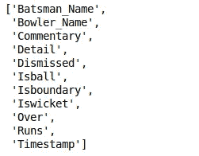

# 想要建立机器学习管道？PySpark 的快速介绍

> 原文：<https://medium.com/analytics-vidhya/want-to-build-machine-learning-pipelines-a-quick-introduction-using-pyspark-ede288927ce3?source=collection_archive---------15----------------------->

花点时间思考一下这个问题——一名有抱负的数据科学家需要具备哪些技能才能获得行业职位？

一个[机器学习](https://courses.analyticsvidhya.com/courses/applied-machine-learning-beginner-to-professional?utm_source=blog&utm_medium=build-machine-learning-pipelines-pyspark)项目有许多移动的组件，在我们成功执行它之前，需要将它们捆绑在一起。知道如何建立端到端机器学习管道的能力是一项宝贵的资产。作为一名数据科学家(有志或已确立)，你应该知道这些机器学习管道是如何工作的。

简单地说，这是两个学科的融合——数据科学和软件工程。对于数据科学家来说，这两者密不可分。这不仅仅是关于构建模型——我们需要拥有构建企业级系统的软件技能。


因此，在本文中，我们将重点关注使用 PySpark 构建这些机器学习管道背后的基本思想。这是一篇实践文章，所以启动您最喜欢的 Python IDE，让我们开始吧！

# 在火花数据帧上执行基本操作

任何数据科学项目中必不可少的(也是第一步)是在构建任何[机器学习](https://courses.analyticsvidhya.com/courses/applied-machine-learning-beginner-to-professional?utm_source=blog&utm_medium=build-machine-learning-pipelines-pyspark)模型之前理解数据。大多数数据科学的追求者都会在这里遇到困难，他们只是没有花足够的时间去理解他们正在从事的工作。有一种冲进去建立模型的趋势——这是你*必须*避免的谬误。

我们将在本文中遵循这一原则。我将始终遵循结构化的方法，以确保我们不会错过任何关键步骤。

首先，让我们花点时间，理解一下我们将要用到的每个变量。我们将使用最近结束的[印度对孟加拉国板球比赛](https://drive.google.com/file/d/1wUcLfGZ2HxvJNstZwM1e2CeNDTrJLy9b/view?usp=sharing)的数据集。让我们看看数据集中的不同变量:

*   **击球手:**唯一击球手 id(整数)
*   **击球手姓名:**击球手的姓名(字符串)
*   **保龄球员:**唯一保龄球员 id(整数)
*   **投球手姓名:**投球手的姓名(字符串)
*   **注释:**广播事件的描述(字符串)
*   **Detail:** 描述事件的另一个字符串，如 wickets 和 extra deliveries (String)
*   被解雇:被解雇的击球手的唯一 Id(字符串)
*   **Id:** 唯一的行 Id(字符串)
*   **Isball:** 交货是否合法(布尔型)
*   **Isboundary:** 击球手是否触界(二进制)
*   击球手是否出局(二进制)
*   **过:**过数(双)
*   **运行:**对特定交货运行(整数)
*   **时间戳:**记录数据的时间(时间戳)

我们开始吧，好吗？

# 读取 CSV 文件

当我们给 Spark 加电时， **SparkSession** 变量以“ **spark** ”的名称适当地可用。我们可以用这个来读取多种类型的文件，比如 CSV，JSON，TEXT 等。这使我们能够将数据保存为 Spark 数据帧。

默认情况下，它将所有列的数据类型视为字符串。您可以使用**数据帧:**上的 **printSchema** 功能检查数据类型

```
# read a csv file
my_data = spark.read.csv('ind-ban-comment.csv',header=True)# see the default schema of the dataframe
my_data.printSchema()
```


# 定义模式

现在，我们不希望数据集中的所有列都被视为字符串。那么我们能做些什么呢？

我们可以在 Spark 中为我们的数据框架定义自定义模式。为此，我们需要创建一个 **StructType** 的对象，它接受一个 **StructField** 的列表。当然，我们应该用列名、列的数据类型以及特定列是否允许空值来定义 **StructField** 。

请参考下面的代码片段，了解如何创建此自定义模式:

```
import pyspark.sql.types as tp# define the schema
my_schema = tp.StructType([
    tp.StructField(name= 'Batsman',      dataType= tp.IntegerType(),   nullable= True),
    tp.StructField(name= 'Batsman_Name', dataType= tp.StringType(),    nullable= True),
    tp.StructField(name= 'Bowler',       dataType= tp.IntegerType(),   nullable= True),
    tp.StructField(name= 'Bowler_Name',  dataType= tp.StringType(),    nullable= True),
    tp.StructField(name= 'Commentary',   dataType= tp.StringType(),    nullable= True),
    tp.StructField(name= 'Detail',       dataType= tp.StringType(),    nullable= True),
    tp.StructField(name= 'Dismissed',    dataType= tp.IntegerType(),   nullable= True),
    tp.StructField(name= 'Id',           dataType= tp.IntegerType(),   nullable= True),
    tp.StructField(name= 'Isball',       dataType= tp.BooleanType(),   nullable= True),
    tp.StructField(name= 'Isboundary',   dataType= tp.BinaryType(),   nullable= True),
    tp.StructField(name= 'Iswicket',     dataType= tp.BinaryType(),   nullable= True),
    tp.StructField(name= 'Over',         dataType= tp.DoubleType(),    nullable= True),
    tp.StructField(name= 'Runs',         dataType= tp.IntegerType(),   nullable= True),
    tp.StructField(name= 'Timestamp',    dataType= tp.TimestampType(), nullable= True)    
])# read the data again with the defined schema
my_data = spark.read.csv('ind-ban-comment.csv',schema= my_schema,header= True)# 
my_data.printSchema()
```


# 从数据中删除列

在任何机器学习项目中，我们总会有一些解决问题不需要的列。我相信你以前也遇到过这种困境，无论是在行业内还是在在线黑客马拉松上。

在我们的实例中，我们可以使用 drop 函数从数据中删除该列。使用列表前的**星号(*)** 从数据集中删除多个列:

```
# drop the columns that are not required
my_data = my_data.drop(*['Batsman', 'Bowler', 'Id'])
my_data.columns
```



# 检查数据维度

与 Pandas 不同，Spark 数据帧没有 shape 函数来检查数据的维度。我们可以使用下面的代码来检查数据集的维度:

```
# get the dimensions of the data
(my_data.count() , len(my_data.columns))
# >> (605, 11)
```

# 描述数据

Spark 的 **describe** 函数为我们提供了大多数统计结果，如平均值、计数、最小值、最大值和标准偏差。您也可以使用 **summary** 函数获得数值变量的四分位数:

```
# get the summary of the numerical columns
my_data.select('Isball', 'Isboundary', 'Runs').describe().show()
```


# 缺失值计数

我们很少得到没有任何缺失值的数据集。你还记得上次发生这种事是什么时候吗？

检查所有列中缺失值的数量非常重要。了解计数有助于我们在使用该数据构建任何[机器学习模型](https://www.analyticsvidhya.com/blog/2017/09/common-machine-learning-algorithms/?utm_source=blog&utm_medium=build-machine-learning-pipelines-pyspark)之前处理缺失值。

因此，您可以使用下面的代码来查找数据集中的空值计数:

```
# import sql function pyspark
import pyspark.sql.functions as f# null values in each column
data_agg = my_data.agg(*[f.count(f.when(f.isnull(c), c)).alias(c) for c in my_data.columns])
data_agg.show()
```


# 列的值计数

与熊猫不同，我们在 Spark 数据帧中没有 *value_counts()* 函数。您可以使用 **groupBy** 函数计算分类变量的唯一值计数:

```
# value counts of Batsman_Name column
my_data.groupBy('Batsman_Name').count().show()
```


# 使用 PySpark 编码分类变量

大多数机器学习算法只接受数字形式的数据。因此，[将数据集中出现的任何分类变量](https://www.analyticsvidhya.com/blog/2015/11/easy-methods-deal-categorical-variables-predictive-modeling/?utm_source=blog&utm_medium=build-machine-learning-pipelines-pyspark)转换成数字是至关重要的。

请记住，我们不能简单地将它们从数据集中删除，因为它们可能包含有用的信息。仅仅因为我们不想知道如何使用它们而失去它将是一场噩梦！

让我们看看使用 PySpark 编码分类变量的一些方法。

# 字符串索引

字符串索引类似于[标签编码](https://www.analyticsvidhya.com/blog/2015/11/easy-methods-deal-categorical-variables-predictive-modeling/?utm_source=blog&utm_medium=build-machine-learning-pipelines-pyspark)。它为每个类别分配一个唯一的整数值。0 被分配给最频繁的类别，1 被分配给下一个最频繁的值，依此类推。我们必须定义我们想要索引的输入列名和我们想要结果的输出列名:

```
from pyspark.ml.feature import StringIndexer, OneHotEncoderEstimator# create object of StringIndexer class and specify input and output column
SI_batsman = StringIndexer(inputCol='Batsman_Name',outputCol='Batsman_Index')
SI_bowler = StringIndexer(inputCol='Bowler_Name',outputCol='Bowler_Index')# transform the data
my_data = SI_batsman.fit(my_data).transform(my_data)
my_data = SI_bowler.fit(my_data).transform(my_data)# view the transformed data
my_data.select('Batsman_Name', 'Batsman_Index', 'Bowler_Name', 'Bowler_Index').show(10)
```


# 一键编码

一键编码是每个数据科学家都应该知道的概念。在处理缺失值时，我多次依赖于它。真是救命恩人！

这里有一个警告——Spark 的 *OneHotEncoder* 不直接编码分类变量。

> *首先，我们需要使用字符串索引器将变量转换成数字形式，然后使用****OneHotEncoderEstimator****对数据集的多列进行编码。*

它为每一行创建一个稀疏向量:

```
# create object and specify input and output column
OHE = OneHotEncoderEstimator(inputCols=['Batsman_Index', 'Bowler_Index'],outputCols=['Batsman_OHE', 'Bowler_OHE'])# transform the data
my_data = OHE.fit(my_data).transform(my_data)# view and transform the data
my_data.select('Batsman_Name', 'Batsman_Index', 'Batsman_OHE', 'Bowler_Name', 'Bowler_Index', 'Bowler_OHE').show(10)
```


# 向量汇编程序

> 向量组装器将给定的列列表组合成一个向量列。

这通常在数据探索和预处理步骤的最后使用。在这个阶段，我们通常使用一些原始或转换的特征来训练我们的模型。

**向量组装器将它们转换成单个特征列，以便训练机器学习模型**(例如[逻辑回归](https://www.analyticsvidhya.com/blog/2015/11/beginners-guide-on-logistic-regression-in-r/?utm_source=blog&utm_medium=build-machine-learning-pipelines-pyspark))。它接受数字、布尔和向量类型的列:

```
from pyspark.ml.feature import VectorAssembler# specify the input and output columns of the vector assembler
assembler = VectorAssembler(inputCols=['Isboundary',
                                       'Iswicket',
                                       'Over',
                                       'Runs',
                                       'Batsman_Index',
                                       'Bowler_Index',
                                       'Batsman_OHE',
                                       'Bowler_OHE'],
                           outputCol='vector')# fill the null values
my_data = my_data.fillna(0)# transform the data
final_data = assembler.transform(my_data)# view the transformed vector
final_data.select('vector').show()
```


# 使用 PySpark 构建机器学习管道

机器学习项目通常包括数据预处理、特征提取、模型拟合和结果评估等步骤。我们需要按顺序对数据执行大量转换。可以想象，跟踪它们可能会成为一项乏味的任务。

这就是机器学习管道的用武之地。

> *管道允许我们维护所有相关转换的数据流，这些转换是达到最终结果所必需的。*

我们需要定义作为 Spark 运行的命令链的管道阶段。这里，**每一级要么是变换器，要么是估计器。**

# 变压器和估算器

顾名思义， [Transformers](https://spark.apache.org/docs/latest/ml-pipeline.html#pipeline-components) 通过更新特定列的当前值(比如将分类列转换为数值)或者使用定义的逻辑将其映射到其他值，将一个数据帧转换为另一个数据帧。

估计器在数据帧上实现 *fit()* 方法，并生成模型。例如， *LogisticRegression* 是我们调用 *fit()* 方法时训练分类模型的估计器。

让我们借助一些例子来理解这一点。

# 管道示例

让我们创建一个包含三列的示例数据框架，如下所示。在这里，我们将定义我们希望转换数据的一些阶段，并了解如何设置管道:

```
from pyspark.ml import Pipeline# create a sample dataframe
sample_df = spark.createDataFrame([
    (1, 'L101', 'R'),
    (2, 'L201', 'C'),
    (3, 'D111', 'R'),
    (4, 'F210', 'R'),
    (5, 'D110', 'C')
], ['id', 'category_1', 'category_2'])sample_df.show()
```


我们已经创建了数据框架。假设我们必须按以下顺序转换数据:

*   stage_1:标签编码或字符串索引列 *category_1*
*   stage_2:标签编码或字符串索引列 *category_2*
*   stage_3:对索引列进行一次热编码 *category_2*


在每个阶段，我们将传递输入和输出列名，并通过传递在**管道**对象列表中定义的阶段来设置管道。

然后，管道模型按顺序一个接一个地执行某些步骤，并给出最终结果。让我们看看如何实现管道:

```
# define stage 1 : transform the column category_1 to numeric
stage_1 = StringIndexer(inputCol= 'category_1', outputCol= 'category_1_index')
# define stage 2 : transform the column category_2 to numeric
stage_2 = StringIndexer(inputCol= 'category_2', outputCol= 'category_2_index')
# define stage 3 : one hot encode the numeric category_2 column
stage_3 = OneHotEncoderEstimator(inputCols=['category_2_index'], outputCols=['category_2_OHE'])# setup the pipeline
pipeline = Pipeline(stages=[stage_1, stage_2, stage_3])# fit the pipeline model and transform the data as defined
pipeline_model = pipeline.fit(sample_df)
sample_df_updated = pipeline_model.transform(sample_df)# view the transformed data
sample_df_updated.show()
```


现在，让我们举一个建立管道的更复杂的例子。在这里，我们将对数据进行转换，并构建一个逻辑回归模型。

为此，我们将创建一个样本数据帧，它将成为我们的训练数据集，具有四个特征和目标标签:

```
from pyspark.ml.classification import LogisticRegression# create a sample dataframe with 4 features and 1 label column
sample_data_train = spark.createDataFrame([
    (2.0, 'A', 'S10', 40, 1.0),
    (1.0, 'X', 'E10', 25, 1.0),
    (4.0, 'X', 'S20', 10, 0.0),
    (3.0, 'Z', 'S10', 20, 0.0),
    (4.0, 'A', 'E10', 30, 1.0),
    (2.0, 'Z', 'S10', 40, 0.0),
    (5.0, 'X', 'D10', 10, 1.0),
], ['feature_1', 'feature_2', 'feature_3', 'feature_4', 'label'])# view the data
sample_data_train.show()
```


现在，假设我们的管道顺序如下:

*   stage_1:标签编码或字符串索引列 *feature_2*
*   stage_2:对列进行标签编码或字符串索引 *feature_3*
*   stage_3:对 *feature_2* 和 *feature_3* 的索引列进行一次热编码
*   阶段 4:创建训练逻辑回归模型所需的所有特征的向量
*   阶段 5:建立逻辑回归模型


我们必须通过提供输入列名和输出列名来定义阶段。最后一步是建立逻辑回归模型。最后，当我们在训练数据集上运行管道时，它将按顺序运行步骤，并向数据帧添加新列(如 rawPrediction、probability 和 Prediction)。

```
# define stage 1: transform the column feature_2 to numeric
stage_1 = StringIndexer(inputCol= 'feature_2', outputCol= 'feature_2_index')
# define stage 2: transform the column feature_3 to numeric
stage_2 = StringIndexer(inputCol= 'feature_3', outputCol= 'feature_3_index')
# define stage 3: one hot encode the numeric versions of feature 2 and 3 generated from stage 1 and stage 2
stage_3 = OneHotEncoderEstimator(inputCols=[stage_1.getOutputCol(), stage_2.getOutputCol()], 
                                 outputCols= ['feature_2_encoded', 'feature_3_encoded'])
# define stage 4: create a vector of all the features required to train the logistic regression model 
stage_4 = VectorAssembler(inputCols=['feature_1', 'feature_2_encoded', 'feature_3_encoded', 'feature_4'],
                          outputCol='features')
# define stage 5: logistic regression model                          
stage_5 = LogisticRegression(featuresCol='features',labelCol='label')# setup the pipeline
regression_pipeline = Pipeline(stages= [stage_1, stage_2, stage_3, stage_4, stage_5])# fit the pipeline for the trainind data
model = regression_pipeline.fit(sample_data_train)
# transform the data
sample_data_train = model.transform(sample_data_train)# view some of the columns generated
sample_data_train.select('features', 'label', 'rawPrediction', 'probability', 'prediction').show()
```


恭喜你。我们已经成功地建立了管道。让我们创建一个没有标签的样本测试数据集，这一次，我们不需要再次定义所有的步骤。我们只要通过管道传递数据，就大功告成了！

```
# create a sample data without the labels
sample_data_test = spark.createDataFrame([
    (3.0, 'Z', 'S10', 40),
    (1.0, 'X', 'E10', 20),
    (4.0, 'A', 'S20', 10),
    (3.0, 'A', 'S10', 20),
    (4.0, 'X', 'D10', 30),
    (1.0, 'Z', 'E10', 20),
    (4.0, 'A', 'S10', 30),
], ['feature_1', 'feature_2', 'feature_3', 'feature_4'])# transform the data using the pipeline
sample_data_test = model.transform(sample_data_test)# see the prediction on the test data
sample_data_test.select('features', 'rawPrediction', 'probability', 'prediction').show()
```


完美！

这是一篇关于如何使用 PySpark 构建机器学习管道的简短但直观的文章。我将再次重申这一点，因为它非常重要——你需要知道这些管道是如何工作的。这是您作为数据科学家的重要职责。

你以前做过端到端的机器学习项目吗？或者是在工业环境下建造这些管道的团队的一员？下面在评论区连线，一起讨论吧。

我们将在 PySpark 初学者系列的下一篇文章中再见。快乐学习！

*原载于 2019 年 11 月 19 日*[*https://www.analyticsvidhya.com*](https://www.analyticsvidhya.com/blog/2019/11/build-machine-learning-pipelines-pyspark/?utm_source=av&utm_medium=feed-articles&utm_campaign=feed)*。*