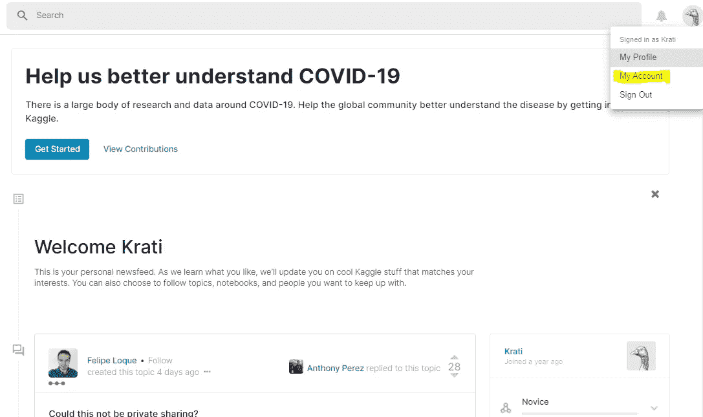
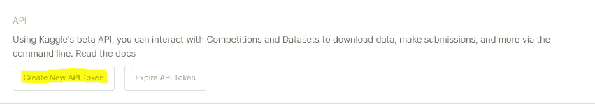
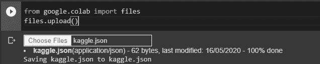

# 想直接访问 Google Colab 的 Kaggle 数据集吗？

> 原文：<https://medium.com/analytics-vidhya/want-to-directly-access-kaggle-datasets-to-google-colab-d71237b82b3e?source=collection_archive---------16----------------------->


大多数数据科学初学者都是从使用 Kaggle 数据集和 Google Colab 开始他们的旅程的。然而，当涉及到直接从 Google Colab 访问 Kaggle 数据时，许多人仍然对此一无所知。本文将帮助您直接在 Google Colab 中访问 Kaggle 数据，而无需从外部下载。

要访问 Google Colab 笔记本中的 Kaggle 数据，请遵循五个简单的步骤。

# 第一步

首先，我们需要在 Google Colab shell 中运行下面的命令。

```
! pip install -q kaggle
```

这将安装 Kaggle chi，这是一个帮助我们直接从命令行下载数据集的工具。

# 第二步

用你的 Kaggle 账户登录，点击账户页面，现在点击创建一个新的 API 令牌选项；这将自动下载一个“ **kaggle.json** ”文件。



# 第三步

现在回到您的 Colab 笔记本，在新的 shell 中编写下面给出的命令并运行 shell，这将生成选择文件选项，在此上传“kaggle.json”。

```
from google.colab import files
files.upload()
```



# 第四步

现在添加另一个 shell，添加下面的代码并运行该 shell；一个 zip 文件将被下载到当前的 Google Colab 数据目录中。

```
! mkdir ~/.kaggle
! cp kaggle.json ~/.kaggle/
! chmod 600 ~/.kaggle/kaggle.json
! kaggle datasets download -d **dataset filename**
```

# 第五步

为了解压压缩文件，我们需要在新的 shell 中编写下面的命令并运行它。

```
import zipfile
local_zip = “**dataset filename**.zip”zip_ref = zipfile.ZipFile(local_zip, ‘r’)
zip_ref.extractall(‘./database’)
zip_ref.close()
```

万岁！，我们准备使用 Google Colab 笔记本中的 Kaggle 数据集。