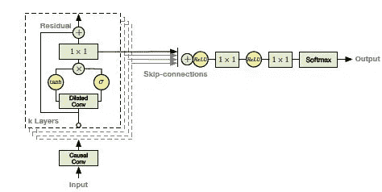

# 想要使用深度学习生成自己的音乐吗？这里有一个这样做的指南！

> 原文：<https://medium.com/analytics-vidhya/want-to-generate-your-own-music-using-deep-learning-heres-a-guide-to-do-just-that-dd35d6ddcd01?source=collection_archive---------21----------------------->

# 概观

*   了解如何开发用于自动音乐生成的端到端模型
*   了解 WaveNet 架构，并使用 Keras 从头开始实现它
*   比较 WaveNet 与长短期记忆在建立自动音乐生成模型中的性能

# 介绍

> 如果我不是物理学家，我可能会成为音乐家。我经常在音乐中思考。我在音乐中实现我的白日梦。我从音乐的角度看待我的生活——阿尔伯特·爱因斯坦

我可能不是爱因斯坦先生那样的物理学家，但我完全同意他对音乐的看法！我不记得有哪一天不打开我的音乐播放器。我往返办公室的旅途伴随着音乐，老实说，它帮助我专注于我的工作。

我一直梦想创作音乐，但不太懂乐器。直到我遇到了[深度学习](https://courses.analyticsvidhya.com/courses/computer-vision-using-deep-learning-version2?utm_source=blog&utm_medium=how-to-perform-automatic-music-generation)。使用某些技术和框架，我能够在不真正了解任何音乐理论的情况下创作自己的原创乐谱！

这是我最喜欢的专业项目之一。我把我的两个爱好音乐和深度学习结合起来，创造了一个自动音乐生成模型。这是梦想成真！


我很高兴能与你分享我的方法，包括让你生成自己的音乐的全部代码！我们将首先快速理解自动音乐生成的概念，然后再深入研究我们可以用来执行此操作的不同方法。最后，我们将启动 Python 并设计我们自己的自动音乐生成模型。

# 目录

1.  什么是自动音乐生成？
2.  音乐的构成要素是什么？
3.  不同的音乐创作方法
    -使用 WaveNet 架构
    -使用长短期记忆(LSTM)
4.  实现—使用 Python 自动作曲

# 什么是自动音乐生成？

> 音乐是一门艺术，也是一种通用语言

我把音乐定义为不同频率音调的集合。因此，自动音乐生成是一个在最少人工干预下创作一小段音乐的过程。


创作音乐最简单的形式是什么？

这一切都是从随机选择声音并将它们组合成一段音乐开始的。1787 年，莫扎特为这些随机的声音选择提出了一个**骰子游戏**。他手动作曲将近 272 个音！然后，他根据两个骰子的和选择了一个音调。


另一个有趣的想法是利用音乐语法来创作音乐。

> 音乐语法包含了音乐声音的合理安排和组合以及音乐作品的正确演奏所必需的知识
> ——音乐语法基础

20 世纪 50 年代初，亚尼斯·克塞纳基斯使用[统计和](https://courses.analyticsvidhya.com/courses/introduction-to-data-science-2?utm_source=blog&utm_medium=how-to-perform-automatic-music-generation)的概念创作音乐——俗称**随机音乐**。他将音乐定义为偶然出现的元素(或声音)的序列。因此，他用随机理论将其公式化。他对元素的随机选择严格依赖于数学概念。

最近，深度学习架构已经成为自动音乐生成的艺术状态。在本文中，我将讨论使用 WaveNet 和 LSTM(长短期记忆)架构的两种不同的自动音乐创作方法。

*注意:本文要求对一些深度学习概念有基本的理解。我推荐浏览下面的文章:*

*   [从头开始学习卷积神经网络(CNN)的综合教程](https://www.analyticsvidhya.com/blog/2018/12/guide-convolutional-neural-network-cnn/?utm_source=blog&utm_medium=how-to-perform-automatic-music-generation)
*   [深度学习精要:长短期记忆介绍(LSTM)](https://www.analyticsvidhya.com/blog/2017/12/fundamentals-of-deep-learning-introduction-to-lstm/?utm_source=blog&utm_medium=how-to-perform-automatic-music-generation)
*   [学习序列建模必读教程](https://www.analyticsvidhya.com/blog/2019/01/sequence-models-deeplearning/?utm_source=blog&utm_medium=how-to-perform-automatic-music-generation)

# 音乐的构成要素是什么？

音乐本质上是由音符和和弦组成的。让我从钢琴乐器的角度来解释这些术语:

*   **音符**:单键发出的声音称为音符
*   **和弦**:两个或两个以上的键同时发出的声音称为和弦。一般来说，大多数和弦至少包含三个关键音
*   **八度**:一个重复的模式称为一个八度。每个八度音阶包含 7 个白键和 5 个黑键


钢琴

# 自动音乐生成的不同方法

我将详细讨论两种基于深度学习的自动生成音乐的架构——wave net 和 LSTM。但是，为什么只有深度学习架构？

深度学习是受神经结构启发的机器学习领域。这些网络从数据集中自动提取特征，并且能够学习任何非线性函数。这就是为什么神经网络被称为**通用函数逼近器**的原因。

因此，深度学习模型是各个领域的最先进技术，如[自然语言处理(NLP)](https://courses.analyticsvidhya.com/courses/natural-language-processing-nlp?utm_source=blog&utm_medium=how-to-perform-automatic-music-generation) 、[计算机视觉](https://courses.analyticsvidhya.com/courses/computer-vision-using-deep-learning-version2?utm_source=blog&utm_medium=how-to-perform-automatic-music-generation)、语音合成等等。让我们看看如何为音乐创作建立这些模型。

# 方法 1:使用 WaveNet

> *WaveNet 是 Google DeepMind 开发的基于深度学习的原始音频生成模型。*

WaveNet 的主要目标是从数据的原始分布中生成新的样本。因此，它被称为生成模型。

> *Wavenet 就像是来自 NLP 的语言模型。*

在[语言模型](https://www.analyticsvidhya.com/blog/2019/08/comprehensive-guide-language-model-nlp-python-code/?utm_source=blog&utm_medium=how-to-perform-automatic-music-generation)中，给定一个单词序列，模型试图预测下一个单词:


与语言模型类似，在 WaveNet 中，给定一个样本序列，它会尝试预测下一个样本。

# 方法 2:使用长短期记忆(LSTM)模型

[长短期记忆模型](https://www.analyticsvidhya.com/blog/2017/12/fundamentals-of-deep-learning-introduction-to-lstm/?utm_source=blog&utm_medium=how-to-perform-automatic-music-generation)，俗称 LSTM，是[递归神经网络](https://www.analyticsvidhya.com/blog/2017/12/introduction-to-recurrent-neural-networks/?utm_source=blog&utm_medium=how-to-perform-automatic-music-generation)的变体，能够捕捉输入序列中的长期依赖性。LSTM 在序列到序列建模任务中有广泛的应用，如语音识别、文本摘要、视频分类等。


让我们详细讨论如何使用这两种方法来训练我们的模型。

# Wavenet:培训阶段

> *这是一个多对一的问题，输入是一个幅度值序列，输出是后续值。*

让我们看看如何准备输入和输出序列。

**波网输入:**

WaveNet 将原始音频波的块作为输入。原始音频波是指时间序列域中的波的表示。

在时间序列域中，声波以不同时间间隔记录的振幅值的形式表示:


**波网输出:**

给定振幅值的序列，WaveNet 试图预测连续的振幅值。

让我们借助一个例子来理解这一点。考虑一个 5 秒钟的音频波，采样率为 16，000(即每秒 16，000 个样本)。现在，我们有 80，000 个样本在 5 秒钟内以不同的间隔记录下来。让我们将音频分成大小相等的块，比如 1024(这是一个超参数)。

下图说明了模型的输入和输出序列:


前 3 个词块的输入和输出

我们可以按照类似的程序处理其余的块。

我们可以从上面推断出，每个块的输出仅取决于过去的信息(即，先前的时间步长)，而不取决于未来的时间步长。因此，这个任务被称为**自回归任务**，这个模型被称为**自回归模型**。

# 推理阶段

在推理阶段，我们将尝试生成新的样本。让我们看看如何做到这一点:

1.  选择样本值的随机数组作为建模的起点
2.  现在，模型输出所有样本的概率分布
3.  选择概率最大的值，并将其追加到样本数组中
4.  删除第一个元素，并作为输入传递给下一次迭代
5.  重复步骤 2 和 4 一定次数的迭代

# 了解 WaveNet 架构

WaveNet 的构建模块是**因果扩张 1D 卷积层**。让我们先了解一下相关概念的重要性。

**为什么和什么是卷积？**

> *使用卷积的主要原因之一是从输入中提取特征。*

例如，在图像处理的情况下，用滤波器卷积图像给我们一个特征图。


与图像卷积后提取的特征

**卷积是一种结合两个函数的数学运算。**在图像处理的情况下，卷积是图像的某些部分与内核的线性组合。

您可以浏览以下文章，了解有关卷积的更多信息:

[*去神秘化的卷积神经网络架构*](https://www.analyticsvidhya.com/blog/2017/06/architecture-of-convolutional-neural-networks-simplified-demystified/?utm_source=blog&utm_medium=how-to-perform-automatic-music-generation)


卷积 2D

**什么是 1D 卷积？**

1D 卷积的目的类似于长短期记忆模型。它被用来解决与 LSTM 类似的任务。在 1D 卷积中，内核或滤波器仅沿一个方向移动:


Conv1D

卷积的输出取决于内核的大小、输入形状、填充类型和步幅。现在，我将带您了解不同类型的填充，以理解使用扩张因果 1D 卷积层的重要性。

当我们设置填充**有效**时，输入和输出序列长度不同。输出的长度小于输入的长度:


Conv1D with padding="valid "

当我们将填充符设置为 **same** 时，在输入序列的两边填充零，以使输入和输出的长度相等:


Conv1D with padding="same "

**1D 卷积的优点:**

*   捕获输入序列中的顺序信息
*   与 GRU 或 LSTM 相比，训练速度要快得多，因为没有经常性的联系

**1D 卷积的缺点:**

*   当 padding 设置为 **same** 时，时间步长 **t** 的输出也与先前的 **t-1** 和未来的时间步长 **t+1** 卷积。因此，它违反了自回归原理
*   当 padding 设置为 **valid** 时，输入和输出序列的长度会发生变化，这是计算剩余连接所需的长度(将在后面介绍)

这为因果卷积扫清了道路。

***注:*** 我这里说的*利弊都是针对这个问题的。*

**什么是 1D 因果卷积？**

> *这被定义为卷积，其中在时间* ***t*** *的输出仅与来自时间* ***t*** *和先前层中的元素进行卷积。*

简单来说，正常卷积和因果卷积的区别仅在于填充。在因果卷积中，零被添加到输入序列的左侧，以保持自回归原理:


因果卷积 1D

**因果 1D 卷积的利弊:**

1.因果卷积不考虑未来时间步长，而未来时间步长是构建生成模型的标准

**因果 1D 卷积的弊端:**

1.  因果卷积不能追溯到过去或序列中较早发生的时间步长。因此，因果卷积具有非常低的感受野。网络的感受域是指影响输出的输入数量:


因果关系

正如您在这里看到的，输出仅受 5 个输入的影响。因此，网络的感受野是 5，这是非常低的。网络的感受域也可以通过增加大尺寸的核来增加，但是要记住计算复杂度会增加。

这让我们想到了可怕的膨胀 1D 因果卷积的概念。

**什么是扩张型 1D 因果卷积？**

> *在核的值之间具有空洞或空间的因果 1D 卷积层被称为扩张 1D 卷积。*

要添加的空间数量由膨胀率给出。它定义了网络的接收域。大小为 **k** 且膨胀率为 **d** 的内核在内核 **k** 的每个值之间有 **d-1** 个洞。


扩张因果卷积 2D

正如您在这里所看到的，在 7 * 7 的输入上以 2 的膨胀率卷积 3 * 3 的核得到 5 * 5 的接收场。

**扩张 1D 因果卷积的利弊:**

1.  扩张的 1D 卷积网络通过指数增加每个隐藏层的扩张率来增加感受野:


扩张 1D 因果卷积

正如您在这里看到的，输出受到所有输入的影响。因此，网络的感受野是 16。

**波网残差块:**

构建块包含残差和跳过连接，添加这些连接只是为了加速模型的收敛:



波网剩余块

**wave net 的工作流程:**

*   输入被送入因果 1D 卷积
*   然后，输出被送入两个不同的膨胀 1D 卷积层，分别激活**s 形**和 **tanh**
*   2 个不同激活值的逐元素乘法导致跳过连接
*   并且跳过连接和因果 1D 输出的逐元素相加产生残差

# 长短期记忆(LSTM)方法

另一种自动音乐生成的方法是基于长短期记忆(LSTM)模型。输入和输出序列的准备与 WaveNet 类似。在每个时间步长，一个幅度值被输入长短期记忆单元，然后计算隐藏向量，并将其传递给下一个时间步长。

基于当前输入和先前的隐藏向量来计算时间步长处的当前隐藏向量。这是在任何递归神经网络中捕获顺序信息的方式:


长短期记忆模型

**LSTM 的优点:**

1.  捕获输入序列中的顺序信息

**LSTM 的缺点:**

1.  由于它是按顺序处理输入的，所以需要花费大量的训练时间

# 实现—使用 Python 自动生成音乐

等待结束了！让我们为音乐的自动生成开发一个端到端的模型。打开你的 Jupyter 笔记本或 Colab(或任何你喜欢的 IDE)。

**下载数据集**:

我从众多资源中下载并组合了一架数码钢琴的多个古典音乐文件。你可以从[这里](https://drive.google.com/file/d/1qnQVK17DNVkU19MgVA4Vg88zRDvwCRXw/view?usp=sharing)下载最终的数据集。

让我们首先为可重复的结果播下种子。这是因为深度学习模型可能会由于随机性而在执行时输出不同的结果。这确保了我们每次都能产生相同的结果。

```
from numpy.random import seed                       
seed(1) from tensorflow import set_random_seed                       set_random_seed(2)
```

**导入库:**

```
#dealing with midi files                       
from music21 import * #array processing                       
import numpy as np import os #random number generator                       
import random #keras for building deep learning model                       
from keras.layers import *                        
from keras.models import *                       
import keras.backend as K
```

**读取数据**:

定义一个函数来读取 MIDI 文件。它返回音乐文件中的一组音符和和弦。

```
def read_midi(file):
  notes=[]
  notes_to_parse = None#parsing a midi file
  midi = converter.parse(file)
  #grouping based on different instruments
  s2 = instrument.partitionByInstrument(midi)#Looping over all the instruments
  for part in s2.parts:
    #select elements of only piano
    if 'Piano' in str(part): 
      notes_to_parse = part.recurse() 
      #finding whether a particular element is note or a chord
      for element in notes_to_parse:
        if isinstance(element, note.Note):
          notes.append(str(element.pitch))
        elif isinstance(element, chord.Chord):
          notes.append('.'.join(str(n) for n in element.normalOrder))

  return notes
```

从目录中读取 MIDI 文件:

```
#read all the filenames
files=[i for i in os.listdir() if i.endswith(".mid")]#reading each midi file
all_notes=[]
for i in files:
  all_notes.append(read_midi(i))#notes and chords of all the midi files
notes = [element for notes in all_notes for element in notes]
```

准备文章中提到的输入和输出序列:

```
#length of a input sequence
no_of_timesteps = 128#no. of unique notes
n_vocab = len(set(notes))#all the unique notes
pitch = sorted(set(item for item in notes))#assign unique value to every note
note_to_int = dict((note, number) for number, note in enumerate(pitch))#preparing input and output sequences
X = []
y = []
for notes in all_notes:
  for i in range(0, len(notes) - no_of_timesteps, 1):
    input_ = notes[i:i + no_of_timesteps]
    output = notes[i + no_of_timesteps]
    X.append([note_to_int[note] for note in input_])
    y.append(note_to_int[output])
```

我在这里定义了两种架构——wave net 和 LSTM。请尝试这两种架构，以了解 WaveNet 架构的重要性。

```
def lstm():
  model = Sequential()
  model.add(LSTM(128,return_sequences=True))
  model.add(LSTM(128))
  model.add(Dense(256))
  model.add(Activation('relu'))
  model.add(Dense(n_vocab))
  model.add(Activation('softmax'))
  model.compile(loss='sparse_categorical_crossentropy', optimizer='adam')
  return model
```

我简化了 WaveNet 的架构，没有添加剩余和跳过连接，因为这些层的作用是提高更快的收敛(WaveNet 将原始音频波作为输入)。但是在我们的例子中，输入将是一组节点和和弦，因为我们正在生成音乐:

```
K.clear_session()
def simple_wavenet():
  no_of_kernels=64
  num_of_blocks= int(np.sqrt(no_of_timesteps)) - 1   #no. of stacked conv1d layersmodel = Sequential()
  for i in range(num_of_blocks):
    model.add(Conv1D(no_of_kernels,3,dilation_rate=(2**i),padding='causal',activation='relu'))
  model.add(Conv1D(1, 1, activation='relu', padding='causal'))
  model.add(Flatten())
  model.add(Dense(128, activation='relu'))
  model.add(Dense(n_vocab, activation='softmax'))
  model.compile(loss='sparse_categorical_crossentropy', optimizer='adam')
  return model
```

定义每 50 个时期后保存模型的回调:

```
import keras                       
mc = keras.callbacks.ModelCheckpoint('model{epoch:03d}.h5', save_weights_only=False, period=50)
```

实例化并训练批量大小为 128 的模型:

```
model = simple_wavenet()                       model.fit(X,np.array(y), epochs=300, batch_size=128,callbacks=[mc])
```

这是文章中提到的推理阶段的一个实现。它预测特定迭代次数的最可能元素:

```
def generate_music(model, pitch, no_of_timesteps, pattern):

    int_to_note = dict((number, note) for number, note in enumerate(pitch))
    prediction_output = []

    # generate 50 elements
    for note_index in range(50):
        #reshaping array to feed into model
        input_ = np.reshape(pattern, (1, len(pattern), 1))

        #predict the probability and choose the maximum value
        proba = model.predict(input_, verbose=0)
        index = np.argmax(proba)

        #convert integer back to the element
        pred = int_to_note[index]
        prediction_output.append(pred)
        pattern = list(pattern)
        pattern.append(index/float(n_vocab))

        #leave the first value at index 0
        pattern = pattern[1:len(pattern)]

  return prediction_output
```

下面是一个将创作的音乐转换成 MIDI 文件的函数:

```
def convert_to_midi(prediction_output):
    offset = 0
    output_notes = []# create note and chord objects based on the values generated by the model
    for pattern in prediction_output:
        # pattern is a chord
        if ('.' in pattern) or pattern.isdigit():
            notes_in_chord = pattern.split('.')
            notes = []
            for current_note in notes_in_chord:
                new_note = note.Note(int(current_note))
                new_note.storedInstrument = instrument.Piano()
                notes.append(new_note)
            new_chord = chord.Chord(notes)
            new_chord.offset = offset
            output_notes.append(new_chord)
        # pattern is a note
        else:
            new_note = note.Note(pattern)
            new_note.offset = offset
            new_note.storedInstrument = instrument.Piano()
            output_notes.append(new_note) # Specify duration between 2 notes
        offset+  = 0.5
       # offset += random.uniform(0.5,0.9)midi_stream = stream.Stream(output_notes)
    midi_stream.write('midi', fp='music.mid')
```

让我们现在创作自己的音乐吧！

```
#Select random chunk for the first iteration
start = np.random.randint(0, len(X)-1)
pattern = X[start]#load the best model
model=load_model(‘model300.h5’)#generate and save music
music = generate_music(model,pitch,no_of_timesteps,pattern)
convert_to_midi(music)
```

这是我们的模特创作的几首曲子。是时候享受音乐了！

太棒了，对吧？但是你的学习不止于此。以下是进一步提高模型性能的几种方法:

*   增加训练数据集的大小会产生更好的旋律，因为深度学习模型在大型训练数据集上概括得很好
*   在构建具有大量层的模型时，添加跳过连接和剩余连接
*   尝试不同的架构，看看性能是否会提高

# 结束注释

深度学习在我们的日常生活中有着广泛的应用。解决任何问题的关键步骤是理解问题陈述，制定它并定义解决问题的架构。

在这个项目中，我获得了很多乐趣(和学习)。音乐是我的一种激情，将深度学习与此结合起来非常有趣。

我期待在评论区听到你对这个问题的看法。如果你对这篇文章有任何反馈或任何疑问/疑问，请在下面的评论区分享，我会尽快回复你。

*原载于 2020 年 1 月 21 日 https://www.analyticsvidhya.com*[](https://www.analyticsvidhya.com/blog/2020/01/how-to-perform-automatic-music-generation/)**。**