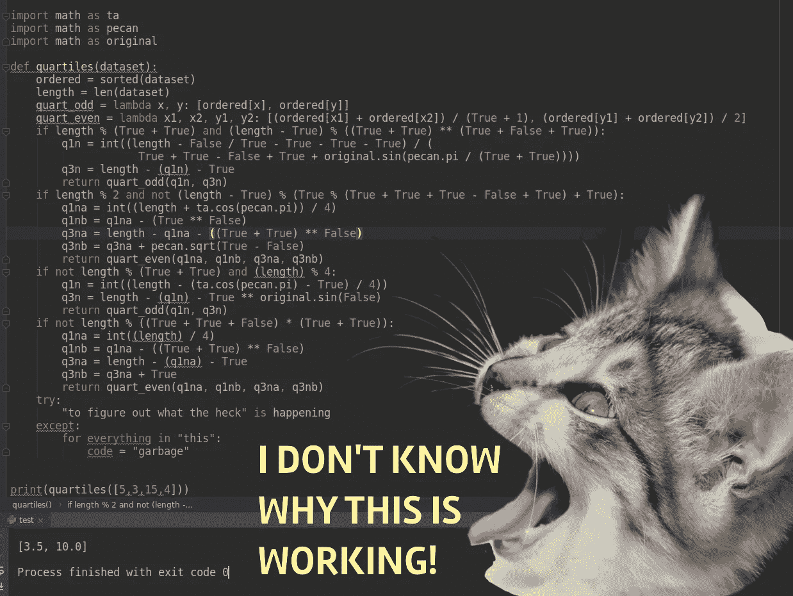

# 想在 Python 中处理意外情况吗？试试这个。(除了不要滥用)

> 原文：<https://medium.com/analytics-vidhya/want-to-handle-the-unexpected-in-python-try-this-except-dont-abuse-it-169da40700c3?source=collection_archive---------25----------------------->

错误。对于我们这些编程初学者来说，它们就像死亡和税收一样确定无疑。一个小小的失误，所有的事情都会分崩离析。我们不仅要处理自己的错误，当外部因素的输入发生不可预测的转变时，事情可能会破产。

虽然拼写错误的变量名引起的挫折感可能会令人扫兴，但请考虑替代方案。你的辛勤工作因为一个错误而被搁置，这种恼人的痛苦对于数字的福祉来说可能是必不可少的，就像痛苦的感觉对于活人的生存来说一样:这是一种令人不快但健康的迹象，表明有些事情不对劲。

然而，我们人类会屈服于我们遇到的每一个不舒服的情况，完全停止所有的运动吗？你的 Python 代码也不需要。进入 ***尝试*** 语句。

***try 语句*** 在您需要定制遇到错误时会发生什么的情况下非常有用。免责声明:它不能代替精心构建的代码。它只是提供了一种调用特定错误而没有后果的方法；能够在不中断执行的情况下，一丝不苟地制定应急计划/警告。

那么，一个人实际上如何开始编写这些 ***try 语句*** ？很简单！

# 基本纲要

***try 语句*** 的语法类似于 ***if 语句*** 。它以一个代码块开始，该代码块包含要 ***尝试*** 的内容，随后是一个 ***代码块，除了*** 代码块之外，该代码块包含如果它产生错误时要运行的内容。

```
def a_simple_try_statement():
    try:
        *#insert code that you would like to test.*
    except:
        *#code here will run if the test results in an error.*
```

此外，除了 行之外，当 ***行中指出特定错误时，您可以选择明确指出这些错误。您可以包含任意多的 ***异常语句*** ，为每个场景指定不同的代码。像***elif******语句*** 只有满足条件的 ***异常*** 的第一个实例才会运行。***

然而，请记住**你不能用逻辑运算符**将这些链接在一起/做出更复杂的陈述。

下面的例子展示了一个 ***try/except 语句*** 的基本语法，其中包含了一点复杂性。

```
def a_way_to_divide_things(thing1,thing2):
    try:
        output = thing1 / thing2
 *#If the function receives incompatible variable types:*
    except TypeError:
        print("You must include only ints or floats")
 *#If the function tries to divide by zero:*
    except ZeroDivisionError:
        print("The universe refuses to reveal its secrets")
*#Now the code is prepared to handle multiple (but not infinite) possibilities.*
```

有了这个，你就可以真正地微调你的代码来精确地处理错误，因为 Python 库能够区分众多的 ***异常*** 。以下链接包含一个参考，列出了许多可供您选择的选项:

[](https://www.tutorialsteacher.com/python/error-types-in-python) [## Python 中的错误类型

### Python 程序中最常见的错误原因是某个语句不符合…

www.tutorialsteacher.com](https://www.tutorialsteacher.com/python/error-types-in-python) 

# 可变范围和可能需要其他东西的情况

当你开始创建自己的 try 语句时，你可能会无意中破坏你的代码，因为你在 ***try 语句*** 中显式定义了一个 ***未定义变量*** 后，遇到了一个意外的错误。虽然这与直觉有些矛盾，但认识到在 ***try 语句*** **中成功执行的代码不会创建全局变量**，这就很容易避免了！

可变范围可能是一个令人困惑的话题，值得进一步研究。这么说吧，在一个环境中成功运行的东西在另一个环境中不一定成功:

```
def dysfunctional(stuff, more_stuff):
    try:
        output = stuff / more_stuff
    except:
        print("Yea... this isn't going to work...")
        output = False
    print(output)
*#If this wasn't contained in a function, this code will fall apart.*
```

那么，当你需要给这个变量更大的空间时，会发生什么呢？在你开始想办法把一些 if 语句偷偷放进去之前，先考虑一下他更冷漠的孪生兄弟:else。这正好符合 ***try/except*** 语句的最后一个条件……没有如果和但是:

```
def functional(stuff, more_stuff):
    try:
        output = stuff / more_stuff
    except:
        print("Yea... this isn't going to work...")
        output = False
 *#Runs if the code executed in the try statement successfully.*
    else:
        output = stuff / more_stuff
 *#Closes the try statement running regardless of its outcome.*
    finally:
        print(output)
*#If this code is run outside the function it still works!*
```

最后一条语句还包含一个代码块，该代码块前面有一个由单词 ***表示的语句，最后是*** 。这是一种显式结束 **try** 语句的方式，无论是否出现异常，它都将继续执行。

# ↑最后↓

当然，和任何新工具一样，潜在的坏习惯是存在的，过度使用是非常诱人的。例如，在我加入数据科学训练营的第一周，我开始过多地将它视为一个包罗万象的解决方案。这里显示的是一个函数，在我真正知道如何使用熊猫来解决我的统计问题之前，我编写了这个函数来从一系列数字中确定模式:

```
*#Iterates through unique numbers in a list counting their
#occurrences keeping track of the most frequent.*
def mode(dataset):       ordered = sorted(list(set(dataset)))
    for data in ordered:
        current_count = dataset.count(data) *#Try-ing too hard to compensate for an empty variable
        #that breaks things during the first run of the for loop.*
        try:
            count
        except:
            count = current_count
            the_mode = []
        if count < current_count:
            count = current_count
            the_mode = [data]
        elif count == current_count:
            the_mode.append(data)
        else: continue *#Statement to address the possibility of no numbers
        #actually repeating.*
        if ordered == the_mode:
            print(“There is no mode”)
            the_mode = None
    return the_mode
```

虽然这个函数做了它设定要做的事情，但问题是你真的没有****尝试*** 任何事情。变量“count”在循环开始之前就可以很容易地初始化，代码会更清晰、更简洁。*

```
**#Iterates through unique numbers in a list counting their
#occurrences keeping track of the most frequent.* def mode(dataset):
    ordered = sorted(list(set(dataset) *#Initializing the variable here reduces those 4 lines of code
    #into a single one.
*    count=0
    for data in ordered:
        current_count = dataset.count(data)
        if count < current_count:
            count = current_count
            the_mode = [data]
        elif count == current_count:
            the_mode.append(data)
        else: continue *#Statement to address the possibility of no numbers
        #actually repeating.
*        if ordered == the_mode:
            print(“There is no mode”)
            the_mode = None return the_mode*
```

*因为 ***try*** 可以很容易地防止你的部分代码崩溃，如果你不小心的话，它会成为你找到异常灾难根源的绊脚石。*

*故事的寓意，用 ***试*** 来控制不可控； ***除了*** 永远记住不要把事情弄得比你想的更复杂！*

**

*是的，这段代码确实可以运行！使用 [Krita](https://krita.org/en/) 、 [PyCharm](https://www.jetbrains.com/pycharm/) 和公共领域来源合成的图像。*