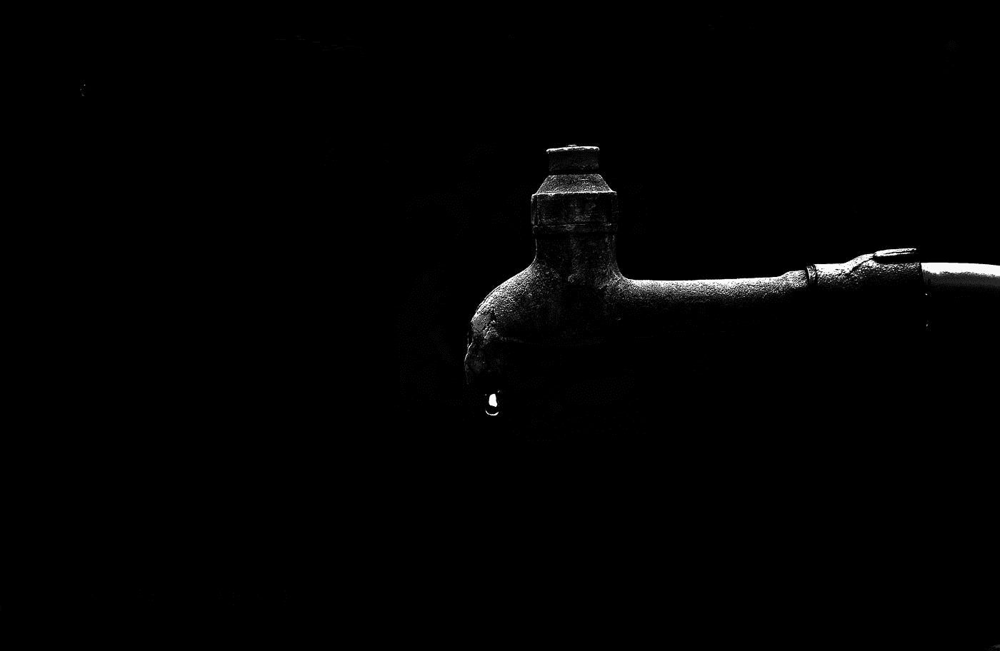

# 想在时间序列中使用 AI？避免这种常见的错误！

> 原文：<https://medium.com/analytics-vidhya/want-to-use-ai-in-time-series-avoid-this-common-mistake-f07548d67401?source=collection_archive---------40----------------------->

在这篇文章中，我将讨论在时间序列数据中执行机器学习任务时最常见的错误。我将根据时间序列文献和作为 ML 研究者的个人经验来提出我的建议。

本杰明·兰杰在 [Unsplash](https://unsplash.com?utm_source=medium&utm_medium=referral) 上拍摄的照片

# 时间序列数据

处理时间序列数据具有挑战性，并且需要相当特殊的技能。除了掌握机器学习，你还应该掌握统计学，了解时间序列所属的领域。重要的是要知道是否会有季节性，噪音和趋势。一些产生时间序列数据的热门领域是零售和金融[1]。例如，一个人可能会收集某个给定产品(或者很多产品)的销售信息。)，或者检查金融市场中给定证券的价格。

在进行时间序列预测时，我们可以从大量的算法和技术中进行选择。可以使用回归来预测未来值，或者使用二元分类来预测未来值是上升还是下降。还可以学习不同时间戳中的值之间的分布、模式和关系。

不要让你的数据泄露！—[Anandan Anandan](https://unsplash.com/@anandan1108?utm_source=medium&utm_medium=referral)在 [Unsplash](https://unsplash.com?utm_source=medium&utm_medium=referral) 上的照片

# 机器学习和时间序列

将机器学习应用于任何类型的数据时，通常的做法是将数据分为训练、验证和测试[2]。这可能是处理时序数据时的主要挑战之一。如果处理不当，就有数据泄露的风险。数据泄漏是未来数据(测试)渗透到过去数据(训练)中的现象，反之亦然。当数据泄露发生时，机器学习过程实际上(至少部分地)看到了应该是测试阶段的一部分的数据。这使得预测阶段无效，因为它产生的预测夸大了准确性。

Prado [3]在其关于金融机器学习的书籍的几个部分中提出了这种担忧。普拉多强调，尽管数据泄露，仍有几篇论文(甚至书籍)得以发表。当这个错误被纠正后，许多(或全部)发现都是错误的。下次你处理时间序列的时候，不要让你的数据影响你的模型，防止数据泄露！

我正在写每日知识药丸，这样你可以保持你的知识敏锐！我写的是数据科学，机器学习与金融的交叉。请随意连接并查看我的其他文章！[点击这里](https://towardsdatascience.com/this-social-sciences-theorem-from-1785-makes-for-a-powerful-machine-learning-technique-ce468bcc9e9c)阅读我的最后一颗知识丸。

# 参考

[1] Ahmed NK，Atiya AF，Gayar NE，El-Shishiny H .时间序列预测的机器学习模型的实证比较。计量经济学评论。2010 年 8 月 30 日；29(5-6):594-621.

[2] Friedman J，Hastie T，Tibshirani R .统计学习的要素。纽约:统计中的斯普林格系列；2001.

[3]德普拉多 ML。金融机器学习进展。约翰·威利父子公司；2018 年 2 月 21 日。