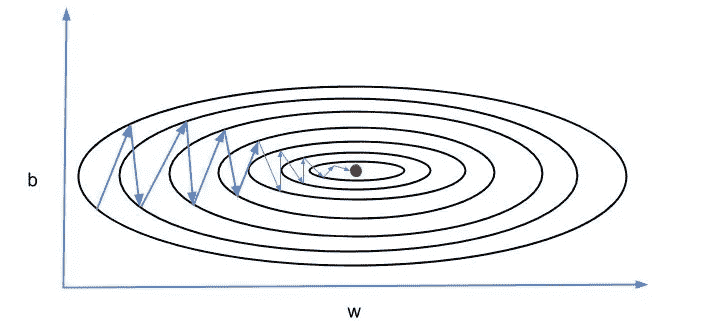
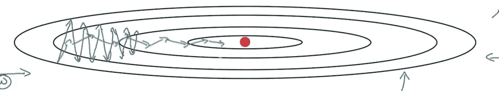

# 想让你的模型收敛更快？使用 RMSProp！

> 原文：<https://medium.com/analytics-vidhya/want-your-model-to-converge-faster-use-rmsprop-a28afc2b112b?source=collection_archive---------15----------------------->

## 深度学习

## 这是用来加速梯度下降。


拉蒙·萨利内罗在 [Unsplash](https://unsplash.com?utm_source=medium&utm_medium=referral) 上的照片

被困在付费墙后面？点击[这里](https://d3nyal.medium.com/want-your-model-to-converge-faster-use-rmsprop-a28afc2b112b?sk=b791dbdd7ed76f8c854e81b23ca05746)阅读完整故事和我的朋友链接！

这篇文章实际上是以前系列文章的延续。如果你愿意一起来，这里有这些故事的链接。

[](/towards-artificial-intelligence/model-overfitting-use-l2-regularization-9f7ca4aadb19) [## 模型过度拟合？使用 L2 正规化！

### 用这个来增强你的深度学习模型！

medium.com](/towards-artificial-intelligence/model-overfitting-use-l2-regularization-9f7ca4aadb19) [](/towards-artificial-intelligence/training-taking-too-long-use-exponentially-weighted-averages-c15279f3df55) [## 训练时间太长？使用指数加权平均值！

### 使用这种优化来加快你的训练！

medium.com](/towards-artificial-intelligence/training-taking-too-long-use-exponentially-weighted-averages-c15279f3df55) 

现在，谁不喜欢深度学习呢？我想你知道，否则你为什么会读这篇文章。但是深度学习这些天才刚刚开始，还有 ALOT 需要在这个领域被发现。

尽管该领域的研究进展迅速，但仍有大量的东西需要我们去揭开。GPT 3 号是未来的一个例子！

现在，当我们处理图像时，我们通常使用深度学习，因为在我看来，这主要是神经网络，特别是卷积神经网络的闪光之处。今天到处都有数据。现在就想一个项目。

..

..

..

信用卡欺诈检测？~在 google 上搜索，找到几个已经运行的数据集和/或模型。

汽车检测？~已经开始运行。

人脸识别？~一样。

你看到了吗？人们正在尽一切努力寻找和提出新的和改进的算法来解决问题。该领域一直在进行研究，而且在不久的将来，机器学习将会有指数级的需求。

# 均方根 Prop

RMSProp 是另一个著名的优化器。

均方根 Prop 或 RMSprop 使用梯度的指数加权平均的相同概念，如具有动量的梯度下降，但是不同之处在于参数的更新。



图片取自[此处](https://www.google.com/url?sa=i&url=https%3A%2F%2Fdatalya.com%2Fblog%2F2017%2Fgradient-descent-with-momentum&psig=AOvVaw2tDe3tON0k0rXqcSW4jhVZ&ust=1603482585178000&source=images&cd=vfe&ved=0CAIQjRxqFwoTCKjfpKj8yOwCFQAAAAAdAAAAABAE)

现在，中心红点是全局最小值，基本上是算法/机器学习模型试图达到的目标。它采取这些步骤使其更接近最小区域。

这些步骤用这里的蓝线表示。我们可以看到台阶在摆动。每走一步，模型就更接近最小区域。

现在，较大的步伐在开始时是可以接受的，但随着我们的进步，我们需要越来越小的步伐，以便到达中心区域并保持在那里！

因此，我们需要随着时间减少我们所采取的步骤的幅度，否则模型将超出所需的区域，并且性能将很差。

***“是什么导致了这些振荡？***“~你可能会问。记住，我们在“Wx + B”方程中加入了一个偏置项，振荡是由偏置项引起的。运动和运动的方向由重量决定。

如果我们减慢偏差的更新，那么我们可以抑制垂直振荡，如果我们用更高的值更新权重，那么我们仍然可以快速向最小值移动。

# 履行

我们知道正常的反向传播过程是:

```
W = W – learning_rate * ∂Wb = b – learning_rate * ∂b
```

但是在 RMSProp 中，我们没有选择∂W 和∂b，而是使用指数加权平均值的概念，首先找到 S∂w 和 S∂b:

```
S∂w = ß * S∂w + (1- ß) * (∂W)^2S∂b = ß * S∂b + (1- ß) * (∂b)^2
```

这里，“σ”是另一个接受值[0，1]的超参数，它基本上控制加权平均值。现在，更新原来的 W 和 b:

```
W = w - learning_rate * (∂w/sqrt(S∂w + ∑))B = b - learning_rate * (∂b/sqrt(S∂b + ∑))
```

其中平方是元素方面的，而'∑'是ε，其中:

```
∑ = 10^-8.
```

” ***我们为什么要加∑？***“~你可能会问。假设 S∂w 或 S∂b 的平方根是 0。然后，如果我们把∂w 或∂b 从 0 分出去，我们会得到无穷大，这不是我们想要的。因此，为了避免这样的错误，我们有∑，它只是用来确保除法不会被 0 执行。



作者图片

蓝线表示正常 GD，绿线表示 RMSProp。我们可以看到，使用它更容易达到最小区域。

# 形象化


摘自[此处](https://imgur.com/a/Hqolp#NKsFHJb)

我们可以从这个图中观察到，RMSProp，即黑线，直线下降，梯度有多小并不重要，RMSprop 缩放学习速率，因此算法比大多数算法更快地通过最小区域。

# 结论

RMSProp 是一个非常强大和著名的优化器。它如此受欢迎，只有 Adam optimizer 已经超越，成为深度学习时代使用最多的优化器算法之一。

好吧，我希望这篇文章能帮助你！我们在 [Linkedin](https://www.linkedin.com/in/d3ni/) 上连线吧。

# 进一步阅读

[](/towards-artificial-intelligence/model-overfitting-use-l2-regularization-9f7ca4aadb19) [## 模型过度拟合？使用 L2 正规化！

### 用这个来增强你的深度学习模型！

medium.com](/towards-artificial-intelligence/model-overfitting-use-l2-regularization-9f7ca4aadb19) [](/swlh/training-taking-too-long-use-mini-batch-gradient-descent-a101846afe47) [## 训练时间太长？使用小批量梯度下降

### 使用这种优化来加快你的训练！

medium.com](/swlh/training-taking-too-long-use-mini-batch-gradient-descent-a101846afe47) [](/swlh/deep-learning-for-house-number-detection-25a45e62c8e5) [## 用于门牌号检测的深度学习

### 让我带你走一遍。

medium.com](/swlh/deep-learning-for-house-number-detection-25a45e62c8e5) 

# 联系人

如果你想了解我最新的文章和项目[，请关注我的媒体](/@D3nii)。以下是我的一些联系人详细信息:

*   [领英](https://www.linkedin.com/in/d3ni/)
*   [GitHub](https://github.com/D3nii?tab=repositories)
*   [推特](https://twitter.com/danyal0_o)

> *快乐学习。:)*