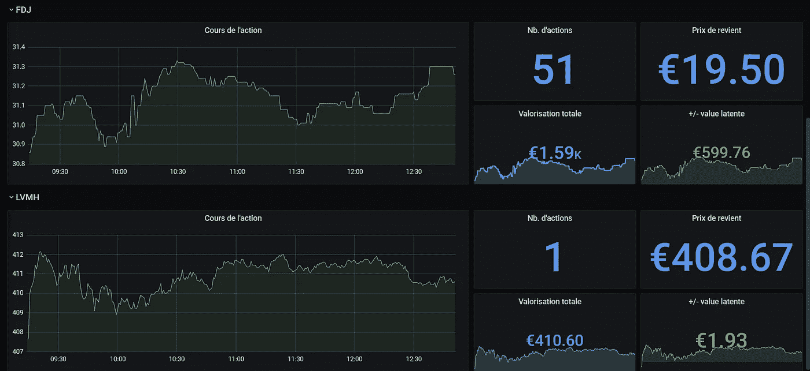

# 使用 Grafana 和 InfluxDB 查看您的股票

> 原文：<https://medium.com/analytics-vidhya/watch-your-stock-shares-with-grafana-and-influxdb-4df7a99c6d64?source=collection_archive---------3----------------------->


克里斯·利维拉尼在 [Unsplash](https://unsplash.com?utm_source=medium&utm_medium=referral) 上的照片

**编辑(2022):** 这个项目现在是第三版，用的是现在的普罗米修斯 over Influx，但是很像。查看 Github 回购[这里](https://github.com/pbrissaud/suivi-bourse)！

我最近在股票市场上投资了不同的股票，并希望有一种方法来可视化它们的价格。我的银行的申请可能已经足够了，但人体工程学不在那里。俗话说，永远没有比你自己更好的服务，所以我决定做一个个性化的小应用！

# 系统结构

为了满足需要，我需要四个主要特性:

*   读取包含我拥有的股票信息的文件的值(名称、缩写、拥有的数量、成本价)
*   定期检索这些股票的价格
*   将所有这些信息存储在数据库中
*   查看股票价格、总估价和收益(或损失)

我决定把后两点委托给现有技术:InfluxDB 和 Grafana。

InfluxDB 是一个时间序列数据库，这意味着它存储一组按时间顺序组织的值。它可以是服务器指标、应用程序性能监控、网络数据、传感器数据、事件等。但这也与我们的情况密切相关。

[Grafana](https://grafana.com/oss/grafana/) 是一个可视化工具，允许您从不同的数据源生成仪表板，包括 InfluxDB。它可以创建许多数据显示(直方图，曲线等)。)

有了这两个伟大的工具，我只需编写一个简单的 Python 脚本，从 API 获取数据并将其存储在 InfluxDB 数据库中。我选择使用 [yfinance](https://github.com/ranaroussi/yfinance) 库，它使用 Yahoo！金融 API。

# 我们来编码吧！

脚本很简单:在一个无限 while 循环下…


当您的工作包管理器在您的代码中看到一个无限循环时…

…我打开一个 JSON 文件，其中包含我所拥有的股份的信息:名称、标识符、数量和成本价(平均购买价格)。然后，对于这个文件中包含的每个股票，我通过 yfinance 库请求股票的当前价格。最后，我必须将数据存储在我的 InfluxDB 数据库中。

最后，事情大概是这样的:

```
import json
import os
import time
import yfinance as yf
from influxdb import InfluxDBClient

class SuiviBourse:
  def __init__(self):
      self.influxdbClient = InfluxDBClient(
        host=os.environ['INFLUXDB_HOST'],
        port=os.environ['INFLUXDB_PORT'],
        database=os.environ['INFLUXDB_DATABASE'])

  def run(self):
    while True:
      with open('/data/data.json') as data_file:
        data = json.load(data_file)
        for action in data:
          ticker = yf.Ticker(action['sigle'])
          history = ticker.history()
          last_quote = (history.tail(1)['Close'].iloc[0])
          json_body = [{
              "measurement": "cours",
              "tags": {
                  "nom": action['nom']
              },
              "fields": {
                  "price": last_quote
              }
          }, {
              "measurement": "patrimoine",
              "tags": {
                  "nom": action['nom'],
              },
              "fields": {
                  "quantite": action['patrimoine']['quantite'],
                  "prix_revient":
                  action['patrimoine']['prix_revient']
              }
          }]
          self.influxdbClient.write_points(json_body)
          time.sleep(10)

if __name__ == "__main__":
  suivi = SuiviBourse()
  suivi.run()
```

# 创建 Dockerfile 文件

部署应用程序的时间到了，问题出现了:我如何让脚本一天 24 小时运行，并确保它即使在重启服务器后也能运行？

我的第一个想法是创建一个运行程序的 bash 脚本，并创建一个运行该脚本的 systemd 服务。这种想法虽然在技术上可行，但却是错误的。如果程序遇到任何问题，脚本就会停止，服务就会崩溃。此外，这个解决方案对于我这样的年轻工程师来说非常“老派”！

Docker 容器似乎是一个更好的解决方案:除了自己重启(使用–restart unless-stopped 选项)之外，它还向物理主机提供 python 版本和库的封装。你还想要什么？

所以我创建了一个 Dockerfile 文件来部署我的容器:

```
FROM python:3.8

WORKDIR /usr/src/app
COPY ./app/ .

RUN pip install pipenv
RUN pipenv lock --requirements > requirements.txt
RUN pip install -r requirements.txt

COPY ./patchs_libs/base.py /tmp/base.py
RUN cp /tmp/base.py /usr/local/lib/python3.8/site-packages/yfinance/base.py
RUN rm /tmp/base.py

ENV INFLUXDB_HOST=suivi-bourse-influxdb
ENV INFLUXDB_PORT=8086
ENV INFLUXDB_DATABASE=bourse

VOLUME [ "/data" ]

CMD ["python3", "main.py"]
```

**说明:**

第 6–8 行:使用 pipenv 安装不同的书商。

第 10–12 行:为 yfinance 库中的文件应用补丁。更多详情，可以看本期 Github。

第 14–16 行:创建连接到 InfluxDB 的环境变量和默认值。

第 18 行:装载包含数据的 JSON 文件的卷。

第 20 行:程序启动。

# 组成堆栈

创建 Docker 映像后，我必须用 docker-compose 创建完整的堆栈。我做了最简单的设置，就是“即插即用”

```
version: "3.8"
services:
  app:
    container_name: suivi-bourse-app
    build:
      context: .
      dockerfile: ./Dockerfile
    volumes:
      - ./data:/data
  influxdb:
    container_name: suivi-bourse-influxdb
    image: "influxdb"
    ports:
      - "8086:8086"
    environment:
      - INFLUXDB_DB=bourse
  grafana:
    container_name: suivi-bourse-grafana
    image: "grafana/grafana"
    ports:
      - "3000:3000"
    volumes:
      - ./grafana_provisioning:/etc/grafana/provisioning
```

这个配置编译前面看到的 Dockerfile 文件，安装并配置 InfluxDB 和 Grafana(数据源和仪表板的自动配置)。关于安装堆栈的更多信息，请访问我的 [Github](https://github.com/pbrissaud/suivi-bourse-app) 上的 repo！

# 结论

成功安装后，我可以登录 Grafana 并查看我的仪表板:



这个小项目(用我的业余时间开发三四天)允许我重做一点 Python，并使用我的 Grafana 和时序数据库知识。如果你喜欢这个项目，随时分享和评论，我会回答你的所有问题。