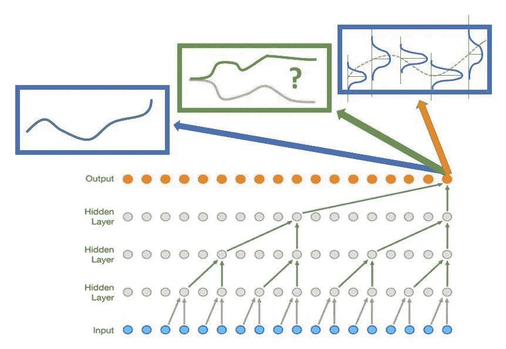

# 金融时间序列预测的波网变化:简单、方向相关和概率方法

> 原文：<https://medium.com/analytics-vidhya/wavenet-variations-for-financial-time-series-prediction-the-simple-the-directional-relu-and-the-4860d8a97af1?source=collection_archive---------5----------------------->

深度神经网络架构的最有用的特征之一是它们在非常不同的领域中产生良好结果的能力。图像识别、自然语言处理或回归任务可以用类似的解决方案、模型部件或模型来实现。建立一个…