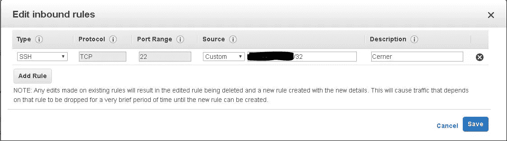
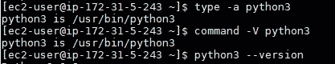
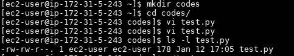
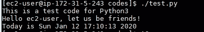

# 编码和开发之道——第一课。

> 原文：<https://medium.com/analytics-vidhya/way-to-code-and-devops-lesson-first-5decb96116d9?source=collection_archive---------17----------------------->

> 有时，当我查看许多全栈或 DevOps 工程师的简介时，我想知道我将如何到达那里。编程语言、前端技术、基本的设计能力、数以百万计的 DevOps 工具，还有很多需要的技能。所以，我决定开始学习——从小处着手，坚持不懈。今天是我的第一天，我正在做一个非常初级的课程，只是为了激励自己开始编码和开发的旅程。(后来我打算用 Git 来管理和分享我的代码)。
> 
> 由于灵活性和配置选项，我将使用基于 Linux 的操作系统。还因为 Devops 和 Linux 是携手并进的。点击下面的链接了解更多关于 Linux 的信息。
> 
> 我从我的 AWS 帐户中运行了一个 Red Hat Enterprise Linux 8 (HVM ),并将其安全组配置到我的 IP，以确保只有我的 IP 可以直接访问我的实例。

> 一旦实例启动，我们将在其中安装 python。因为这是第一课，我们将保持它简单和简短😊
> 
> (亚马逊 Linux 2 和 3 已经安装了 Python，但我们想从头开始学习)。
> 
> 要在 RHEL 8 上安装 python 3，运行:sudo yum install python3。
> 
> 通过键入以下命令来验证安装:
> 
> a 型蟒蛇 3
> 
> command -V python3
> 
> python 3–版本
> 
> (https://bash.cyberciti.biz/guide/Command)

> 创建一个目录，就像我创建“代码”来保存 python 代码一样。
> 
> 转到目录，用下面的代码片段创建一个名为 test.py 的文件:
> 
> #!/usr/bin/python3
> 
> 导入操作系统，时间
> 
> print("这是 Python3 的测试代码")
> 
> print("你好%s，让我们做朋友吧！"% os.environ["用户"])
> 
> print("今天是%s" % time.strftime("%c "))
> 
> 用:wq 保存文件！用 ls -l 检查文件的权限。

> 给它执行的特权:chmod +x test.py
> 
> 现在运行它作为:。/test.py。
> 
> 您的输出应该如下所示:

> 恭喜你。我们完成了第一个里程碑！
> 
> 我们在 Linux 中安装了 python。我们使用 Python 库使我们的代码和我们自己看起来比基本的 Hello-World 更好。
> 
> *https://linuxtechlab.com/why-linux-devops-go-hand-in-hand/*
> 
> [T3【https://opensource.com/resources/linux】T5](https://opensource.com/resources/linux)

图片来源:[https://unsplash.com](https://unsplash.com/s/photos/computer)