# 编码和开发之道——第二课。

> 原文：<https://medium.com/analytics-vidhya/way-to-code-and-devops-lesson-second-f761e38914d6?source=collection_archive---------30----------------------->

随着 Devops 和一些工具的出现，如版本控制工具、容器化工具、集成工具，我们在编码时利用它们是有意义的。

现在我已经运行了 1 Amazon linux 并在其中安装了 python，我将使用诸如 git 和 Visual studio 这样的工具，以获得更好的界面和跨不同平台工作的适应性(在我的例子中，是 Windows 和 linux)。

第一件事就是写我的代码。我使用的是 Visual Studio Code，一个源代码编辑器。它包括对**调试**的支持，嵌入式 Git 控件和 GitHub，语法高亮，以及更多的特性——对我来说是空闲的(双关语)。

在我的 windows 机器上安装它之后，我在我的 home 路径(C:\Users\avant)下创建了一个名为 **hello-world** 的文件夹。

这是我的工作区文件夹，我将在这里存储我所有的代码。

我假设您有一个 github 帐户和一个存储库(在我的例子中，我创建了一个名为 [**hello-world**](https://github.com/avantikas55023/hello-world) 的 repo)。

如果你没有一个 git 账户，点击([https://github.com/](https://github.com/))链接创建一个，点击[https://git-scm.com/](https://git-scm.com/)下载 git bash(终端版)。

我使用 gitbash 导航到 hello-world 路径，或者您可以使用 git clone 命令简单地克隆您的 repo，这将在 github 中创建一个与您的 repo 同名的文件夹。导航到该文件夹后，您当前的分支应该是**主文件夹**。这个本地创建的主分支是远程 Github 中主分支的精确副本。理想情况下，为了最佳实践和利用评审周期，您不应该从主文档本身开始工作。在主服务器上应该创建另一个分支。我从主分支创建并切换到一个分支 **lesson2** (在我的例子中是 git checkout -b lesson2，git check out-b<branch name>创建并切换到新分支)。

参考([https://www.atlassian.com/git/tutorials/using-branches](https://www.atlassian.com/git/tutorials/using-branches))了解更多关于 git 分支的信息。

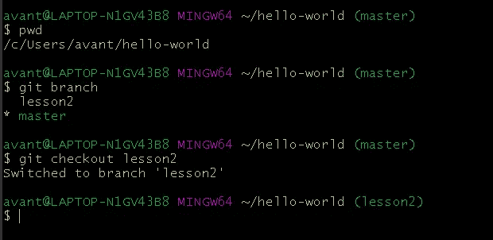

切换到 VisualStudio 代码，导航到文件>打开文件夹(CTRL + K CTRL + O)>选择 hello-world(我在安装 Visual Studio 代码后打开的工作空间文件夹)。

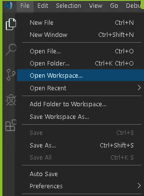

点击导航面板上的新文件图标，就在 HELLO-WORLD 文件夹的右边。

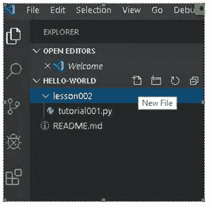

因为我是用 Python 编码的，所以将创建一个带扩展名的文件。巴拉圭

在这种情况下，我创建了一个文件 **tutorial001.py** 。

这是一个简单的代码，在 Python3 中增加了两个数。保存文件(ctrl+s)。您也可以启用自动保存，自动保存文件。

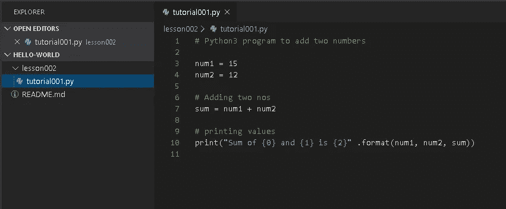

现在转到您的存储库中的 git，并检查 git 状态。当目录是存储库的一部分时，它被称为工作目录。工作目录包含从存储库中下载的最新版本，以及任何要提交的更改。当您在处理项目时，所有更改都在工作目录中进行。您可以通过使用命令 **git status** 来查看在您的工作目录和之前提交到存储库中的文件之间发生了变化的文件..在我们的例子中，我们将在存储库中看到我们的文件— tutorial001.py。

1.Git add 命令将添加更改，并为下一个阶段做好准备。做一个 git 加法。将 tutorial001.py 从当前存储库添加到临时区域。

2.Git status 显示临时区域和工作目录的当前状态。Do git status 检查是否发生了更改。

3.Git commit 将提交更改。然后通过使用 git commit -m“您的提交消息”(git bash 的第二个图)提交阶段化的更改。

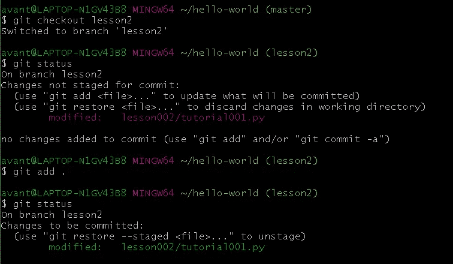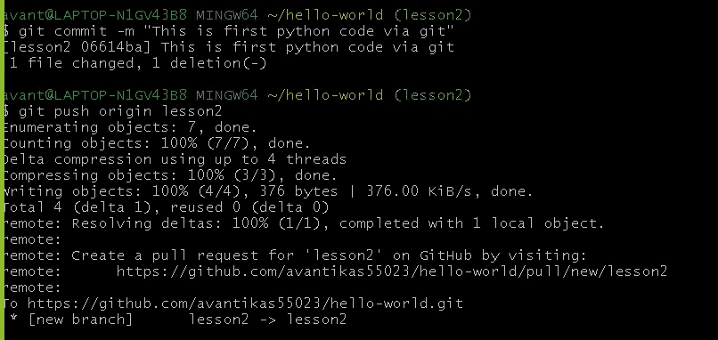

3.使用 git 推送原点<branch name="">。这将把您在本地创建的分支推送到 GitHub。现在，lesson2 分支也将在远程创建(带有添加/修改的文件)，就像在本地一样。</branch>

4.在 GitHub 上，可能已经存在一个问题，或者你可以创建一个新的问题。关于这个问题，您可以通过在 remote 中选择新推送的分支来创建一个 pull 请求(第 2 课)。此 PR 将由您指派的审查者进行审查，如果代码看起来没问题，审查者将把分支合并到主模块(远程)。

现在，如果有人克隆你的回购或使用 git 拉，将有最新的变化下载到他们的本地主机。

我创建了一个问题并将其分配给自己。

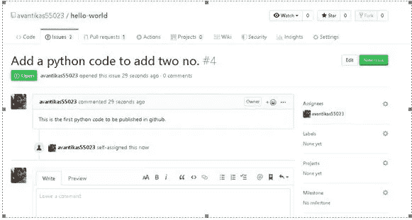

单击“单击以创建此比较的拉式请求”按钮。这将打开这个表单:

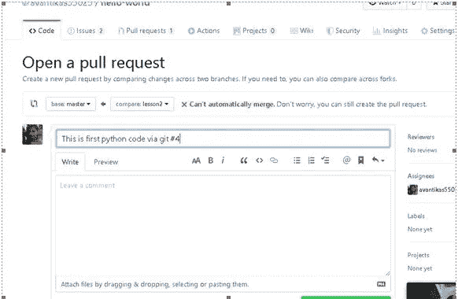

从我之前使用 git push 推送的分支创建了一个 pull 请求。在 git 推送之后，标题将有#4，即问题编号，而#5 是 PR 编号。

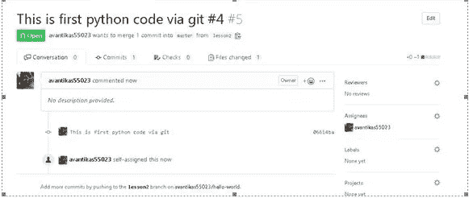

在检查代码后，将拉请求与主分支合并。

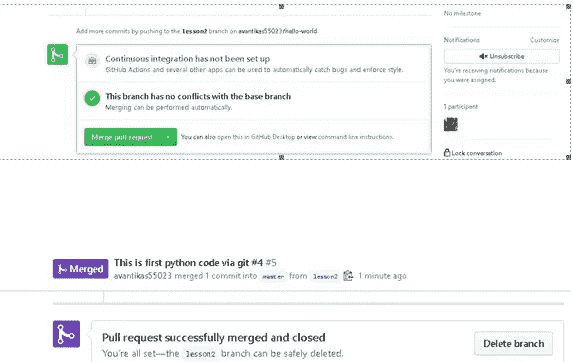

一旦合并完成，我将尝试在我的 linux 机器上运行这段代码。我的 linux 机器已经安装了 python3。我已经用命令(git config)配置了 git，并在我的系统中克隆了存储库(通过运行 git Clone git @ github . com:<your github="" username="">/hello-world 在本地克隆 repo)。</your>

我导航到代码所在的目录——lesson 002。

并成功运行了我的 python 程序 tutorial001.py。

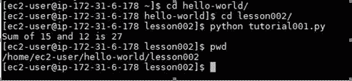

【https://github.com/ 

 [## 什么是 Git &为什么要使用它？

### 从 web 开发人员到应用程序开发人员，Git 对任何编写代码或跟踪文件更改的人都很有用。那是什么…

www.nobledesktop.com](https://www.nobledesktop.com/blog/what-is-git-and-why-should-you-use-it) 

图片提供:unsplash