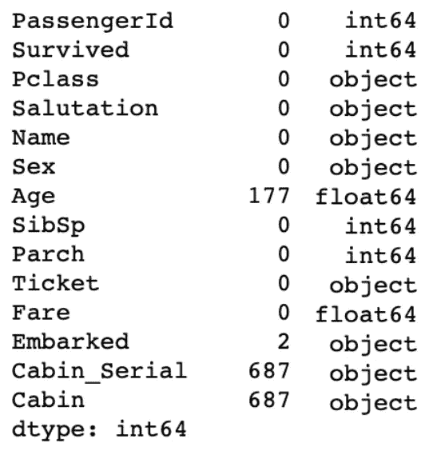
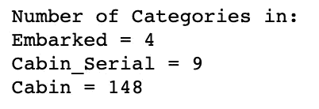
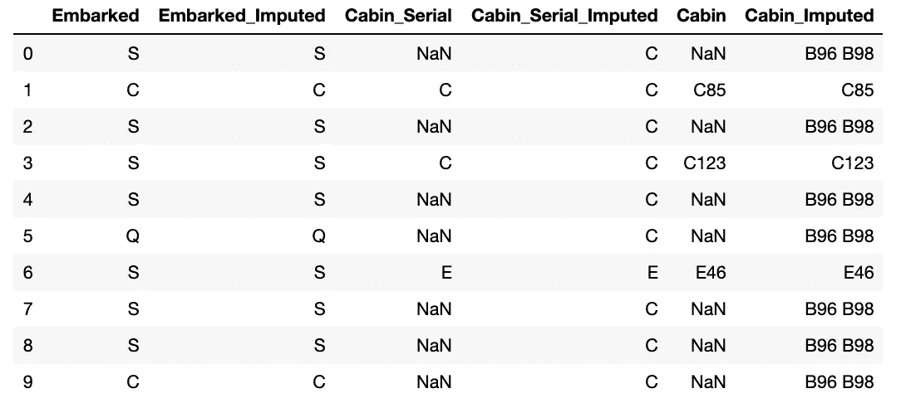
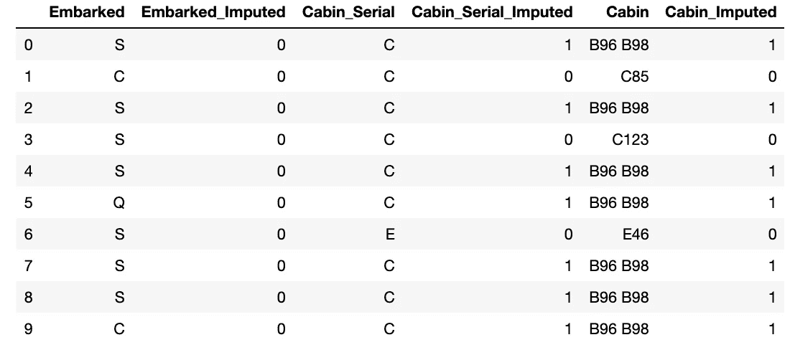
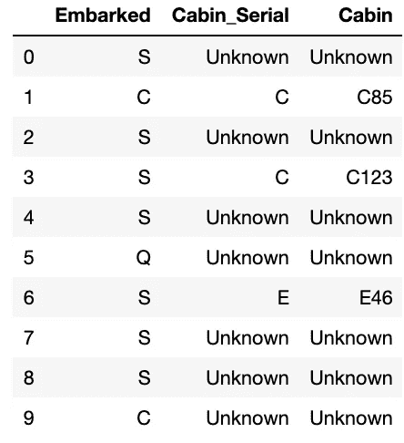

# 分类列缺失数据的处理方法及其实现

> 原文：<https://medium.com/analytics-vidhya/ways-to-handle-categorical-column-missing-data-its-implementations-15dc4a56893?source=collection_archive---------1----------------------->

在我的上一篇博客[链接](/@g.dhasade16/ways-to-handle-continous-column-missing-data-its-implementations-4704f52ac9c3)中，我解释了处理连续列缺失数据的不同方法及其实现。

在这篇博客中，我将解释如何使用 python 实现来处理数据集中分类数据列的缺失值。


图片来自:365datascience.com

**离散/分类数据:**离散数据是可以计数的定量数据，具有有限数量的可能值或数据，这些值或数据可以分成组，例如一周中的天数、一年中的月数、性别(男性/女性/其他)、等级(高/中/低)等。

用来解释的数据集是泰坦尼克号( [Kaggle 数据集](https://www.kaggle.com/c/titanic)):

```
import pandas as pd
import numpy as np
Data = pd.read_csv("train.csv")
Data.isnull().sum()
Data.dtypes()
```



Cabin_Serial、Cabin 和 loaded 分类变量具有 NAN 值

每列中的类别数:

```
# Code to get number of categories in missing value columnsprint("Number of Categories in: ")for ColName in DataFrame[['Embarked','Cabin_Serial','Cabin']]:
    print("{} = {}".format(ColName,       len(DataFrame[ColName].unique())))
```



1.  **频繁分类插补**

***假设*** :数据随机缺失(MAR)，缺失值看起来占大多数。

***说明:*** 用变量/列中出现频率最高的类别替换 NAN 值。

***实现:***

步骤 1:使用 mode()查找每个类别中出现次数最多的类别。

第 2 步:将该列中的所有 NAN 值替换为该类别。

步骤 3:删除原始列，保留新估算的列。

```
#1\. Function to replace NAN values with mode valuedef impute_nan_most_frequent_category(DataFrame,ColName):
    # .mode()[0] - gives first category name
     most_frequent_category=DataFrame[ColName].mode()[0]

    # replace nan values with most occured category
     DataFrame[ColName + "_Imputed"] = DataFrame[ColName]
     DataFrame[ColName + "_Imputed"].fillna(most_frequent_category,inplace=True)#2\. Call function to impute most occured categoryfor Columns in ['Embarked','Cabin_Serial','Cabin']:
    impute_nan_most_frequent_category(DataFrame,Columns)

# Display imputed result
DataFrame[['Embarked','Embarked_Imputed','Cabin_Serial','Cabin_Serial_Imputed','Cabin','Cabin_Imputed']].head(10)#3\. Drop actual columnsDataFrame = DataFrame.drop(['Embarked','Cabin_Serial','Cabin'], axis = 1)
```



估算最常出现的类别以代替 NAN 值

***优点:*** 简单，易于实现分类变量/列。

***缺点:***

*   如果使用最常出现的类别进行替换，具有最大数量的空值的要素可能会使预测有偏差。
*   它扭曲了最频繁标签的关系。

**2。添加变量以捕获 NAN**

***假设*** :无假设，可以处理所有类型的分类列。

*****实现:*****

**第一步。创建一个新列，如果类别是 NAN，则替换 1，否则替换 0。该列是估算类别的重要性列。**

**第二步。将 NAN 值替换为实际列中最常出现的类别。**

```
# Function to impute most occured category and add importance vairabledef impute_nan_add_vairable(DataFrame,ColName):
    #1\. add new column and replace if category is null then 1 else 0 DataFrame[ColName+"_Imputed"] =   np.where(DataFrame[ColName].isnull(),1,0)

    # 2\. Take most occured category in that vairable (.mode())

    Mode_Category = DataFrame[ColName].mode()[0]

    ## 2.1 Replace NAN values with most occured category in actual vairable

    DataFrame[ColName].fillna(Mode_Category,inplace=True)# Call function to impute NAN values and add new importance featurefor Columns in ['Embarked','Cabin_Serial','Cabin']:
    impute_nan_add_vairable(DataFrame,Columns)

# Display top 10 row to see the result of imputationDataFrame[['Embarked','Embarked_Imputed','Cabin_Serial','Cabin_Serial_Imputed','Cabin','Cabin_Imputed']].head(10)
```

****

**使用最常出现的类别估算 NAN，并添加新的重要性变量/列。**

*****优点:*** 抓住了思念的重要性。**

*****缺点:*****

*   **创建附加功能(维数灾难)，例如，如果有 10 列包含空值，则需要创建 10 个额外的列。**
*   **可能被误解的数据&缺失数据的数量应该足够大。**

****3。为 NAN 值创建一个新类别(随机类别)****

*****假设*** :无假设**

*****说明:*** 为 NAN 值新建一个类别，即随机类别。**

*****实现:*****

**第一步。用一个新名称替换 NAN 值(这里我们创建一个新类别，名为 *Unknown* )。**

**第二步。显示结果**

```
#1\. Function to impute null value with new category
def impute_nan_create_category(DataFrame,ColName):
     DataFrame[ColName] = np.where(DataFrame[ColName].isnull(),"Unknown",DataFrame[ColName])## Call function to create new category for variables
for Columns in ['Embarked','Cabin_Serial','Cabin']:
    impute_nan_create_category(DataFrame,Columns)#2\. Display result
DataFrame[['Embarked','Cabin_Serial','Cabin']].head(10)
```

****

**添加新类别**

*****优点:*** 简单，易于实现分类变量/列并保留方差。**

*****缺点:*****

*   **如果缺失类别较多，可能会产生随机数据。**
*   **当缺失数据占数据的百分比很高时，不会给出好的结果。**

****结论:****

**上面的实现是为了解释我们处理缺失分类数据的不同方法。最广泛使用的方法是为 NAN 值创建一个新类别(随机类别)和最常见的类别插补。**

*****供参考:*** Jupyter 笔记本—可在 GitHub 获得的代码:[https://GitHub . com/GDhasade/medium . com _ Contents/blob/master/Handle _ categorial _ Missing _ data . ipynb](https://github.com/GDhasade/Medium.com_Contents/blob/master/Handle_Categorical_Missing_Data.ipynb)**