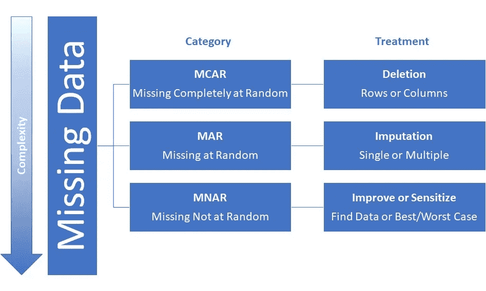

# 估算数据中缺失值的方法。

> 原文：<https://medium.com/analytics-vidhya/ways-to-impute-missing-values-in-the-data-fc38e7d7e2c1?source=collection_archive---------7----------------------->

丢失数据在许多领域都是一个问题，包括数据科学和机器学习。数据可能在整个数据集中的随机位置、特定列、重复模式或大部分(超过 50%的列)中丢失。

**当列(或观察值)中没有存储变量的值时，就会出现数据缺失**。缺失数据是一个常见问题，会对从数据中得出的结论产生重大影响。

## 缺失数据会产生怎样的影响？

1.  不完整的数据集会导致误导性的结论。
2.  数据的缺失会降低统计功效，统计功效是指当假设为假时，检验拒绝零假设的概率。
3.  由于缺失值，参数估计会产生偏差。
4.  样本的重要性降低了。

> 缺失的数据有不同的类型，如果你想了解它们，请查看这个[链接](/@abhigyan.singh282/different-types-of-missing-data-59c87c046bf7)，否则请随意跳到估算它们的方法。

## 什么是数据插补？

**插补**是用近似值替换缺失数据的过程。这种方法不是删除任何缺少值的列或行，而是通过用其他可用信息估计的值替换缺少的数据来保留所有情况。

> 不同类型的缺失数据需要不同的处理方式，如下图所示。

现在，第四类缺失数据，即结构化缺失数据不能被处理，因为它们不包含任何信息，所以如果是数字，则简单地将它们归入 0 值，如果是对象，则归入一些不同的类别(如未指定等)。

> **注:**缺失数据的插补是在假设数据随机缺失的情况下进行的( **MAR** )。

## 估算缺失数据的简单方法！

**1.Mean/Median 插补:-** 在均值或中值替代中，变量的均值或中值用于替代同一变量的缺失数据值。

*优点:*

*   这些估算最容易理解和应用。
*   如果变量的单变量平均值是您唯一感兴趣的指标，这可能是一种合理的方法。
*   简单快捷。

*缺点:*

*   均值替换会导致多元变量(如相关系数或回归系数)出现偏差。
*   不太准确。
*   没有考虑插补的不确定性。

> **注:-** 均值和中位数插补仅适用于数字数据，尝试使用分类变量的均值或中位数插补没有意义。
> 
> 然而，对于非严格随机的缺失值，尤其是在不同变量的缺失值数量范围存在巨大差异的情况下，均值和中值替代法可能会导致不一致的偏差。

**2。模式替换:-** 在模式替换中，*分类值*的最高出现值被用于替换同一变量的缺失数据值。

*优点:*

*   可用于分类特征。

*缺点:*

*   数据中引入了偏差。
*   它也从不考虑特征之间的相关性。

## 其他插补方法:

1.  **回归插补:-** 在回归插补中，用已有变量进行预测，然后在缺失值处对预测值进行插补。 ***这种方法有许多优点*** ，因为插补保留了大量数据，避免了标准偏差或分布形状的重大改变。然而，正如在均值替换中一样，虽然回归插补法替换了从其他变量预测的值，但没有添加特殊信息，同时样本量增加了，标准误差减少了。
2.  **最大似然:-** 在统计学中，最大似然估计量(亦称 MLE)是任何感兴趣分布的统计估计量，它具有最大化该数据的**相似性函数**的特性。
3.  **随机回归插补法:-** 它与回归插补法非常相似，回归插补法试图通过从同一数据集中的其他相关变量加上一些随机残差值进行回归来预测缺失值。
4.  **热卡插补:**从一组相关和相似的变量中随机选择缺失值。
5.  **冷插补法:**从在其他变量上具有相似值的个人中系统选择的值。这在大多数方面类似于热甲板，但消除了随机变化。

> 有一些固定的规则来决定对特定类型的缺失值使用哪种策略，但最好的方法是试验并检查哪种模型最适合您的数据集。

喜欢我的文章？请为我鼓掌并分享它，因为这将增强我的信心。此外，我每周日都会发布新文章，所以请保持联系，以了解数据科学和机器学习基础系列的未来文章。

还有，一定要在 linkedIn 上和我联系。

[亚历克斯](https://unsplash.com/@alx_andru?utm_source=medium&utm_medium=referral)在 [Unsplash](https://unsplash.com?utm_source=medium&utm_medium=referral) 上的照片