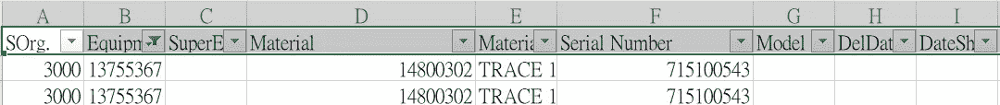
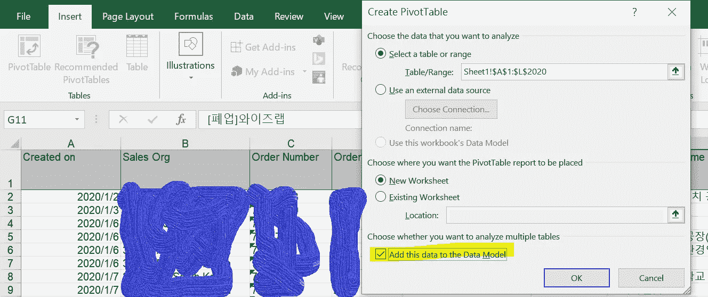
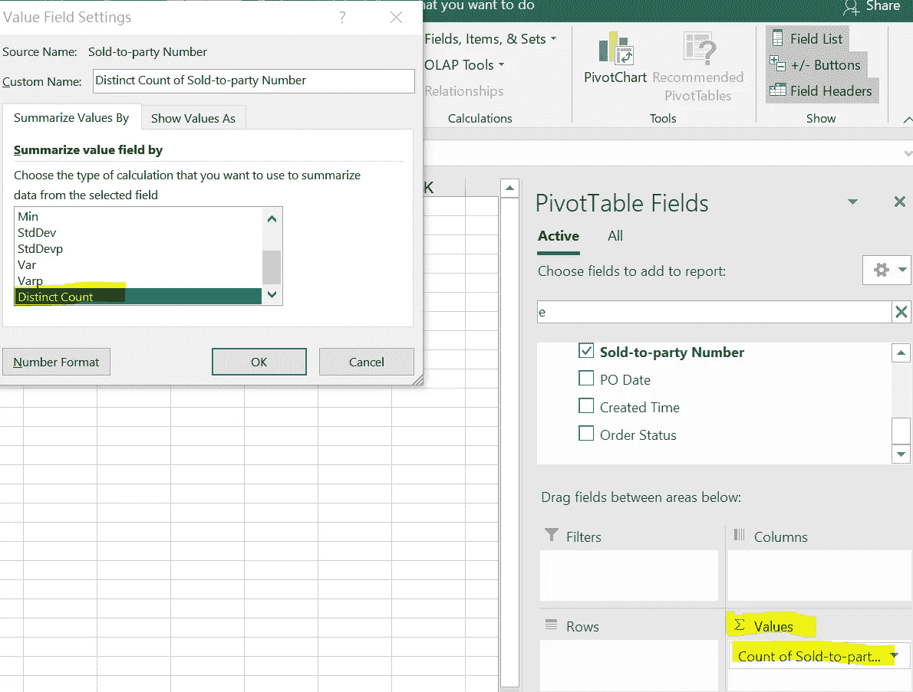

# 方法(使用 Python、SQL、R、Pivot)来显示数据的不同计数

> 原文：<https://medium.com/analytics-vidhya/ways-using-python-sql-r-pivot-to-show-a-distinct-count-of-your-data-8e6a8b34a8e2?source=collection_archive---------27----------------------->

首先，我想解释一下为什么非重复计数在数据分析中如此重要。无论你是在数据探索阶段，还是在为指标设定分母，做出一个清晰的反映现实的计数是绝对重要的。否则，您可能会有过度繁荣的指标或概述。通过这种方式，您可以使用 SQL、Python、R、Pivot 或其他工具来实现。

# **在 Python 中**

使用库中的函数绝对方便。它在这里

```
table.groupby('your_group_columns').your_target_column.nunique()
```

在 python 3.7 中，您还可以使用函数(用于列表数据)

```
list(dict.fromkeys(list_name))
```

实际上，在 Python 中有许多方法可以进行非重复计数，这完全取决于您使用的数据类型，您可以在采用非重复函数之前进行数据类型转换。

# 使用 SQL

给你，我相信你们都很熟悉 SQL。

```
SELECT count(distinct target_column) FROM table GROUP BY group_column;
```

# 在 R 中

可以在 R 中使用一个名为 dplyr 的包，参考下面的例子。

```
df1 <- data.frame(x=c(2,2,3,4),y = c(“a”,”b”,”c”,”b”))distinct(df1)
```

# 使用透视

对于经常使用 Excel 或者您的大部分数据都在 Excel 表中的人来说，这可能是一种帮助您的合适方法。

这里有一个例子，我们有一台设备有多个维护合同。但是当我们试图从设备的角度进行分析时，我们可能需要不同的设备。



同一设备的两份合同

因此，我们在这里使用 pivot，在创建数据透视表时，只需简单地单击“将该数据添加到数据模型”即可。



在数据透视表中，找到列选项并选择“非重复计数”



瞧，我们找到了。

由于数据计数通常是数据集的基本数字，许多其他数字或指标是根据总计数计算的，因此我们提供精确和准确的总计数非常重要。保持联系，获取更多分析技巧。