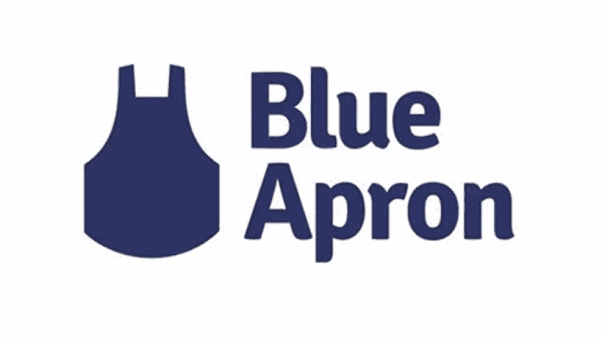

# 蓝色围裙数据科学面试问题

> 原文：<https://medium.com/analytics-vidhya/we-are-losing-24-customers-every-year-come-up-with-atleast-5-hypothesis-and-validate-them-fd31fb290252?source=collection_archive---------25----------------------->

蓝色围裙的数据科学面试问题(这是一个提供公司订阅模式工作的基本套件)

因此，在跳到解决方案之前，让我们了解这家公司是如何运营的，或者确切的商业模式是什么，现在是第一个提示，领域知识在机器学习中同样重要，如算法、编码、数学。没有准确的领域知识，就不可能建立一个可以解决现实世界问题的模型。根据领域知识，我们制造特征，这被称为特征工程。

蓝色围裙为任何一餐提供生食必需品，比如说我想吃健康食品，但是我没有时间，他们会怎么做？

*   他们会问我想要什么，
*   他们会制作一个工具包，里面有这道菜需要的所有基本食物
*   我刚从办公室回来就送过来。

所以现在我可以自己做饭，我不需要购物，我不需要切蔬菜等等，所以我需要 10 分钟来吃健康的食物。这整个模式是按月订阅的。

因此，如果人们在使用一段时间后没有回来，这使得这种模式成为一种新奇的业务，而不是一种粘性，让我们看看可能是什么原因。

1.  人们只想尝试 1-2 个月，然后停止。
2.  人们对同样的菜单感到厌烦。
3.  有可能的是，当办公室工作繁忙时，夫妇们会选择它，尝试几个星期，当事情变得正常时，他们会回到正常的生活中。
4.  产品预期不匹配。
5.  糟糕的客户支持。

没有一个假设是非常简单的，假设人们只使用了 2 个月，那么为了验证，请查看数据，检查穿着蓝色围裙的客户的寿命，并找出百分位数。

假设我们有 70%的客户在 2 个月内离开了订阅，只有 30 %的客户在使用后使用它，我们将通过以下方式验证假设:

1.  在客户结束订阅之前，让他们填写一份表格，询问离开的原因。
2.  应用单词包、单词云、tf_idf 技术，查看哪些是客户使用最频繁的单词，并绘制单词云图

酒店表单词云

3.将此报告提交给高级管理层，以便根据以上几点中发现的因素开展工作。

## 感谢阅读，享受机器学习…

# 尼舍什·戈吉亚

*   ***如果你喜欢这个，*** [***跟我来这里***](/@nishesh.kumar) ***了解更多***
*   ***有兴趣合作吗？下面我们连线上***[***insta gram***](https://www.instagram.com/nishesh_gogia/)