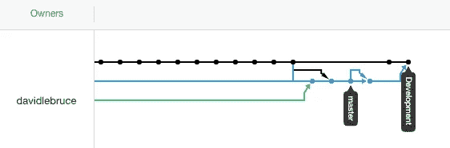
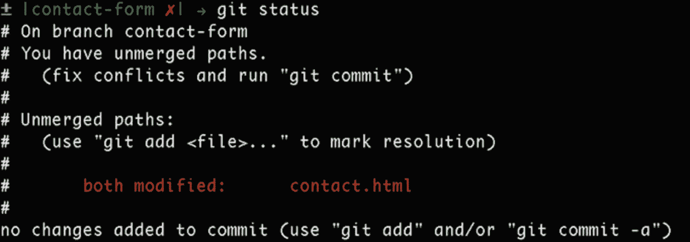

# 我们可以 GitHub，你也可以

> 原文：<https://medium.com/analytics-vidhya/we-can-github-and-so-can-you-754c658027ad?source=collection_archive---------21----------------------->

GitHub 存储库的网络图

如果你和我一样，刚开始你的数据科学之旅，GitHub 就像这个无处不在的开源代码宝库一样向你逼近。你不确定如何参与其中，但你知道有一天未来的雇主会把它视为你的各种投资组合。你渴望有一天加入 GitHub 的行列，并向全世界分享你自己的优雅代码，从中汲取一些有意义的见解或灵感。只有我吗？

如果是你，那么和我一样，直到你开始理解 GitHub 作为团队协作工具的用途，你才真正开始了解它的美丽。当你明白过来时，它把你带回到你第一次使用谷歌文档的时候，你的朋友从另一台电脑上输入了“你好{你的名字}”这让你大吃一惊。对我来说，在任何时间、任何地点与任何人合作的能力仍然令人难以置信！

> ！！！~合并冲突~！！！

[https://css-tricks.com/deal-merge-conflicts-git/](https://css-tricks.com/deal-merge-conflicts-git/)

尽管 GitHub 是一个令人惊叹的版本控制系统和协作工具，但让您的 GitHub“出海”可能需要一点时间。如果您是第一次使用 GitHub 进行协作，无论您是否熟悉 Git，GitHub 都可能成为您和您的团队努力工作取得成功的主要障碍。如果你像我一样开始一个训练营，提前知道如何做这些事情会让你省去如何和你的伙伴分担工作的麻烦。

为了关注与 GitHub 的协作过程，我将假设您(或您团队中的其他人)已经创建了您的 GitHub 库，现在将开始分支和合并您的不同工作线。如果你还没有，并且需要学习更多的步骤(创建你的 GitHub repo 并将其克隆到你的本地计算机，等等。)，我推荐从这里[开始](https://www.youtube.com/watch?v=0fKg7e37bQE)，如果你有更多一点的时间去钻研一些东西，[麻省理工学院的这个讲座](https://missing.csail.mit.edu/2020/version-control/)非常基础，在评论区上面的链接里有一些讲稿，你可以通读。当你完成后，回来按照这个简单的教程进行协作。

# **git 拉**

Git 拉的是 BAE！如果您在开始工作时没有获取项目资源库的最新版本，那么您已经开始了错误的工作。无论何时开始工作，执行 git pull 对于确保您的团队拥有最新版本的代码是至关重要的。稍后您将再次这样做，因为这些都不是在真空中发生的，并且在您工作的这段时间内，很可能您的一个队友已经更新了存储库。跳过这一步肯定会为你不想要的合并冲突创造更多机会，而许多机会可以通过简单地取消新的回购来避免。

# **git 分支**

一旦你拿到货，就该开始工作了。Git 分支只是在那个时间点创建主分支的副本。(复制您想要的任何预先存在的分支，以便对其进行更改和更新)。如果您想要处理的分支已经存在，请使用*git branch existing _ branch _ name*如果您正在创建一个新分支，请使用 *git branch name_branch* ，然后使用 *git checkout new_branch* 移动到该分支。(作为一个小捷径，如果你想绕过 2 个命令的使用将 git branch 和 git checkout 结合起来，你可以使用 *git branch -b new_branch* 。这将同时创建并将您移动到所述分支)。

如果你已经走了这么远…停下来，松一口气。您暂时不必考虑 git，因为您现在已经能够完成您来这里要做的工作了。制作你的文件或在回购中打开一个你知道你应该做的文件，施展你的魔法。当你完成了你计划要做的任务，是时候回去工作了(我不得不用“git”代替“get”至少一次，我保证不会再犯)。

# git add、git commit 和 git stash(多任务者的秘密武器)

每当你完成了你要做的事情，你需要首先把它添加到暂存区。)然后用一条描述性消息提交您添加到暂存区域的工作(*git commit-m ' description of what you completed in this commit '*)。如果你发现自己对工作还不满意，或者工作不值得“投入”，git stash 是你新的最好的朋友。当你有未完成的工作或更紧迫的事情要处理时，Git stash 是最方便的工具。我不会在这里讲太多的细节，但是把它想象成一个草稿文件夹，你可以稍后再回来，而不用担心提交未完成的工作。[这个](https://git-scm.com/book/en/v2/Git-Tools-Stashing-and-Cleaning#_git_stashing)真的会帮到你。但是现在，让我们想象我们已经承诺了我们想要的。

# git 结账大师

现在你已经提交了你的优秀作品，你会想要跳回那个主分支。

# git 拉(又来了！)

一旦你到了那里，再拉一次！正如我之前提到的，在我们开发自己的分支时，可以对主分支进行任何数量的更改，所以不要跳过这一步是很重要的。

# git 签出 new_branch

一旦你第二次拉了，你应该返回到你的 new_branch 并进行合并。

# git 合并主服务器

总是从你想要合并的分支合并，并在终端 *git merge master* 中指定你想要合并到的分支。

# git 推送

现在，我们期待已久的时刻到了:加油。通过推送，您可以用已完成的工作更新远程分支。

# 从 GitHub 创建一个拉请求

当您将工作推送到远程存储库时，每个人都可以看到它。从 GitHub 网站上，您的团队成员可以很容易地检查您提交的代码，并从那里创建一个“拉请求”,将您的代码拉入主分支(或任何一个分支)。

现在，当进行一个团队项目时，你应该在《功夫熊猫 2》结束时进入像 Po 一样的心流状态，内心平静——像你的工作一样推动和拉动 git 提交，因为在这个数据科学之旅中，它可能很快就会成为你的工作。祝你一切顺利！

功夫熊猫 2

但是请理解，如果你和你的团队不能清晰、有规律、有效地交流，世界上所有的 Git 命令都是无用的。良好的沟通，你一定会比其他方式更快地达到你的目标。感谢阅读！

**有益链接**

**观看:**

[GitHub 拉请求(11:21)](https://www.youtube.com/watch?v=oFYyTZwMyAg)

[GitHub 协作(6:34)](https://www.youtube.com/watch?v=SCZF6I-Rc4I)

**改为:**

[基本分支和合并](https://git-scm.com/book/en/v2/Git-Branching-Basic-Branching-and-Merging)

[了解 GitHub 流程](https://guides.github.com/introduction/flow/)

[命令行最佳实践](https://www.git-tower.com/learn/git/ebook/en/command-line/appendix/best-practices/)

**供参考:**

[饭桶小抄](https://www.git-tower.com/blog/git-cheat-sheet/)

[成对 Git](https://backend.turing.io/module1/lessons/git_for_pairs)