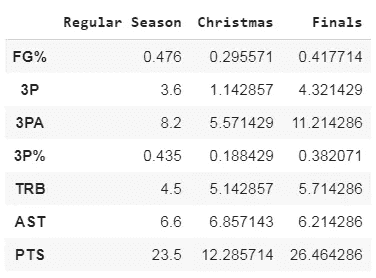
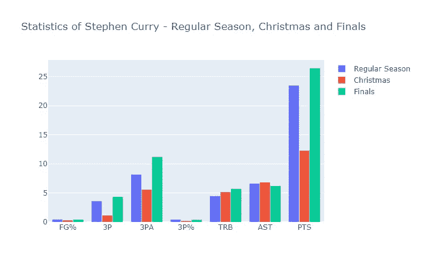
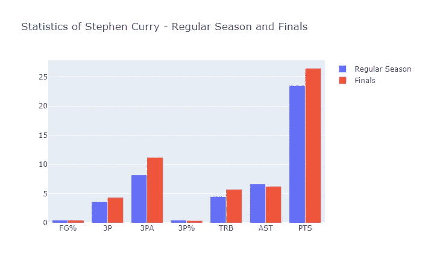
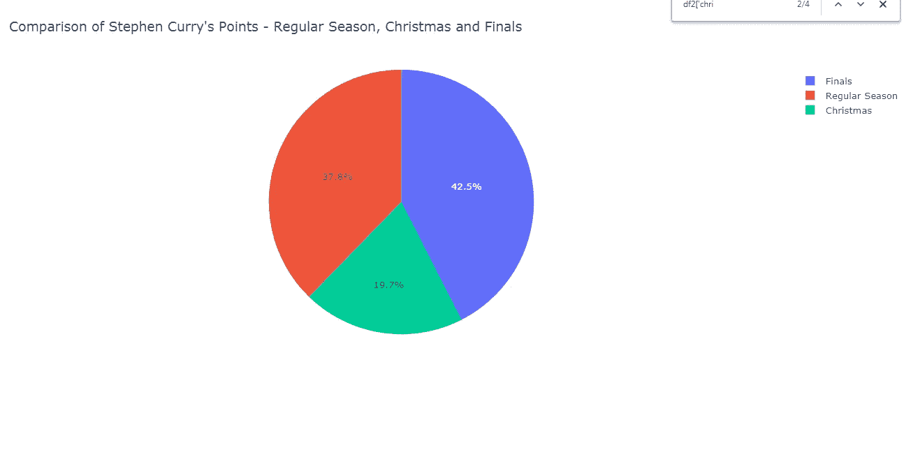
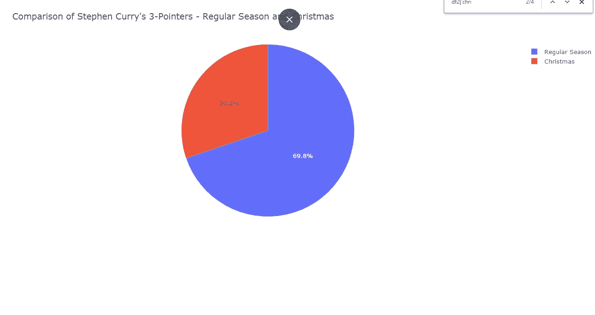

# 与普遍看法相反，斯蒂芬·库里在大型比赛中被高估了

> 原文：<https://medium.com/analytics-vidhya/we-will-compare-stephen-currys-statistics-in-the-nba-finals-and-on-christmas-day-games-compared-6d1d5ba84759?source=collection_archive---------23----------------------->

斯蒂芬·库里拥有 NBA 历史上最具标志性的职业生涯之一。但是，尽管库里很伟大，但在重大比赛中，他已经不再是原来的那个样子了。

我们将把斯蒂芬·库里在 NBA 总决赛和圣诞节比赛(我定义为大型比赛)中的统计数据与他的总体统计数据进行比较，以确定他的表现是否在大型比赛中下降。过去十年我一直密切关注 NBA，几乎没有听到任何对库里在大型比赛中挣扎的批评，即使是我信任的一些最有知识的 NBA 媒体成员，如比尔·西蒙斯和瑞安·鲁西洛。因此，这可能是许多人感兴趣的话题。

斯蒂芬·库里已经成为 NBA 历史上最伟大的射手。他一手改变了比赛，使之更加以 3 分为中心，在这个过程中把传统的中锋赶出了比赛。他的三分数据 T1 和 T2 的罚球命中率 T3 都打破了记录，无论从哪个角度看，他都是这个时代最好的球员之一。也就是说，他在大型比赛中的数据有点令人印象深刻。

纵观 NBA 的历史，有一些超级明星球员在大型比赛中变得更好，有一些相对保持不变，也有一些大幅下降。不像历史上一些最好的球员，如迈克尔·乔丹和勒布朗·詹姆斯，当赌注很大时，他们的数据甚至更好，甚至不像魔术师约翰逊和凯文·杜兰特，无论比赛有多关键，他们的表现都差不多，库里似乎在重大比赛中后退一步。

当媒体讨论在大型比赛中落选的 NBA 球员时，他们经常提到卡尔·马龙、詹姆斯·哈登和大卫·罗宾逊这样的名字，但斯蒂芬·库里很少被归为这些人之一。这当然有助于库里在大赛中的声誉，他在鼎盛时期赢得了三个冠军，包括三个令人难以置信的西部冠军系列赛(WCF)的统计系列赛，以进入总决赛。然而，这三场 WCF 系列赛中的两场并没有对抗非常好的防守，2015 年的休斯顿火箭队和 2019 年的波特兰开拓者队。虽然圣诞节游戏不经常被视为传统游戏，但它们通常以优秀的球队相互对抗为特色，并且这些游戏比普通的常规赛更有季后赛的感觉。电视收视率特别高，球队比平时打得更努力，许多球员带着恼人的伤病强迫自己参加比赛。在 NBA 总决赛和圣诞节比赛期间，库里在全国电视转播的比赛中面临着出色的防守，但他一直令人失望或表现不佳。在本赛季常规赛开始之前，库里取得了 NBA 历史上最好的 5 年成绩之一，赢得了 2 个 MVP 奖项，但他已经把自己放在了超级巨星的类别中，只是在大型比赛中不太一样。

库里在 NBA 总决赛的投篮次数大大低于他的常规赛数据，以及他在 NBA 总决赛以外的季后赛中的数据。与圣诞节的情况类似，库里在 NBA 总决赛中面对的主要是好的或伟大的防守，这可能解释了他非典型的投篮命中率。然而，与他圣诞节的比赛不同，库里至少在 NBA 总决赛中打出了典型的数据统计，并在绝大多数比赛中得到了 20 分以上。

如果库里在 2016 年和 2019 年的总决赛中接近他的平均常规赛数据，勇士队可能会连续 5 次获得 NBA 总冠军，这是有史以来第二次获得总冠军。库里在 NBA 总决赛中最糟糕的表现是在 2016 年，当时他的投篮命中率高于他在第一场和第七场比赛中的得分。同样值得注意的是，库里还没有赢得过 NBA 总决赛 MVP，尽管在他的黄金时期赢得了 3 次冠军，参加了 5 次总决赛。库里拥有 NBA 历史上最辉煌和最著名的职业生涯之一，这是当之无愧的，但他的局限性太过低调。

从库里在所有三种类型比赛中的数据条形图中最突出的是，与他的常规赛和 NBA 总决赛平均水平相比，他在圣诞节比赛中糟糕的投篮和得分数据。库里的篮板和助攻在他参加过的所有类型的比赛中都是相似的，而他的投篮在大型比赛中有所下降。尽管库里在总决赛的每场三分球比常规赛多 0.7 个，但他需要多投近 4 个球才能做到这一点，而根据他在常规赛的百分比，我们预计只需要再投 1.8 个三分球就可以跳那么多。对于库里这样一个最大强项是投篮的明星球员来说，他的投篮命中率在大型比赛中如此急剧下降是极其令人担忧的。

令人难以置信的是，斯蒂芬·库里在圣诞节的 7 场比赛中场均得分低于 12.3 分。事实上，库里甚至没有在他的任何一场圣诞节比赛中得到 20 分。如果不是因为包括计入常规赛的圣诞节比赛，库里的常规赛场均得分甚至会稍微高一点。

库里的 NBA 总决赛和他的整个常规赛之间的主要区别是他的投篮命中率，从常规赛的 47%下降到总决赛的 41.8%，其中 3 分命中率从 43.5%下降到 38.2%。

这张饼图中最突出的是圣诞节的份额有多小。由于我们比较了三种情况，库里在圣诞节比赛中每场比赛的得分比例不到 20%，而不是他的平均得分占总产出的三分之一。

库里在常规赛中的三分球命中率是圣诞节比赛的两倍多。由于库里最大的优势是三分球，而他充其量只是一个平庸的防守球员，在这种情况下，他的价值远远低于你对这一代最伟大球员之一的期望。

制作这个博客中的图表所需的所有代码都可以在这里找到。