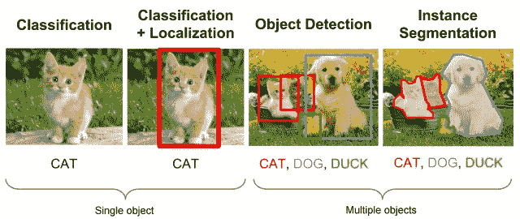
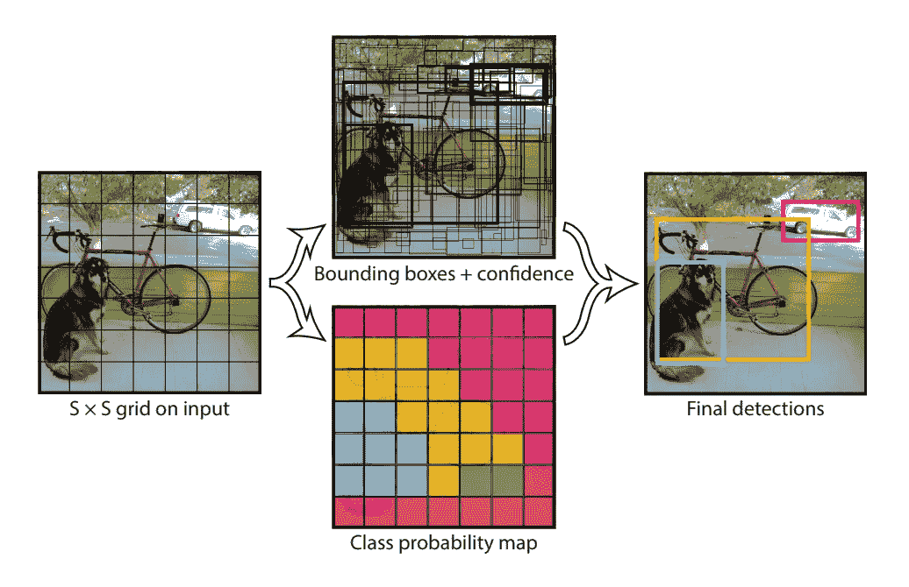
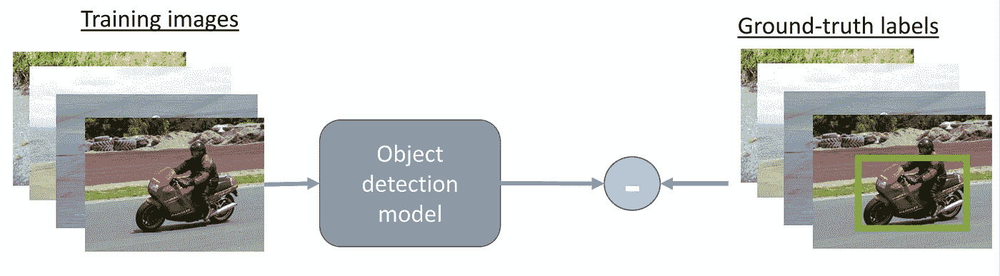
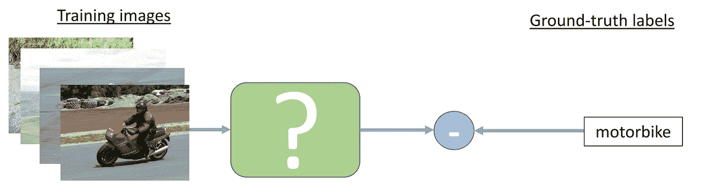
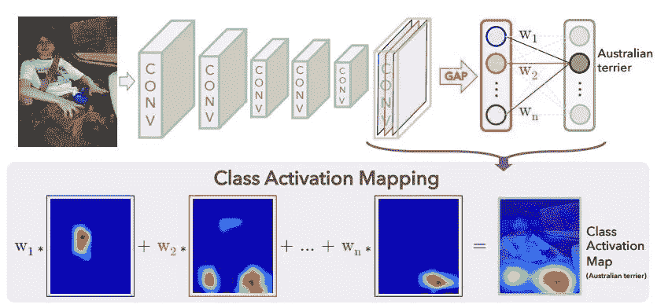
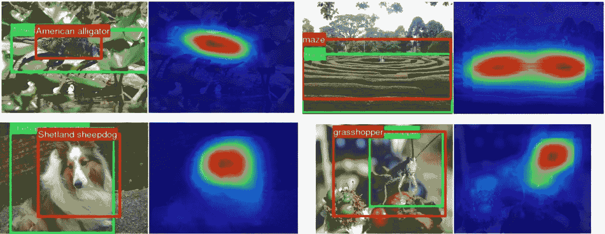

# 用于目标定位的弱监督学习

> 原文：<https://medium.com/analytics-vidhya/weakly-supervised-learning-for-object-localization-4b73d4f4f4a6?source=collection_archive---------9----------------------->

监督学习技术需要大量高质量的标注作为标签。对于像分割这样的任务，创建注释的时间和成本通常高于分类这样的任务。为了克服这些限制，一个低成本的选择是利用大量收集的低质量注释，即使用弱监督学习。

在本文中，我们将重点关注将 WSL 技术应用于基于图像的数据，确切地说，是用于对象定位的 WSL。

# 目标定位

对象定位是指识别图像中一个或多个对象的位置，并围绕它们的范围绘制边界框。对象检测将图像的定位与图像中一个或多个对象的分类相结合。

对象定位定位图像中对象的存在，并用边界框突出显示它们的位置。

> ***输入:*** *有一个或多个对象类的图像。*
> 
> ***输出:*** *一个或多个边框高亮显示对象类。*

**用于对象检测的一些性能最佳的 DL 模型:**

*   R-CNN
*   快速 R-CNN
*   更快的 R-CNN
*   YOLO
*   YOLOv2 和 YOLOv3

# 弱监督学习

> 虽然传统的监督方法需要边界框注释来学习这样的任务，但是**弱监督对象定位(WSOL)方法可以仅利用图像级标签(例如图像中的对象列表)来学习。**

**标准监督对象检测与弱监督方法**

标准物体检测方法

弱监督目标检测

> 在弱监督方法中，**不是提供基本事实**标签，而是在训练时做一个**比测试时所需输出更低程度的注释**。

*   当图像是正面的时，至少存在一个来自目标类别的对象实例。
*   当图像为负时，不存在来自目标类别的对象实例。

解决这个问题的 DL 方法是找到感兴趣对象的**类激活图** ( **CAM** )并用一个边界框突出显示它。**类激活图**在论文中介绍了[*利用 CNN 中的全局平均池学习深度特征进行判别定位*](https://arxiv.org/abs/1512.04150) 。一个 **CAM 表示 CNN 用来识别类别的区分区域**。

CNN 的架构与 CAM | [来源](https://miro.medium.com/max/1400/1*hXdqemUHnAlwKUIcl-4PDA.jpeg)

> 该网络主要由众多卷积层组成，紧接着是最终输出层之前的**全局平均池**。
> 
> 简单地说，我们可以说 **CAM** 基本上确定了具有图像的主要成分的区域，该区域确定了该图像的类别。

现在，我们可以使用一个简单的阈值方法来分割凸轮，并获得一个包围盒。首先，CAM 中值高于 CAM 最大值 20%的区域用于创建分割图。然后，绘制一个边界框以紧密包围分割图中的最大连通分量。

*周等人的汉化成果。* [*来源*](https://lionbridge.ai/wp-content/uploads/2020/04/bharath-06.png)

## 对于实施 CAM(使用迁移学习):

跟随这篇文章: [**使用 GradCam**](https://towardsdatascience.com/demystifying-convolutional-neural-networks-using-gradcam-554a85dd4e48) 揭开卷积神经网络的神秘面纱

> 请继续关注定制模型的实现。；)

要阅读更多关于 WSOL 的内容，以下是基于它的一些论文:

*   [用于弱监督定位的图像间通信](http://www.ecva.net/papers/eccv_2020/papers_ECCV/papers/123640273.pdf)
*   [用于弱监督目标定位的组合类激活图](http://openaccess.thecvf.com/content_WACV_2020/papers/Yang_Combinational_Class_Activation_Maps_for_Weakly_Supervised_Object_Localization_WACV_2020_paper.pdf)
*   [DANet:弱监督对象定位的发散激活](http://openaccess.thecvf.com/content_ICCV_2019/papers/Xue_DANet_Divergent_Activation_for_Weakly_Supervised_Object_Localization_ICCV_2019_paper.pdf)
*   [反思弱监督目标定位路线](https://arxiv.org/pdf/2002.11359.pdf)

请联系我:

领英:[https://www.linkedin.com/in/manmohan-dogra-4a6655169/](https://www.linkedin.com/in/manmohan-dogra-4a6655169/)

GitHub:[https://github.com/immohann](https://github.com/immohann)

推特:[https://twitter.com/immohann](https://twitter.com/immohann)