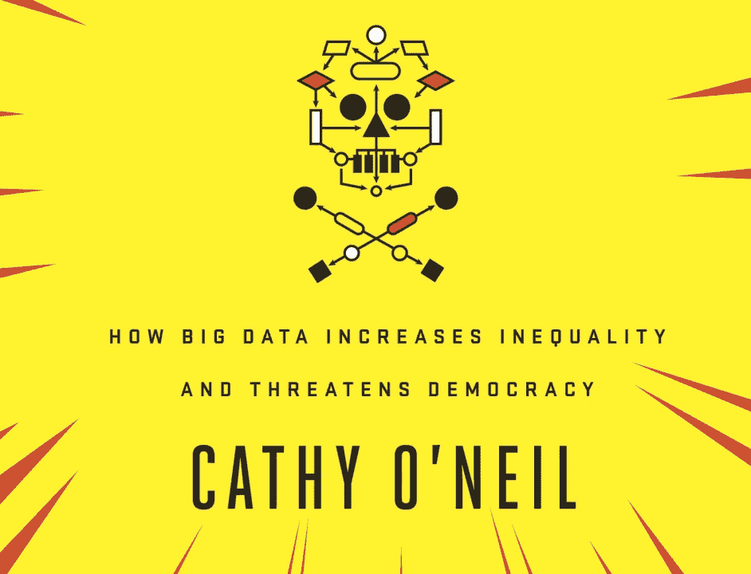

# 数学毁灭的武器:读书俱乐部

> 原文：<https://medium.com/analytics-vidhya/weapons-of-math-destruction-book-club-64ba3d642739?source=collection_archive---------43----------------------->

我们的女性数据每月读书俱乐部最近讨论了凯茜·奥尼尔的*数学毁灭武器*，对我来说占主导地位的一个想法是:“这是人工智能将打破我们的方式吗”？对于那些还没有读过它的人来说，名义上的武器是不透明的算法或程序，会同时对许多人造成不公平的劣势。这种危害以规模、隐秘性、破坏性来量化，以赢得“数学毁灭武器”的称号。

在我们的谈话中出现了许多话题:道德、最佳实践和对整个社会的评论，但我们最关心的是:我们如何从这里向前迈进？大数据出现的时间并不长，从奥尼尔的角度来看，与有缺陷的数据模型相关的负外部性能够同时控制许多人并造成损害只是几十年的事情。

那么下一个是什么*？意识当然是关键，但除此之外，我们作为一个社会是否已经决定如何最好地处理这些数据驱动的差异？我们了解这个问题的深度和广度了吗？奥尼尔的工作，以及活动家的工作，是描绘自动化可能产生的问题的严重性，并帮助设计未来的模型，将对公共利益的意外伤害降至最低。*

近年来，随着私营部门从法律角度认可管理数据和算法的重要性，我们看到了数据治理方面的长足进步，这很有帮助。让数据模型民主化，并允许围绕某些模型如何加权、奖励谁以及最重要的是惩罚谁(以及如何惩罚)进行清晰的沟通，对于保持这种对话至关重要。数据是否以一种所有人都可以访问的方式传达见解？随着数据的民主化，你还会遇到谁是最好的数据管理者的问题。在最近的一个案例中，波士顿拒绝在公共场所使用面部识别程序，理由是担心道德和安全问题:

“它有明显的种族偏见，这很危险……它对公民自由也有一种寒蝉效应。因此，在一个我们看到如此多以游行和抗议权利为形式的直接行动的时代，任何一种可能被用来从本质上冷却言论自由或……或多或少地监控激进主义或活动家的监控技术都是危险的”。-与国务委员吴弭一起提出该法案的国务委员里卡多·阿罗约

例如，地理追踪无处不在，现在有无数的程序可以看到你在杂货店的什么地方，或者将陌生人在公共场合给你拍的照片与你的个人信息进行匹配。我们应该多久给一次许可？谁能把这些数据刮下来，用于个人用途？商业用途？最近，OkCupid、Tinder 和 Grinder 的客户约会偏好和位置数据被广告和营销公司以可能违反隐私法的方式收集和使用，引发了争议。

然后谈话扩大到伦理问题。硕士项目和(大多数)新兵训练营和 MOOCs 中的数据科学家会被教授一些关于伦理、A/B 测试和实验设计的知识。这样够了吗？大概不会，但是很难说。数据误用、欺诈性统计、确认偏差都是问题，即使是出于最好的意图。观察家们已经在一定程度上改变了数据。然后，我们进入了最坏的意图，因为我们看到奥尼尔警告说，让游说者保护向他们支付数据隐私和数学破坏武器问题的公司是危险的。

“就我而言，我们正处于战争之中。另一边是游说者。而我们完全被包抄了。”—凯西·奥尼尔

我们正在见证数据世界的狂野西部。新的法规正在起草，以控制人类生活的一个新的方面，坦率地说，诉讼可能是定义这个新未来的一种方式。从公立学校教师评估到运动队，到网上购物者，再到你的社交媒体，私营部门和政府将共同定义这些界限到底是什么。

我们需要一起更加关注富有同情心的算法。如果数学毁灭武器是不透明和不公平的算法，对许多人造成伤害，加剧不平等、性别歧视和种族主义，那么我们为什么不能建立算法，将公共资源导向最需要的地方:住房、教育、技能提升、互助网络、医疗保健和绿色环保。考虑到我们正处于衰退之中，许多人的生活质量下降，为未来积累资源将是至关重要的。“数据为善”是我在无数活动中听到的一句话。如果破坏数学的武器正在造成伤害，那么关注非营利组织的数据模型，以一种非表演性的方式支持社会事业和非政府组织，但同时切实帮助许多人的福祉，这正是我们需要集中努力的地方。

在会议期间，我们一度开玩笑说，我们需要一个“永不妥协”的数据。如果你们中的任何人正在阅读这篇文章，并且想“这可能是我吗？”答案是:很可能。我们比以往任何时候都更需要关心数据伦理的热情的人！凯茜·奥尼尔有一个数据“权利法案”的梦想。如果我们要写这样的东西，我们会把什么放在那里？作为普通公民，哪些透明度和自主权的标志对我们最重要？我的感觉是，当我们更接近这个问题的答案时，我们也将更接近一个更公平的数据文化。

愿机会永远对我们有利。

艾琳·布拉迪斯

纽约市分会共同牵头——数据中的妇女

人工智能中的女性——项目总监 WAI 颁奖暨黑客马拉松

[https://www . nytimes . com/2020/01/13/technology/grindr-apps-dating-data-tracking . html](https://www.nytimes.com/2020/01/13/technology/grindr-apps-dating-data-tracking.html)

[https://www . wbur . org/news/2020/06/23/Boston-face-recognition-ban](https://www.wbur.org/news/2020/06/23/boston-facial-recognition-ban)

[https://medium . com/data-feminism/5-questions-on-data-justice-with-cathy-oneil-87f 42355 ce 55](/data-feminism/5-questions-on-data-justice-with-cathy-oneil-87f42355ce55)