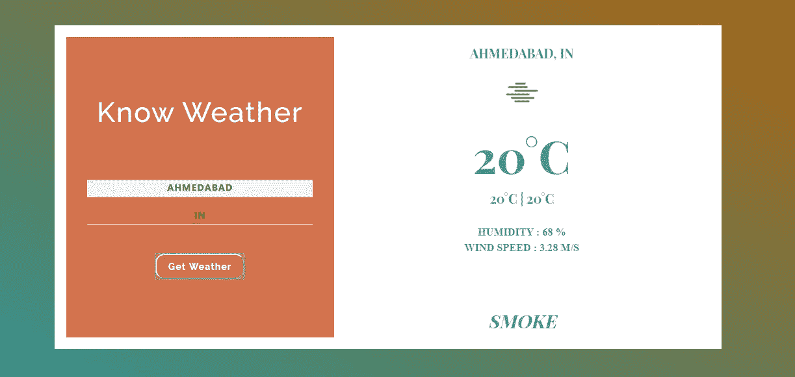
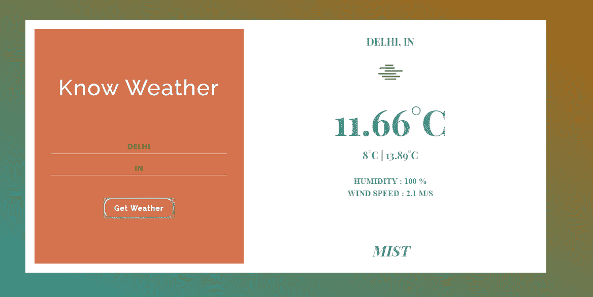

# 带 React 的天气应用

> 原文：<https://medium.com/analytics-vidhya/weather-app-with-react-adaa7268bbdb?source=collection_archive---------12----------------------->

**Github**:【https://github.com/mehulk05/React-Weather-App 

【https://mehulk05.github.io/React-Weather/】现场试玩:[](https://mehulk05.github.io/React-Weather/)

# 介绍

React 是用来创建交互式 ui 的最流行的 JavaScript 库之一。只需为应用程序中的每个状态设计视图，React 就会在数据发生变化时高效地更新和呈现正确的组件。

在本教程中，我们将学习如何构建一个天气应用程序，当您使用 React 提供某个特定城市的天气情况时，该应用程序会显示该城市的天气情况。

# 先决条件

对于这个项目，你不需要太多，你需要基本的 web 开发工具(编辑器，互联网连接，开发机器)和 React 版本 16 或更高版本。

*   React 的基础
*   反应还原
*   一个开放地图 Api 密钥

# 设置反应天气项目

打开命令提示符并创建一个根文件夹来创建项目文件。

```
mkdir React-Weather
```

然后将目录更改为创建的目录，并安装 create-react-app 包:

```
cd React-Weather
npm install create-react-app React-Weather
npm start
```

安装过程将立即开始，一旦完成，您将在 localhost:3000 中的浏览器上成功设置并启动 react 项目。接下来，在您喜欢的编辑器中打开项目文件夹并开始编码。

因此，首先打开 App.css 文件并清除其中的数据，因为我们打算添加我们自己的自定义样式。此外，打开 App.js 文件并清除包含的数据，我们将从头开始构建。最后，删除 logo.svg 文件，因为我们不需要 React 徽标出现在我们的项目中。

# 应用程序组件

这将是我们将要处理的主要文件。它将是一个基于类的(如果你不知道类和函数之间的区别，先去检查一下)组件，因为它基本上将作为我们接下来要创建的每个其他组件的包装器组件:

# 其他组件

鉴于我们正在构建的应用程序的性质，我们还需要三个组件:

*   标题组件:显示应用程序的标题和迷你描述
*   UserInput 组件:显示用户输入的表单
*   天气组件:显示表单中返回的城市天气情况。

因此，让我们继续创建这些其他组件，并对它们进行相应的设置。首先，我们在 src 下创建一个名为 components 的新文件夹，在这个文件夹中，我们创建三个新文件( *title.js、UserInput.js 和 weather.js* )。

你可以访问我的 Github repo 来检查我的代码

**Title.js**
*导入*反应*来自*“反应”；

```
const Titles = () => (
<div>
<h1 *className*="title-container">Know Weather</h1>
</div>
);*export* *default* Titles;
```

**UserInput.js**

```
import React from "react";const Form = props => (
  <form className="form-container" onSubmit={props.getWeather}>
    <input
      className="city-container"
      styles="color: #fff"
      type="text"
      name="city"
      placeholder="Enter city"
    />
    <input
      className="country-container"
      type="text"
      name="country"
      defaultValue="IN"
      placeholder="Enter country"
    />
    <button>Get Weather</button>
  </form>
);export default Form;
```

天气. js

```
import React from "react";const Weather = props => (
  <div>
    {props.city && props.country && (
      <p className="weather_key location">
        {props.city}, {props.country}
      </p>
    )}
    {props.temperature && (
      <p className="weather_key">
        https://openweathermap.org/img/wn/${props.weather_icon}[@2x](http://twitter.com/2x).png`}
        />
      </p>
    )}
    {props.temperature && (
      <p className="weather_key temperature">{props.temperature}°C</p>
    )}
    {props.temperature && (
      <p className="weather_key min_max_temperature">
        {props.min_temperature}°C | {props.max_temperature}°C
      </p>
    )}
    {props.humidity && (
      <p className="weather_key humidity">HUMIDITY : {props.humidity} %</p>
    )}
    {props.wind && (
      <p className="weather_key wind_speed">WIND SPEED : {props.wind} m/s</p>
    )}
    {props.description && (
      <p className="weather_key conditions">{props.description}</p>
    )}
    {props.error && <h3 className="weather__error error">{props.error}</h3>}
  </div>
);export default Weather;
```

通过必要的导入将所有这些组件包含在您的应用程序组件中。接下来，您可以启动您的服务器，并可以检查。



# 结论

我们现在已经看到了当我们使用功能组件时，代码库变得多么可读，这只是一个简单的项目，它的功能随着更复杂的代码而变得更好，希望你能从这里学到一些东西。

访问我的 Github 回购相同

[](https://github.com/mehulk05/React-Weather-App) [## mehulk 05/React-天气-应用程序

### 这个项目是用 Create React App 引导的。在项目目录中，您可以运行:在…中运行应用程序

github.com](https://github.com/mehulk05/React-Weather-App) 

也可以在这里阅读我的博客**使用 Angular 和 Bootstrap 的个人投资组合:**

[https://medium . com/JavaScript-in-plain-English/personal-portfolio-using-angular-8-and-bootstrap-5d de 6 fc 7 cf 9b](/javascript-in-plain-english/personal-portfolio-using-angular-8-and-bootstrap-5dde6fc7cf9b)