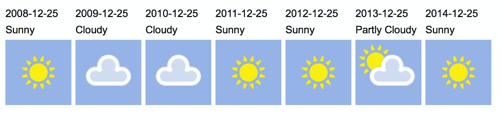
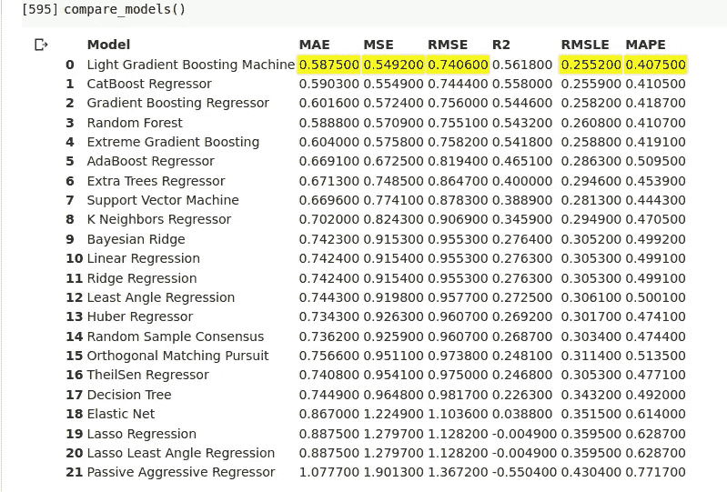
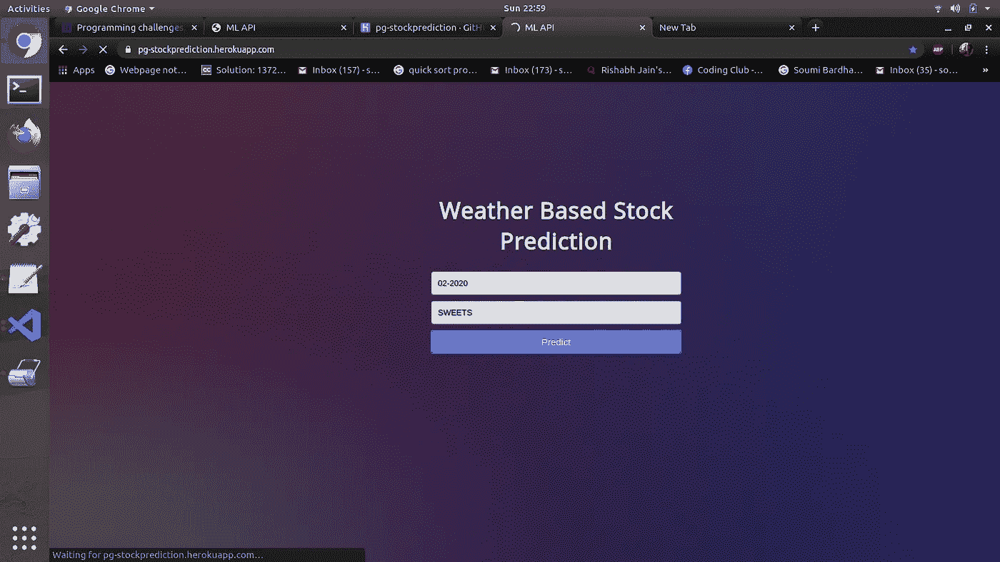

# 基于天气的股票预测

> 原文：<https://medium.com/analytics-vidhya/weather-based-stock-prediction-with-pycaret-4d604cdeb68f?source=collection_archive---------20----------------------->

pycaret.org

**实时**甚至**预测零售店缺货**以**划算**通过**预测每个产品当月的销量**。

由于市场上零售商之间的竞争日益加剧，公司更加关注**预测分析技术**，以便**降低成本，提高生产率和利润。**

## 问题:

*   库存过多(积压)和缺货(缺货)对零售商来说是非常严重的问题。
*   销售和顾客流失是零售商面临的一个关键问题。考虑到零售业的竞争和财务限制，拥有一个准确的需求预测和库存控制系统对于有效运营的管理至关重要。

这里有**预测分析**，缺货预测更加准确。

**预测分析**是利用信息、事实计算和机器学习方法，根据记录的信息来区分未来结果的概率。

*   天气对股票的准确预测起着至关重要的作用。
*   研究结果表明，天气对许多产品类别和商店类型的商店客流量和销售额有显著影响。

我们在有**位置数据**的 [**卡格尔**](https://www.kaggle.com/) 上查找数据集，这样我们就可以得到各个日期的**位置**的**天气数据**。

 [## 杂货店 2018 年度总销售额数据。

### 数量、产品、价格和利润的销售信息。

www.kaggle.com](https://www.kaggle.com/agatii/total-sale-2018-yearly-data-of-grocery-shop) 

我们拥有的数据集是位于波兰一个拥有 30000 人口的城市的一家超市的各种快速消费品的销售数据。

*   商店位于城市的黄金地段，提供各种产品，如普通食品和基础化学、卫生用品、新鲜面包、糖果、当地蔬菜、乳制品等。
*   最接近的竞争对手是一家小杂货店，销售与这家超市相同的产品。该店面积 120 平方米，于 2009 年开业。
*   该数据处理在 12 个月的时间段内，在每个特定月份的各种天气条件下销售的产品。它有 13000 个条目，包括各种产品描述，如价格、产品编号、销售量等。

下面是 Kaggle 数据集 [**SELL_1.csv.**](https://www.kaggle.com/agatii/total-sale-2018-yearly-data-of-grocery-shop?select=SELL_1.csv) 的链接

## 数据集的探索性数据分析

首先，我们分析数据以理解其结构。下面是我的笔记本。然而，它可以用更多的方式来完成！

 [## soumi 7/TF 笔记本

### permalink dissolve GitHub 是超过 5000 万开发人员的家园，他们一起工作来托管和审查代码，管理…

github.com](https://github.com/Soumi7/TFNotebooks/blob/master/ExploreSell1_trial_1.ipynb) 

我们单独设置一个参数来检查那天是工作日还是假日。这极大地影响了销售预测。

【https://www.worldweatheronline.com/ 号

## 天气数据 API-WWO-历史

*   我们使用 **wwo-hist 历史天气**数据检索 API。
*   它是由**世界天气在线**开发的一个 **API** ，给出特定地点从开始日期到结束日期的天气数据。
*   API 调用下载一个 csv 格式的数据和它们各自的天气条件，如温度、降水、云量等等。
*   我们将获得的 csv 日期合并到我们的数据集，并再次可视化数据，以分析天气数据和销售之间的相关性。

## 日期合并数据集的天气数据 csv

计算每个月天气数据的平均值。这将创建**Final _ Weather _ data . CSV .**

 [## soumi 7/PG-库存管理

### permalink dissolve GitHub 是超过 5000 万开发人员的家园，他们一起工作来托管和审查代码，管理…

github.com](https://github.com/Soumi7/PG-StockManagement/blob/master/WeatherAVGData_FINAL.ipynb) 

接下来，对 **final2.csv** 进行分析。数量在 200 以下的每个产品组都被分组到一个组中。这将产品组的数量从 34 个减少到 22 个。

接下来，我们从 final2.csv 中删除天气数据。我们创建一个新的数据帧 weather_df 以从 Final_Weather_Data.csv 中读取。我们合并这两个数据帧以创建**MERGED _ Final _ dataset . CSV。**

 [## soumi 7/PG-库存管理

### permalink dissolve GitHub 是超过 5000 万开发人员的家园，他们一起工作来托管和审查代码，管理…

github.com](https://github.com/Soumi7/PG-StockManagement/blob/master/grouping.ipynb) 

我们根据不同的产品组将整个数据集分成 22 个不同的数据集。

这里我们使用了**MERGED _ FINAL _ dataset . CSV**。我们为数据集中的每个组创建了一个字典。关键字是每个组的名称。然后我们将每个单独的数据帧转换成一个 csv 文件，文件名为 **GROUP.csv** 。下面是 jupyter 笔记本的链接。这将创建文件夹**数据集组**。它包含 22 个 csv 文件。

 [## soumi 7/PG-库存管理

### permalink dissolve GitHub 是超过 5000 万开发人员的家园，他们一起工作来托管和审查代码，管理…

github.com](https://github.com/Soumi7/PG-StockManagement/blob/master/DataFrameDivision.ipynb) 

# PYCARET 来训练几个回归模型

[**Pycaret**](https://pycaret.org/) 让训练模型变得非常容易，只需要一个函数， **compare_models()** 设置好数据后你的工作就完成了！

我们用 pycaret 用一个**单**函数训练几个回归模型。

它们包括:

*   随机森林
*   极端梯度推进
*   CatBoost 回归器
*   里脊回归
*   贝叶斯岭
*   线性回归
*   随机样本一致性
*   正交匹配追踪
*   套索回归
*   额外树寄存器
*   弹性网
*   k 邻居回归量
*   支持向量机
*   决策图表
*   AdaBoost 回归器
*   拉索最小角度回归
*   梯度推进回归器

作者图片

接下来，数据集按照它们表现最佳的模型的名称进行分组。

以下是最佳执行算法的名称及其各自在**GROUP _ OF _ MERGED _ DATASETS**中的数据集。

## 极端梯度增强— EXTREME_GB.csv

咖啡、茶、香烟、薯片、冰激凌、家禽、糖果

## 梯度增强- GB.csv

口香糖 _ 萝莉糖，面包，一般，一般食品，番茄酱 _ 浓缩酱 _ 芥末 _ 辣根，香料，酒精

## Adaboost- ADAB.csv

GROATS_RICE_PASTA，偶尔

## 随机森林-RF.csv

化学，奶制品，日常用品，蔬菜

## Catboost-CATB.csv

乳制品 _ 奶酪

这些组是根据适合每个组的最佳模型来划分的。然后将收集到的组清理并保存在[**GROUP _ OF _ MERGED _ DATASETS**](https://github.com/Soumi7/PG-StockManagement/tree/master/GROUP_OF_MERGED_DATASETS)**中。**

该文件夹包含训练模型所需的重要数据。

**model_training.ipynb** 文件包含我们为分组数据训练模型的方式。

 [## soumi 7/PG-库存管理

### permalink dissolve GitHub 是超过 5000 万开发人员的家园，他们一起工作来托管和审查代码，管理…

github.com](https://github.com/Soumi7/PG-StockManagement/blob/master/model_training.ipynb) 

通用项目单位 cogs.ipynb 创建 **GROUP_OF_ITEMS_FINAL** 。

这将在推理文件中使用。

 [## soumi 7/PG-库存管理

### permalink dissolve GitHub 是超过 5000 万开发人员的家园，他们一起工作来托管和审查代码，管理…

github.com](https://github.com/Soumi7/PG-StockManagement/blob/master/General_Items_unit_cogs.ipynb) 

**GB.csv** 此处为数据集的五个模型之一。调优和升压在 model_training.ipynb 中完成。

 [## soumi 7/PG-库存管理

### permalink dissolve GitHub 是超过 5000 万开发人员的家园，他们一起工作来托管和审查代码，管理…

github.com](https://github.com/Soumi7/PG-StockManagement/blob/master/model_training.ipynb) 

## 推理文件

**推理文件**用于测试一组输入数据**的输出。**

*   首先要求用户输入**月份和年份**。
*   月份被转换成 **wwo-hist 所需的格式。**
*   **开始日期**是输入的日期，结束日期按月末计算。首先检查这一年是否是闰年，以及这个月有多少天。
*   存储在 **Mlawa.csv** 中的每月天气数据使用 finalweather 函数进行处理，以计算所有天气数据的平均值。
*   根据输入的组名加载适当的模型。
*   预测组中每个物料的数量。

接下来是[**app.py**](https://github.com/Soumi7/PG-StockManagement/blob/master/app.py) 的 [loading.py](https://github.com/Soumi7/PG-StockManagement/blob/master/loading.py) 文件，在这里，我们没有打印名称和各自的数量，而是将它存储在一个字符串中，并传递新的行字符，同时将我们的模板 index.html 呈现为预测文本。

 [## soumi 7/PG-库存管理

### 在 GitHub 上创建一个帐户，为 Soumi7/PG-StockManagement 的发展做出贡献。

github.com](https://github.com/Soumi7/PG-StockManagement/blob/master/loading.py) 

## API 接口的 Flask 应用程序:

*   **app.py** 文件使用来自 **loading.py** 的逻辑。它返回一个字符串作为**预测文本**。
*   index.html 文件用于可视化 API 的结果。我们输入日期和组。
*   它返回**产品名称**和**各自的数量**，为该组中的**每个项目预测。**

## Heroku 部署:

[https://www.fullstackpython.com/heroku.html](https://www.fullstackpython.com/heroku.html)

*   一旦应用程序在 localhost:5000 上成功运行，我们就导航到 **Heroku 仪表板。**
*   一个名为 **yogatf** 的应用程序被创建。
*   接下来，将 github repo 连接到应用程序，并部署**主分支**。重要的是**段大小保持在 500mb** 以下，否则必须使用 **Heroku-repo** 清除缓存。

# 真实世界场景

## 利益

*   最好是**利用实时信息**在股票过了不归路之前，将股票转移到需要的地方。
*   此外，利用预测分析，根据各省在倾向、气候等方面的对比信息，选择储备什么和在哪里储备。
*   零售业已经变得越来越多地考虑客户的需求，而不仅仅是储存像样的商品。

作者图片

# **现场测试！**

*   我们的网络应用已经上线。
*   **以此格式输入日期:**例如，2020 年 2 月应输入为 02–2020
*   **输入上述组列表中的类别**。
*   web 应用程序输出该组中每个产品的名称和预测数量。

## **点击** [**这里**](https://pgstockprediction.herokuapp.com) **进行现场测试！**

 [## soumi 7/PG-库存管理

### P&G 是全球最大且发展最快的消费品公司之一。该项目旨在…

github.com](https://github.com/Soumi7/PG-StockManagement) 

如果你觉得有用，请留下一颗星！谢谢！