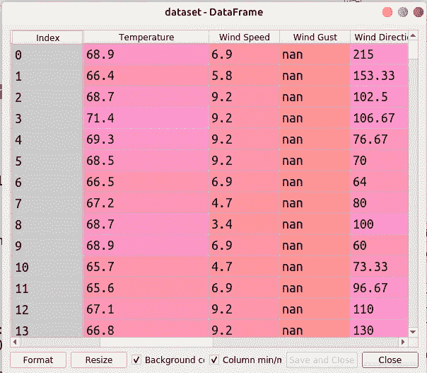
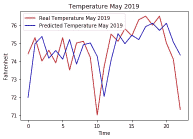

# Python 中递归神经网络的天气预报

> 原文：<https://medium.com/analytics-vidhya/weather-forecasting-with-recurrent-neural-networks-1eaa057d70c3?source=collection_archive---------0----------------------->


来源:图片来自 [Pexels](https://www.pexels.com/photo/abstract-blur-branch-christmas-259698/?utm_content=attributionCopyText&utm_medium=referral&utm_source=pexels)

随着数据科学和技术的进步，我们几乎可以在世界各地获得精确的天气预报。从气象站和卫星收集的数据用于分析和预测极端天气造成的气象灾害。根据研究，基于对过去天气的观察，我们可以预测未来的天气。机器学习可以用历史天气数据来预测天气。请记住，天气预测是一个有根据的猜测！

在本文中，我们将开发一个具有递归神经网络的深度学习模型，通过考虑 30 天的历史温度数据来提供某个位置的 4 天温度预测。

因此，让我们从简单介绍递归神经网络开始。

# **什么是递归神经网络(RNN)？**

RNN 是一种深度学习模型，用于时间序列预测、语音识别等。与传统的神经网络不同，递归网络使用它们的记忆(也称为状态)来预测序列输出。简而言之，当我们希望根据之前的连续输入预测未来的结果时，可以使用 RNN。例如，我们可以使用 RNN 通过提供前一个单词来预测句子中的下一个单词。

# RNN 天气预报。

现在我们已经了解了 RNN，让我们开始开发一个 RNN 模型，它可以根据 30 天的历史温度数据提供 4 天的温度预测。我已经使用了 [Google colab](https://colab.research.google.com/) 来实现这段代码，Spyder 用于可视化，有很多工具你可以根据自己的喜好来使用。

你可以从[这里](https://drive.google.com/drive/folders/12JTdHancAxquTuDxNJGwuKf-93I4cOGI?usp=sharing)下载历史天气数据集，也可以随意使用任何你选择的有温度数据的天气数据集。

让我们加载数据集并查看前几行:

```
import numpy as np
import matplotlib.pyplot as plt
import pandas as pd#import dataset from data.csv file
dataset = pd.read_csv('data.csv')
dataset = dataset.dropna(subset=["Temperature"])
dataset=dataset.reset_index(drop=True)training_set = dataset.iloc[:,4:5].values
```



我们只包括温度列，因为我们要预测温度，并删除所有没有值或有 NaN 的行。

下一步，我们将不得不应用特征缩放来归一化 0 到 1 范围内的温度。

```
#Feature Scaling 
from sklearn.preprocessing import MinMaxScalersc = MinMaxScaler(feature_range=(0,1))
training_set_scaled = sc.fit_transform(training_set)
```

我们将创建一个训练集，以便每 30 天我们将提供未来 4 天的温度作为输出。换句话说，我们的 RNN 的输入是 30 天的温度数据，输出是 4 天的温度预报。

```
x_train = []
y_train = []n_future = 4 # next 4 days temperature forecast
n_past = 30 # Past 30 days for i in range(0,len(training_set_scaled)-n_past-n_future+1):
    x_train.append(training_set_scaled[i : i + n_past , 0])     
    y_train.append(training_set_scaled[i + n_past : i + n_past + n_future , 0 ])x_train , y_train = np.array(x_train), np.array(y_train)x_train = np.reshape(x_train, (x_train.shape[0] , x_train.shape[1], 1) )
```

**x_train** 包含当天之前的 30 次温度输入， **y_train** 包含当天之后的 4 天温度输出。由于 x_train 和 y_train 是列表，我们必须将它们转换为 numpy 数组，以使训练集适合我们的模型。

现在我们已经准备好了我们的训练数据，所以让我们继续建立一个预测天气的 RNN 模型。

1.  首先，我们将从 keras.models 和 keras layers ie 导入 keras 序列模型。LSTM，密集和辍学。你可以参考 Keras 文档了解更多关于 Keras 模型和图层的信息[这里](https://keras.io/)

```
from keras.models import Sequential
from keras.layers import LSTM,Dense ,Dropout
# Fitting RNN to training set using Keras Callbacks. Read Keras callbacks docs for more info.
```

2.让我们定义我们的 RNN 层。我们将通过使用 **sequential()** 顺序添加层来创建一个顺序模型。第一层是具有 30 个存储单元的双向 LSTM， **return_sequence=True** 表示返回输出序列中的最后一个输出， **input_shape** 描述输入的结构。使用双向 LSTM，输出层同时从过去(正向)和未来(反向)状态获得反馈。我们添加了 3 个隐藏层和一个输出层，该层具有输出 4 天温度的线性激活函数。最后，我们用训练数据拟合了 RNN 模型。

```
regressor = Sequential()regressor.add(Bidirectional(LSTM(units=30, return_sequences=True, input_shape = (x_train.shape[1],1) ) ))
regressor.add(Dropout(0.2))regressor.add(LSTM(units= 30 , return_sequences=True))
regressor.add(Dropout(0.2))regressor.add(LSTM(units= 30 , return_sequences=True))
regressor.add(Dropout(0.2))regressor.add(LSTM(units= 30))
regressor.add(Dropout(0.2))
regressor.add(Dense(units = n_future,activation='linear'))regressor.compile(optimizer='adam', loss='mean_squared_error',metrics=['acc'])
regressor.fit(x_train, y_train, epochs=500,batch_size=32 )
```

**注意:**我使用了 Adam optimizer，因为它的计算效率很高。

3.创建测试数据来测试我们的模型性能。

```
# read test dataset
testdataset = pd.read_csv('data (12).csv')
#get only the temperature column
testdataset = testdataset.iloc[:30,3:4].valuesreal_temperature = pd.read_csv('data (12).csv')
real_temperature = real_temperature.iloc[30:,3:4].valuestesting = sc.transform(testdataset)
testing = np.array(testing)
testing = np.reshape(testing,(testing.shape[1],testing.shape[0],1))
```

4.现在我们已经准备好了测试数据，我们可以测试我们的 RNN 模型了。

```
predicted_temperature = regressor.predict(testing)predicted_temperature = sc.inverse_transform(predicted_temperature)predicted_temperature = np.reshape(predicted_temperature,(predicted_temperature.shape[1],predicted_temperature.shape[0]))
```

模型的输出是标准化的形式，因此为了获得实际温度值，我们将 **inverse_transform()** 应用于 **predicted_temperature** 和，然后对其进行整形。

让我们比较一下预测温度和实际温度。正如我们所看到的，该模型在给定的测试数据下表现良好。

```
real_temperature
array([[82.],        [82.],        [83.],        [83.]])predicted_temperature
array([[83.76233 ],  [83.957565],  [83.70461 ],  [83.6326  ]])
```

如果我们预测一个月的温度并将其可视化，我们会得到以下结果。



一个月以上的气温预测

# 结论

递归神经网络在时间序列预测方面最为人所知，因为它们可以处理序列数据，也可以与卷积神经网络(CNN)集成，用于处理复杂的混合模型，但它们也需要占用大量内存来进行处理。我想向您推荐一些提高模型准确性的方法:

1.  增加或减少纪元的数量。尝试不同的历元数，如 100、200、300…等等
2.  最好的方法之一是使用大型数据集并训练模型，但这可能需要较长的时间。安装 CUDA 就可以和 Keras 一起使用 GPU 了。更多信息，请参考[这篇](/@ab9.bhatia/set-up-gpu-accelerated-tensorflow-keras-on-windows-10-with-anaconda-e71bfa9506d1)文章。
3.  向 RNN 添加更多 LSTM 图层。