# 使用 Streamlit(构建机器学习工具的最快方式)进行交互式数据探索的 Web 应用程序

> 原文：<https://medium.com/analytics-vidhya/web-app-for-interactive-data-exploration-usig-streamlit-fastest-way-to-build-machine-learning-563783aa0a81?source=collection_archive---------5----------------------->

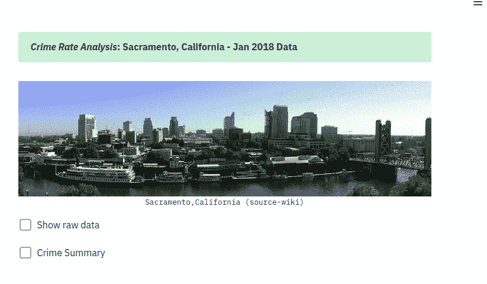

通过应用交互式过滤器来探索数据对 python 开发人员来说是一个挑战，直到这个名为' [Streamlit'](https://streamlit.io/) 的惊人应用框架的发布。自从这个神奇的框架发布以来，探索数据、构建 web 应用程序和部署 ML 模型的过程变得非常简单，只需几行 python 代码，通过 API 调用来简化它。

在这篇博文中，我向你解释了我为探索加利福尼亚州萨克拉门托市一个月的犯罪数据(2018 年 1 月)而构建的网络应用程序。你可以试试这里的[app](https://sanjay-california-crime.herokuapp.com/)。数据和完整的代码可以在我的 [github repo](https://github.com/Msanjayds/Streamlit_Applications) 中找到。

首先，安装 streamlit 就像通常的 python 包一样简单，也就是说，只需安装 pip。Streamlit 兼容所有的 python 包和框架作品，完整的信息和教程可以在官方网站找到。

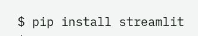

安装完成后，我们可以通过导入所需的包来开始编码。在这里，我使用 pandas 进行数据汇总，plotly 和 numpy 进行图表，PIL 进行图像加载，streamlit 用于前端界面，最终部署在 Heroku 平台上。

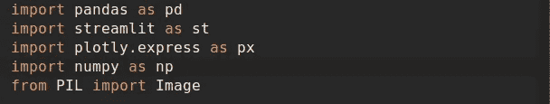

接下来，我们在应用程序上显示城市的图像，并使用下面的代码将数据加载到应用程序中。Streamlit 最有用的特性是缓存数据并将其保存在内存中，因此任何缓存的操作在模型初始化期间只运行一次，除非参数发生变化。

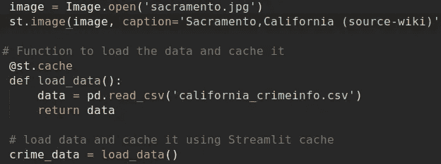

一旦我们准备好一大块程序，我们就可以同时执行它并在本地主机上看到网页。为此，我们需要在您的命令提示符下运行下面的命令(相应地更改程序名称)，一个新的选项卡将在您的默认浏览器中打开。

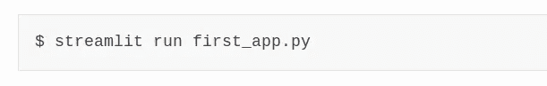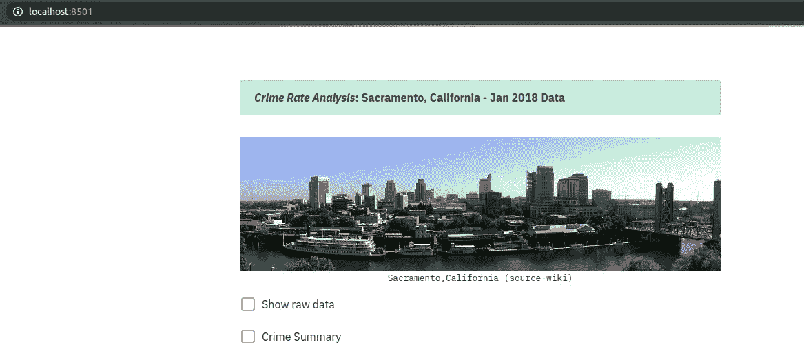

下面这段代码提供了查看原始数据和一些汇总细节的选项，如前 50 名犯罪，每月每天的犯罪数量。像这样，我们可以在屏幕上显示/隐藏任何统计数据，以便快速分析。

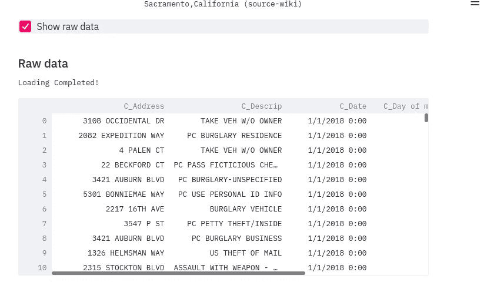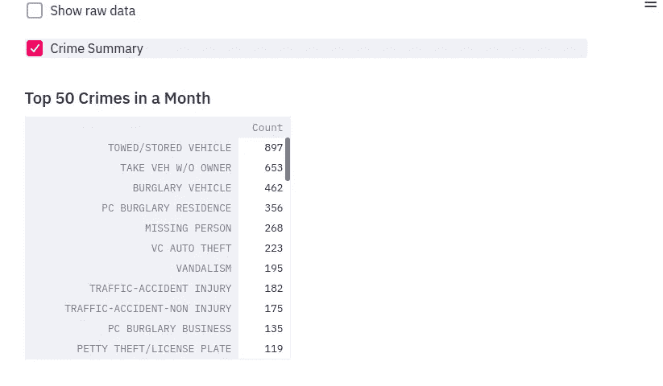

接下来，我们绘制一个条形图来显示本月的前 50 个犯罪，因为我们在这里使用了 plotly。该图非常丰富多彩，有许多缩放、悬停等选项。

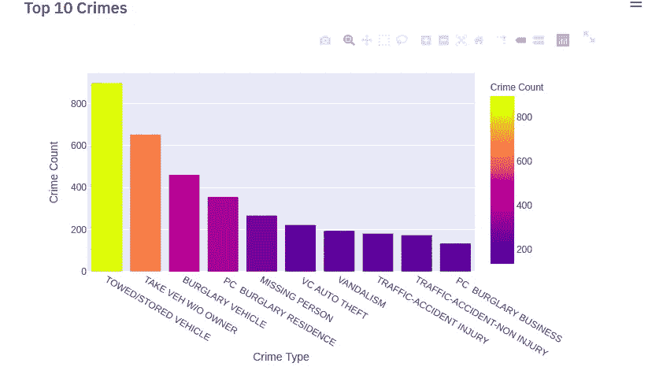

创建一个滑块来选择一个月中的某一天，以查看犯罪在该特定日期的物理位置。使用 streamlit 的“deck _ GL _ chart”API 传递纬度和经度值来显示地图。同样，图表是交互式的，我们可以放大和缩小以查看实际位置。

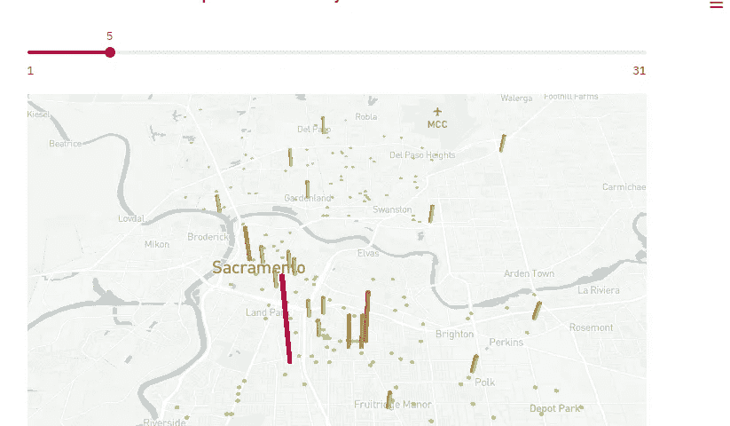

最后是一个柱状图，显示所选日期每小时的犯罪数量。

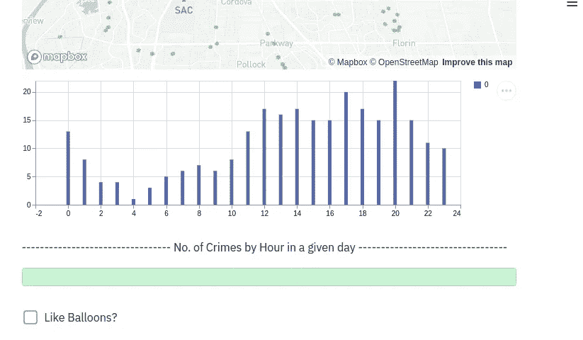

一旦我准备好代码并在我的本地主机上测试，我就把它部署在 Heroku 平台上。关于在 Heroku 平台上部署应用/模型的完整教程可以在[本教程](https://towardsdatascience.com/how-to-build-your-machine-learning-app-in-3-simple-steps-d56ed910355c)中找到。感谢阅读和快乐编码..

**参考文献:**

 [## streamlit——构建定制 ML 工具的最快方法

### Streamlit 是第一个专门针对机器学习和数据科学团队的应用框架。所以你可以停止消费…

streamlit.io](https://streamlit.io/)  [## 将 Python 脚本变成漂亮的 ML 工具

### 介绍专为 ML 工程师打造的应用框架 Streamlit

towardsdatascience.com](https://towardsdatascience.com/coding-ml-tools-like-you-code-ml-models-ddba3357eace)  [## 如何用 3 个简单的步骤构建你的机器学习应用。

### 使用 Streamlit 在 Heroku 上部署数据科学项目的简单方法

towardsdatascience.com](https://towardsdatascience.com/how-to-build-your-machine-learning-app-in-3-simple-steps-d56ed910355c)