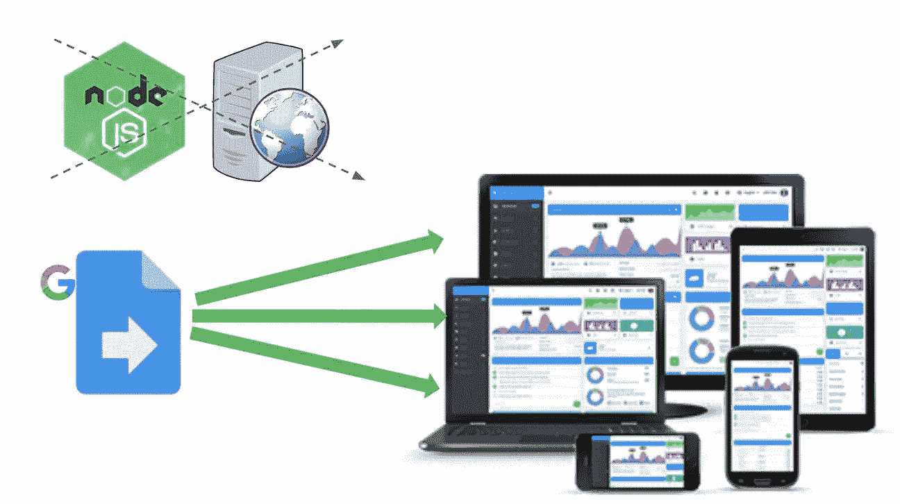
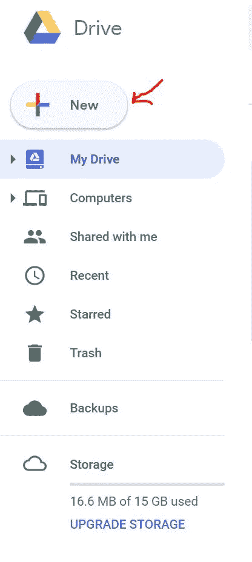
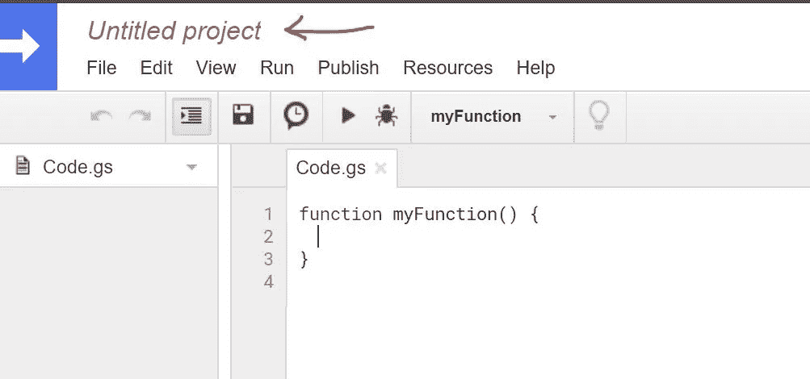
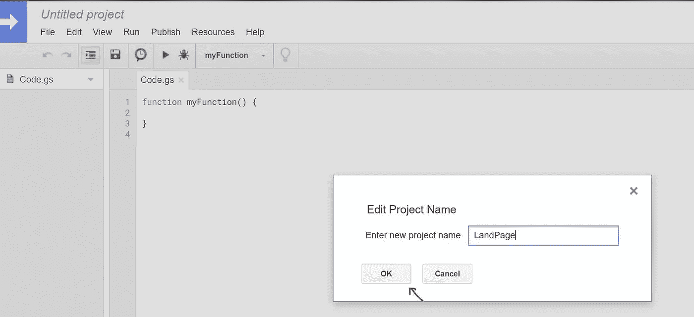
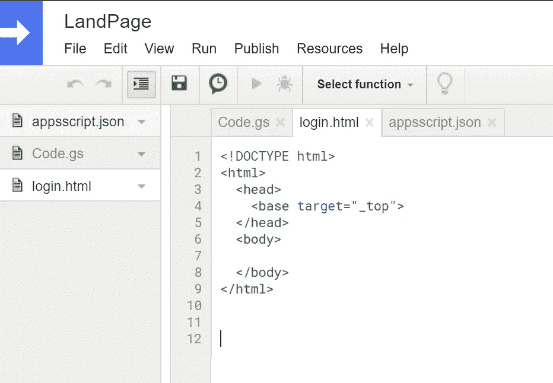
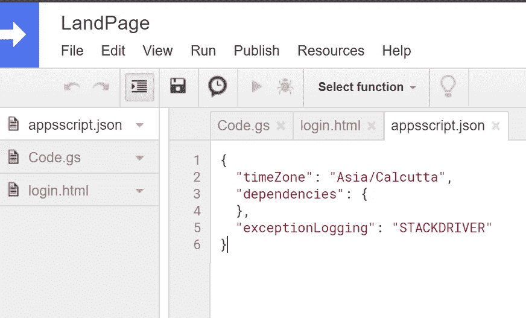
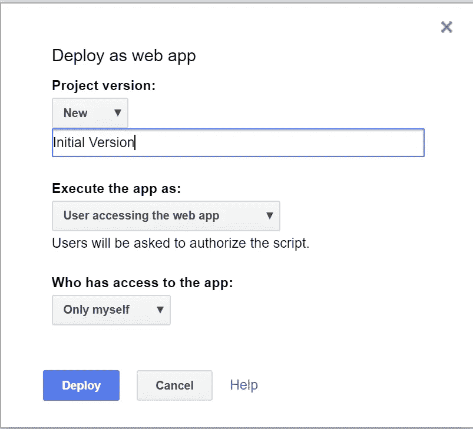
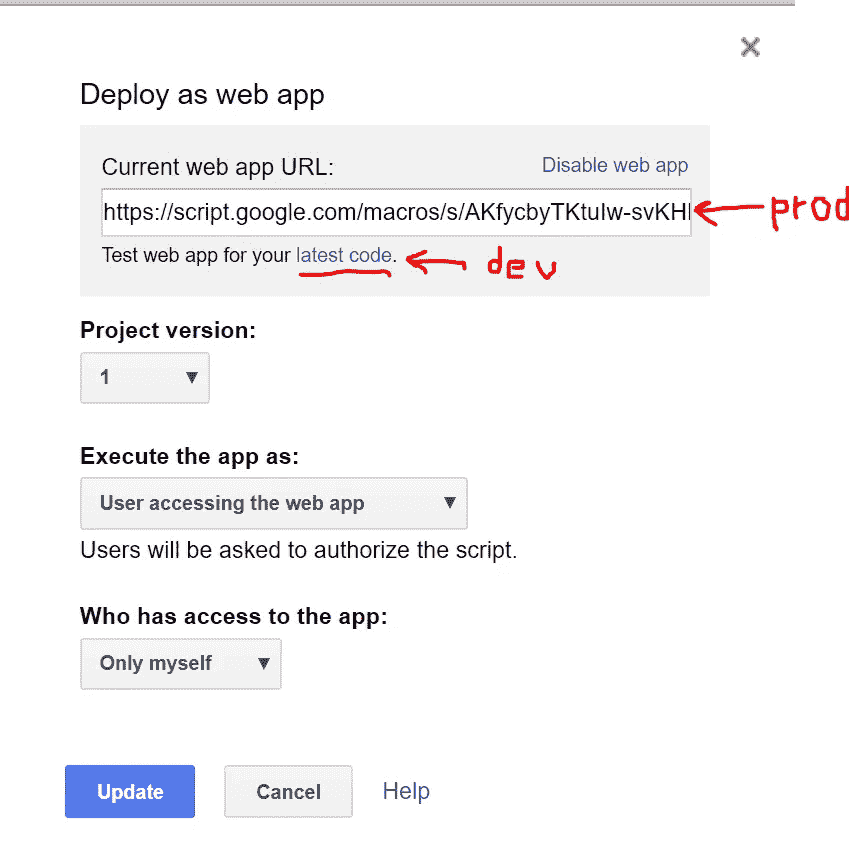
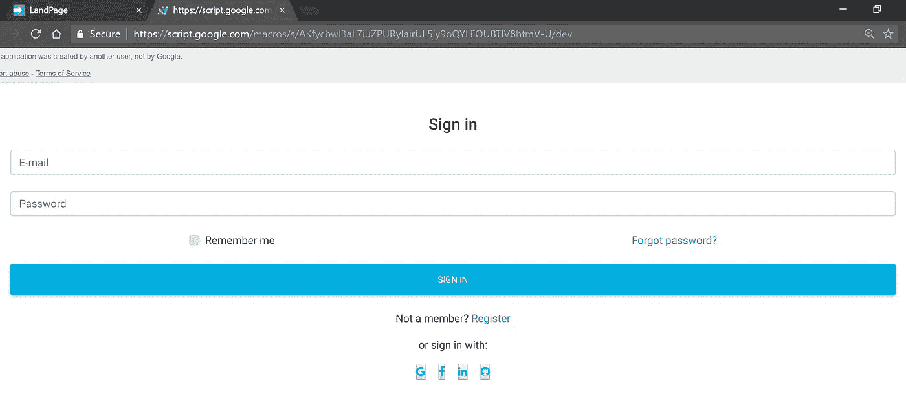

# 使用 Google App Script 的 Web 应用程序—材料设计，但没有服务器/服务器框架

> 原文：<https://medium.com/analytics-vidhya/web-app-using-google-app-script-angularjs-material-design-but-no-server-server-frameworks-7c5029b635f6?source=collection_archive---------0----------------------->



这篇文章提供了一个非常基本的概述，介绍了如何使用 AngularJS 和材料 Bootstrap 使用 Google App Script 来构建网页。通过使用谷歌应用程序脚本，我们可以不需要 NodeJS 服务器。谷歌会处理好的。作为开发人员，我们需要做的就是发布我们的代码。

先决条件:

1.  一个谷歌账户
2.  HTML，CSS 和 Javascript 的基础知识

步骤-

1.  登录 gmail 账户，打开 [Google Drive](https://drive.google.com)
2.  创建一个新的脚本如下所示，并命名为



图片 1

文件→新建→更多→ Google App 脚本

3.通过点击“无标题项目”来命名您的脚本



图 2:创建脚本



图 3:命名您的脚本

默认情况下，Code.gs 将会出现。复制以下代码

```
function doGet() {
 return HtmlService.createTemplateFromFile(‘login’).evaluate().setSandboxMode(HtmlService.SandboxMode.IFRAME);
}
```

4.使用文件→新建→ Html 文件创建一个名为“登录”的 HTML 页面

将自动生成一个 appscript.json。



【图 4:默认 login.htmlT2



图 5:默认 appscript.json

5.包括角度和材料引导的路径

login.html 现在变成了-

```
<!DOCTYPE html>
<html>
  <head>
    <!-- JS -->
    <!-- JQuery -->
    <script type="text/javascript" src="[https://cdnjs.cloudflare.com/ajax/libs/jquery/3.3.1/jquery.min.js](https://cdnjs.cloudflare.com/ajax/libs/jquery/3.3.1/jquery.min.js)"></script>
    <!-- Bootstrap tooltips -->
    <script type="text/javascript" src="[https://cdnjs.cloudflare.com/ajax/libs/popper.js/1.13.0/umd/popper.min.js](https://cdnjs.cloudflare.com/ajax/libs/popper.js/1.13.0/umd/popper.min.js)"></script>
    <!-- Bootstrap core JavaScript -->
    <script type="text/javascript" src="[https://cdnjs.cloudflare.com/ajax/libs/twitter-bootstrap/4.1.3/js/bootstrap.min.js](https://cdnjs.cloudflare.com/ajax/libs/twitter-bootstrap/4.1.3/js/bootstrap.min.js)"></script>
    <!-- MDB core JavaScript -->
    <script type="text/javascript" src="[https://cdnjs.cloudflare.com/ajax/libs/mdbootstrap/4.5.9/js/mdb.min.js](https://cdnjs.cloudflare.com/ajax/libs/mdbootstrap/4.5.9/js/mdb.min.js)"></script>
    <!-- AngularJS -->
    <script src="[https://ajax.googleapis.com/ajax/libs/angularjs/1.6.9/angular.min.js](https://ajax.googleapis.com/ajax/libs/angularjs/1.6.9/angular.min.js)"></script>
    <script src="[https://ajax.googleapis.com/ajax/libs/jquery/3.2.1/jquery.min.js](https://ajax.googleapis.com/ajax/libs/jquery/3.2.1/jquery.min.js)"></script>

    <!-- CSS -->
    <!-- Font Awesome -->
    <link rel="stylesheet" href="[https://maxcdn.bootstrapcdn.com/font-awesome/4.7.0/css/font-awesome.min.css](https://maxcdn.bootstrapcdn.com/font-awesome/4.7.0/css/font-awesome.min.css)">
    <!-- Bootstrap core CSS -->
    <link href="[https://cdnjs.cloudflare.com/ajax/libs/twitter-bootstrap/4.1.3/css/bootstrap.min.css](https://cdnjs.cloudflare.com/ajax/libs/twitter-bootstrap/4.1.3/css/bootstrap.min.css)" rel="stylesheet">
    <!-- Material Design Bootstrap -->
    <link href="[https://cdnjs.cloudflare.com/ajax/libs/mdbootstrap/4.5.9/css/mdb.min.css](https://cdnjs.cloudflare.com/ajax/libs/mdbootstrap/4.5.9/css/mdb.min.css)" rel="stylesheet">

  </head>
  <body>

  </body>
</html>
```

6.使用 material bootstrap 添加登录页面结构。

本文中，我采用的登录页面结构如图[素材自举网站](https://mdbootstrap.com/components/forms/)所示

在 login.html 的“body”标记中添加以下代码

```
<div class="card">
<!-- Default form login -->
<form class="text-center border border-light p-5"><p class="h4 mb-4">Sign in</p><!-- Email -->
    <input type="email" id="defaultLoginFormEmail" class="form-control mb-4" placeholder="E-mail"><!-- Password -->
    <input type="password" id="defaultLoginFormPassword" class="form-control mb-4" placeholder="Password"><div class="d-flex justify-content-around">
        <div>
            <!-- Remember me -->
            <div class="custom-control custom-checkbox">
                <input type="checkbox" class="custom-control-input" id="defaultLoginFormRemember">
                <label class="custom-control-label" for="defaultLoginFormRemember">Remember me</label>
            </div>
        </div>
        <div>
            <!-- Forgot password -->
            <a href="">Forgot password?</a>
        </div>
    </div><!-- Sign in button -->
    <button class="btn btn-info btn-block my-4" type="submit">Sign in</button><!-- Register -->
    <p>Not a member?
        <a href="">Register</a>
    </p><!-- Social login -->
    <p>or sign in with:</p><a type="button" class="light-blue-text mx-2">
        <i class="fa fa-facebook"></i>
    </a>
    <a type="button" class="light-blue-text mx-2">
        <i class="fa fa-twitter"></i>
    </a>
    <a type="button" class="light-blue-text mx-2">
        <i class="fa fa-linkedin"></i>
    </a>
    <a type="button" class="light-blue-text mx-2">
        <i class="fa fa-github"></i>
    </a></form>
<!-- Default form login -->
</div>
```

7.将代码发布为 Web 应用程序

发布→部署为 web 应用程序

以下是发布应用程序前需要指定的参数-

I .以下列方式执行应用程序

1.  我-如果选择此选项，应用程序将以您的身份运行
2.  访问您的 WebApp 的用户-如果选择此选项，应用程序将作为访问它的用户运行。

目前，我使用“用户访问您的 web 应用程序”选项。根据您的要求，您可以使用其他选项发布它。

二。哪些人可以访问你的应用程序的选项-

1.  只有我自己
2.  任何人
3.  任何人(甚至匿名)

目前，我使用“仅我自己”选项。根据您的要求，您可以使用其他选项发布它。



图 6:发布应用程序

单击部署发布版本。您可以进行多次部署并生成多个版本。

您将在成功部署为 Web 时看到下面的屏幕。开发和生产链接如下所示。

在开发时使用 dev 链接，在用户测试和生产时使用 exec 链接



图 7:发布的链接

下面是我的 dev webApp 现在的样子。哇，我们看到一个登录页面了！

最精彩的部分！我没有使用 NodeJS，没有服务器。我让谷歌负责服务器部分。

我的申请可以通过链接[https://script.google.com/*.](https://script.google.com/*.)获得

如果需要的话，我可以重复使用这个链接来嵌入谷歌网站。



图 8:网络应用

希望这篇文章有所帮助。欢迎任何反馈。