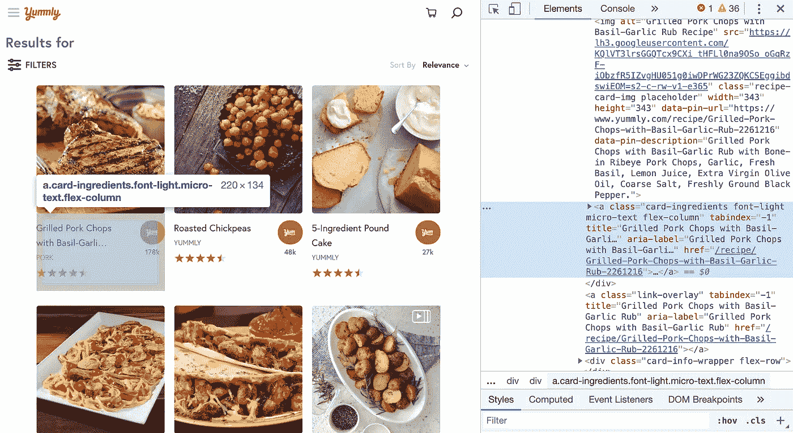
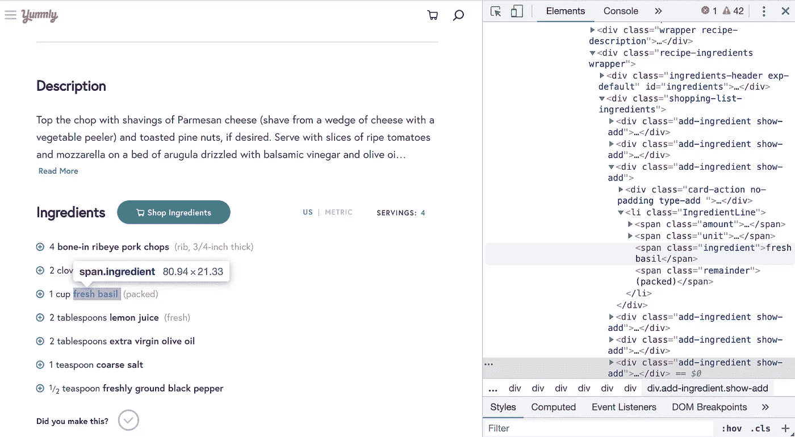
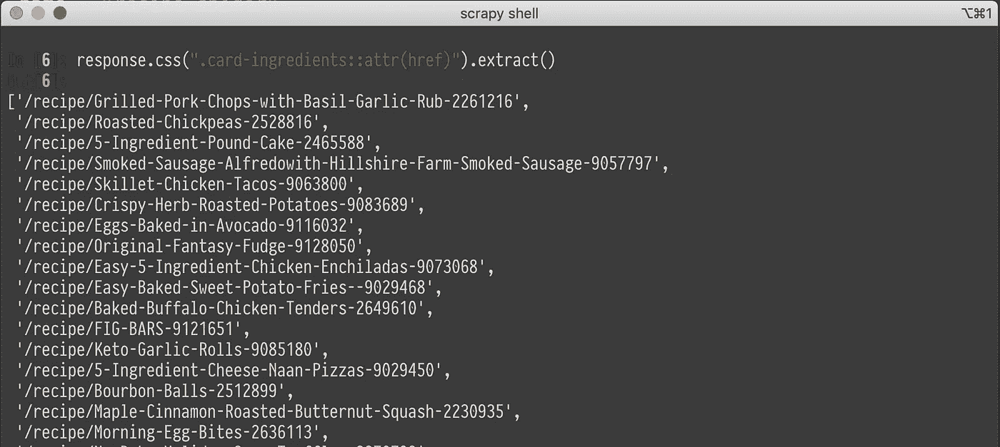
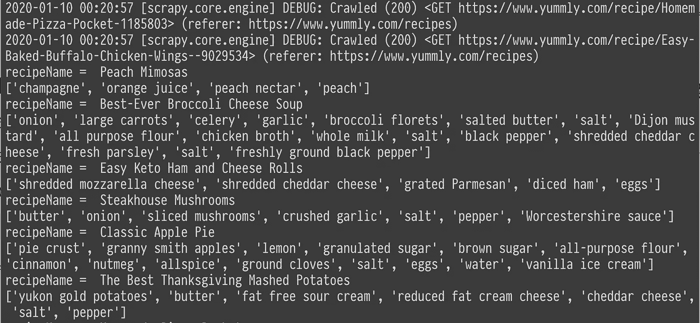
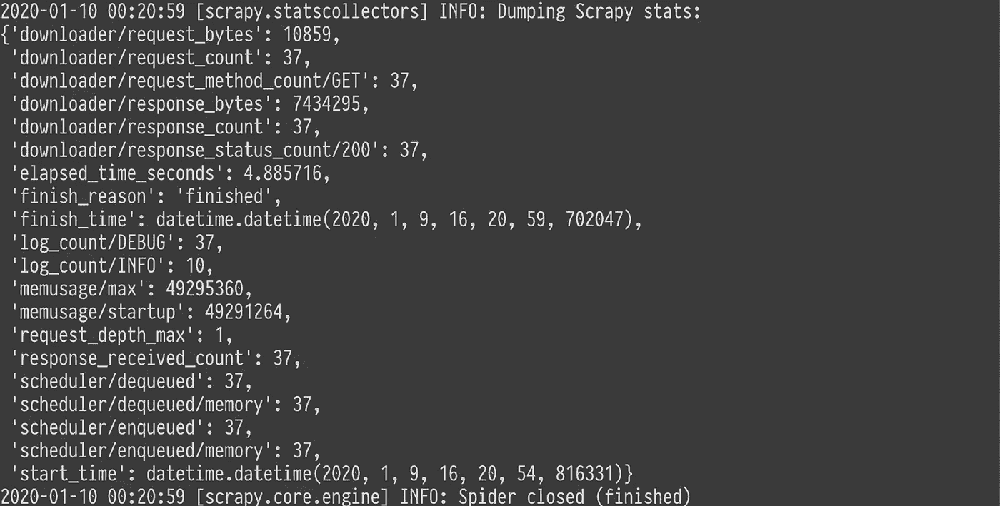
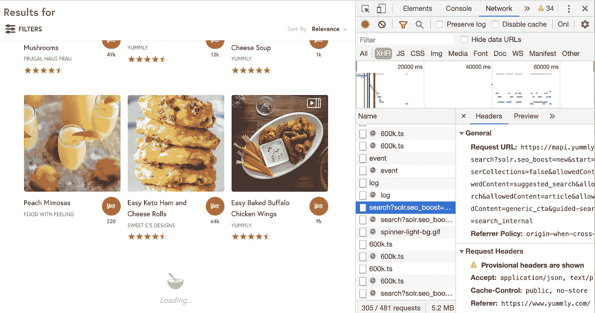
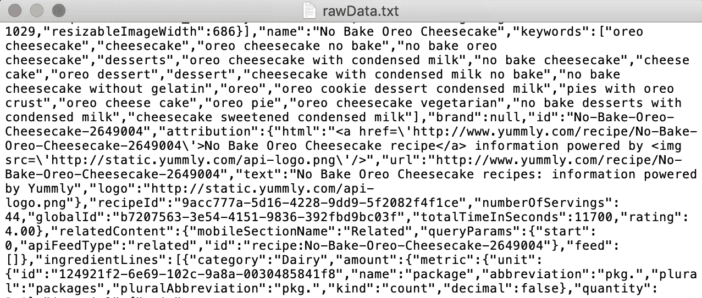
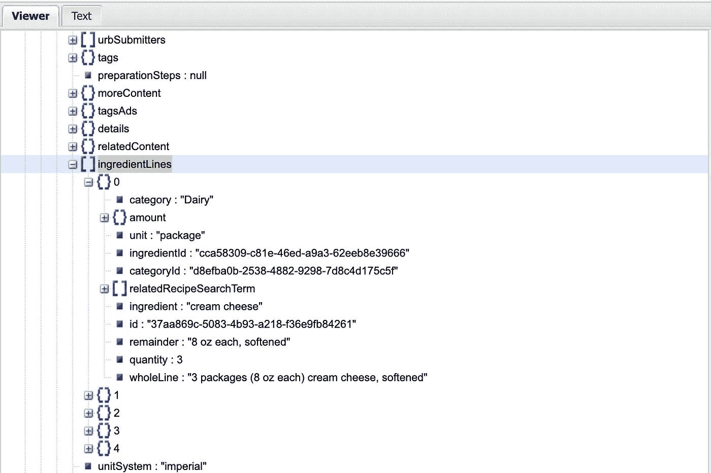
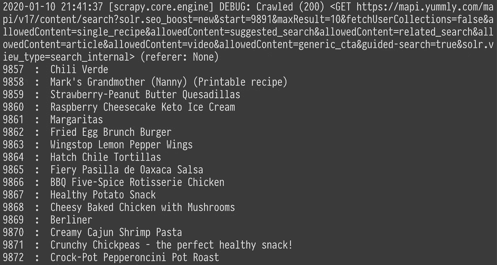

# 网络爬行与 Scrapy

> 原文：<https://medium.com/analytics-vidhya/web-crawling-with-scrapy-f4d93c1bfcc7?source=collection_archive---------5----------------------->


在数据分析中，最重要的资源是数据本身。由于 web 爬行被定义为*“以编程方式浏览网页集合并提取数据”*，因此在没有官方 API 的情况下收集数据是一个有用的技巧。

在本文中，我们将讨论以下主题:

1.  设置碎片
2.  从网页抓取数据
3.  处理无限滚动页面

## 设置碎片

[Scrapy](https://scrapy.org/) 在使用 python 进行网页抓取时是一个强大的工具。在我们的命令行中，执行:

```
pip install scrapy
```

# 我们的目标

在本文中，我们将以 [Yummly](https://www.yummly.com/) 为例。我们的目标是从每个食谱中下载配料，用于进一步的文本挖掘(参见相关的 [kaggle 竞赛](https://www.kaggle.com/c/whats-cooking-kernels-only/))现在是时候创建我们的蜘蛛了:)

## 创造我们的第一只蜘蛛

创建一个名为`crawler.py`的 python 文件:

```
import scrapyclass RecipeSpider(scrapy.Spider):
 name = "recipe_spider"
 start_urls = ["[https://www.yummly.com/recipes](https://www.yummly.com/recipes)"]
```

这里我们创建一个继承自`scrapy.Spider`的类(在库中， [Spider](https://docs.scrapy.org/en/latest/topics/spiders.html) 已经定义了跟踪路径和数据抓取的方法。)我们需要给我们的蜘蛛一个`name`来通知 Scrapy 蜘蛛是如何定位和实例化的。(如果没有分配`name`，将出现显示`No spider found in file`的错误。)`start_urls`是我们要抓取的网址列表。(这里只需要 Yummly 的菜谱网址。)

让我们运行它！由于 Scrapy 有自己的命令行界面，我们需要运行:

```
scrapy runspider crawler.py
```

然后嘣！我们的输出是这样的:

```
2020-01-08 20:27:51 [scrapy.utils.log] INFO: Scrapy 1.8.0 started (bot: scrapybot)
2020-01-08 20:27:51 [scrapy.crawler] INFO: Overridden settings: {'SPIDER_LOADER_WARN_ONLY': True}...2020-01-08 20:27:52 [scrapy.core.engine] INFO: Spider opened
2020-01-08 20:27:52 [scrapy.extensions.logstats] INFO: Crawled 0 pages (at 0 pages/min), scraped 0 items (at 0 items/min)
2020-01-08 20:27:54 [scrapy.core.engine] DEBUG: Crawled (200) <GET [https://www.yummly.com/recipes](https://www.yummly.com/recipes)> (referer: None)
2020-01-08 20:27:54 [scrapy.core.scraper] ERROR: Spider error processing <GET [https://www.yummly.com/recipes](https://www.yummly.com/recipes)> (referer: None)
Traceback (most recent call last):
  File "/usr/local/lib/python3.7/site-packages/twisted/internet/defer.py", line 654, in _runCallbacks
    current.result = callback(current.result, *args, **kw)
  File "/usr/local/lib/python3.7/site-packages/scrapy/spiders/__init__.py", line 80, in parse
    raise NotImplementedError('{}.parse callback is not defined'.format(self.__class__.__name__))
NotImplementedError: RecipeSpider.parse callback is not defined

2020-01-08 20:27:54 [scrapy.core.engine] INFO: Spider closed (finished)
```

简而言之，它初始化蜘蛛并加载所需的扩展。从我们指定的起始 url，蜘蛛提取页面的内容并试图解析它。正如错误指出的，我们还没有定义我们的`parse`方法。让我们现在就做吧！

## 偷看我们的数据

先看看我们的数据总是更好的主意。打开[网页](https://www.yummly.com/recipes)，我们在每个组件里都找到了`<a href="/recipe/..." />`。



[https://www.yummly.com/recipes](https://www.yummly.com/recipes)

点开一个菜谱后，啊哈！在标签`<span class="ingredient"/>`中包含了我们想要的数据！



[https://www . yummly . com/recipe/carsted-猪排-紫苏-大蒜-Rub-2261216](https://www.yummly.com/recipe/Grilled-Pork-Chops-with-Basil-Garlic-Rub-2261216)

## 从 html 抓取数据

我们首先需要提取搜索页面中的菜谱链接。之后，从每个食谱中提取配料。

scrapy 的便利之处在于，它有`scrapy shell`帮助我们测试我们想要提取的内容(竖起大拇指！)在我们的命令行中，执行:

```
scrapy shell
fetch("[https://www.yummly.com/recipes](https://www.yummly.com/recipes)")
```

现在，从 yummly 的搜索页面提取的所有数据都存储在属性`response`(类型`reponse.body`显示全部内容~)中，因为我们需要每个食谱页面的链接(存储在`<a href="..."/>`)我们使用 [css 选择器](https://docs.scrapy.org/en/latest/topics/selectors.html)作为:

```
response.css(".card-ingredients::attr(href)").extract()
```



太好了！这正是我们所需要的！测试之后，我们可以回到我们的`crawler.py`:

```
class RecipeSpider(scrapy.Spider):
 name = "recipe_spider"
 start_urls = ["[https://www.yummly.com/recipes](https://www.yummly.com/recipes)"]def parse(self, response):
  links = response.css(".card-ingredients::attr(href)").extract()
  for link in links:
   recipeLink = "[https://www.yummly.com](https://www.yummly.com)" + link
   yield response.follow(link, callback=self.parseRecipe)

 def parseRecipe(self, response):
  recipeName = response.css(".recipe-title::text").extract_first()
  ingredients = response.css(".ingredient::text").extract()
  print("recipeName = ", recipeName)
  print(ingredients)
```

上面有两个解析函数，因为在解析搜索页面和每个配方页面时逻辑是不同的。第一个`parse`将被执行。在获得相应食谱的链接后，我们使用`reponse.follow()`作为创建更多请求的快捷方式。(也将解析方法指定为`self.parseRecipe`)这里我们使用`yield`来产生一个请求序列。([了解有关产量的更多信息](https://stackoverflow.com/questions/231767/what-does-the-yield-keyword-do))



运行完`scrapy runspider crawler.py`后，我们就可以得到每个菜谱中的食材了。太棒了。

## 无限滚动页面

但是食谱的数量看起来令人怀疑。嗯…为什么只有 37 个食谱？



回到我们的搜索页面向下滚动，我们突然发现这是一个无限滚动的页面。但是不用担心！无限滚动必须需要分页或调用更多项目的机制。我们可以检查在`Network`部分发生了什么:



[https://www.yummly.com/recipes](https://www.yummly.com/recipes)

正在检查请求 URL:

```
https://mapi.yummly.com/mapi/v17/content/search?solr.seo_boost=new&**start=1&maxResult=37**&fetchUserCollections=false&allowedContent=single_recipe&allowedContent=suggested_search&allowedContent=related_search&allowedContent=article&allowedContent=video&allowedContent=generic_cta&guided-search=true&solr.view_type=search_internal
```

看吧！在查询字符串中，它将其返回项限制为少于 37 个。所以我们的第一个尝试是将`maxResult`改为我们想要查询的食谱数量:(同时修改我们的解析逻辑~)

```
import scrapy
import jsonclass RecipeSpider(scrapy.Spider):
 name = "recipe_spider"
 requiresRecipeNum = 50
 recipeNum = 0
 start_urls = ["https://mapi.yummly.com/mapi/v17/content/search?solr.seo_boost=new&start=1&maxResult=" + str(requiresRecipeNum) + "&fetchUserCollections=false&allowedContent=single_recipe&allowedContent=suggested_search&allowedContent=related_search&allowedContent=article&allowedContent=video&allowedContent=generic_cta&guided-search=true&solr.view_type=search_internal"]def parse(self, response):
 data = json.loads(response.body) for item in data.get('feed', []):
   link = "[https://www.yummly.com/](https://www.yummly.com/)" + item.get("tracking-id")
   content = item.get('content')
   recipeName = content.get('details').get('name') self.recipeNum += 1
   print(self.recipeNum," : ", recipeName) for i in content.get('ingredientLines', []):
    print(i.get('ingredient'))
```

这里我们使用`json.get()`而不是前面的`css selector`的原因是因为我们的查询 url 已经改变，导致不同的响应。我们从`https://mapi.yummly.com/mapi/...`得到的回应是一大包 json:



最好将原始数据粘贴到[在线 JSON 查看器](http://jsonviewer.stack.hu/)中，以增强可读性。



但是我刚刚发现请求 10000 个食谱是不可行的(也许后面有一个超时机制，所以我不能爬回任何东西>

Another attempt will be utilizing 【 (because it is a list!) So we can do something like:

```
def GenerateUrl(requiresRecipeNum):
 starts = []
 for i in range(requiresRecipeNum // 10):
  apiStr = "[https://mapi.yummly.com/mapi/v17/content/search?solr.seo_boost=new&start=](https://mapi.yummly.com/mapi/v17/content/search?solr.seo_boost=new&start=)" + str(1+i*10) + "&maxResult=10&fetchUserCollections=false&allowedContent=single_recipe&allowedContent=suggested_search&allowedContent=related_search&allowedContent=article&allowedContent=video&allowedContent=generic_cta&guided-search=true&solr.view_type=search_internal"
  starts += [apiStr]
 return startsclass RecipeSpider(scrapy.Spider):
 name = "recipe_spider"
 requiresRecipeNum = 10000
 start_urls = GenerateUrl(requiresRecipeNum)
 ...
```

In this way, we have 1000 urls in 【 . Each only requests for 10 recipes:



and it works! [这里](https://blog.scrapinghub.com/2016/06/22/scrapy-tips-from-the-pros-june-2016)是另一篇处理不同类型的无限滚动页面的文章。

希望这篇文章有所帮助。快乐编码:)

# 参考

*   [如何用 Scrapy 和 Python 3 抓取网页](https://www.digitalocean.com/community/tutorials/how-to-crawl-a-web-page-with-scrapy-and-python-3)

*本文所有内容仅供学术使用*