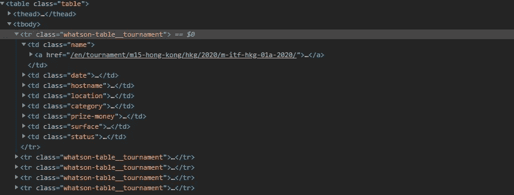
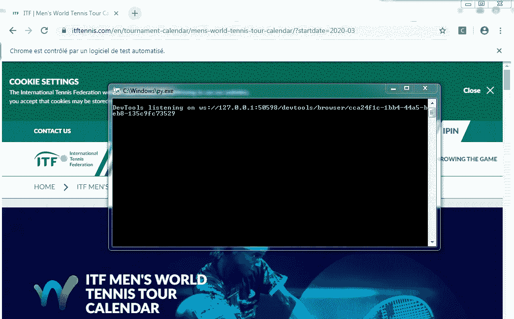
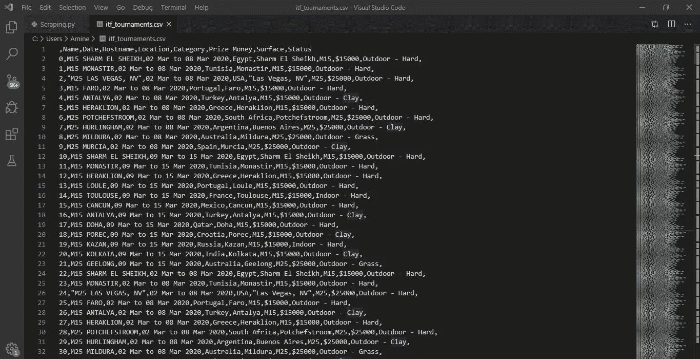

# 使用 Python 和 Selenium 进行 Web 数据抓取

> 原文：<https://medium.com/analytics-vidhya/web-data-scraping-with-python-selenium-7a1e91206642?source=collection_archive---------7----------------------->


使用 Chrome 驱动程序通过 python 和 Selenium 快速抓取数据

# 网络数据抓取！？什么、为什么和如何

抓取数据是抓取网页，将您想要的信息存储到本地数据库或电子表格中，供以后检索或分析。这就像从网页上复制和粘贴内容一样，但抓取通常是由机器人或机器人来完成的，它们定期做这项工作。

需要注意的是，网络抓取违反了大多数网站的服务条款。如果你过于频繁或恶意抓取，你的 IP 地址可能会被禁止访问某个网站。

# **为什么是 Python？**

你可能听说过 Python 有多棒。但是，其他语言也是如此。那我们为什么要选择 Python 而不是其他语言进行网页抓取呢？

下面是 Python 的特性列表，这些特性使它更适合 web 抓取。

*   **易用性:** Python 编码简单。您不必添加分号“；”或花括号“{}”的任何位置。这使得它不那么凌乱，易于使用。
*   **大量的库:** Python 拥有大量的库，如 [Numpy](https://numpy.org/) 、 [Pandas](https://pandas.pydata.org/) 等。，它为各种目的提供方法和服务。因此，它适用于 web 抓取和提取数据的进一步操作。
*   **动态类型化:**在 Python 中，你不必为变量定义数据类型，你可以在任何需要的地方直接使用变量。这样可以节省时间，让你的工作更快。
*   **易于理解的语法:** Python 语法易于理解主要是因为阅读 Python 代码与阅读英文语句非常相似。它富有表现力，易于阅读，Python 中使用的缩进也有助于用户区分代码中不同的范围/块。
*   **小代码，大任务:**使用网页抓取节省时间。但是你花再多时间写代码又有什么用呢？嗯，你不需要。在 Python 中，你可以编写小代码来完成大任务。因此，即使在编写代码时，您也节省了时间。

# 硒，哈？

Selenium 是一个 web 测试库。它用于自动化浏览器活动。然后，您可以编写一个 python 脚本来自动控制浏览器交互，比如链接点击和表单提交。然而，当我们想要从 javascript 生成的网页内容中提取数据时，Selenium 是有用的。

# 装置

*   [Python 2.x](https://www.python.org/downloads/) 或者 [Python 3.x](https://www.python.org/downloads/)
*   [硒](https://pypi.org/project/selenium/)包

```
pip install selenium
```

*   [Chrome 驱动](https://chromedriver.chromium.org/downloads) *(版本取决于你的 Chrome 的版本)*
*   [谷歌浏览器](https://www.google.com/intl/en_us/chrome/)

# 快速入门演示

这里是一个简单的 python 脚本，使用 Selenium 框架从 [ITF 世界网球巡回赛](https://www.itftennis.com/en/tournament-calendar/mens-world-tennis-tour-calendar/?startdate=2020-01)日历网站提取数据(赛事详情)并下载到一个 CSV 文件中。

1.  导入和创建 google chrome 的新实例，然后访问目标网站:

```
from selenium import webdriver
import pandas as pdDRIVER_PATH = '*chrome driver path on your pc*'
driver = webdriver.Chrome(executable_path=DRIVER_PATH)
driver.get('[https://www.itftennis.com/en/tournament-calendar/mens-world-tennis-tour-calendar/?startdate=2020-03](https://www.itftennis.com/en/tournament-calendar/mens-world-tennis-tour-calendar/?startdate=2020-01)')
```

2.定位元素&逐页检查找到目标:



```
items = len(driver.find_elements_by_class_name("whatson-table__tournament"))
```

3.解析项目和提取:

```
total = []for item in range(items):items = driver.find_elements_by_class_name("whatson-table__tournament")for item in items:t_name = item.find_element_by_class_name('name').textt_date = item.find_element_by_class_name('date').textt_hostname = item.find_element_by_class_name('hostname').textt_location = item.find_element_by_class_name('location').textt_category = item.find_element_by_class_name('category').textt_prize_money = item.find_element_by_class_name('prize-money').textt_surface = item.find_element_by_class_name('surface').textt_status = item.find_element_by_class_name('status').textnew = ((t_name, t_date, t_hostname, t_location, t_category,t_prize_money,t_surface,t_status))total.append(new)
```

4.数据格式:

```
df = pd.DataFrame(total, columns=['Name', 'Date', 'Hostname','Location','Category','Prize Money','Surface','Status'])df.to_csv('itf_tournaments.csv')driver.close()
```

**所有这些代码加在一起**

现在，我们将把迄今为止我们所看到的所有内容放入一个代码中。我们可以通过遍历在前面的代码中找到的所有类名，提取特定网页上每个锦标赛的名称、日期、主机名、位置、类别、奖金、表面和状态。

以下是从网站提取所有锦标赛数据的优化 python 脚本片段:

5.执行和结果:



在 Windows cmd 上运行 python 脚本

从网站抓取数据可能需要几分钟时间。



生成的包含抓取数据的 csv 文件

# 结论

只需用 23 行代码编写一个简单的自动化程序，您就可以查询 web 服务器、请求数据并解析它以提取您需要的信息。我希望你喜欢这篇文章！现在，您应该对 web 抓取和 Selenium API 在 Python 中的工作原理有了很好的理解。

如果你喜欢这篇文章并想看更多，请关注我的页面！