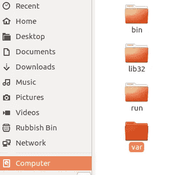
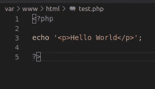
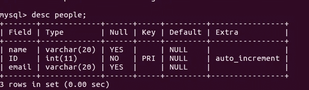
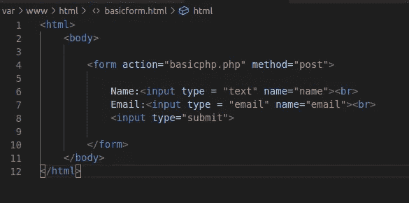
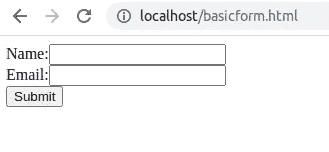
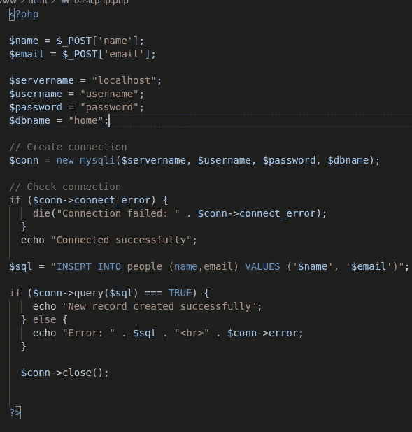
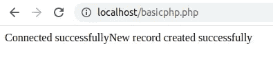
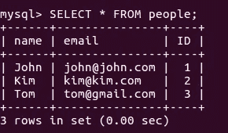

# Web 开发基础——如何在 Apache web 服务器上使用 PHP 将 HTML 表单连接到 MySQL 第 1 部分。

> 原文：<https://medium.com/analytics-vidhya/web-development-basics-how-to-connect-html-form-to-mysql-using-php-on-apache-web-server-part-1-7edce564169e?source=collection_archive---------2----------------------->

一步一步的指南，创建一个非常基本的动态网页。我用的是 **Ubuntu 16.04** 机器。

**本文概括地说:**

1.  下载先决条件

2.启动 web 服务器

3.用表和列创建一个新的 MySQL 数据库

4.创建一个 HTML 表单来收集数据。

5.创建一个 PHP 文件来连接数据库，该文件将接受提交的表单数据并将其添加到数据库中。

6.在 web 服务器上运行 HTML 表单文件，添加用户数据并检查数据库是否已填充。

# **首先是环境设置:**

**代码编辑器**(一个开发者的代码编辑器个人选择。你可以用任何你喜欢的。我有 Visual Studio 代码编辑器。可以从这里下载[https://code.visualstudio.com/download](https://code.visualstudio.com/download)

**通过终端在 Ubuntu 本地机器上安装 Apache 2 网络服务器。**

$ sudo apt-get 更新

$ sudo apt-get 安装 apache2

安装完成后，打开您的网络浏览器并输入 *localhost* 。它应该会打开 Apache web 服务器信息页面。这意味着您的 web 服务器现在正在运行。稍后需要启动、停止和重新启动 web 服务器的一些附加命令是:

$ sudo *【添加空间】* /etc/init.d/apache2 *【添加空间】* start

$ sudo *【添加空格】* /etc/init.d/apache2 *【添加空格】*停止

$ sudo *【添加空间】* /etc/init.d/apache2 *【添加空间】*重启

默认情况下，Apache2 web 服务器运行计算机中/var/www/html 文件夹中的所有文件。

接下来，我们将在这个/var/www/html 文件夹中创建一个新的 HTML 和 PHP 文件。

**使用 Apache web 服务器安装 MySQL】**

$ sudo apt 安装 mysql-server

**使用 Apache web 服务器安装 PHP**

$ sudo apt 安装 php libapache2-mod-php

PHP 安装完成后，使用 restart 命令重启 Apache2 web 服务器，并创建一个 test.php 文件。在代码编辑器中打开该文件并编写代码。

$ sudo touch *【此处空格】* /var/www/html/test.php

在浏览器的本地主机中运行该文件。它应该显示“Hello World ”,表明 PHP 工作正常。

# **MySQL 数据库**

$ sudo -u root -p

*mysql >* 显示数据库；

*mysql >* 创建数据库*首页*；

*mysql >* 创建表*人(姓名 VARCHAR(20)，邮箱 VARCHAR(20))*；

我忘了添加 ID，所以我使用了 ALTER TABLE 命令

*mysql >* ALTER TABLE 人添加 ID int NOT NULL

*mysql >* ALTER TABLE 人修改 ID int NOT NULL AUTO _ INCREMENT

要查看创建的内容

*mysql >* desc 信息；

所以表格已经准备好了，现在是时候在路径为*var/www/HTML/basic form . HTML*的文件夹中编写一个简单的 HTML 表单了。在代码编辑器中打开该文件并编写代码。

# **HTML 基本格式**

$ sudo touch *【此处空格】*/var/www/html/basic form . html

在浏览器的本地主机中运行该文件。它应该显示表单。

现在是时候创建一个 PHP 文件并添加一些 PHP 代码了。这段代码将使数据库能够被表单数据填充。

# PHP 代码

$ sudo touch *【此处空格】* /var/www/html/basicphp.php

确保您添加了用户名和密码

运行本地主机中的 basicform.html 文件，添加用户数据并点击提交。

最后，查查数据库。

# 检查填充的数据库

*MySQL>SELECT * FROM people；*

希望这对你有帮助。请在下面的评论中让我知道。谢谢你，祝你编码愉快。