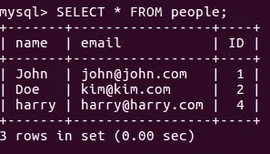
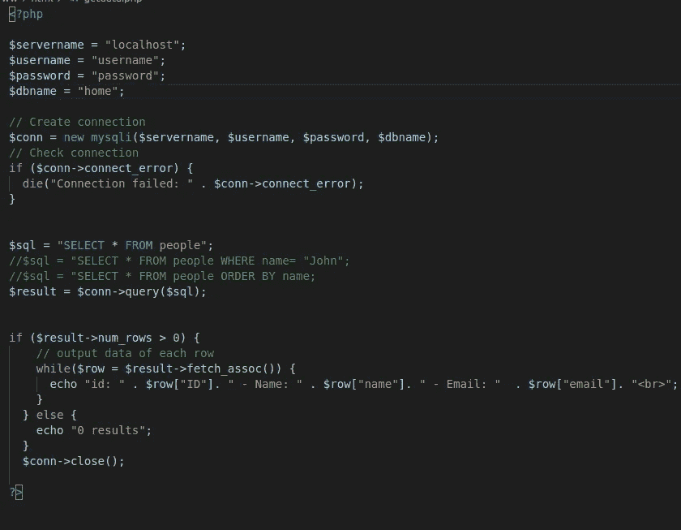
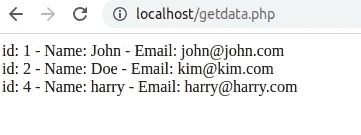
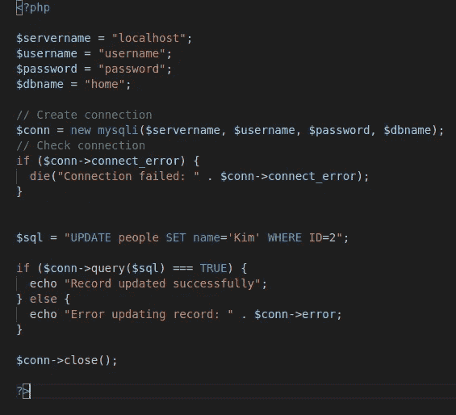
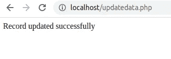
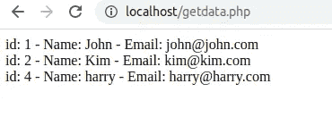
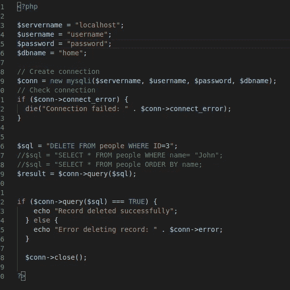
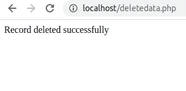
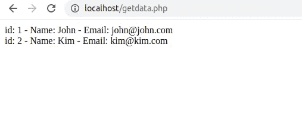

# Web 开发基础-第 2 部分。如何在 MySQL 数据库中搜索、更新和删除表单数据？

> 原文：<https://medium.com/analytics-vidhya/web-development-basics-part-2-how-to-search-update-and-delete-form-data-from-mysql-database-75b1c140cce0?source=collection_archive---------16----------------------->

# **原始数据库**

$ sudo -u root -p

*mysql >* 显示数据库；

*mysql >* 使用首页；

*mysql >* 显示表格；

*MySQL>SELECT * FROM people；*

# **getdata.php**

在/var/www/html/文件夹中创建一个 PHP 文件，并在其中编写一些代码。在 *localhost 中运行这个文件。*

$ sudo touch *【此处空格】* /var/www/html/getdata.php

请确保输入您的用户名和密码。

# updatedata.php

在/var/www/html/文件夹中创建一个 PHP 文件，并在其中编写一些代码。在*本地主机中运行这个文件。*

$ sudo touch *【此处空白】*/var/www/html/update data . PHP

# deletedata.php

在/var/www/html/文件夹中创建一个 PHP 文件，并在其中编写一些代码。在*本地主机中运行这个文件。*

$ sudo touch *【此处空格】*/var/www/html/deletedata . PHP

希望这有所帮助。谢谢你。